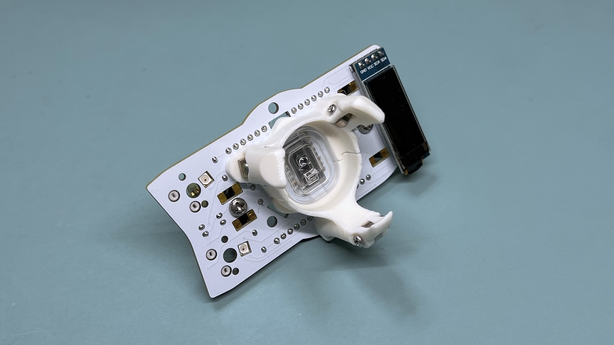
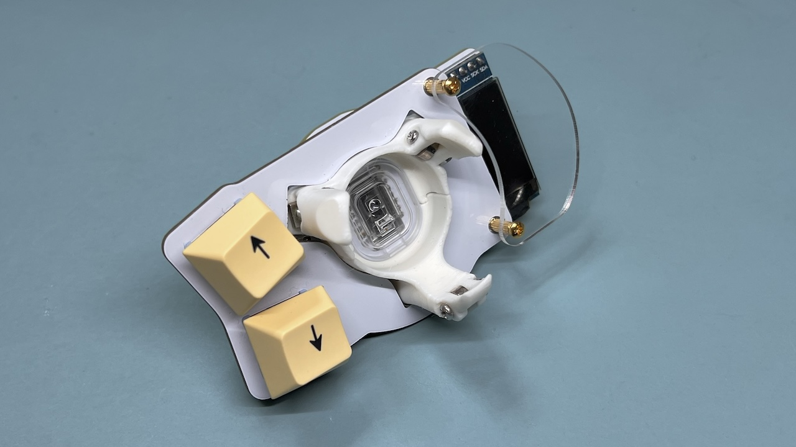
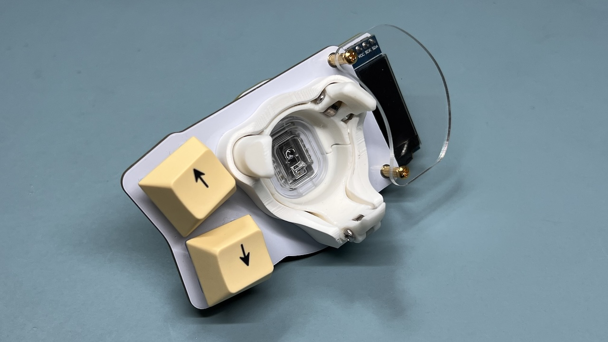
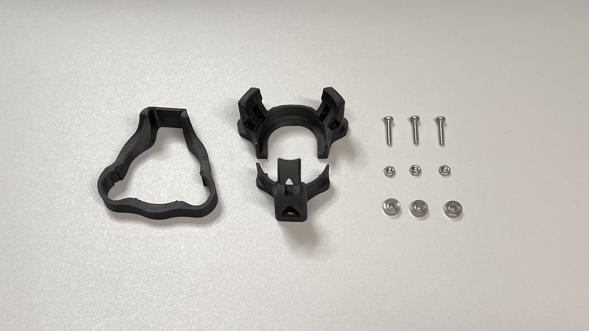
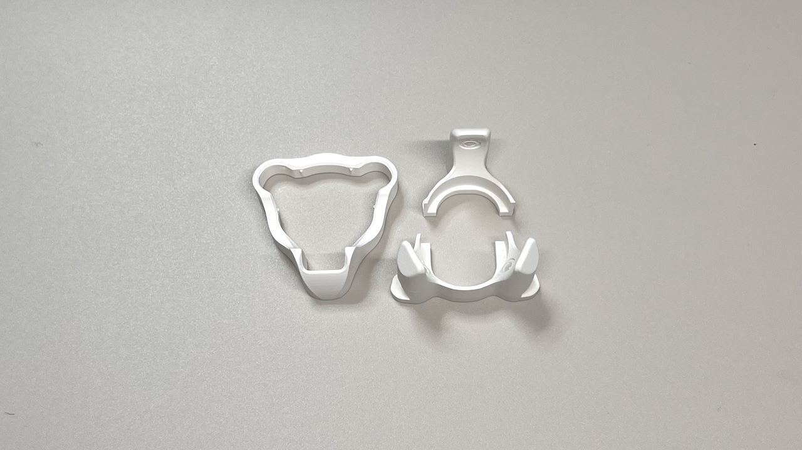
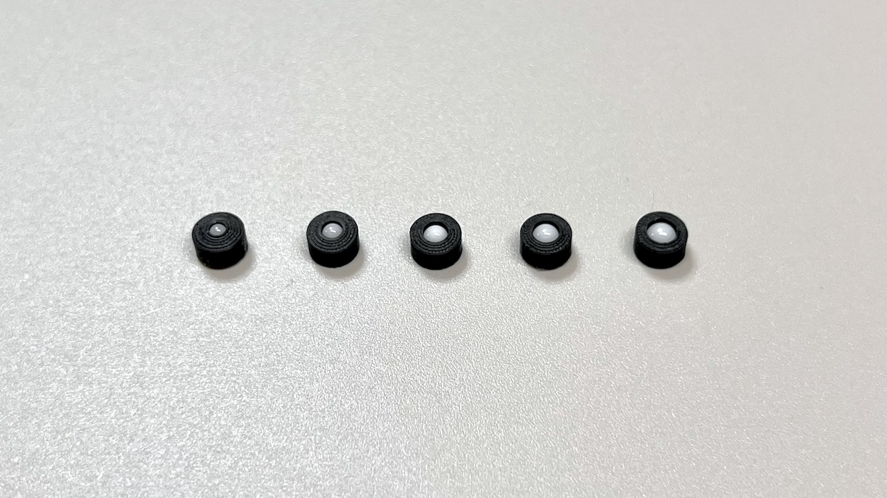
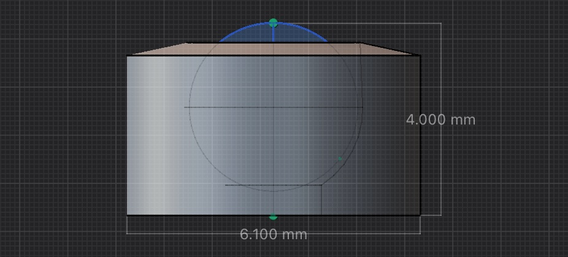
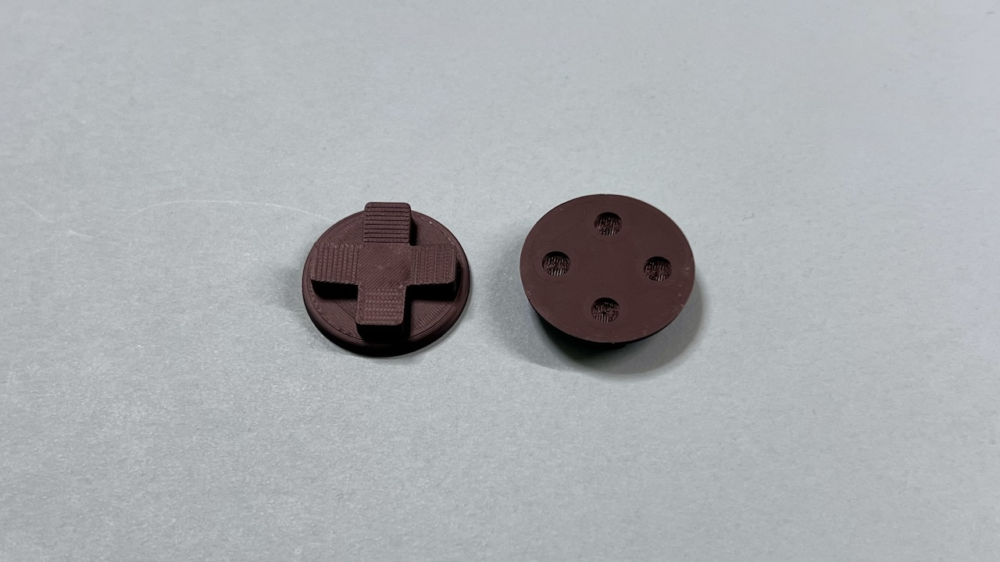
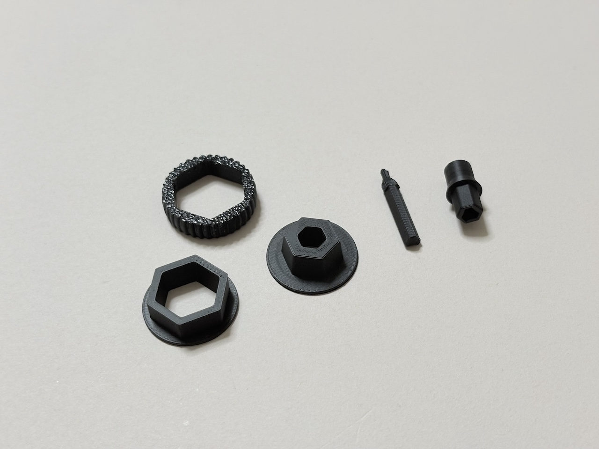
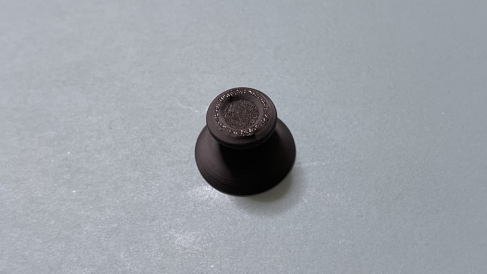

# Killer Whale 3Dプリンター製パーツ（[English](3DP_EN.md)）

# ボールケース

印刷用のモデルと送付のために分割したモデルがあります。

## 組み立て方
ベアリングの場合は10mmのM2ネジとナットでベアリングを固定します。
メインボードに10mmのM3ネジとナットでケースを固定します。

スイッチプレートを取り付けます。

カバーを被せます。

## ファイル内容
### ベアリング方式

https://github.com/Taro-Hayashi/KillerWhale/tree/main/stl/Ballcase_34mm_Bearing
|ファイル名||
|-|-|
|Integrated.stl|一体型データ|
|Separated #1.stl|分割データ|
|Separated #2.stl||
|Cover.stl|スイッチプレートカバー|

|部品名||
|-|-|
|M2ねじ|10mm|
|M2ナット||
|ベアリング|2x6x2.5|

### 支持球方式

https://github.com/Taro-Hayashi/KillerWhale/tree/main/stl/Ballcase_34mm_Sphere

|ファイル名||
|-|-|
|Integrated.stl|一体型データ|
|Separated #1.stl|分割データ|
|Separated #2.stl||
|Cover.stl|スイッチプレートカバー|

### ボールユニット

https://github.com/Taro-Hayashi/KillerWhale/tree/main/stl/Sphere_Unit
|ファイル名||
|-|-|
|2mm.stl||
|2.5mm.stl||
|3mm.stl||
|3.175mm.stl||
|3.5mm 0.2mm nozzle.stl|0.2mmノズル向けモデル|
|3.5mm 0.4mm nozzle.stl|0.4mmノズル向けモデル|

# 十字キー

https://github.com/Taro-Hayashi/KillerWhale/tree/main/stl/D-Pad
|ファイル名||
|-|-|
|D-Pad.stl||

# ホイール

https://github.com/Taro-Hayashi/KillerWhale/tree/main/stl/Wheel
|ファイル名||
|-|-|
|Wheel.stl||
|Shaft.stl||

# ジョイスティックキャップ

https://github.com/Taro-Hayashi/KillerWhale/tree/main/stl/Joystick
|ファイル名||
|-|-|
|Joystick.stl||

## 販売サイト
- ベアリング方式ボールケース https://tarohayashi.booth.pm/items/6485619
- 支持球方式ボールケース https://tarohayashi.booth.pm/items/6485486

<a property="dct:title" rel="cc:attributionURL" href="https://github.com/Taro-Hayashi/KillerWhale/tree/main/3DP.md">Killer Whale 3Dプリント部品</a> by <a rel="cc:attributionURL dct:creator" property="cc:attributionName" href="https://x.com/w_vwbw">Taro Hayashi</a> is licensed under <a href="https://creativecommons.org/licenses/by/4.0/?ref=chooser-v1" target="_blank" rel="license noopener noreferrer" style="display:inline-block;">CC BY 4.0</a>

