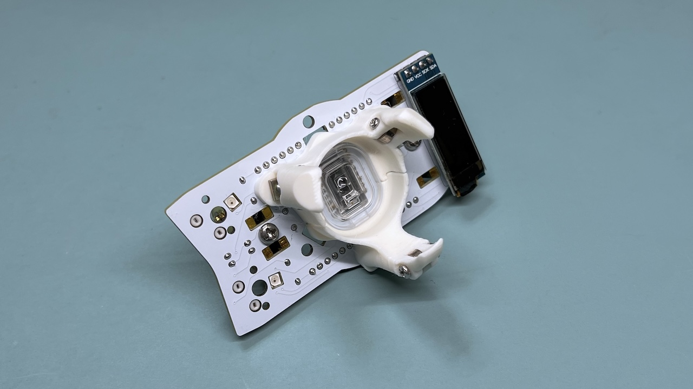
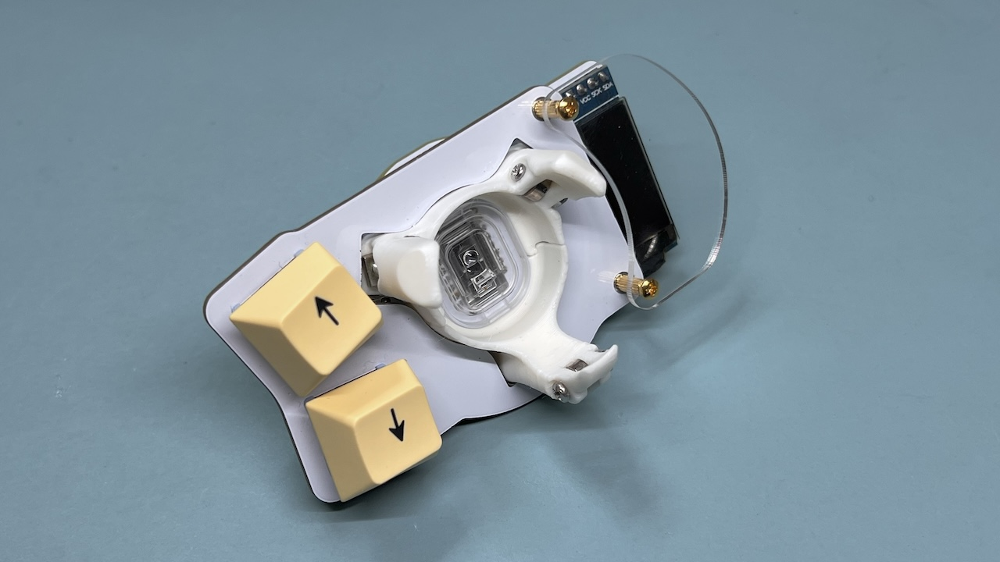
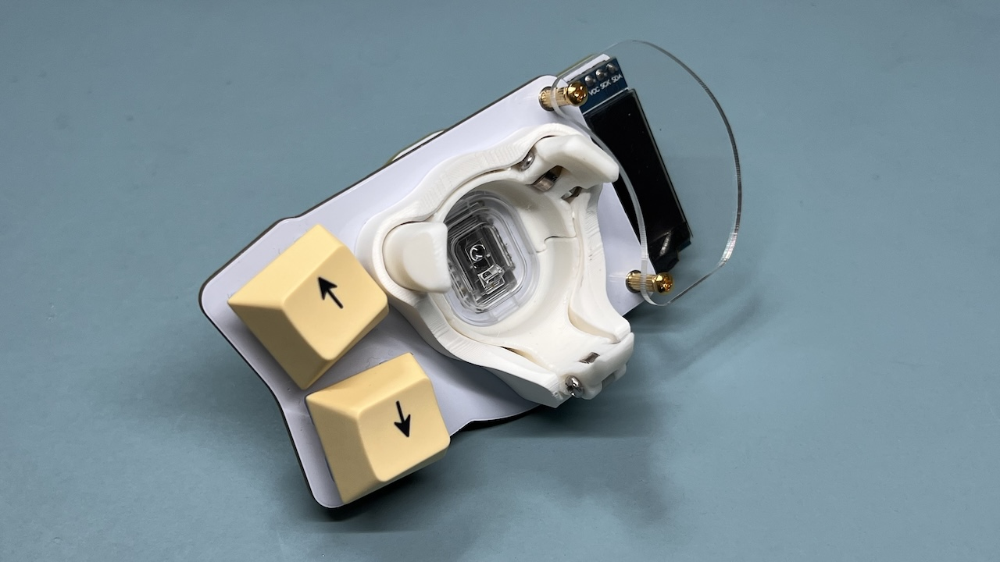
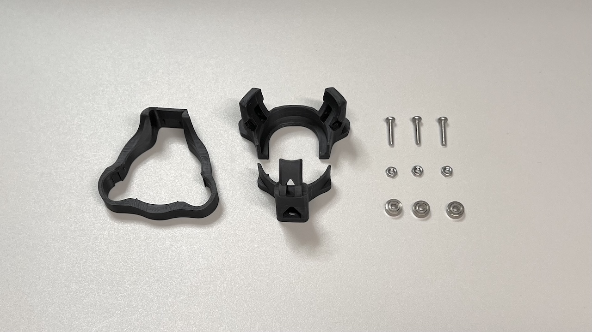
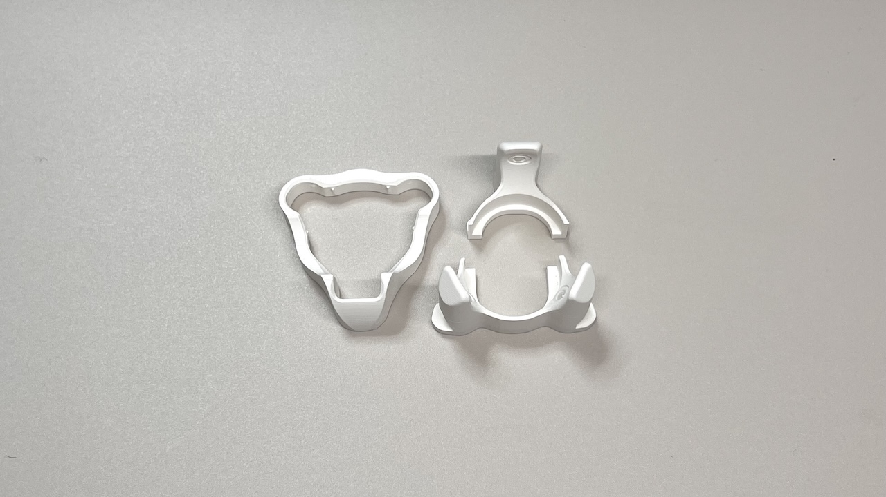
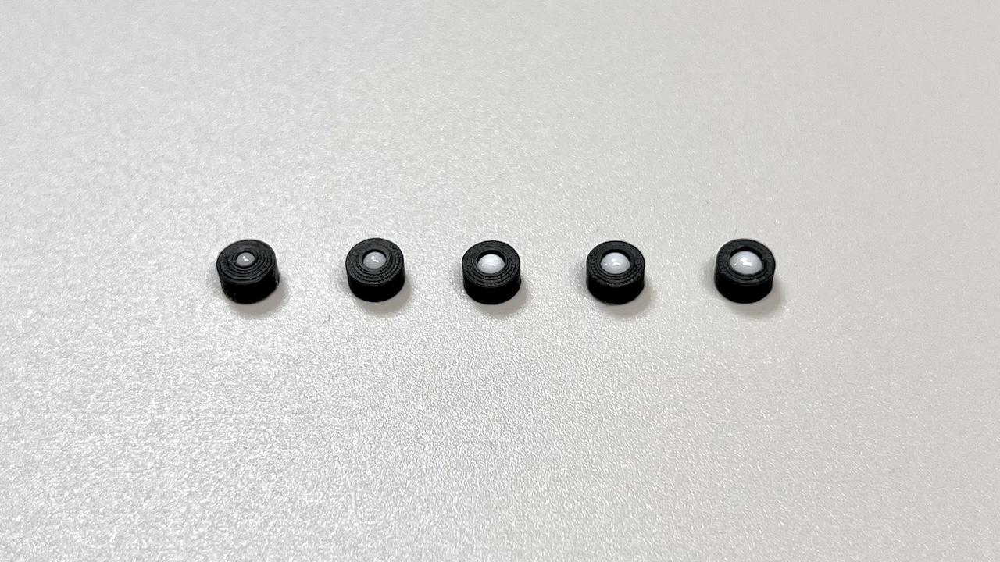
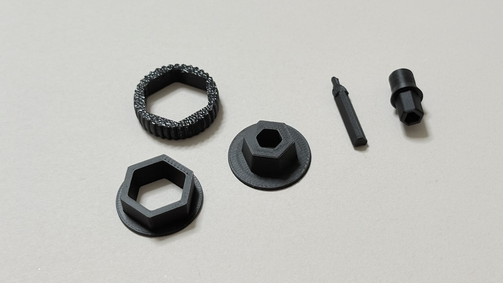

# Killer Whale 3D Printed Parts（[日本語](3DP.md)）

# Ballcase
There are models for printing and split models for sending.

## How to assemble
Secure the bearing case with 10 mm M2 screws and nuts.
Secure the case to the mainboard with 10 mm M3 screws and nuts.

Install switch plate.

Covering.

## File contents
### Bearing case

https://github.com/Taro-Hayashi/KillerWhale/tree/main/stl/Ballcase_34mm_Bearing
|Filename|
|-|
|Integrated.stl|
|Separated #1.stl|
|Separated #2.stl|
|Cover.stl|

|Parts||
|-|-|
|M2 screws|10mm|
|M2 nuts||
|Bearings|2x6x2.5|

### Ceramic ball case

https://github.com/Taro-Hayashi/KillerWhale/tree/main/stl/Ballcase_34mm_Sphere

|Filename|
|-|
|Integrated.stl|
|Separated #1.stl|
|Separated #2.stl|
|Cover.stl|

### Sphere Unit

https://github.com/Taro-Hayashi/KillerWhale/tree/main/stl/Sphere_Unit
|Filename|
|-|
|2mm.stl|
|2.5mm.stl|
|3mm.stl|
|3.175mm.stl|
|3.5mm 0.2mm nozzle.stl|
|3.5mm 0.4mm nozzle.stl|

# D-Pad

https://github.com/Taro-Hayashi/KillerWhale/tree/main/stl/D-Pad
|Filename|
|-|
|D-Pad.stl|
# Wheel

https://github.com/Taro-Hayashi/KillerWhale/tree/main/stl/Wheel
|Filename|
|-|
|Wheel.stl|
|Shaft.stl|
# Joystick Cap

https://github.com/Taro-Hayashi/KillerWhale/tree/main/stl/Joystick
|Filename|
|-|
|Joystick.stl|

<a property="dct:title" rel="cc:attributionURL" href="https://github.com/Taro-Hayashi/KillerWhale/tree/main/3DP.md">Killer Whale 3D Printed Parts</a> by <a rel="cc:attributionURL dct:creator" property="cc:attributionName" href="https://x.com/w_vwbw">Taro Hayashi</a> is licensed under <a href="https://creativecommons.org/licenses/by/4.0/?ref=chooser-v1" target="_blank" rel="license noopener noreferrer" style="display:inline-block;">CC BY 4.0</a>

