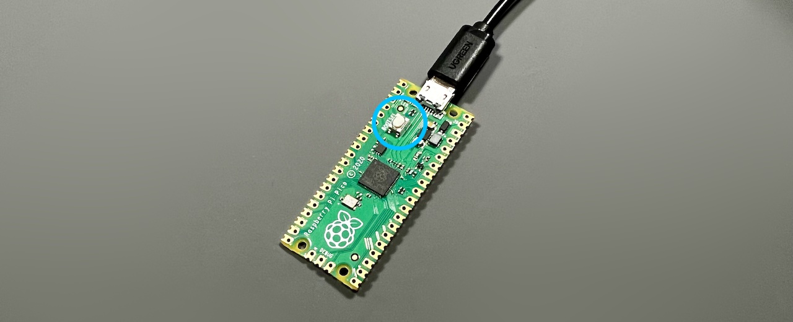

# Killer Whale ビルドガイド スタートページ（[English](README_EN.md)）

1. スタートページ（このページ）
2. [ベースユニットの組み立て](右手用/2_ベースユニット.md)
3. [追加ユニットの組み立て](右手用/3_追加ユニット.md)
4. [側面ユニットの組み立て](右手用/4_側面ユニット_トラックボール.md)
5. [天面ユニットの組み立て](右手用/5_天面ユニット.md)
6. [カスタマイズ](右手用/6_カスタマイズ.md)
7. [その他](右手用/7_その他.md)

  
大きな袋の中にスイッチプレートと5つの袋が入っています。
   
- ベースユニット
- 追加ユニット
- 側面ユニット トラックボール
- 側面ユニット 十字キー
- 天面ユニット
  
が入っていて３つ、もしくは4つのユニットを組み合わせて1台の片手用キーボードになります。
2台をケーブルで繋ぐと左右分割キーボードになります。
   

## キット以外に必要なもの
  
|部品名|数||
|-|-|-|
|[キースイッチ](https://shop.yushakobo.jp/collections/all-switches)|28|Cherry MX互換|
|[キーキャップ](https://shop.yushakobo.jp/collections/keycaps)|28|Cherry MX互換|
|[Raspberry Pi Pico](https://shop.yushakobo.jp/products/raspberry-pi-pico)|1||
|[Micro USBケーブル](https://shop.yushakobo.jp/products/usb-cable-micro-b-0-8m)|1||
|[34mm トラックボール](https://www.amazon.co.jp/gp/product/B07BDGSX5X)|1|トラックボールを使う場合|

### オプション
<table>
    <tr>
      <td><a href="https://shop.yushakobo.jp/products/oled">OLEDモジュール - ピンソケット付き</a></td> 
      <td>1</td>
      <td>画面にレイヤー番号を表示することができます。</td>
    </tr>
    <tr>
      <td><a href="https://shop.yushakobo.jp/products/sk6812mini-e-10">LED（SK6812MINI-E)</a></td>
      <td>32</td>
      <td>発光させられますがはんだ付けの難易度が上がります</td>
    </tr>
    <tr>
      <td><a href="https://shop.yushakobo.jp/products/trrs_cable">TRSケーブル、TRRSケーブル</a></td>
       <td>1</td>
      <td>2台を接続し、左右分割キーボードとして使用できます。</td>
    </tr>
 </table>

### 別売ユニット
<table>
    <tr>
      <td><a href="">側面ユニット ホイール 縦</a></td> 
    </tr>
    <tr>
      <td><a href="">側面ユニット ホイール 横</a></td>
    </tr>
    <tr>
      <td><a href="">側面ユニット ジョイスティック</a></td>
    </tr>
    <tr>
      <td><a href="">ホイール付き天面ユニット</a></td>
    </tr>
 </table>

### そのほか対応している部品、互換品
※ビルドガイド内での解説はありませんので必要なタイミングで使ってください。
<table>
    <tr>
      <td><a href="https://shop.yushakobo.jp/products/7532">Raspberry Pi Pico 互換品 Type-C</a></td>
    </tr>
    <tr>
      <td><a href="https://shop.yushakobo.jp/products/7497">Raspberry Pi Pico W</a></td>
    </tr>
    <tr>
      <td><a href="https://shop.yushakobo.jp/products/31?variant=40815840067745">コンスルー20ピン</a></td>
    </tr>
    <tr>
      <td>ゲームボーイの十字キー</td>
    </tr>
    <tr>
      <td><a href="https://akizukidenshi.com/catalog/g/gP-12718/">トグルスイッチ用ラバーフード</a></td>
    </tr>
 </table>

### 必要な工具
<table>
    <tr>
      <td>はんだごて</td>
    </tr>
    <tr>
      <td>はんだ</td>
    </tr>
    <tr>
      <td>ピンセット</td>
    </tr>
    <tr>
      <td>ニッパー</td>
    </tr>
    <tr>
      <td>カッター（デザインナイフ）</td>
    </tr>
    <tr>
      <td>マスキングテープ</td>
    </tr>
    <tr>
      <td>やすり（棒、紙）</td>
    </tr>
    <tr>
      <td>+の精密ドライバー</td>
    </tr>
    <tr>
      <td>ナットをしめるもの（ラジオペンチ、M2スパナ）</td>
    </tr>
 </table>

## 準備
### スイッチプレートの切り離し
スイッチプレートは繋がった状態で入っていて、切り離して使います。
  
カッターで切れ目を入れ、折って切り離します。
  
断面は棒やすりや、平らな面に敷いた紙やすりで綺麗にします。
  
削った粉がコネクタ類やトラックボールのセンサーに入り込まないようにここで一度服を払ったり机の上の掃除をすると安心です。

## ファームウェアを書き込む
Raspberry Pi Picoをキーボードとして使えるようにします。
こちらのファイルをダウンロードしてください。  
 - []

Raspberry Pi PicoのBOOTSELボタン押しながらUSBケーブルでPCと接続すると、RPI-RP2というUSBメモリとして認識されます。  
   
   
ダウンロードしたファイルをそこにドラッグ&ドロップしてドライブが自動的に消えたら成功です。  
書き込みが終わったら一旦USBケーブルは外します。  

### 左右を決める
キットを左右どちらで作るか決めてベースユニットの組み立てに進んでください。
- [ベースユニット 左手用](左手用/2_ベースユニット.md)
- [ベースユニット 右手用](右手用/2_ベースユニット.md)

左右のビルドガイドの違いは写真だけです。

