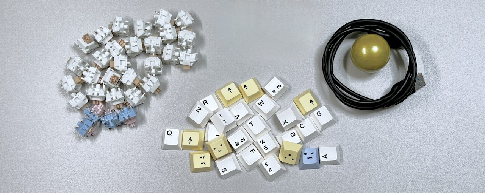

# Killer Whale ビルドガイド スタートページ（[English](README_EN.md)）

1. スタートページ（このページ）
2. [ベースユニットの組み立て](右手用/2_ベースユニット.md)
3. [側面ユニットの組み立て](右手用/3_側面ユニット_トラックボール.md)
4. [天面ユニットの組み立て](右手用/4_天面ユニット.md)
5. [追加ユニットの組み立て](右手用/5_追加ユニット.md)
6. [全体の組み立て](右手用/6_全体の組み立て.md)
7. [カスタマイズ](右手用/7_カスタマイズ.md)
8. [その他](右手用/8_その他.md)

大きな袋の中にスイッチプレートと5つの袋が入っています。  
     

## キット以外に必要なもの（片手分）
|部品名|数||
|-|-|-|
|[キースイッチ](https://shop.yushakobo.jp/collections/all-switches)|26〜30|Cherry MX互換|
|[キーキャップ](https://shop.yushakobo.jp/collections/keycaps)|26〜30|Cherry MX互換|
|[Raspberry Pi Pico](https://shop.yushakobo.jp/products/raspberry-pi-pico)|1||
|USBケーブル|1||
|34mm トラックボール|0~1|[遊舎工房](https://shop.yushakobo.jp/products/8020)、[Amazon](https://www.amazon.co.jp/gp/product/B07BDGSX5X)|

     
### オプション（片手分）
<table>
    <tr>
      <td><a href="https://shop.yushakobo.jp/products/oled">OLEDモジュール</a></td> 
      <td>1〜2</td>
      <td>通常は1個、予備の側面ユニットにも付けるならもう1個</td>
    </tr>
    <tr>
      <td>ピンソケット4ピン分</td> 
      <td>1〜2</td>
      <td>OLEDモジュールを付け外しする場合</td>
    </tr>
    <tr>
      <td><a href="https://shop.yushakobo.jp/products/sk6812mini-e-10">LED（SK6812MINI-E)</a></td>
      <td>30〜36</td>
      <td>通常は33個、追加ユニットなしで30個、予備の側面ユニットに3個</td>
    </tr>
    <tr>
      <td><a href="https://shop.yushakobo.jp/products/trrs_cable">TRS、TRRSケーブル</a></td>
       <td>1</td>
      <td>2台を繋げて左右分割キーボードとして使用できます。  </td>
    </tr>
 </table>

    

### 別売ユニット
<table>
    <tr>
      <td><a href="https://tarohayashi.booth.pm/items/4877491">側面ユニット ホイール 縦</a></td> 
    </tr>
    <tr>
      <td><a href="https://tarohayashi.booth.pm/items/4877491">側面ユニット ホイール 横</a></td>
    </tr>
    <tr>
      <td><a href="https://tarohayashi.booth.pm/items/4877491">側面ユニット ジョイスティック</a></td>
    </tr>
    <tr>
      <td><a href="https://tarohayashi.booth.pm/items/4877491">25mm トラックボール支柱</a></td>
    </tr>
    <tr>
      <td><a href="https://tarohayashi.booth.pm/items/4877486">ホイール付き天面ユニット</a></td>
    </tr>
 </table>
  
    

### 色違いのアクリルプレート
<table>
    <tr>
        <td><a href="https://shop.yushakobo.jp/products/keyboard_acrylic_plate?variant=47873651245287">左手用</a></td> 
        <td><a href="https://shop.yushakobo.jp/products/keyboard_acrylic_plate?variant=47873651278055">右手用</a></td>
        <td><a href="https://shop.yushakobo.jp/products/keyboard_acrylic_plate?variant=47873651310823">支柱</a></td>
    </tr>
 </table>

### そのほか対応しているもの
<table>
    <tr>
      <td><a href="https://shop.yushakobo.jp/products/31?variant=40815840067745">コンスルー20ピン 2.5mm</a></td>
    </tr>
    <tr>
      <td><a href="https://shop.yushakobo.jp/products/7532">Raspberry Pi Pico 互換品 Type-C</a></td>
    </tr>
    <tr>
      <td><a href="https://shop.yushakobo.jp/products/7497">Raspberry Pi Pico W</a></td>
    </tr>
    <tr>
      <td>ゲームボーイの十字キー</td>
    </tr>
    <tr>
      <td><a href="https://booth.pm/ja/items/5410034">3Dプリンター製ケース（Training&KBD様作）</a></td>
    </tr>
    <tr>
      <td><a href="https://nankatsukurouyo.myportfolio.com/killerwhale">トラックボールケース3Dプリントデータ（せう様作）</a></td>
    </tr>
    <tr>
      <td><a href="https://booth.pm/ja/items/5676575">UndertowとUndertow Alterna</a></td>
    </tr>
 </table>

### 必要な工具
<table>
    <tr>
      <td>はんだごて</td>
    </tr>
    <tr>
      <td>はんだ</td>
    </tr>
    <tr>
      <td>ピンセット</td>
    </tr>
    <tr>
      <td>ニッパー</td>
    </tr>
    <tr>
      <td>カッター</td>
    </tr>
    <tr>
      <td>やすり</td>
    </tr>
    <tr>
      <td>精密ドライバー</td>
    </tr>
    <tr>
      <td>ナットをしめるもの（ラジオペンチ等）</td>
    </tr>
 </table>

## 準備
### スイッチプレートの切り離し
スイッチプレートは繋がった状態で入っていて切り離して使います。  
    
カッターで切れ目を入れ折って切り離します。  
    
断面はやすりで綺麗にします。  
    
削った粉がコネクタ類やトラックボールのセンサーに入り込まないようにここで一度服を払ったり机の上の掃除をすると安心です。  
    
それぞれのユニットのビルドガイドでスイッチプレートとして使います。  

## テスト用ファームウェアを書き込む
こちらのファイルをダウンロードしてください。    
- [tarohayashi_killerwhale_solo_default.uf2
](https://github.com/Taro-Hayashi/KillerWhale/releases/latest/download/tarohayashi_killerwhale_solo_default.uf2)

Raspberry Pi PicoのBOOTSELボタン押しながらUSBケーブルでPCと接続すると、RPI-RP2というUSBメモリとして認識されます。    
     
     
ダウンロードしたファイルをドラッグ&ドロップしてドライブが自動的に消えたら成功です。    
書き込みが終わったら一旦USBケーブルは外します。    

### 左右を決める
キットを左右どちらで作るか決めてベースユニットの組み立てに進みます。
- [ベースユニット 左手用](左手用/2_ベースユニット.md)
- [ベースユニット 右手用](右手用/2_ベースユニット.md)

> [!NOTE] 
> 左右のビルドガイドの違いは写真だけですが間違えやすいので合った側を見ることをお勧めします。  

