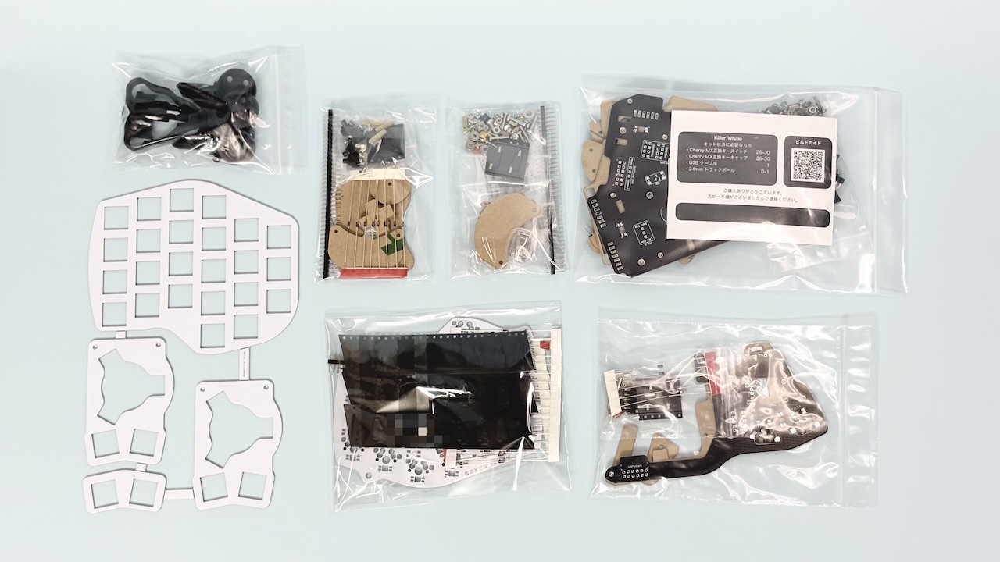
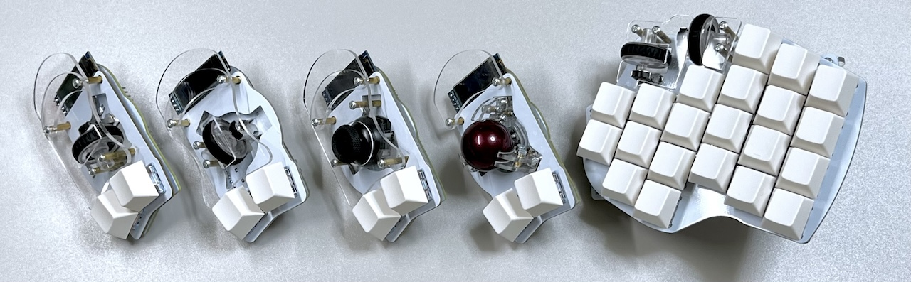
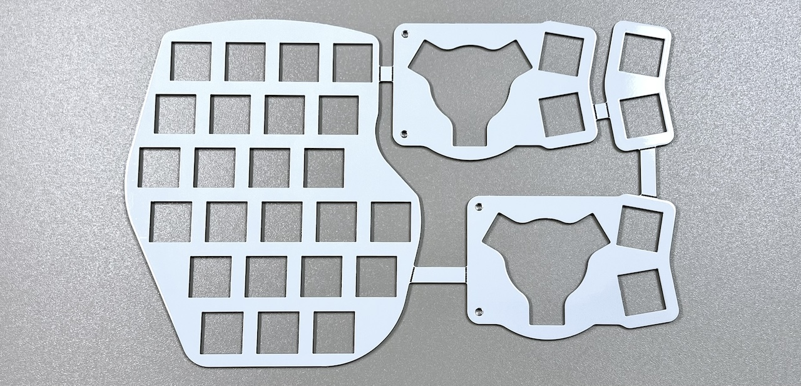
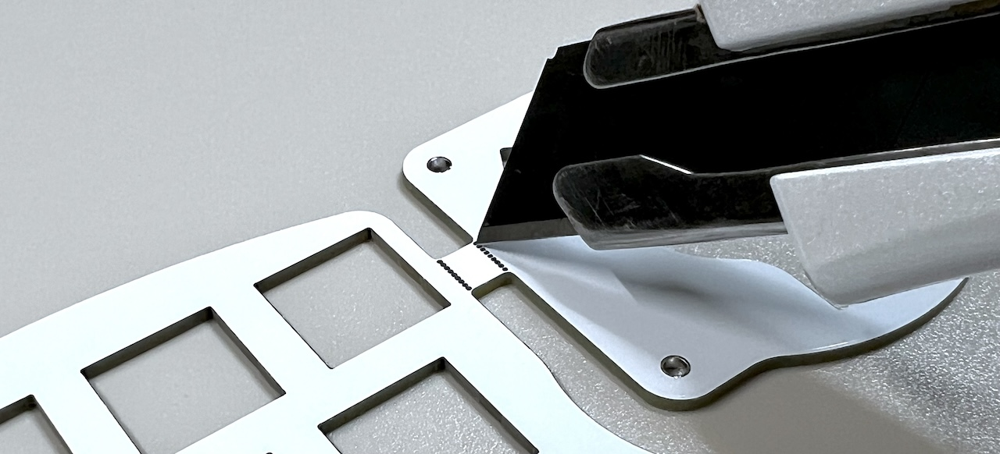
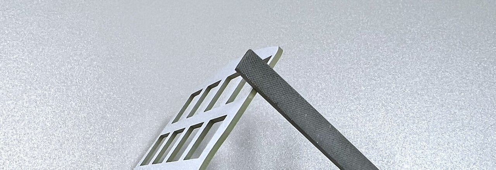
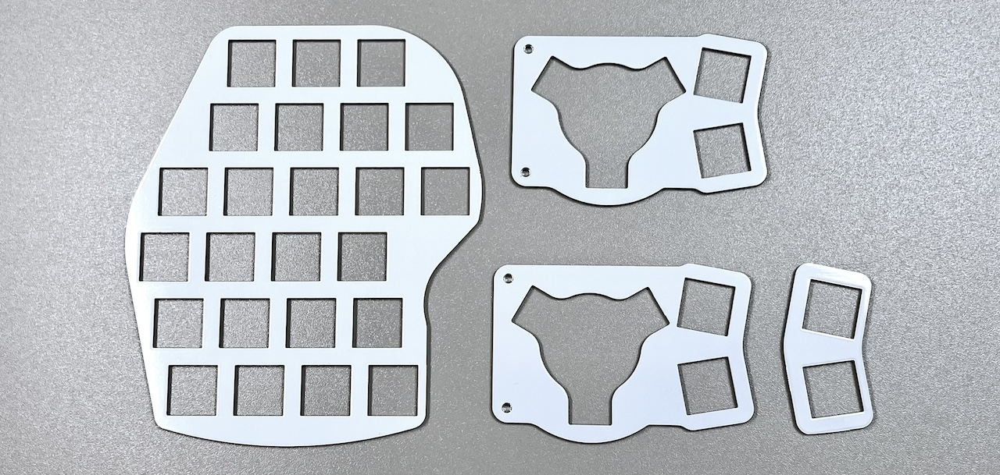

# Killer Whale Build Manual First Page（[日本語](README.md)）

1. Start Page
2. [BASE Unit](rightside/2_BASE.md)
3. [SIDE Unit](rightside/3_SIDE_TRACKBALL.md)
4. [TOP Unit](rightside/4_TOP.md)
5. [ADD Unit](rightside/5_ADD.md)
6. [Assemble](rightside/6_ASSEMBLE.md)
7. [Customize](rightside/7_CUSTOM.md)
8. [Misc](rightside/8_MISC.md)

There are 5 switch plates included in the largest bag.
     

## Additionally Required (quantities for or one side)
<table>
    <tr>
      <td>MX switches</td>
       <td>between 26 and 30</td>
    </tr>
    <tr>
      <td>Keycaps</td> 
      <td>between 26 and 30</td>
    </tr>
    <tr>
      <td>Raspberry Pi Pico</td>
      <td>1</td>
    </tr>
    <tr>
      <td>USB cable</td>
       <td>1</td>
    </tr>
    <tr>
      <td>34mm Trackball</td>
       <td>0 or 1</td>
    </tr>
 </table>

    
### Optional Parts (quantities for one side)
<table>
    <tr>
      <td>OLED Display module</td> 
      <td>1 or 2</td>
      <td>Normally just one, but you can add one more to the side unit</td>
    </tr>
    <tr>
      <td>Pin socket 4pin</td> 
      <td>1 or 2</td>
      <td>If you want to pull out OLED module.</td>
    </tr>
    <tr>
      <td>LEDs (SK6812MINI-E)</td>
      <td>Between 30 and 36</td>
      <td>Normally 33, or just 30 without the additional unit, and 3 more for the side unit</td>
    </tr>
    <tr>
      <td>TRS or TRRS Cable</td>
       <td>1</td>
       <td>Used to connect the left and right parts of the keyboard</td>
    </tr>
 </table>

    

### Optional Units (sold separately)
<table>
    <tr>
      <td><a href="https://tarohayashi.booth.pm/items/4877491">SIDE Unit (Vertical Wheel)</a></td> 
    </tr>
    <tr>
      <td><a href="https://tarohayashi.booth.pm/items/4877491">SIDE Unit (Horizontal Wheel)</a></td>
    </tr>
    <tr>
      <td><a href="https://tarohayashi.booth.pm/items/4877491">SIDE Unit (Joystick)</a></td>
    </tr>
    <tr>
      <td><a href="https://tarohayashi.booth.pm/items/4877491">Ball pillars for 25mm ball</a></td>
    </tr>
    <tr>
      <td><a href="https://tarohayashi.booth.pm/items/4877486">TOP Unit with wheel</a></td>
    </tr>
 </table>

   

### Optional Acrylic Plates
<table>
    <tr>
      <td><a href="https://shop.yushakobo.jp/products/keyboard_acrylic_plate?variant=47873651245287">LEFT Side</a></td> 
    </tr>
    <tr>
      <td><a href="https://shop.yushakobo.jp/products/keyboard_acrylic_plate?variant=47873651278055">RIGHT Side</a></td>
    </tr>
    <tr>
      <td><a href="https://shop.yushakobo.jp/products/keyboard_acrylic_plate?variant=47873651310823">Pillars</a></td>
    </tr>
 </table>

### 3D Printed Cases (made by Training&KBD)
- https://booth.pm/ja/items/5410034

### 3D Printed Trackball Case  (made by thw)
- https://nankatsukurouyo.myportfolio.com/killerwhale

### Undertow
- https://booth.pm/ja/items/5676575

### Required tools and consumables
<table>
    <tr>
      <td>Soldering iron</td>
    </tr>
    <tr>
      <td>Solder</td>
    </tr>
    <tr>
      <td>Tweezers</td>
    </tr>
    <tr>
      <td>Nipper</td>
    </tr>
    <tr>
      <td>Cutter</td>
    </tr>
    <tr>
      <td>File (for sanding)</td>
    </tr>
    <tr>
      <td>Precision screwdriver (cross/Philipps type)</td>
    </tr>
    <tr>
      <td>Tool for tightening nuts (radio pliers, M2 spanner)</td>
    </tr>
 </table>

## Preparations
### Detach the switch plates
Switch plates are initially attached, and must be separated.
    
Make a cut with a cutter, and separate by bending the plates.    
   
Sand the side with a file.
 
After sanding, make sure to clean your bench and brush off residues from you clothes to prevent them from getting inside connectors or trackball sensor.
  
Switch plates will be used in the build guide of each unit.

## Write Testing firmware
Download the following uf2 file.
- [tarohayashi_killerwhale_solo_default.uf2
](https://github.com/Taro-Hayashi/KillerWhale/releases/latest/download/tarohayashi_killerwhale_solo_default.uf2)

Connect the Raspberry Pi Pico to the PC while holding down the BOOTSEL button, it will be recognized as a USB memory device called RPI-RP2.

     
     
After downloading the uf2 file, drag and drop the file to the USB drive. If the drive disappears, flashing was successful.
After flashing, disconnect the USB cable.

### Decide to build left or right side
Decide if you build the left or right side of the keyboard and proceed to BASE Unit page.
- [BASE Unit LEFT Side](leftside/2_BASE.md)
- [BASE Unit RIGHT Side](rightside/2_BASE.md)

> [!NOTE] 
> The only differences between the left and right build guides are the pictures, but since it is easy to make mistakes, it is recommended to follow the right build guide.

