# Killer Whale BASE Unit LEFT Side ビルドガイド （[RIGHT Side](../rightside/2_BASE.md)）

1. [First Page](../README_EN.md)
2. BASE Unit LEFT Side（このページ）
3. [SIDE Unit](../leftside/3_SIDE_TRACKBALL.md)
4. [TOP Unit](../leftside/4_TOP.md)
5. [ADDITIONAL Unit](../leftside/5_ADD.md)
6. [Assemble](../leftside/6_ASSEMBLE.md)
7. [Customize](../leftside/7_CUSTOM.md)
8. [Misc](../leftside/8_MISC.md)

## 内容品
      
||部品名|数||
|-|-|-|-|
|1|メインボード|1|FR4|
|2|ボトムプレート|1|アクリル|
|3|側面ユニット支柱|4|アクリル|
|4|天面ユニット支柱|4|アクリル|
|5|M2なべネジ|12|10mm|
|6|M2ワッシャー|24||
|7|M2スプリングワッシャー|12||
|8|M2ナット|12||
|9|M2スペーサー|12|3mm|
|10|M2ネジ（黒）|4|8mm|
|11|M2ワッシャー（黒）|8||
|12|M2スプリングワッシャー（黒）|4|
|13|M2ナット（黒）|4|
|14|M3なべネジ|11|10mm|
|15|M3ワッシャー|11||
|16|M3四角ナット|11||
|17|TRRSジャック|2||
|18|ピンヘッダ|2||
|19|ピンソケット|2||
|20|L字ピンソケット|1||
|21|ジャンパー|6||
|22|ゴム足|4||

以下はLED用の小さい部品で専用の小袋に入っています
<table>
    <tr>
      <td>23</td>
      <td>MOSFET</td>
      <td>1</td>
      <td>BSS138</td>
    </tr>
    <tr>
      <td>24</td>
      <td>抵抗R</td>
      <td>2</td>
      <td>10kΩ</td>
    </tr>
 </table>
 
## はんだ付け
ベースユニットには全ての部品を表に実装します。  
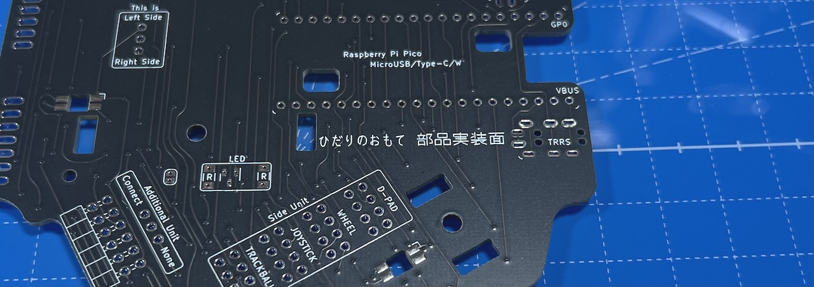    
### Raspberry Pi Picoのはんだ付け
ピンヘッダを20ピンずつニッパーで切ります。  
    
メインボードに差し込み、Raspberry Pi Picoをのせてマスキングテープで固定します。  
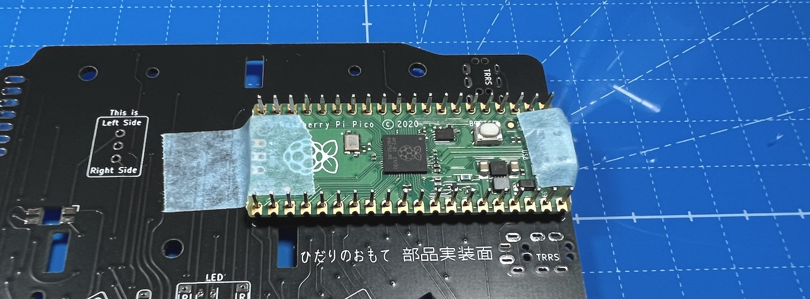    
左右でRaspberry Pi Picoの裏表が変わるのでGP0,VBUSの位置を確認して合わせてからはんだ付けしてください。  
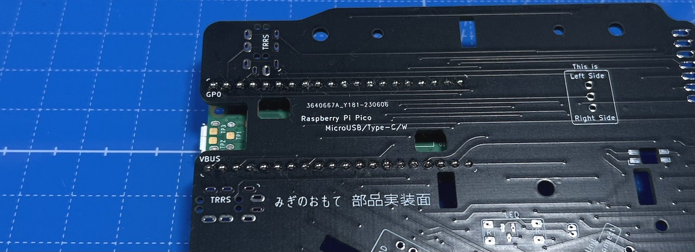    
表裏両面をはんだ付けします。  長い方のピンはニッパーで短くします。  

### L字ピンソケットのハンダ付け
マスキングテープを使って水平になるように固定して、裏側をはんだ付けします。  
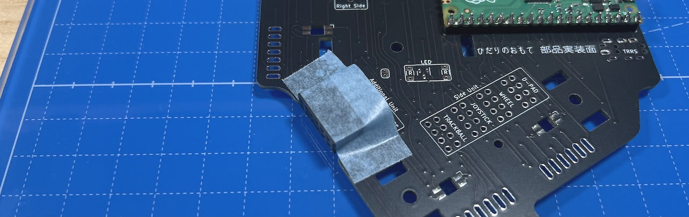    

### TRRSジャックのはんだ付け
2台を接続するために使う部品です。  
2箇所取り付け位置があり好きな方だけはんだ付けしても両方はんだ付けしても、使う予定がない場合は取り付けなくても問題ありません。  
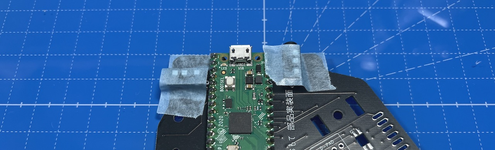    

### ジャンパーピンのはんだ付け
ジャンパーピンを3ピンを2つ、4ピンを8つ切り出し、枠で囲われたところにはんだ付けします。  
短い方をホールに差して長い方は表側にしてください。   
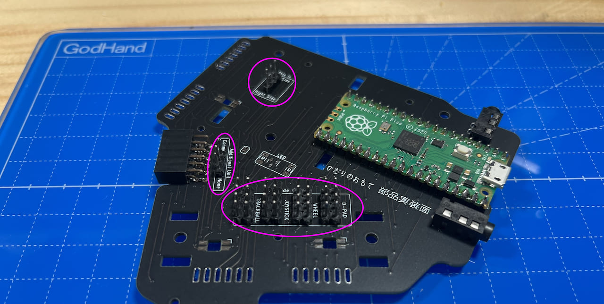    
マスキングテープを突き破るように固定すると垂直に付けやすいです。  
    
3箇所にジャンパーピンを6つ差し込み、どのように組み立てるかを選びます。    
左手側、追加ユニットを付け、側面ユニットが十字キーの場合は以下のようになります。  
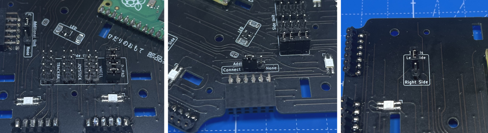    
ジャンパーピンの付け外しをする時はUSBケーブルは抜いてください。  

### （オプション）LED部品のはんだ付け
LED用小袋内のMOSFETと抵抗を取り付けます。部品が小さいのでピンセットを使いやけどをしないように注意してください。  
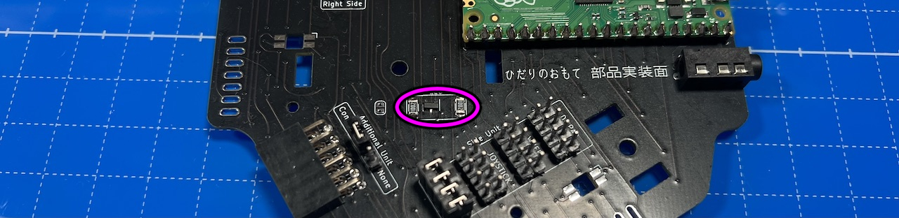      
LEDには向きがあります。  丸い発光面が向こう向きになり、基板の角のマークとLEDの足の切り欠きの方向が一致するようにします。  
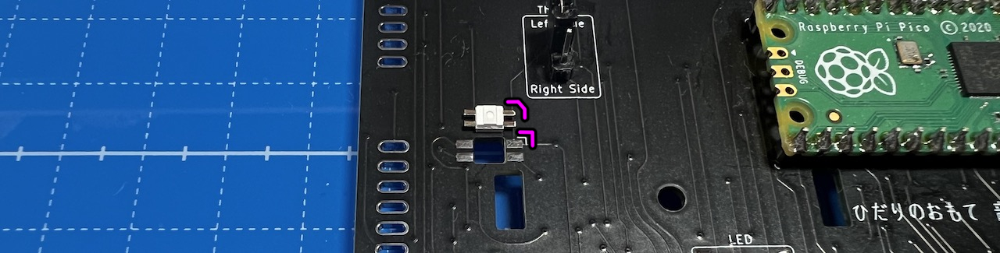    
ベースユニットには3箇所取り付けます。  
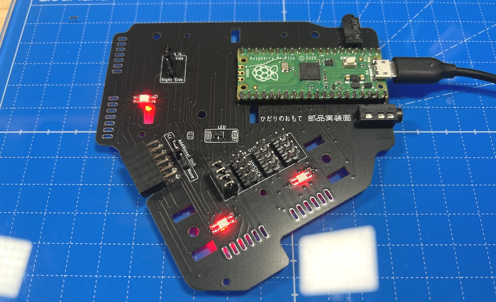 
USBケーブルを接続して発光するかどうかチェックしましょう   

ベースユニットのはんだ付けは以上です。  

## 支柱の取り付け

### 支柱の組み立て
支柱は8パーツ4組あります。  
    
前準備としてなべネジ12本にワッシャーを通します。  切れ目が入っているのはスプリングワッシャーで反対側を固定する時に使います。  
    
ワッシャー、スプリングワッシャーはナットがゆるむことを防止するために使っています。  無くしてしまったりした場合は使わなくても組み立てには問題ありません。  
  
ワッシャーを通したなべネジを支柱パーツの片側に通し、スペーサーで止めます。  
    
スリットに四角ナットを斜めにして立てます。  小さいパーツは2箇所、中くらいのパーツは3箇所、大きいパーツは4箇所スリットがあります。  
    
反対側の支柱パーツをネジに通して、四角ナットをはさみこみます。  
    
ワッシャー、スプリングワッシャーの順にネジに入れ、ナットで固定します。  
    
最後にドライバーでネジを少し締めるとより強固になりますが力をかけすぎると割れるので気をつけてください。 
    
4種類作り終えたところです。  

### 支柱の取り付け
M3なべネジ5本にワッシャーを通します。  
    
表面に支柱を立てて裏面からネジ止めします。  
ここに使っているネジはなめやすく、あとで一度外すのできつく締めすぎないでください。  
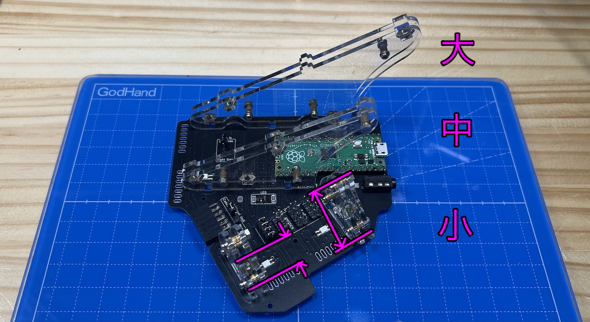    
取り付ける場所、方向は画像を参考にしてください。  
  
残りの部品はこの後の工程で使うので小皿に入れる等して保管してください。    
    

組み立てる予定の側面ユニットの説明に進んでください。  

3. SIDE Unit
   - [トラックボール](../leftside/3_SIDE_TRACKBALL.md)
   - [D-PAD](../leftside/3_SIDE_DPAD.md.md)
   - [（別売）ホイール 縦/横](../leftside/3_SIDE_WHEEL.md)
   - [（別売）ジョイスティック](../leftside/3_SIDE_JOYSTICK.md)
