# Killer Whale SIDE Unit D-Pad LEFT Side Build Manual （[RIGHT Side](../rightside/3_SIDE_DPAD.md)）

1. [Start Page](../README_EN.md)
2. [BASE Unit](../leftside/2_BASE.md)
3. SIDE Unit
   - [Trackball](../leftside/3_SIDE_TRACKBALL.md)
   - D-Pad LEFT Side
   - [Wheel (sold separately)](../leftside/3_SIDE_WHEEL.md)
   - [Joystick (sold separately)](../leftside/3_SIDE_JOYSTICK.md)
4. [TOP Unit](../leftside/4_TOP.md)
5. [ADD Unit](../leftside/5_ADD.md)
6. [Assembly](../leftside/6_ASSEMBLE.md)
7. [Customizations](../leftside/7_CUSTOM.md)
8. [Misc](../leftside/8_MISC.md)

## Contents
    
||types|quantities||
|-|-|-|-|
|1|Mainboard|1|FR4|
|2|Switch plate|1|FR4|
|3|Cover plate|2|Acrylic|
|4|D-pad plate|2|Acrylic|
|5|M2 short screws|5|6mm|
|6|M2 long screw|1|10mm|
|7|M2 washer|1||
|8|M2 spring washer|1||
|9|M2 nut|1||
|10|M2 black screws|5|4mm|
|11|M2 short spacers|2|5mm|
|12|M2 long spacers|3|12mm|
|13|Pin header|1||
|14|Diodes|8|1N4148|
|15|Kailh mute switches|4|
|16|MX hotswap sockets|2||

Disclaimer: it is possible that the screws aspect or socket colors are different from the pictures from the build guide.

## Soldering
Note that components will be placed on both sides of the side unit.
  
The PCB side with text in Japanese is the back side.

### Soldering of the LEDs (optional)  
Solder the 3 LEDs. The round LED should be facing away from the side where soldering is done.
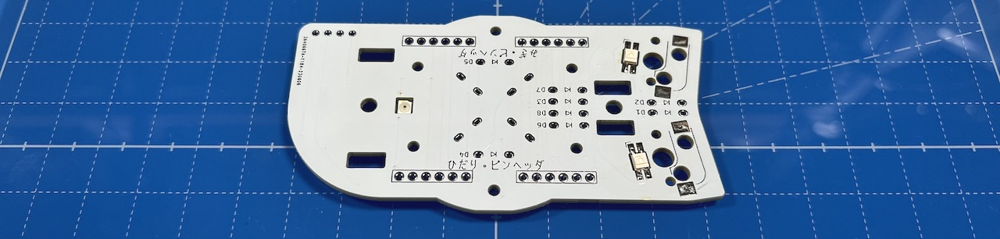  

### Soldering of MX hotswap socket (back side)
From the back side of the unit, solder the MX hotswap sockets while keeping them in place with tweezers.
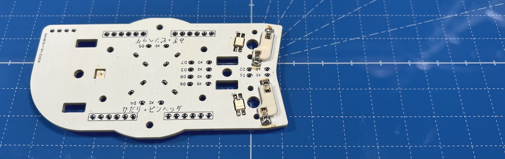  
Once there is enough solder material on both sides of the socket so that it stays in place, you can put the tweezers aside and apply more solder.
Because of the relatively large surface, a lot of solder material is needed.

### Soldering of the diodes (back side)
Diodes are directional components. Make sure to align the lines with markings on the PCB.
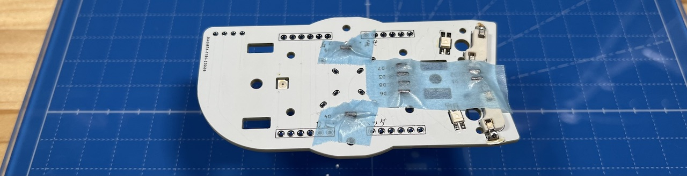  
Insert the diodes in the 8 locations on the back side of the PCB, and secure them with masking tape.
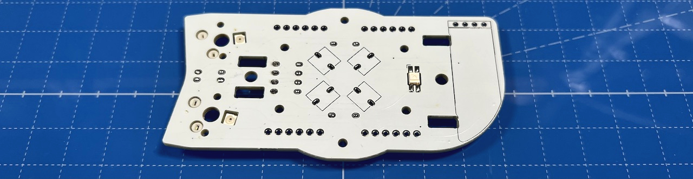  
Solder from the front side of the PCB and cut the diode legs.

### Soldering of the pin headers
Cut out four sets of 6 pins from the 40 pin headers and insert the from the back side.
Insert the long side of the pins. In case you did it the other way around, cut the long side in order to match the length of the short side.

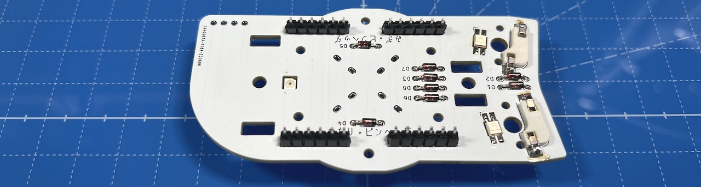  
### Soldering of the OLED Display (Optional, front side) 
Solder the OLED display socket from the front side.
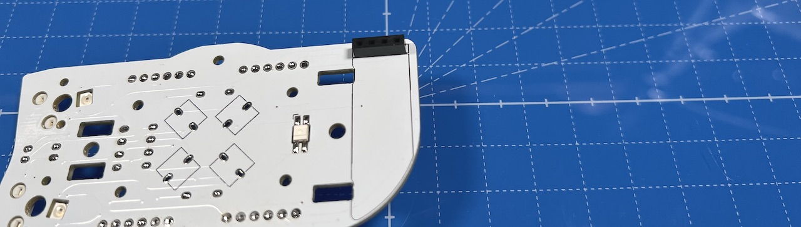  
If you do not plan to remove the display later, it is also possible to directly solder it without socket.

Solder the dedicated pin headers to the OLED module.

  
Keep the module aside for later and do not connect it yet.
### Kailh mute switch
### Soldering of the Kailh mute switches (front side)
Insert the switches from the front side of the PCB and solder from the back side.

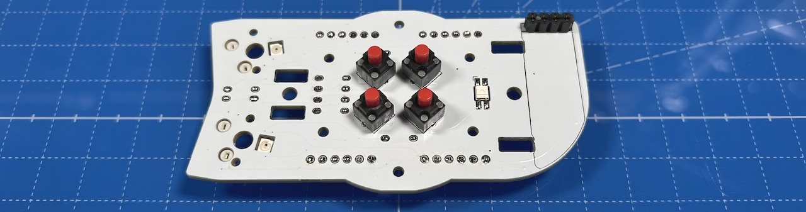  

## Assembling

### Attaching the switch plate
Attach short spacers to the switch plate with black M2 screws.
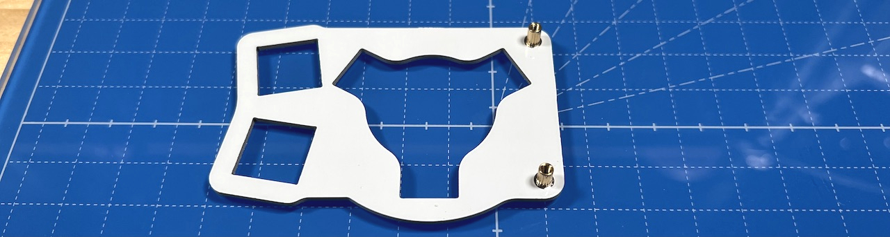  
Note that the switch plate has an orientation - refer to the picture.

Attach the protection acrylic sheets to the spacers with M2 short screws.
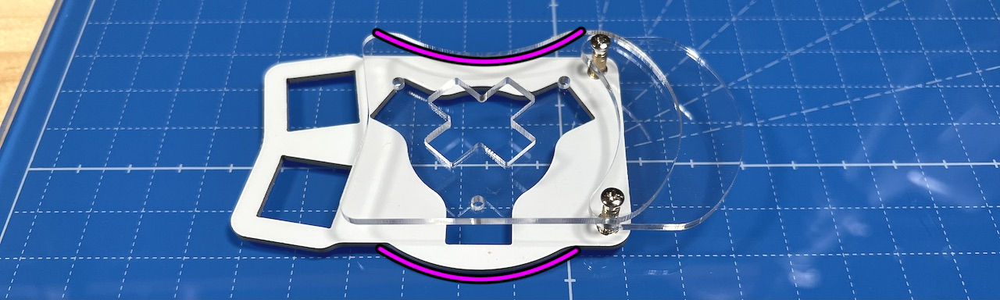  
If the spacers are long and silver, put the small protection acrylic sheet on top, and if the spacers color is copper, put the large protection crylic sheet on top.
  

Attach long M2 spacers with M2 black screws to the SIDE unit.
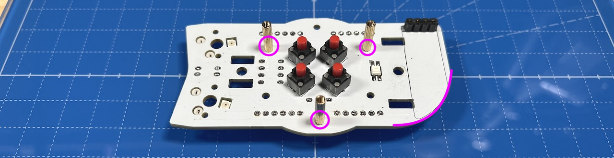  
There should be one spacer on the bottom side of the SIDE unit and two to the top, forming an equilateral triangle.

If this is the first SIDE unit that you have built, remove two sets of 6 pins from the remaining BASE unit pin headers, and insert them in the pin sockets of the SIDE unit.
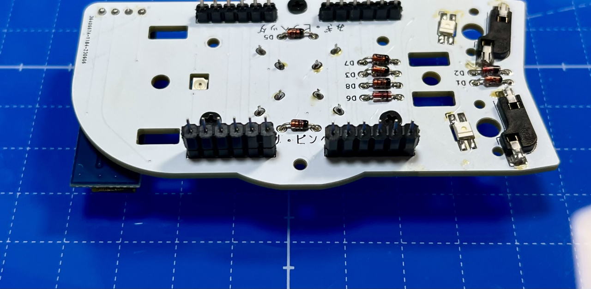  
From the BASE unit remaining items, thread M3 washers onto M3 screws.  
   
Place the SIDE unit on the supports and secure it with the M3 screws. Make sure that the legs of the pin sockets are inside the long through-holes of the BASE unit.

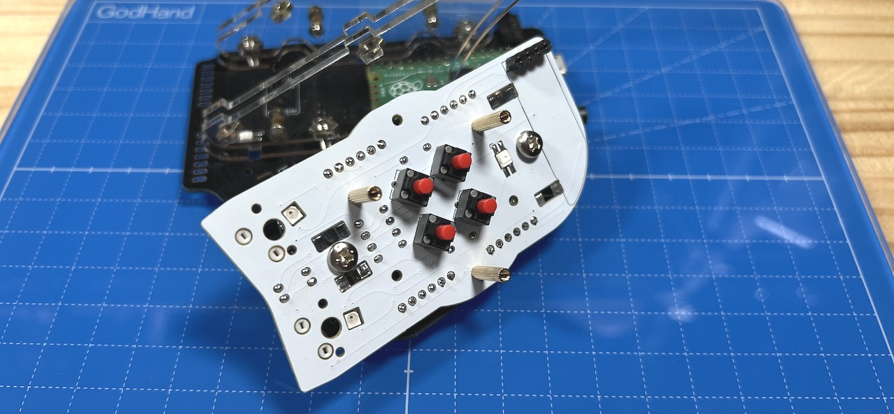  
Solder the pin sockets from the back side of the BASE unit. Make sure to put enough solder to reach the front side of the BASE unit through the holes.
  
This is the last soldering step for the SIDE unit.

In case you plan on using the OLED module, insert it in the pin socket.
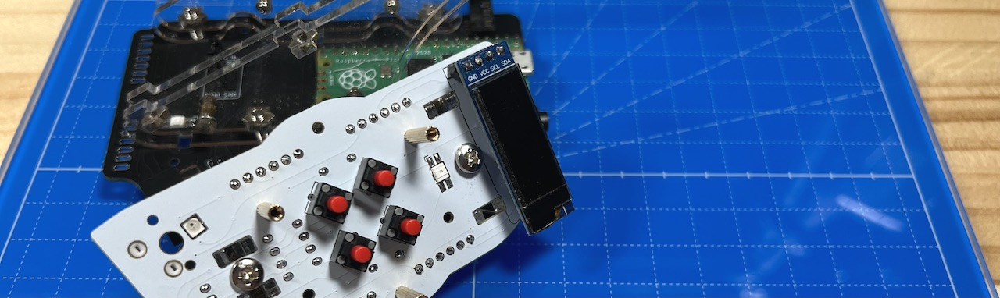  

Secure the D pad plate with one long M2 screw, washer, spring washer and nut.
  
Attach the key switches to the plate and insert the assembly into the MX sockets, so that the D pad is in the middle. 
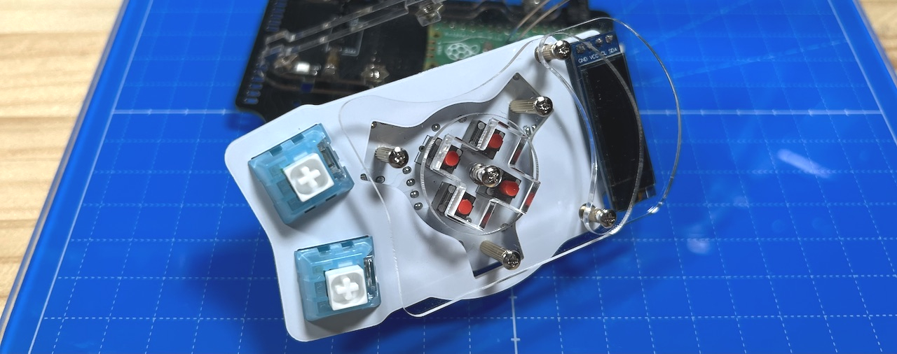  
Secure the protection plate with short M2 screws. That's it for the SIDE unit!
 
Confirm that everything is working by connecting the unit to a computer with a USB cable. Note that the LEDs will not work until the top and additional unit are completed.
If you do not detect any issue, proceed with the TOP unit assembly.
 
4. [TOP Unit](../leftside/4_TOP.md)
   - [TOP Unit with wheel (sold separately)](../leftside/4_TOP_WHEEL.md)

