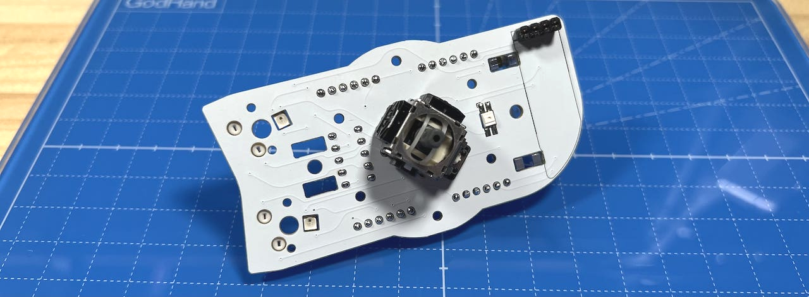

# Killer Whale ジョイスティック側面ユニット 左手用Build Manual （[右手用](../rightside/3_SIDE_JOYSTICK.md)）

1. [First Page](../README_EN.md)
2. [BASE Unit](../leftside/2_BASE.md)
3. SIDE Unit
   - [Trackball](../leftside/3_SIDE_TRACKBALL.md)
   - [D-PAD](../leftside/3_SIDE_DPAD.md.md)
   - [Wheel (selling separately)](../leftside/3_SIDE_WHEEL.md)
   - Joystick (selling separately) LEFT Side
4.  [TOP Unit](../leftside/4_TOP.md)
5. [ADDITIONAL Unit](../leftside/5_ADD.md)
6. [Assemble](../leftside/6_ASSEMBLE.md)
7. [Customize](../leftside/7_CUSTOM.md)
8. [Misc](../leftside/8_MISC.md)
   
## Contents
    
||Types|quantities||
|-|-|-|-|
|1|Mainboard|1|FR4|
|2|Switch plate|1|FR4|
|3|Cover plates|2|Acrylic|
|4|M2 silver screws|5|6mm|
|5|M2 black screws|5|4mm|
|6|M2 short spacers|2|9mm|
|7|M2 long spacers|3|16mm|
|8|Pin headers|1||
|9|Diodes|5|1N4148|
|10|Joystick|1||
|11|Joystick cap|1||
|12|MX Hoswap sockets|2||

### Additional Required
|Types|quantities|
|-|-|
|Keyswitches|2|
|Keycaps|2|

### Optional Parts
<table>
    <tr>
      <td>OLED Display</a></td> 
      <td>1</td>
    </tr>
    <tr>
      <td>SK6812MINI-E</td>
      <td>3</td>
    </tr>
 </table>

## Soldering
### (Optional)LED 
  
### MX hotswap socket
  
### Diodes
  
  

### Pin headers
  

### (Optional) OLED Display
  

  
### Joystick
表から差し込んで裏ではんだ付けします。  
  

## 仮組みとソケットのはんだ付け
側面ユニットには上下があります。  右手用はOLED用ソケットが下側、左手用は上側です。  
  
### スイッチプレートの組み立て
スイッチプレートにM2スペーサー（短）をM2ネジ（黒）で取り付けます。  
  
スイッチプレートも上下があるので気をつけてください。  
  
スペーサーに保護プレート2種を、M2バインドネジで取り付けます。  
  
穴が空いている大きい方が上です。 

### ベースユニットへの取り付け
側面ユニットにM2スペーサー（長）3つをM2ネジ（黒）で取り付けます。  
  
下側はスペーサーが一本、上側に2本で正三角形を作るように立てます。  
  
初めて側面ユニットを作る場合、ベースユニットで余ったピンソケットから6ピンを2つ切り出して側面ユニットのピンソケットに差し込みます。
  
ベースユニットのM3ネジ２本にワッシャーを通します。   
    
支柱に側面ユニットを差し込み、M3ネジで止めます。  ベースユニットの縦長のスルーホールにピンソケットの足が入るようにしてください。  
  
ベースユニットの裏面でピンソケットをはんだ付けします。  多めにはんだを流して表面までしっかりはんだ付けされるようにしてください。  
  
これで側面ユニットのはんだ付けは終わりです。  

OLEDモジュールを使う場合はここでピンソケットに差し込みます。  
  

ジョイスティックにキャップをはめて、スイッチプレートにキースイッチを取り付けてMXソケットに差し込みます。  
  
保護プレートをM2バインドネジで固定したら完成です。  
  
USBケーブルを差し動作確認してみましょう。  LEDは天面ユニットを取り付けるまで光りません。  
問題がなくキーやホイールが反応したら天面ユニットの組み立てに進んでください。  
  

同梱されているものと、別売のホイール付きの2種類があります。  
  
4. [TOP Unit](../rightside/4_TOP.md)
   - [（別売）ホイール付き天面ユニット](../rightside/4_TOP_WHEEL.md)

