# Killer Whale SIDE Unit Joystick LEFT Side Build Manual （[RIGHT Side](../rightside/3_SIDE_JOYSTICK.md)）

1. [First Page](../README_EN.md)
2. [BASE Unit](../leftside/2_BASE.md)
3. SIDE Unit
   - [Trackball](../leftside/3_SIDE_TRACKBALL.md)
   - [D-PAD](../leftside/3_SIDE_DPAD.md)
   - [Wheel (selling separately)](../leftside/3_SIDE_WHEEL.md)
   - Joystick (selling separately) LEFT Side
4.  [TOP Unit](../leftside/4_TOP.md)
5. [ADD Unit](../leftside/5_ADD.md)
6. [Assemble](../leftside/6_ASSEMBLE.md)
7. [Customize](../leftside/7_CUSTOM.md)
8. [Misc](../leftside/8_MISC.md)
   
## Contents
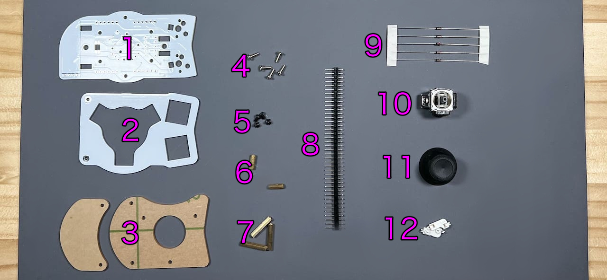    
||Types|quantities||
|-|-|-|-|
|1|Mainboard|1|FR4|
|2|Switch plate|1|FR4|
|3|Cover plates|2|Acrylic|
|4|M2 silver screws|5|6mm|
|5|M2 black screws|5|4mm|
|6|M2 short spacers|2|9mm|
|7|M2 long spacers|3|16mm|
|8|Pin headers|1||
|9|Diodes|5|1N4148|
|10|Joystick|1||
|11|Joystick cap|1||
|12|MX Hoswap sockets|2||

### Additional Required
|Types|quantities|
|-|-|
|Keyswitches|2|
|Keycaps|2|

### Optional Parts
<table>
    <tr>
      <td>OLED Display</a></td> 
      <td>1</td>
    </tr>
    <tr>
      <td>SK6812MINI-E</td>
      <td>3</td>
    </tr>
 </table>

## Soldering
### (Optional)LED 
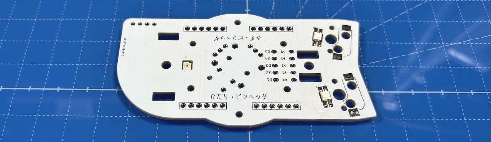  
### MX hotswap socket
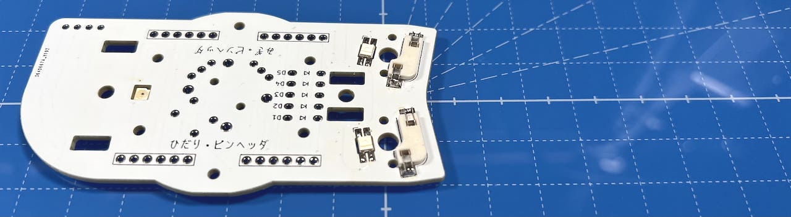  
### Diodes
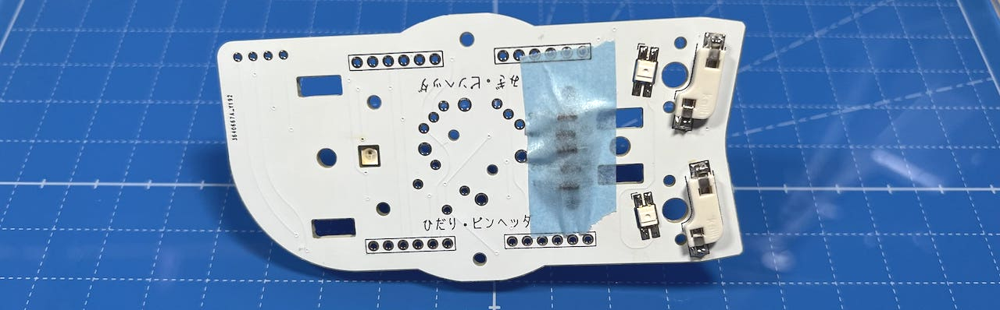  
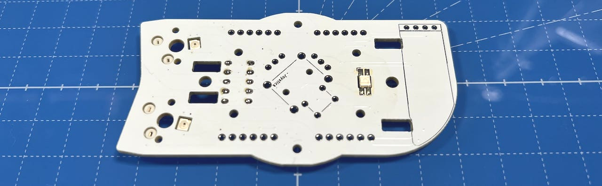  

### Pin headers
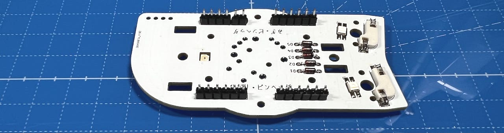  

### (Optional) OLED Display
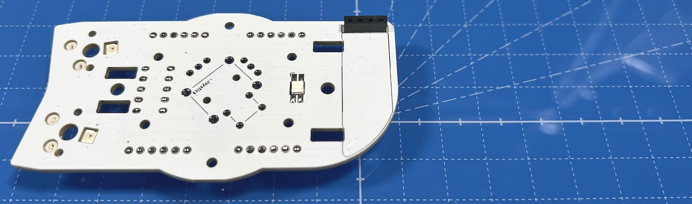  

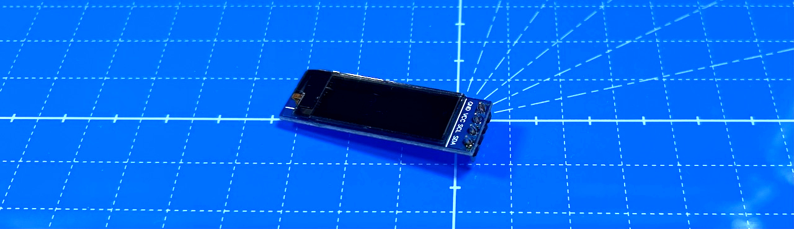  
### Joystick 
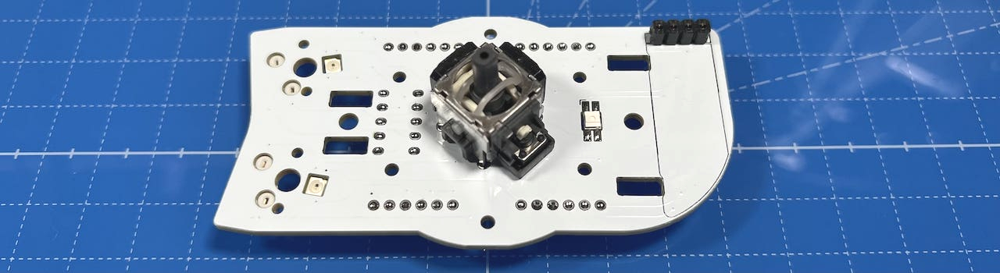  

## Assembling
Attach M2 short spacers with M2 black screws. 
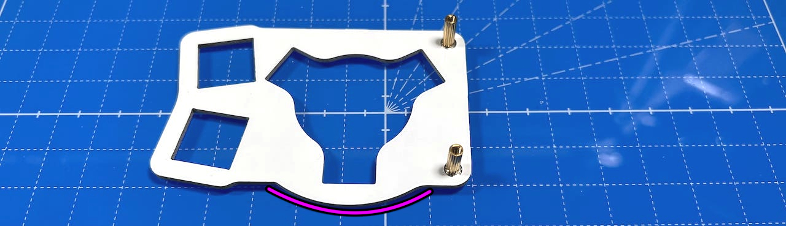  
Attach cover plate with M2 short screws.
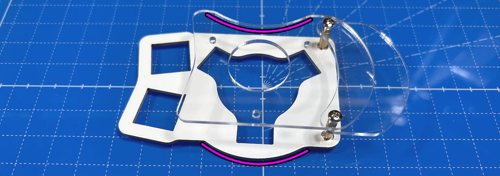  
Larger cover plate is on top.

Attach M2 long spacers with M2 black screws.
  
  
Insert pin socket into pin header.
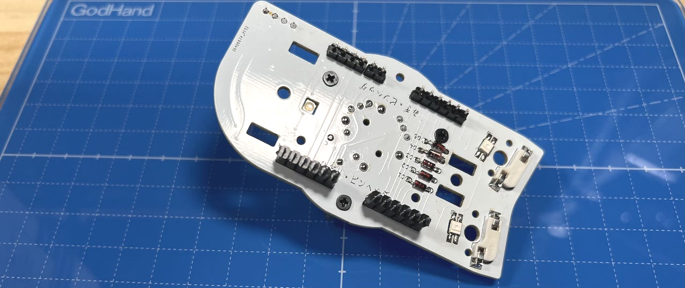  
Attach M3 washers with M3 screws. 
    
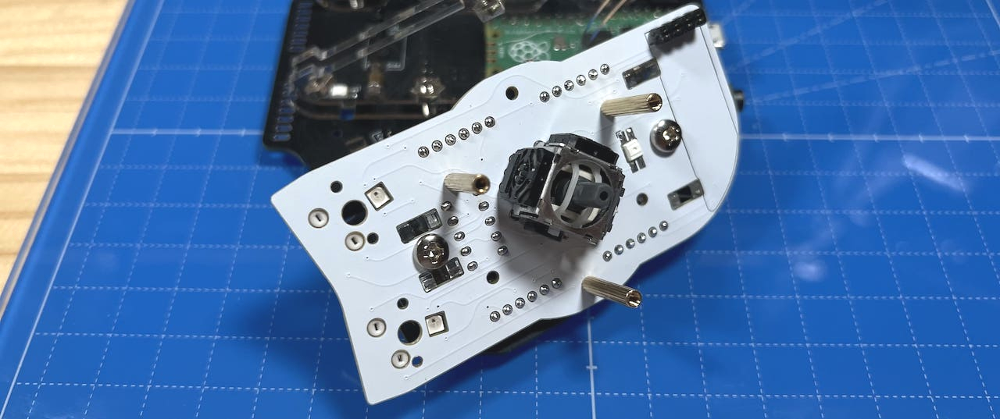  

Solder pin sockets on the bottom.
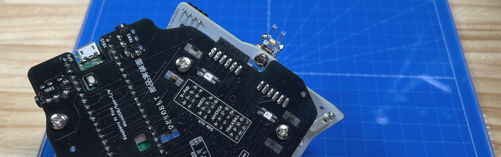  

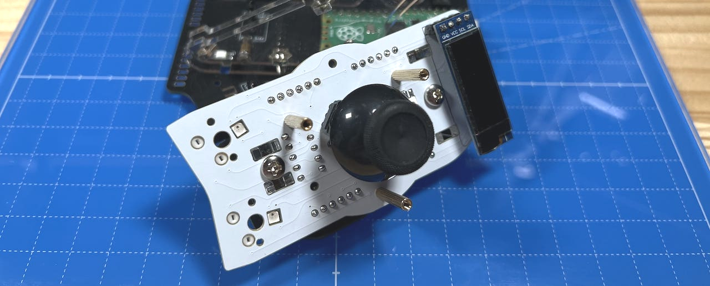  
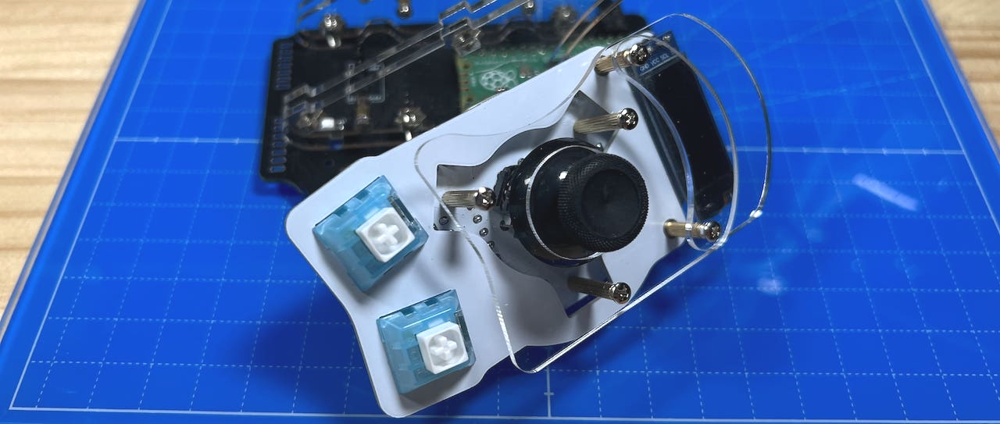  

4. [TOP Unit](../leftside/4_TOP.md)
   - [TOP Unit with wheel (selling separately)](../leftside/4_TOP_WHEEL.md)

