# Killer Whale ホイール側面ユニット 縦/横 左手用ビルドガイド （[右手用](../rightside/3_SIDE_WHEEL.md)）

1. [スタートページ](../README_EN.md)
2. [ベースユニットの組み立て](../leftside/2_BASE.md)
3. 側面ユニットの組み立て
   - [トラックボール](../leftside/3_SIDE_TRACKBALL.md)
   - [十字キー](../leftside/3_SIDE_DPAD.md.md)
   - （別売）ホイール 縦/横（左手用）（このページ）
   - [（別売）ジョイスティック](../leftside/3_SIDE_JOYSTICK.md)
4. [天面ユニットの組み立て](../leftside/4_TOP.md)
5. [追加ユニットの組み立て](../leftside/5_ADD.md)
6. [全体の組み立て](../leftside/6_ASSEMBLE.md)
7. [カスタマイズ](../leftside/7_CUSTOM.md)
8. [その他](../leftside/8_MISC.md)

## 内容品
    
||部品名|数||
|-|-|-|-|
|1|メインボード|1|FR4|
|2|スイッチプレート|1|FR4|
|3|保護プレート|2|アクリル|
|4|M2バインドネジ|4|6mm|
|5|M2ネジ（黒）|5|4mm|
|6|M2スペーサー（短1）|1|8mm|
|6|M2スペーサー（短2）|2|9mm|
|7|M2スペーサー（長）|2|16mm|
|8|ピンヘッダ|1||
|9|ダイオード|4|1N4148|
|10|ホイールエンコーダー|1||
|11|ホイール|1||
|12|MXスイッチソケット|2||

※メインボード、保護プレートに縦と横の違いがありますが大きく違いはありませんので適宜読み替えてください。  

### キット以外に必要なもの
|部品名|数||
|-|-|-|
|[キースイッチ](https://shop.yushakobo.jp/collections/all-switches)|2|Cherry MX互換|
|[キーキャップ](https://shop.yushakobo.jp/collections/keycaps)|2|Cherry MX互換|
|幅1cm以下の棒やすり||整形済みで必要ないことがあります|

### オプション
<table>
    <tr>
      <td><a href="https://shop.yushakobo.jp/products/oled">OLEDモジュール - ピンソケット付き</a></td> 
      <td>1</td>
    </tr>
    <tr>
      <td><a href="https://shop.yushakobo.jp/products/sk6812mini-e-10">LED（SK6812MINI-E)</a></td>
      <td>3</td>
    </tr>
 </table>
 
## 準備
スイッチプレートにタブがついていたらカットしてやすりがけします。
  

## はんだ付け
側面ユニットは表裏両方に部品を実装するので気をつけてください。  
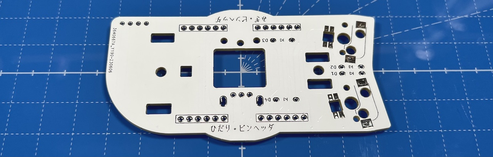  
記載がある方が裏面です。  
### （オプション）LEDのはんだ付け
LEDは3個取り付けます。すべてはんだ付けする面から見て丸い発光面が向こう向きです。  
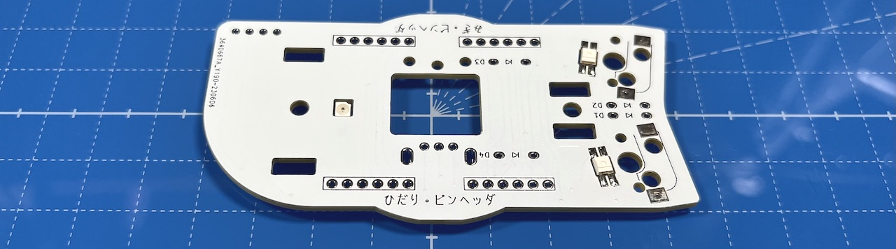  
### MXスイッチソケットのはんだ付け（裏面）
裏面にピンセットで押し付けながらハンダごてに乗せたはんだを流し込みます。  
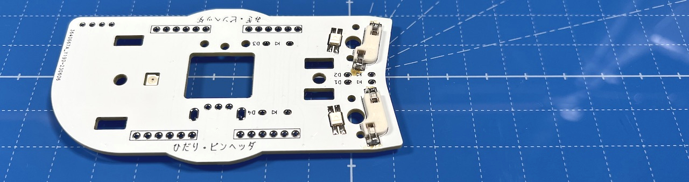  
両側をはんだしてずれなくなったらピンセットからはんだに持ち替えて追加で流し込みしましょう。  表面積が広く多めのはんだが必要です。  
### ダイオードのはんだ付け（裏面）
ダイオードには向きがあります。線と基板のマークの方向を合わせてください。 
 
4箇所に裏からダイオードを差し、マスキングテープで固定します。  
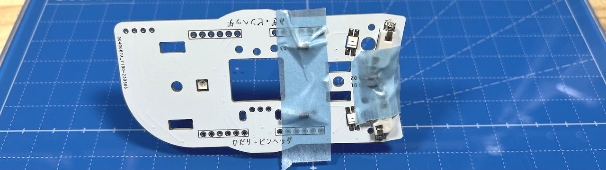  
表ではんだ付けして足を切ります。  
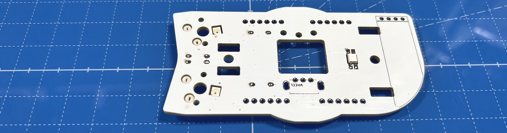  

### ピンヘッダーのはんだ付け（裏面）
40ピンヘッダーから6ピンを4本切り出し、裏面にピンヘッダーを立ててはんだ付けします。
長い方を差し込んでください。反対にした場合は短い方と同程度まで切ってください。 
  

### （オプション）OLEDモジュールのはんだ付け（表面）
表面にOLED用ソケットをはんだ付けします。  
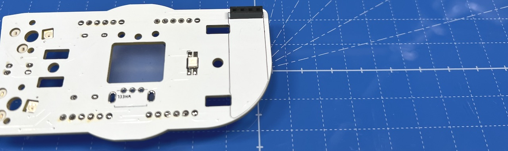  
付け外しを考えないのであれば、OLEDモジュールを直接はんだ付けしてしまうのも良いと思います。

OLEDモジュールにはOLED用ピンヘッダをはんだ付けします。  
  
まだ差し込まず別々に保管してください。  
### ホイールエンコーダーのはんだ付け（表面）
エンコーダーの裾のプレートを少し広げます（ショートを防ぐため）。  
  
基板の四角マークに合わせてホイールを差し込みマスキングテープで垂直に固定したら、裏面をはんだ付けします。  
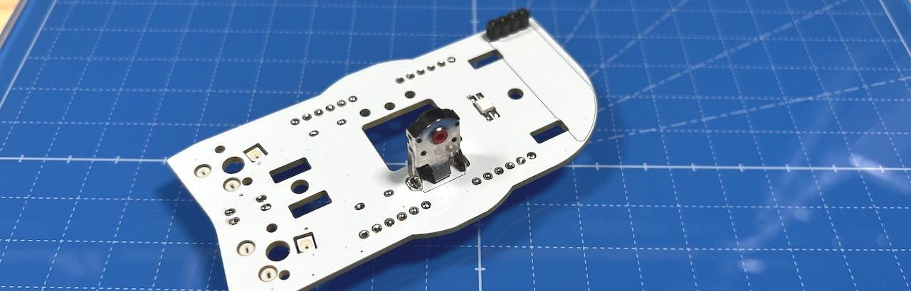  
垂直が難しい場合はホイール側の穴に傾くようにしてください。

## 組み立て
側面ユニットには上下があります。  右手用はOLED用ソケットが下側、左手用は上側です。  
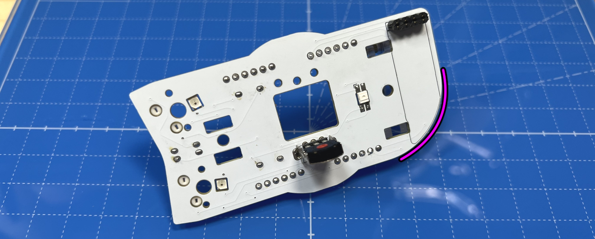  
### スイッチプレートの組み立て
スイッチプレートにM2スペーサー（短2）をM2ネジ（黒）で取り付けます。  M2スペーサー（短2）は長さが近いものも入っていますが長めの2本を使って同じ高さにしてください。  
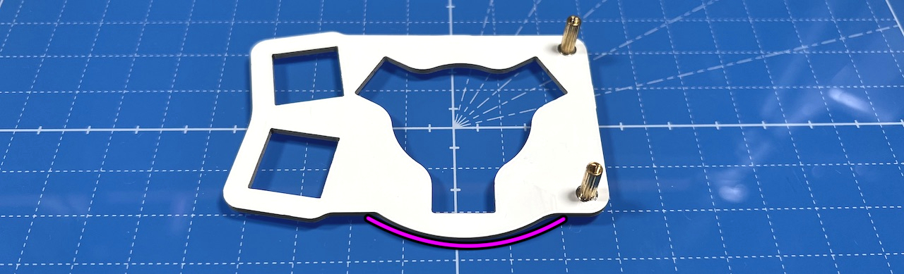  
スイッチプレートも上下があるので気をつけてください。  
  
スペーサーに保護プレート2種を、M2バインドネジで取り付けます。  
穴が空いている大きい方が上です。 
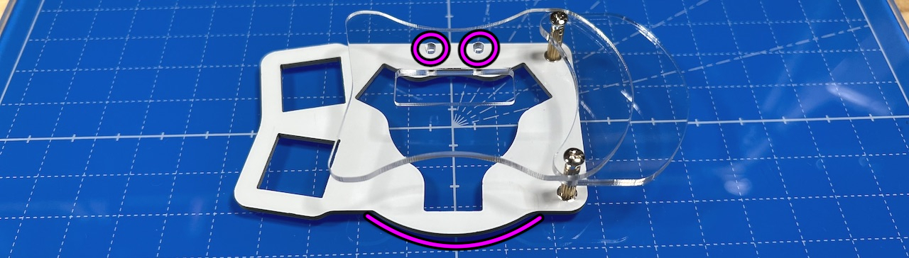  
ホイール横版はメインボードのスペーサーと保護プレートのネジ穴の上下を合わせてください。  

### ベースユニットへの取り付け
側面ユニットにM2スペーサー（短1）とM2スペーサー（長）をM2ネジ（黒）で取り付けます。  
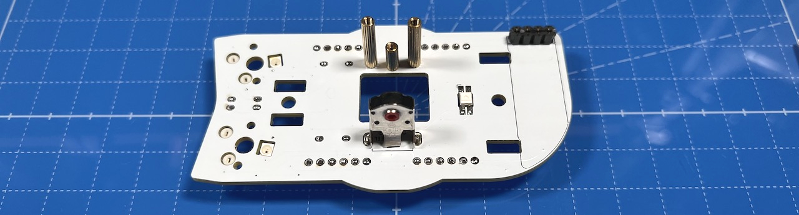  
真ん中がM2スペーサー（短1）です。  
  
初めて側面ユニットを作る場合、ベースユニットで余ったピンソケットから6ピンを2つ切り出して側面ユニットのピンソケットに差し込みます。
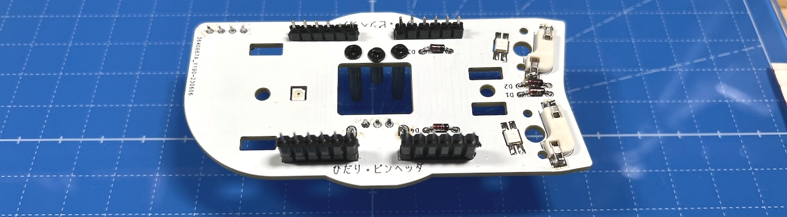  

ベースユニットのM3ネジ２本にワッシャーを通します。  
   
支柱に側面ユニットを差し込み、M3ネジで止めます。  ベースユニットの縦長のスルーホールにピンソケットの足が入るようにしてください。  
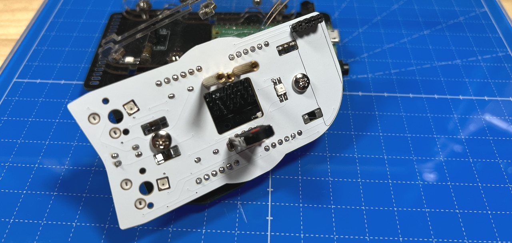  
ベースユニットの裏面でピンソケットをはんだ付けします。  多めにはんだを流して表面までしっかりはんだ付けされるようにしてください。  
  
これで側面ユニットのはんだ付けは終わりです。  

OLEDモジュールを使う場合はここでピンソケットに差し込みます。  
  

ホイールエンコーダーにホイールを差し込み、スイッチプレートにキースイッチを取り付けてMXソケットに差し込みます。  
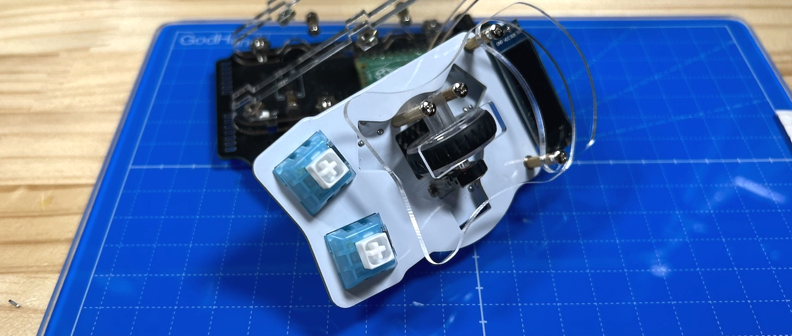  
保護プレートをM2バインドネジで固定したら完成です。  
  
USBケーブルを差し動作確認してみましょう。  LEDは天面ユニットを取り付けるまで光りません。  
問題がなくキーやホイールが反応したら天面ユニットの組み立てに進んでください。  
   

同梱されているものと、別売のホイール付きの2種類があります。  
  
1. [天面ユニットの組み立て](../rightside/4_TOP.md)
   - [（別売）ホイール付き天面ユニット](../rightside/4_TOP_WHEEL.md)

