# Killer Whal　天面ユニット 左手用ビルドガイド （[右手用](../rightside/4_TOP.md)）

1. [スタートページ](../README_EN.md)
2. [ベースユニットの組み立て](../leftside/2_BASE.md)
3. [側面ユニットの組み立て](../leftside/3_SIDE_TRACKBALL.md)
4. 天面ユニットの組み立て（左手用）（このページ）
   - [（別売）ホイール付き天面ユニットの組み立て](../leftside/4_TOP_WHEEL.md)
5. [追加ユニットの組み立て](../leftside/5_ADD.md)
6. [全体の組み立て](../leftside/6_ASSEMBLE.md)
7. [カスタマイズ](../leftside/7_CUSTOM.md)
8. [その他](../leftside/8_MISC.md)

## 内容品
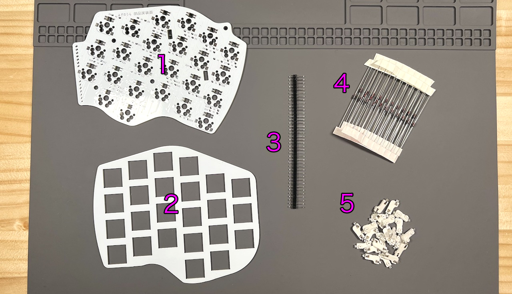    
||部品名|数||
|-|-|-|-|
|1|メインボード|1|FR4|
|2|スイッチプレート|1|FR4|
|3|ピンヘッダ|1||
|4|ダイオード|30||
|5|MXスイッチソケット|24||

## はんだ付け
天面ユニットは全ての部品を裏に実装します。  
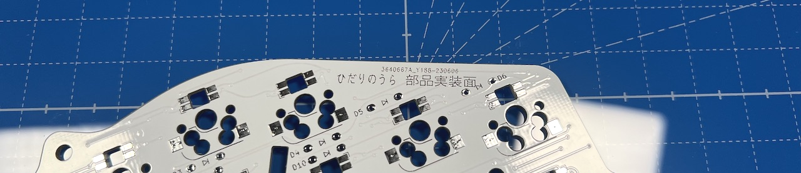  

### （オプション）LEDのはんだ付け 
すべて発光面が向こう向きになります。  
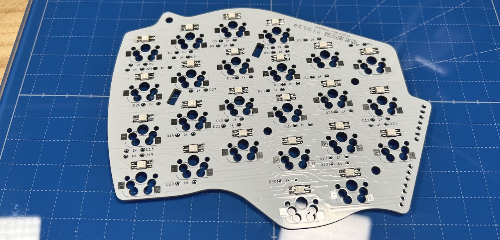  

### ダイオードのはんだ付け
D1からD30までダイオードを差し、マスキングテープで固定します。  
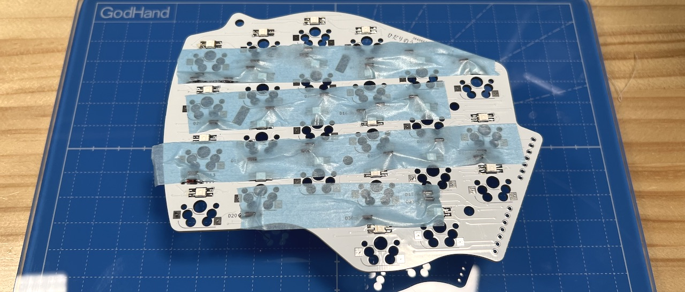  
表ではんだ付けして足を切ります。  
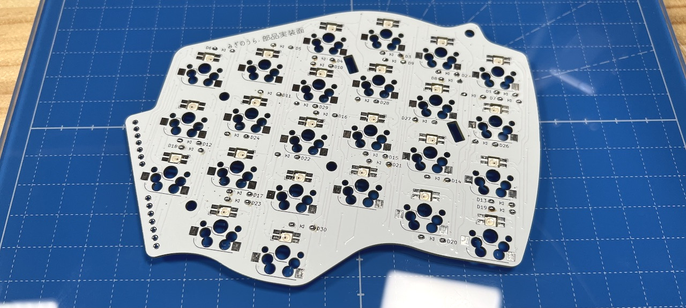  
### MXスイッチソケットのはんだ付け
ピンセットで押し付けながらハンダごてに乗せたはんだを流し込みます。  
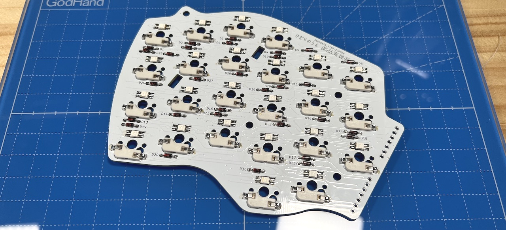  
両側をはんだしてずれなくなったらピンセットからはんだに持ち替えて追加で流し込みしましょう。  表面積が広く多めのはんだが必要です。  

### ピンヘッダーのはんだ付け
40ピンヘッダーから7ピンを2本切り出し、裏面に立ててはんだ付けします。長い方を差し込んでください。  
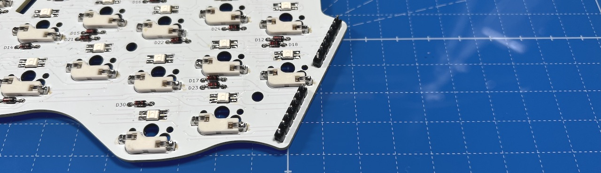  

### 仮組みとソケットのはんだ付け
初めて天面ユニットを作る場合、ベースユニットで余ったピンソケットから7ピンを2つ切り出して側面ユニットのピンソケットに差し込みます。  
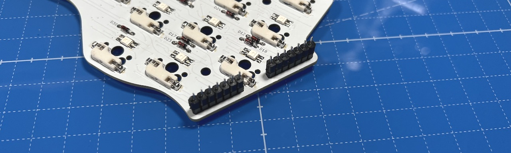  
ベースユニットのM3ネジ4本にワッシャーを通します。  
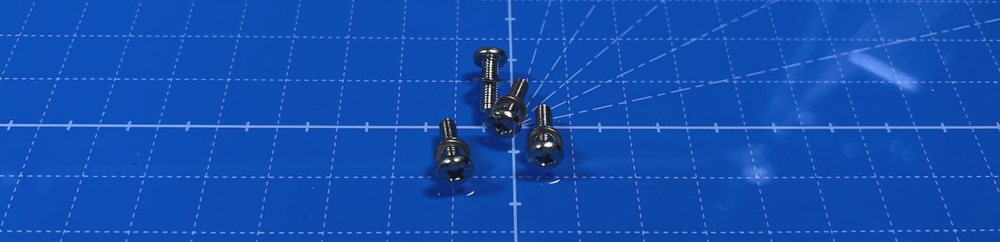  
支柱に天面ユニットを差し込み、M3ネジで止めます。  ベースユニットの横長のスルーホールにピンソケットの足が入るようにしてください。  
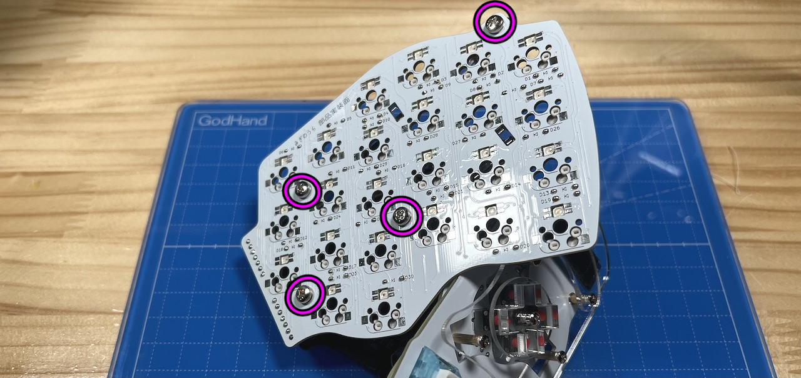  
ベースユニットの裏面でピンソケットをはんだ付けします。  多めにはんだを流して表面までしっかりはんだ付けされるようにしてください。  
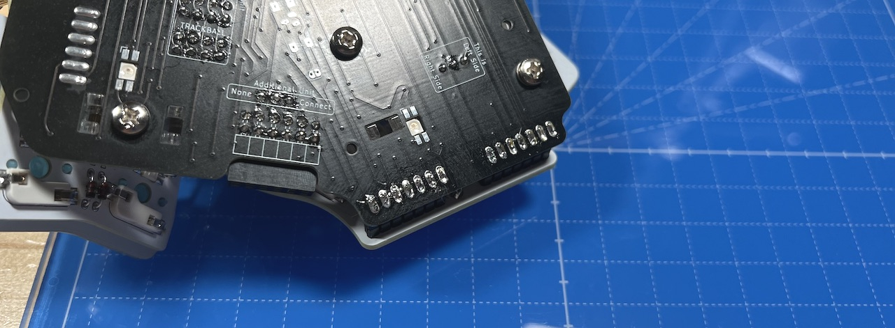  
スイッチプレートの四角にキースイッチを取り付けてMXソケットに差し込みます。  
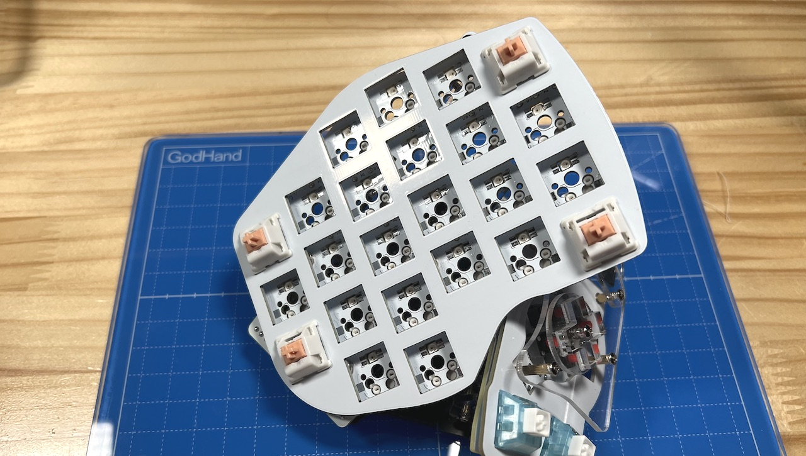  
全てのスイッチを取り付けました。
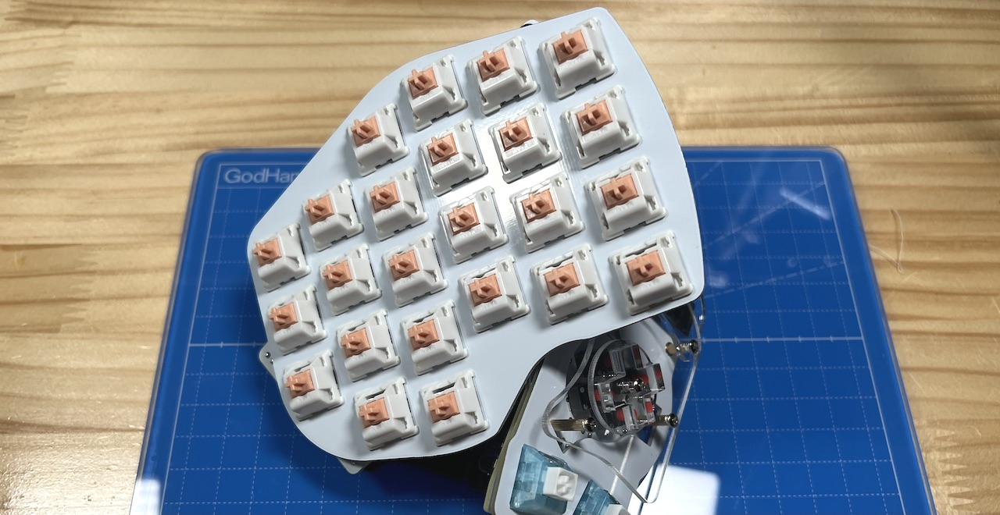  
USBを繋いで動作確認をしてみてください。

追加ユニットは必須ではありません。取り付ける場合は追加ユニットの説明に、取り付けない場合は全体の組立てに進んでください。  

5. [追加ユニットの組み立て](../leftside/5_ADD.md)
6. [全体の組み立て](../leftside/6_ASSEMBLE.md)
