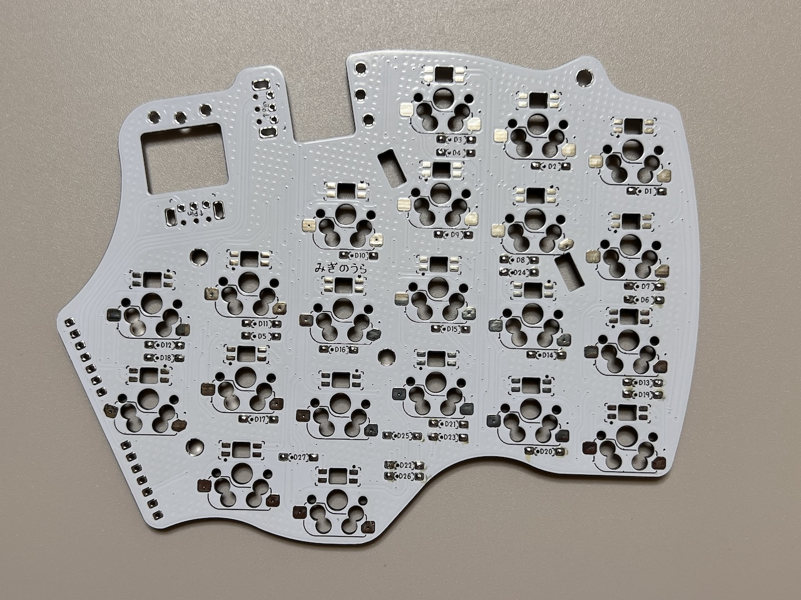
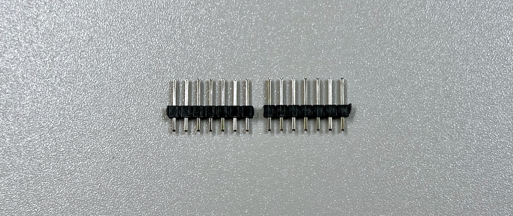
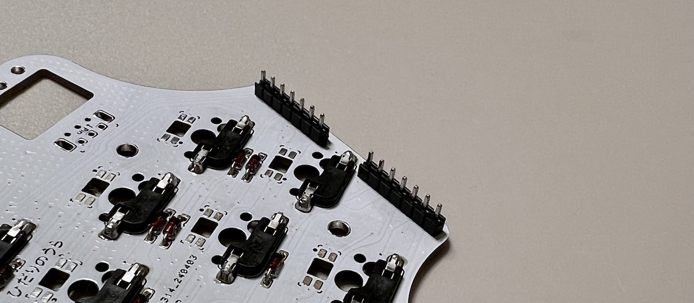
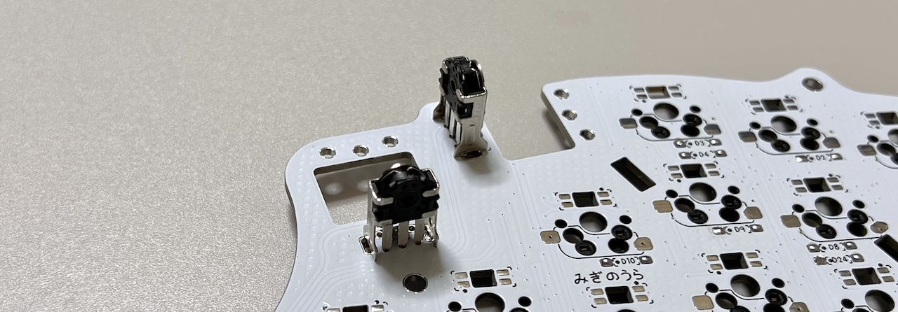
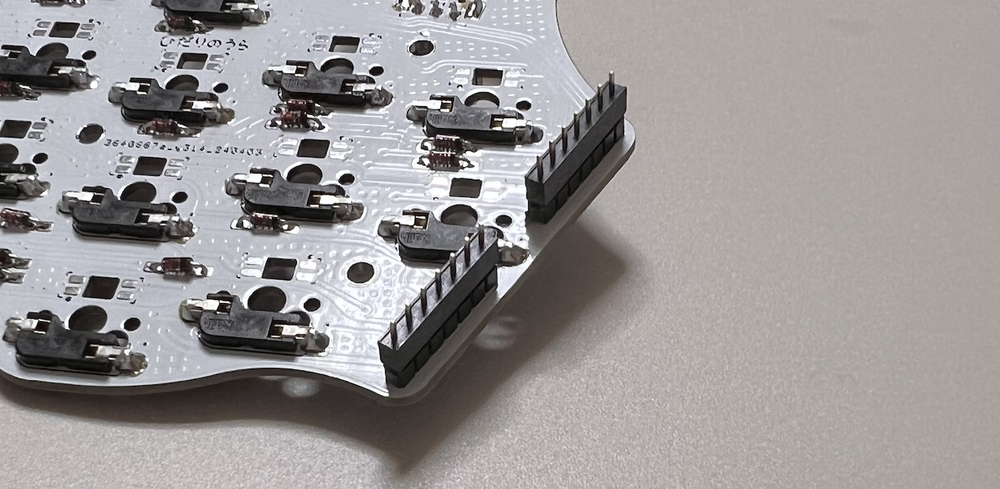

# Killer Whale TOP Unit with Wheel LEFT Side Build Manual （[RIGHT Side](../rightside/4_TOP_WHEEL.md)）

1. [First Page](../README_EN.md)
2. [BASE Unit](../leftside/2_BASE.md)
3. [SIDE Unit](../leftside/3_SIDE_TRACKBALL.md)
4. [TOP Unit](../leftside/4_TOP.md)
   - TOP Unit with wheel (selling separately) LEFT Side
5. [ADD Unit](../leftside/5_ADD.md)
6. [Assemble](../leftside/6_ASSEMBLE.md)
7. [Customize](../leftside/7_CUSTOM.md)
8. [Misc](../leftside/8_MISC.md)

## Contents

||types|quantities||
|-|-|-|-|
|1|Main board|1|FR4|
|2|Switch plate|1|FR4|
|3|Cover plate|2|Acrylic|
|4|M2 short screws|6|4mm|
|5|M2 middle screws|4|6mm|
|6|M2 short spacers|2|8mm|
|7|M2 long spacers|4|16mm|
|8|Pin header|1||
|9|MX hotswap sockets|21||
|10|Diodes|27||
|11|Wheel encoders|2||
|12|Wheels|2||

### Additional Required
|Types|quantities|
|-|-|
|Keyswitches|21|
|Keycaps|21|

## Soldering
### (Optional)LED

> [!CAUTION]
> Orientation varies by location.

### Diodes

### MX hotswap socket

### Pin headers

### Wheel encoder
Widen the plate at the hem of the encoder

Attach M2 long spacers and short spacer with M2 short screws.

## Assembling

Insert pin socket into pin header.

Thread the M3 washers onto 4 M3 screws.

Solder pin sockets on the bottom.

5. [ADD Unit](../leftside/5_ADD.md)
6. [Assemble](../leftside/6_ASSEMBLE.md)
