# Killer Whale ADDITIONAL Unit LEFT Side Build Manual （[RIGHT Side](../rightside/5_ADD.md)）

1. [First Page](../README_EN.md)
2. [BASE Unit](../2_BASE.md)
3. [SIDE Unit](../leftside/3_SIDE_TRACKBALL.md)
4. [TOP Unit](../leftside/4_TOP.md)
5. ADDITIONAL Unit LEFT Side
6. [Assemble](../leftside/6_ASSEMBLE.md)
7. [Customize](../leftside/7_CUSTOM.md)
8. [Misc](../leftside/8_MISC.md)

## Contents
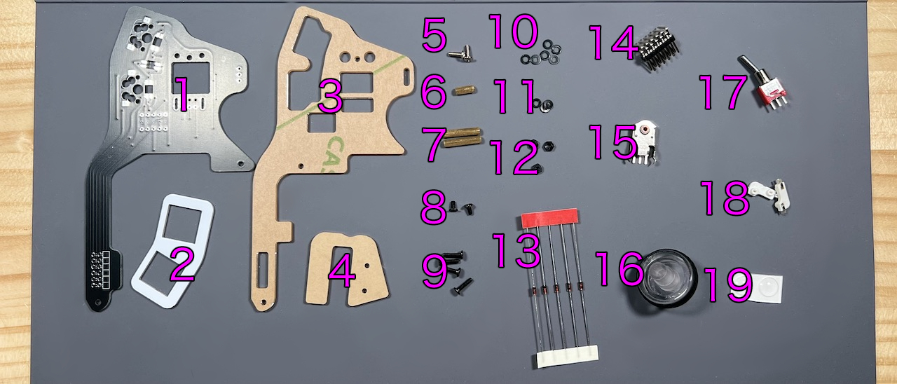    
||types|quantities||
|-|-|-|-|
|1|Main board|1|FR4|
|2|Switch plate|1|FR4|
|3|Bottom plate|1|Acrylic|
|4|Cover plate|1|Acrylic|
|5|M2 silver screws|2|6mm|
|6|M2 short spacer|1|8mm|
|7|M2 long spacers|2|16mm|
|8|M2 short black screws|2|4mm|
|9|M2 short black screws|5|8mm|
|10|M2 black washers|6|
|11|M2 black spring washers|3|
|12|M2 black nuts|3|
|13|Diodes|5||
|14|Angle pin header|1||
|15|Wheel encoder|1||
|16|Wheel|1||
|17|Toggle switch|1||
|18|MX Hotswap sockets|2||
|19|Rubber feet|2||

## Soldering
### (Optional)LED 
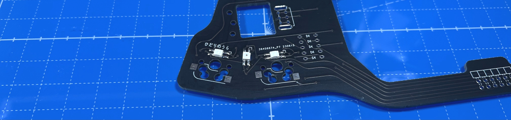  

### Diodes
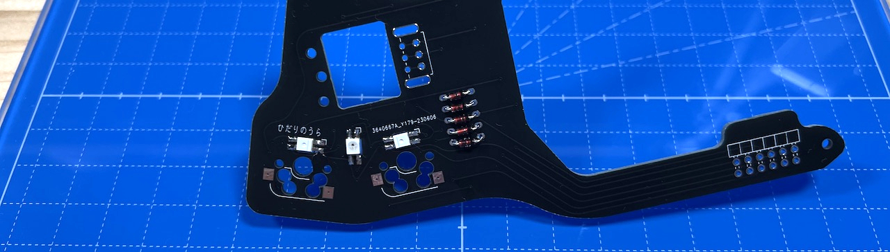  

### MX hotswap socket
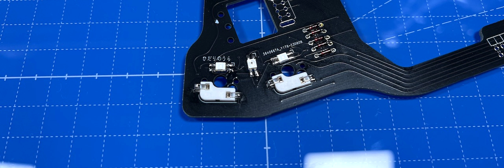  

### Angle pin header 
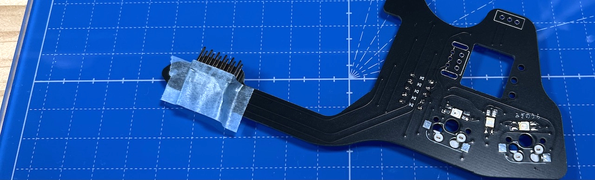  

### Wheel encoder
Widen the plate at the hem of the encoder 
  
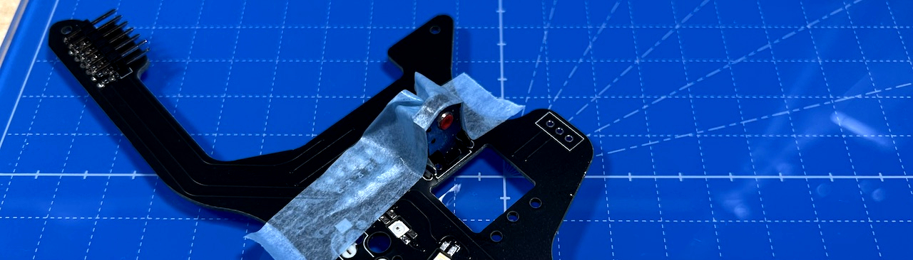  

### Toggle switch
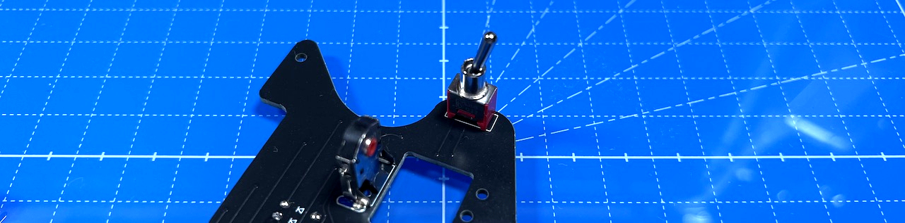  

## Assembling
Attach M2 black washers with M2 black screws. 
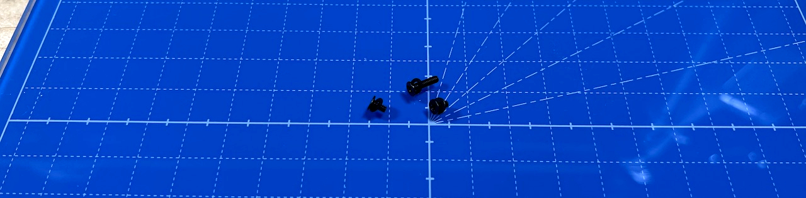  

Attach bottom plate with M2 long black screw and M2 short spacer.
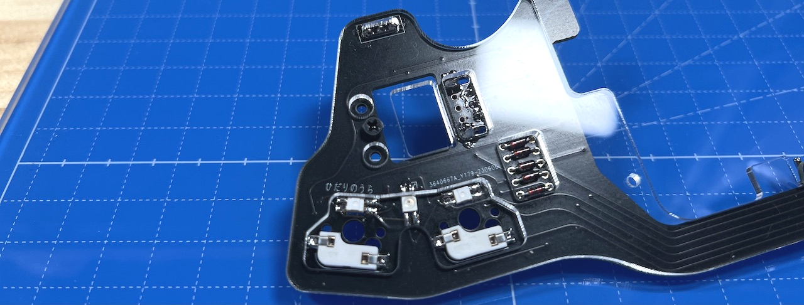  
    
Attach M2 short black screws and M2 long spacers.
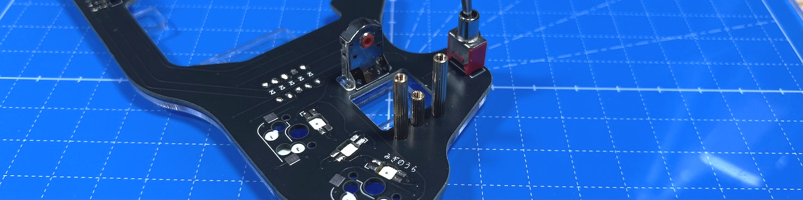  
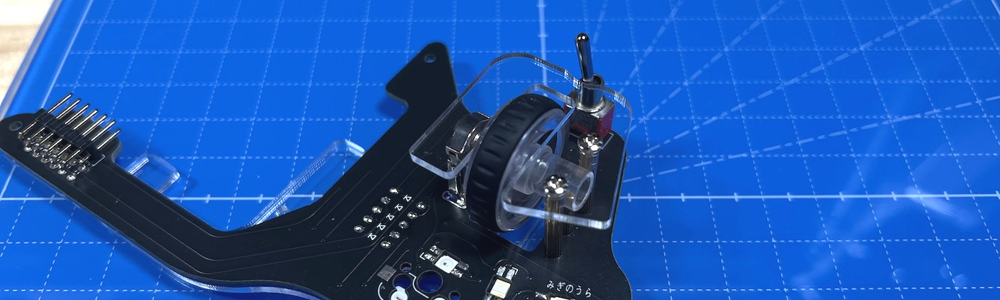  
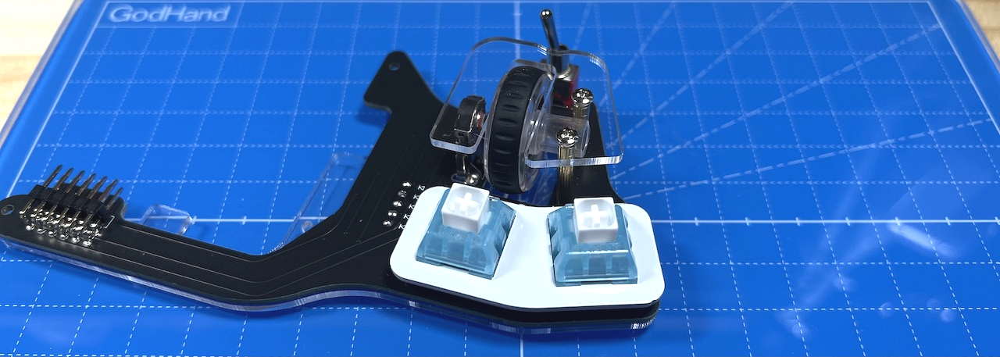  

6. [Assemble](../leftside/6_ASSEMBLE.md)
