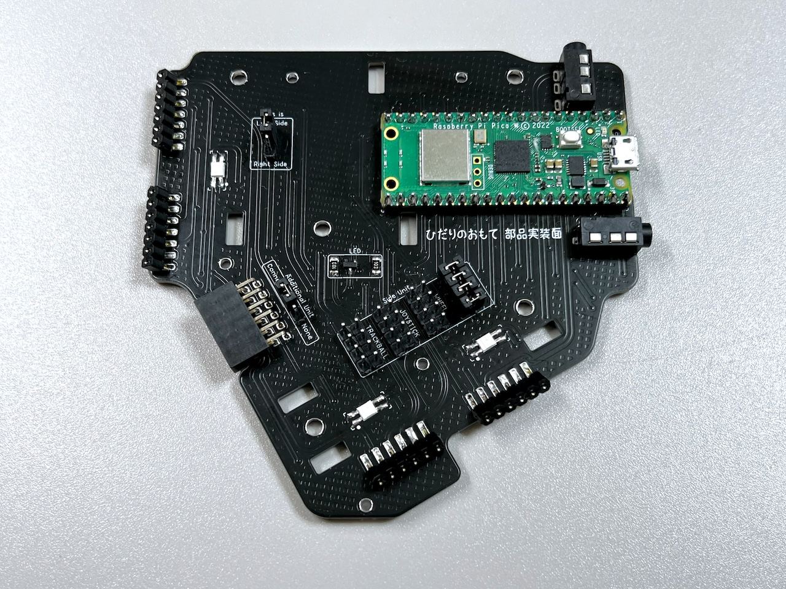
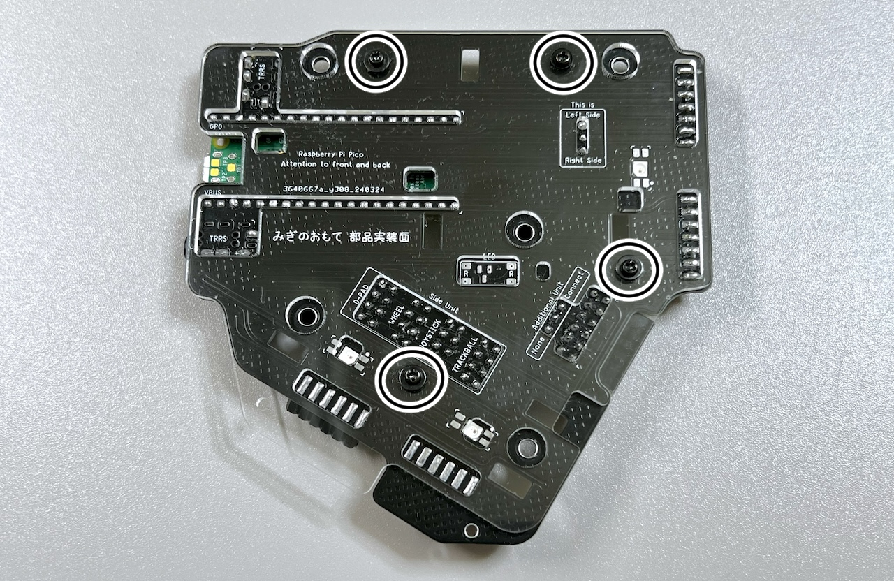
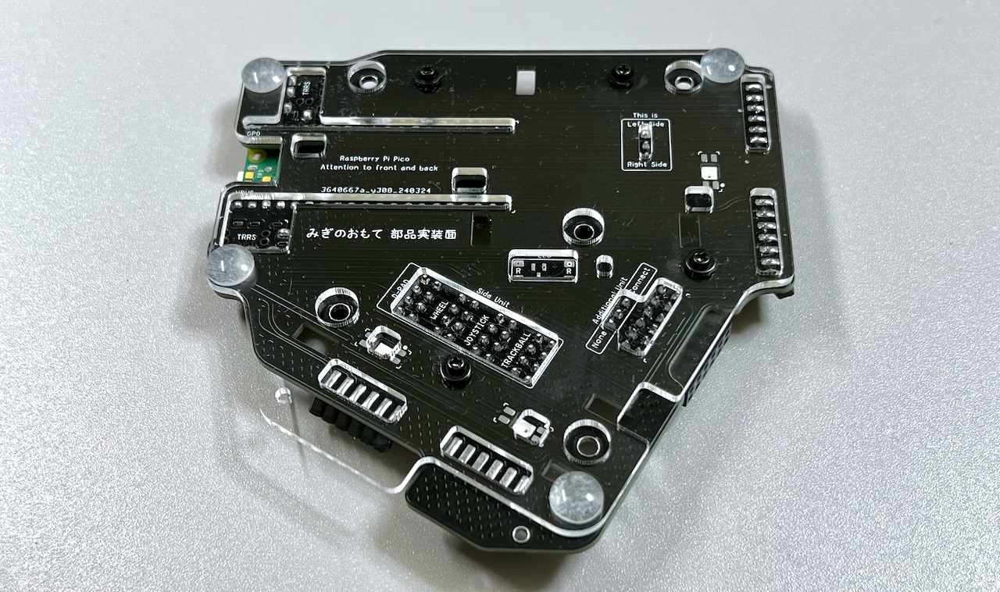
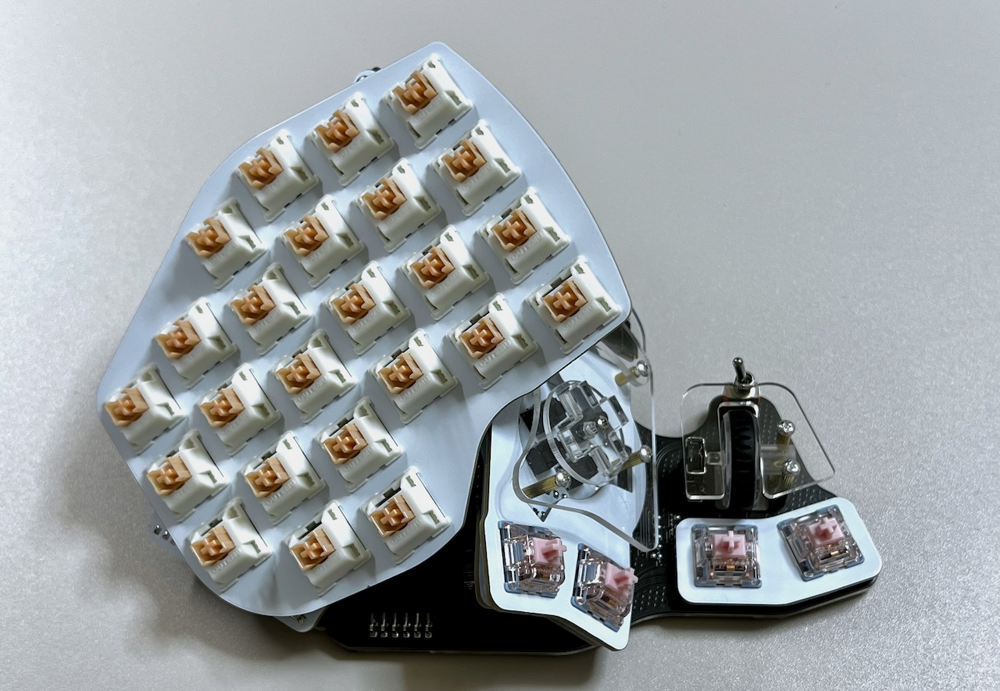
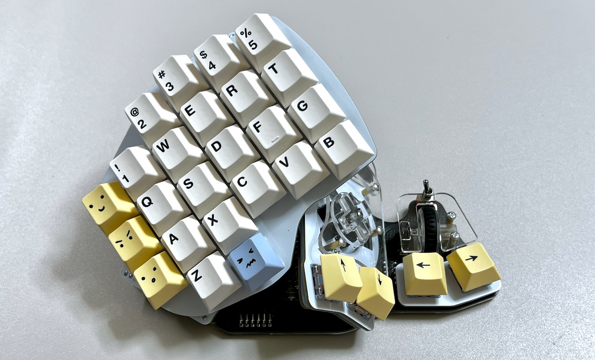

# Killer Whale overall assembly LEFT Side （[RIGHT Side](../rightside/6_ASSEMBLE.md)）

1. [Start Page](../README_EN.md)
2. [BASE Unit](../leftside/2_BASE.md)
3. [SIDE Unit](../leftside/3_SIDE_TRACKBALL.md)
4. [TOP Unit](../leftside/4_TOP.md)
5. [ADD Unit](../leftside/5_ADD.md)
6. Overall assembly LEFT Side
7. [Customizations](../leftside/7_CUSTOM.md)
8. [Misc](../leftside/8_MISC.md)

## Assembly
### Assembly of the  bottom plate
Remove the bottom M3 screws, then the TOP unit by pulling out the pin headers from the pin sockets. Remove the SIDE Unit in a similar fashion.

  

Thread 4 black washers onto 4 screws.  
  
Place the bottom plate on the back of the BASE unit, and insert the screws from the back side, and secure the screws with washers, spring washers and nuts.
  

Attach the 4 rubber feet.
 

### Assembly of the ADD Unit (Optional)
Thread 3 black washers onto 3 black screws.  
  
Slide the ADD unit and insert the angle pin header into the angle pin socket.

  

Insert black M2 screws into the 3 screw holes, and secure them with washers, spring washers and nuts.

  

Attach the rubber feet.
  

Confirm that everything is working by connecting the unit to a computer with a USB cable. 
> [!NOTE]
> The LEDs will only work if the TOP unit is connected.  
> The direction of the scrolling can be configured later.

### Completion
Reattach the SIDE and TOP unit to the supports.

  
The keyboard will be complete after placing keycaps.
  
Good job!
Next, proceed to the guide for key settings.

7. [Customizations](../leftside/7_CUSTOM.md)
