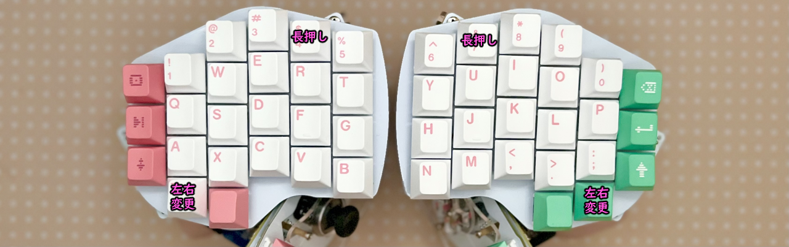
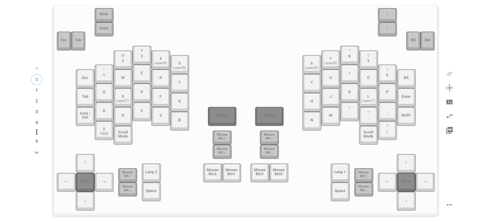

# Killer Whale Customize
1. [Start Page](../README_EN.md)
2. [BASE Unit](../leftside/2_BASE.md)
3. [SIDE Unit](../leftside/3_SIDE_TRACKBALL.md)
4. [TOP Unit](../leftside/4_TOP.md)
5. [ADD Unit](../leftside/5_ADD.md)
6. [Assembly](../leftside/6_ASSEMBLE.md)
7. Customizations
8. [Misc](../leftside/8_MISC.md)

## Firmware for Remap
Once you have confirmed that all keys are working, download the firmware that suits you needs.

- SOLO  [tarohayashi_killerwhale_solo_via.uf2
](https://github.com/Taro-Hayashi/KillerWhale/releases/latest/download/tarohayashi_killerwhale_solo_via.uf2)
- DUO, trackball on LEFT Side [tarohayashi_killerwhale_duo_ballleft.uf2
](https://github.com/Taro-Hayashi/KillerWhale/releases/latest/download/tarohayashi_killerwhale_duo_ballleft.uf2)
- DUO, trackball on RIGHT Side [tarohayashi_killerwhale_duo_ballright.uf2
](https://github.com/Taro-Hayashi/KillerWhale/releases/latest/download/tarohayashi_killerwhale_duo_ballright.uf2)
- DUO, trackball on BOTH Sides [tarohayashi_killerwhale_duo_doubleball.uf2
](https://github.com/Taro-Hayashi/KillerWhale/releases/latest/download/tarohayashi_killerwhale_duo_doubleball.uf2)

*** Do not connect or disconnect the TRRS cable while the USB is connected. ***
Note: keep the toggle switch in the ADD unit towards the palm of your hand.

The key highlighted in the picture can be substituted for the Raspberry Pi Pico BOOT button. By pressing it while connecting the USB cable to a PC, a folder named RPI-RP2 will appear, and you can drag and drop uf2 firmware files to it. 

 
Note: If you use a split keyboard, both sides need to be updated.
Note: while there are two TRRS connectors, you just need to use one.

## Switching between left and right (SOLO case)
The default configuration is QWERTY for lef-handed users. It is possible to select a right-handed keymap with the toggle switch.
Even if you do not have the ADD unit, you can toggle between left and right-hand keymaps with the key combination depicted below. 
  

## Mouse layer and auto mouse
Assuming that you are using a trackball SIDE unit, just after the trackball has moved, you can use the key F (resp. J) as mouse click, and D (resp. K) as right click.
By long-pressing S (resp. L), you can exchange the roles of F and D, even if the trackball is not moving.
  
- You can scroll by moving the trackball while pressing the lowest key.
- The keys in the ADD units also have the mouse and right mouse click assignments. You can scroll with the wheel as well.

Here is how to activate or deactivate the auto mouse function.
## Changing trackball direction and speed
Hold the second key from the corner (key 4, resp. 7) to move to the trackball setting layer, described in the picture below
  
- Select the orientation of the trackball by adjusting angle or inverting across the X axis.
- You can select scroll or cursor modes via the mode change key.

## LED settings
Hold the key in the corner, so 5 (resp. 6) to move to the RGB setting layer.
  

## Using Remap- Remap https://remap-keys.app
You can customize everything, including the joystick or wheels with a the Remap website. It is very easy to use, therefore highly recommended.

You will need Google Chrome or Microsoft Edge to use it.
- Remap https://remap-keys.app

  

 
### Save and restore keymap
You can save your keymap and restore it with the keys below.
  
Consider sharing your keymap with others!

### Change layout (exchange left and right for SOLO case, reduced mode for DUO case)
You can change the appearance of remap from here.
  

### Assign keys
After dragging & dropping keys, press flash to activate your changes.
  
If you select Japanese instead of English (US) from the pull-list, it will select a Japanese keyboard layout (JIS). Check you OS settings.

### Configuring LEDs
With the following button, it is possible to customize LEDs.
  

#### Special key
VIA USER KEY in the FUNCTIONS tab can be used to customize various functions, including shortcuts, trackball or OLED, regardless of the OS.

  

The last page contains firmware files, JSON files and troubleshooting information.  
  
8. [Misc](../leftside/8_MISC.md)
