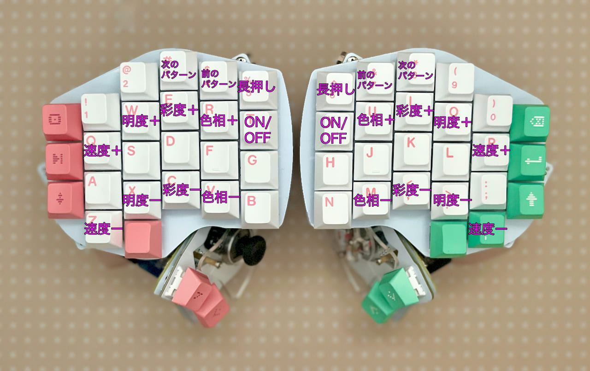

# Killer Whale Customize
1. [First Page](../README_EN.md)
2. [BASE Unit](../leftside/2_BASE.md)
3. [SIDE Unit](../leftside/3_SIDE_TRACKBALL.md)
4. [TOP Unit](../leftside/4_TOP.md)
5. [ADD Unit](../leftside/5_ADD.md)
6. [Assemble](../leftside/6_ASSEMBLE.md)
7. Customize
8. [Misc](../leftside/8_MISC.md)

## Toggle LEFT and RIGHT keymap, bootloader mode, oled setting
Hold B（N）to move to utility layer.
  

## Firmware for split keyboard

- Ball in LEFT Side [tarohayashi_killerwhale_duo_ballleft.uf2
](https://github.com/Taro-Hayashi/KillerWhale/releases/download/0.21.4.1/tarohayashi_killerwhale_duo_ballleft.uf2)
- Ball in RIGHT Side [tarohayashi_killerwhale_duo_ballright.uf2
](https://github.com/Taro-Hayashi/KillerWhale/releases/download/0.21.4.1/tarohayashi_killerwhale_duo_ballright.uf2)
- Ball in BOTH Side [tarohayashi_killerwhale_duo_default.uf2
](https://github.com/Taro-Hayashi/KillerWhale/releases/download/0.21.4.1/tarohayashi_killerwhale_duo_default.uf2)

  

## Mouse layer and auto mouse
Hold S（L）or use trackball to move to mouse layer.

  

## Trackball settings
Hold 4（7）or use trackball to move to ball setteing layer.
  

## LED settings
Hold 5（6）or use trackball to move to RGB setteing layer.
  

## Using VIA
Download JSON File.
- SOLO [killer_whale_solo.json
](https://github.com/Taro-Hayashi/KillerWhale/releases/download/0.21.4.1/killer_whale_solo.json)
- DUO [killer_whale_duo.json
](https://github.com/Taro-Hayashi/KillerWhale/releases/download/0.21.4.1/killer_whale_duo.json)

Access VIA.
- [Web版VIA（Google Chromeでアクセスしてください）](https://usevia.app/#/design)
- [アプリ版VIA](https://github.com/the-via/releases/releases)
  
Load JSON.
  

### Save and restore

  
- sample keymap [solo_left.layout.json](https://github.com/Taro-Hayashi/KillerWhale/releases/download/0.21.4.1/solo_left.layout.json)

### 左右の変更（単体使用時）
LAYOUTSから見た目の左右を変更することができます。  
  

### 通常のキーの割り当て
入れ替えたいキーを上から選んで、下のキーコード一覧をクリックすると設定できます。  
  
### ホイールのキーの割り当て
丸いキーを選ぶとホイールに割り当てるキーを設定できます。
  
QMK Firmwareのキーコードを入力してください。こちらに一覧があります。
-  https://github.com/qmk/qmk_firmware/blob/master/docs/keycodes.md

### 特殊なキーの割り当て
SPECIALタブのANYキーに直接入力することでいろいろな機能を設定することができます。
  
ここで紹介しているのはほんの一部です。
#### 修飾キーの同時押し
修飾キー（Shift、Ctrlなど）と通常のキーの組み合わせを1キーに割り当てることができます。
|機能|キーコード|
|-|-|
|Ctrl|C(キーコード)|
|Shift|S(キーコード)|
|Win、Cmd|G(キーコード)|
|Alt、Opt|A(キーコード)|
|Ctrl+Shift|RCS(キーコード)|
|Win、Cmd+Shift|LSG(キーコード)|

例えばCtrl+Sのキーは
~~~
C(KC_S)
~~~
となります。

詳しくはこちらをご覧ください。
- https://github.com/qmk/qmk_firmware/blob/master/docs/mod_tap.md

#### Mod-Tap
長押しで修飾キー、短押しで通常のキーが打てるようなキーを設定できます。

|機能|キーコード|
|-|-|
|Ctrl|LCTL_T(キーコード)|
|Shift|LSFT_T(キーコード)|
|Win、Cmd|LGUI_T(キーコード)|
|Alt、Opt|LALT_T(キーコード)|
|Ctrl+Shift|RCS_T(キーコード)|
|Win、Cmd+Shift|LSG_T(キーコード)|

長押しでShift、短押しでZの場合は
~~~
LSFT_T(KC_Z)
~~~
です。

詳しくはこちらをご覧ください。
- https://github.com/qmk/qmk_firmware/blob/master/docs/mod_tap.md

#### レイヤーキー
レイヤーの切り替え方法は複数あります。
|機能|キーコード|
|-|-|
|押している間だけ切り替え|MO(レイヤー番号)|
|押すと切り替え、もう一度押すと戻る|TG(レイヤー番号)|
|長押しでレイヤー切り替え、短押しは通常キー|LT(レイヤー番号、キーコード)|

詳しくはこちらをご覧ください。
- https://github.com/qmk/qmk_firmware/blob/master/docs/feature_layers.md

#### トラックボールの方向、速度を変更するキー
|機能|キーコード|
|-|-|
|速度UP|CUSTOM(65)|
|速度DOWN|CUSTOM(66)|
|角度+（左手）|CUSTOM(67)|
|角度-（左手）|CUSTOM(68)|
|X軸の反転（左手）|CUSTOM(69)|
|角度+（右手）|CUSTOM(70)|
|角度-（右手）|CUSTOM(71)|
|X軸の反転（右手）|CUSTOM(72)|
|スクロールとカーソルの切り替え（左手）|CUSTOM(73)|
|スクロールとカーソルの切り替え（右手）|CUSTOM(74)|
|スクロールの反転|CUSTOM(75)|
|押下時だけスクロールモード|CUSTOM(76)|
|オートマウスの切り替え|CUSTOM(77)|
|OLED表示の切り替え|CUSTOM(78)|

最後のページはファームウェア、JSONファイル、トラブルシューティングの簡単なまとめです。
8. [Misc](../leftside/8_MISC.md)
