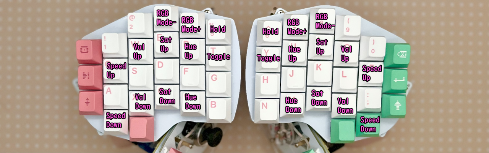
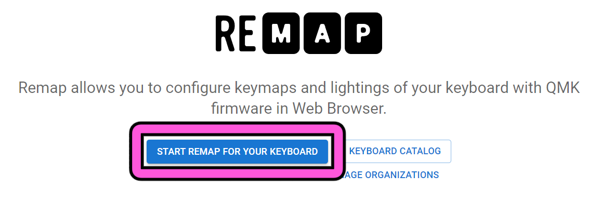
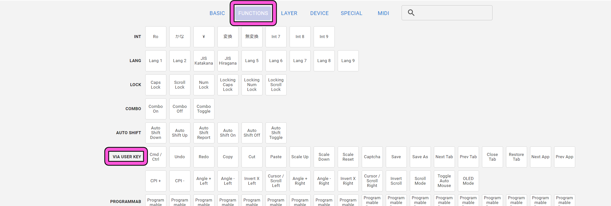

# Killer Whale Customize
1. [First Page](../README_EN.md)
2. [BASE Unit](../leftside/2_BASE.md)
3. [SIDE Unit](../leftside/3_SIDE_TRACKBALL.md)
4. [TOP Unit](../leftside/4_TOP.md)
5. [ADD Unit](../leftside/5_ADD.md)
6. [Assemble](../leftside/6_ASSEMBLE.md)
7. Customize
8. [Misc](../leftside/8_MISC.md)

## Firmware for Remap

- SOLO  [tarohayashi_killerwhale_solo_via.uf2
](https://github.com/Taro-Hayashi/KillerWhale/releases/latest/download/tarohayashi_killerwhale_solo_via.uf2)
- DUO Ball in LEFT Side [tarohayashi_killerwhale_duo_ballleft.uf2
](https://github.com/Taro-Hayashi/KillerWhale/releases/latest/download/tarohayashi_killerwhale_duo_ballleft.uf2)
- DUO Ball in RIGHT Side [tarohayashi_killerwhale_duo_ballright.uf2
](https://github.com/Taro-Hayashi/KillerWhale/releases/latest/download/tarohayashi_killerwhale_duo_ballright.uf2)
- DUO Ball in BOTH Side [tarohayashi_killerwhale_duo_doubleball.uf2
](https://github.com/Taro-Hayashi/KillerWhale/releases/latest/download/tarohayashi_killerwhale_duo_doubleball.uf2)

*** Do not connect or disconnect the TRRS cable while the USB is connected. ***

The button in the image can be substituted for the Raspberry Pi Pico BOOT button.

 

## Mouse layer and auto mouse
Hold S（L）or use trackball to move to mouse layer.

  

## Trackball settings
Hold 4（7）or use trackball to move to ball setteing layer.
  

## LED settings
Hold 5（6）or use trackball to move to RGB setteing layer.
  

## Using Remap
- Remap https://remap-keys.app

  

If required JSON
- SOLO [killer_whale_solo.json
](https://github.com/Taro-Hayashi/KillerWhale/releases/download/0.22.2/killer_whale_solo.json)
- DUO [killer_whale_duo.json
](https://github.com/Taro-Hayashi/KillerWhale/releases/download/0.22.2/killer_whale_duo.json)

### Save and restore keymap
  

### Change layout
  

### Assign keys
After Drag & Drop Keys, press flash.
  

#### Original keycode for settings
  

### Setting RGBs
  
  
  
8. [Misc](../leftside/8_MISC.md)
