# Killer Whale BASE Unit RIGHT Side Build Manual （[LEFT Side](../leftside/2_BASE.md)）

1. [Start Page](../README_EN.md)
2. BASE Unit RIGHT Side
3. [SIDE Unit](../rightside/3_SIDE_TRACKBALL.md)
4. [TOP Unit](../rightside/4_TOP.md)
5. [ADDITIONAL Unit](../rightside/5_ADD.md)
6. [Assembly](../rightside/6_ASSEMBLE.md)
7. [Customizations](../rightside/7_CUSTOM.md)
8. [Misc](../rightside/8_MISC.md)

## Contents
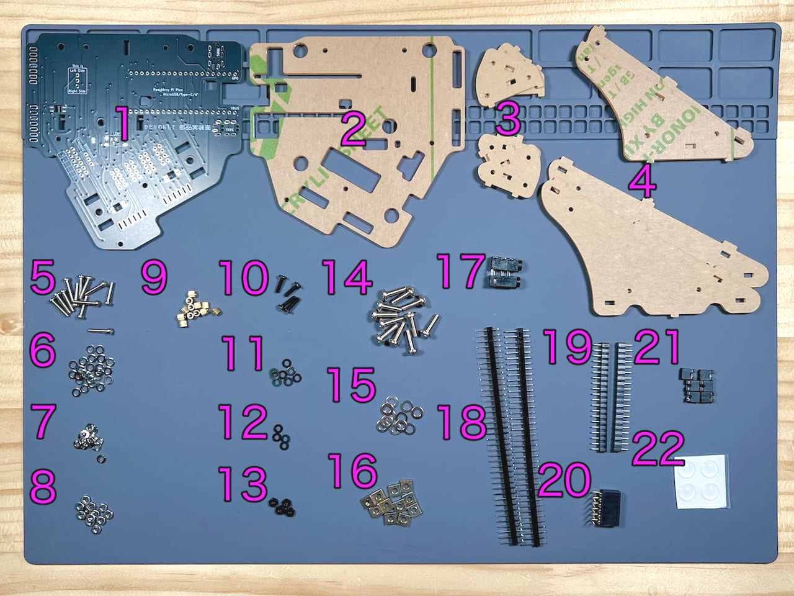      
||Types |Quantities||
|-|-|-|-|
|1|Main Board|1|FR4|
|2|Bottom Plate|1|Acrylic|
|3|SIDE Unit Pillar|4|Acrylic|
|4|TOP Unit Pillar|4|Acrylic|
|5|M2 silver screw|12|10mm|
|6|M2 silver washers|24||
|7|M2 silver spring washers|12||
|8|M2 silver nuts|12||
|9|M2 spacers|12|3mm|
|10|M2 black screws|4|8mm|
|11|M2 black washers|8||
|12|M2 black spring washers|4|
|13|M2 black nuts|4|
|14|M3 screws|11|10mm|
|15|M3 washers|11|Nylon for TOP Unit|
|16|M3 square nuts|11||
|17|TRRS jacks|2||
|18|Pin headers|2||
|19|Pin sockets|2||
|20|Angle pin socket|1||
|21|Jumpers|6||
|22|Rubber feet|4||

Disclaimer: it is possible that the screws aspect is different from the pictures from the build guide.

The following small components are only needed in case you plan on using LEDs.

<table>
    <tr>
      <td>23</td>
      <td>MOSFET</td>
      <td>1</td>
      <td>BSS138</td>
    </tr>
    <tr>
      <td>24</td>
      <td>Resistors</td>
      <td>2</td>
      <td>10kΩ</td>
    </tr>
 </table>

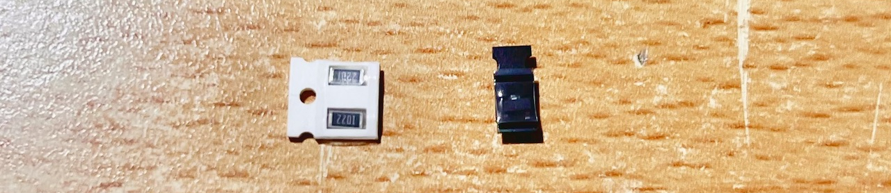    

## Soldering
The components of the BASE unit are all placed on the front side.
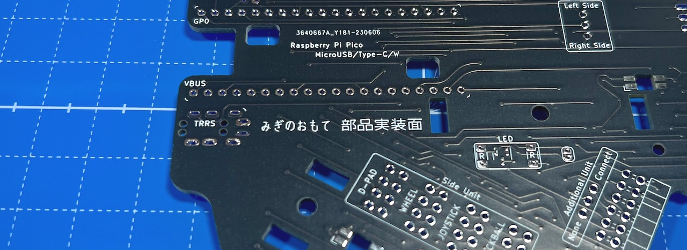    

### Soldering of the Raspberry Pi Pico
Separate the pin header into sets of 20 pins with a nipper. 
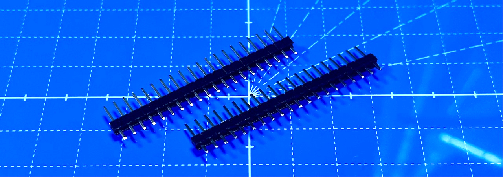  
Insert the pins in the holes in the PCB, place the Raspberry Pi Pico and secure it with masking tape.
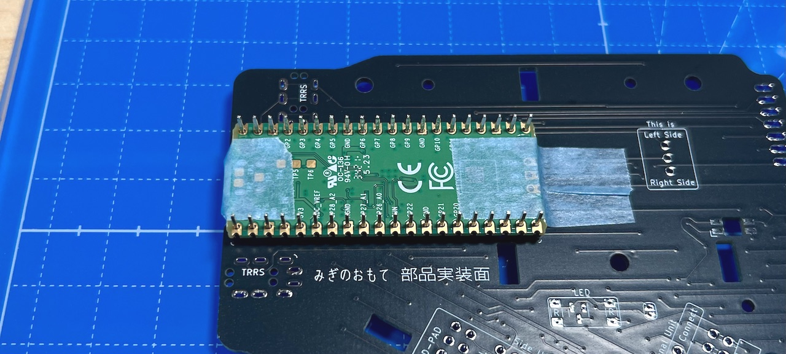    
Be careful to place the Raspberry Pi Pico on the correct side - you can confirm this by checking the position of GP0 and VBUS. Once this is done, proceed with soldering.

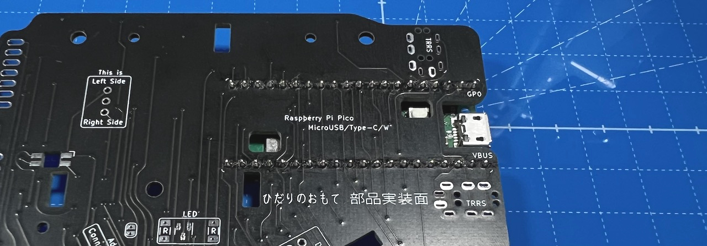    
Solder both sides of the front and back. 
Solder from the front and back side. Cut the long side of the pins with a nipper.

### Soldering of Angle Pin Socket
Secure the socket with masking tape, then solder from the back side 
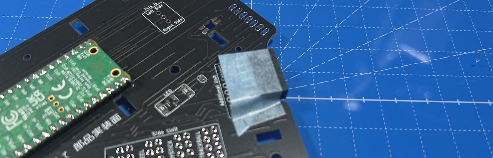    

### Soldering of TRRS Jacks
They are necessary to connect two units.
THere are two locations on the BASE unit, you can solder both connector or just the position you prefer, or no connector if you plan to use a single unit only.
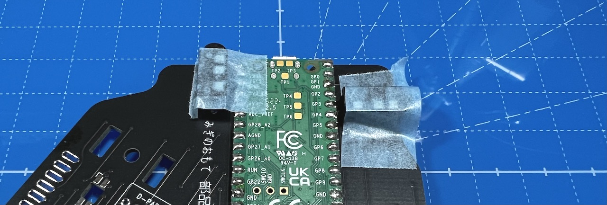    

### Jumpers
From the pin headers, cut out two sets of 3 pins, and 8 sets of 4 pins. Solder them in the area delimitated by frames. Insert the short side in holes so that the long side is stick out from the front side of the PCB.
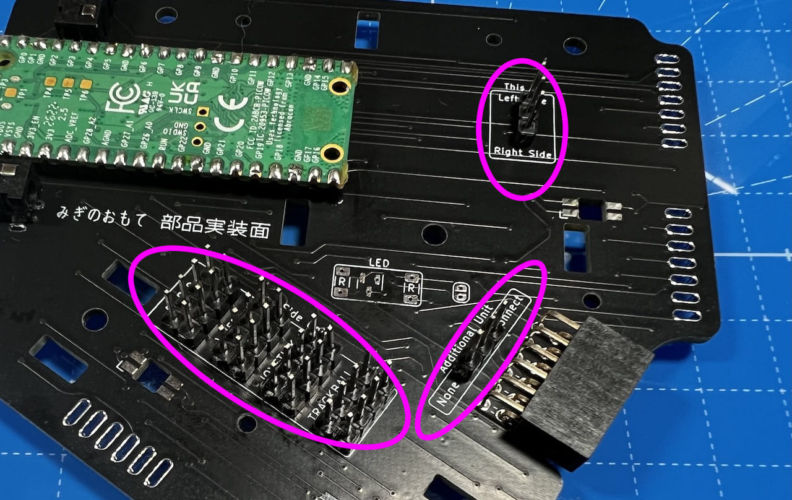     
The operation is easier to perform by placing masking tape through the pins and secure them.
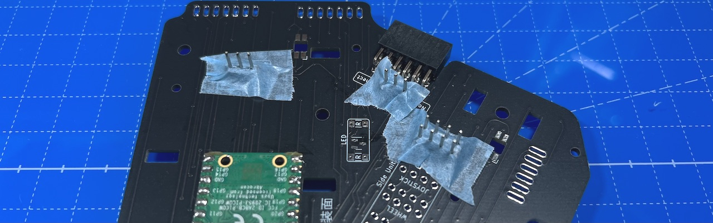    
Insert 6 jumpers at 3 locations according to your planned configuration.
For the LEFT BASE unit, in case you plan to have the ADD unit and a keypad based SIDE unit, the jumper placement should be the same as the picture below.
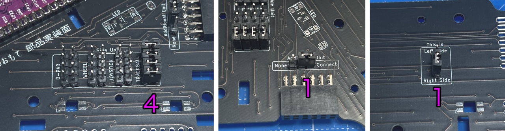    
Please make sure to disconnect the USB cable when you change the configuration/jumpers.

### Soldering of the LEDs (optional)
Take out the MOSFET and resistors for the LEDs out of their containers. Since the components are very small, manipulate them with tweezers during soldering in order to avoid getting burned.
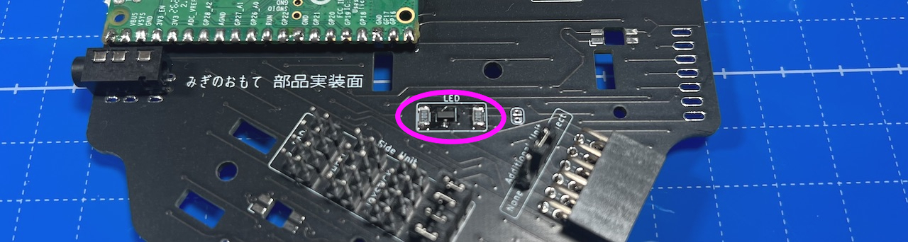  

LEDs have a direction. Make sure that the round part emitting light is facing away by placing the cut leg of LEDs on the pad with a mark on the PCB.
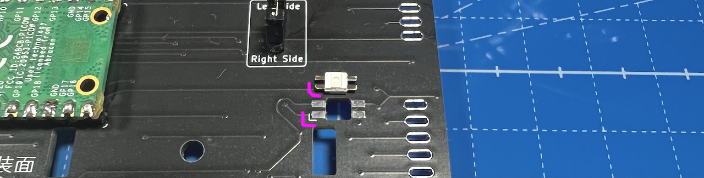    
There are 3 locations for LEDs on the base unit.
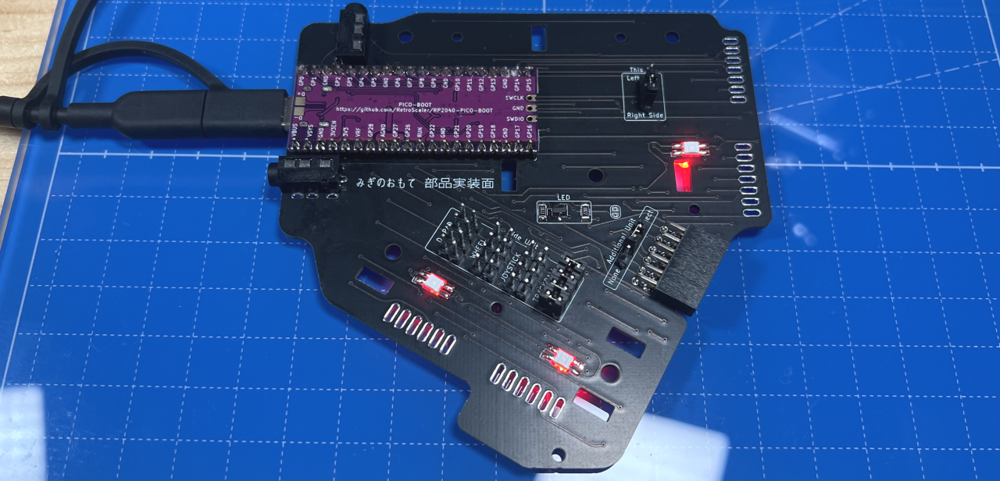    
Connect a USB cable and check if the LEDs are working.

This is the last soldering step for the BASE unit.

## Supports
### Assembly of the supports
4 supports must be prepared with the 8 acrylic sheets.
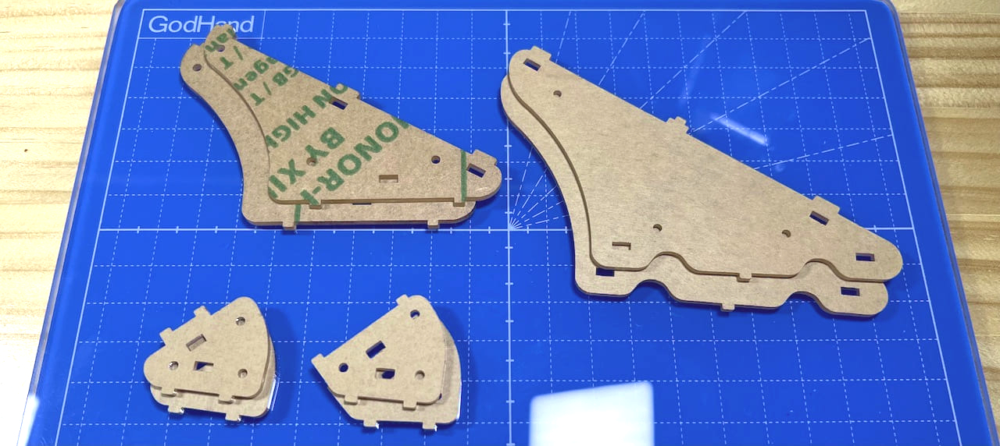    
Thread the M2 silver washers onto 12 M2 silver screws. Washers with a cut are spring washers used on the other side of the screw when securing it with a nut.
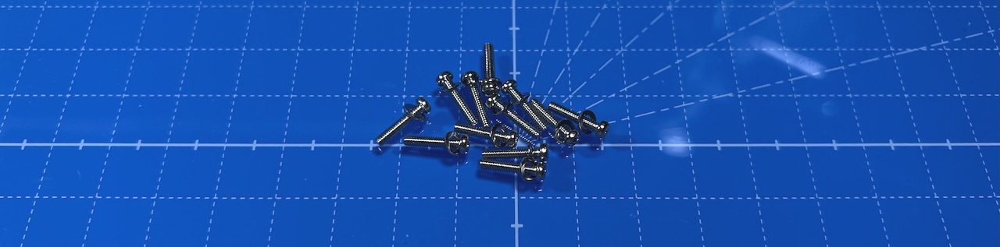    
Washers and spring washers are useful because they prevent nuts from getting loose. But it is not a major problem to assemble the unit without them.

Insert the M2 screws with washers into one side of the pillars, and secure with M2 spacers.
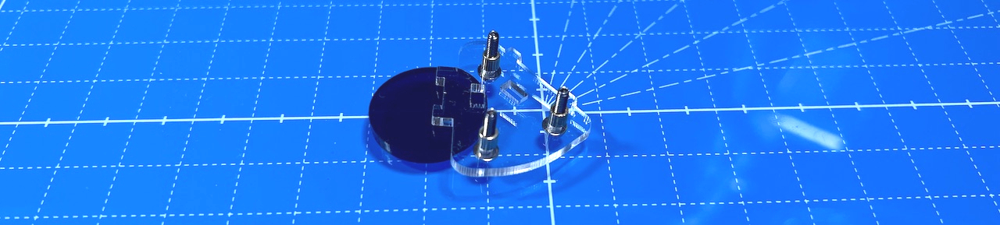    
Insert the square nut diagonally into the slits of the supports. The small support has 2 slits, the medium on 3 and the large one 4. 
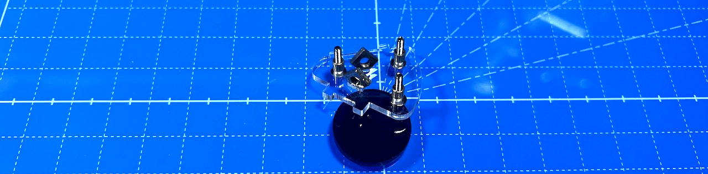    
Place the other side of the support on the screws and the square nut.
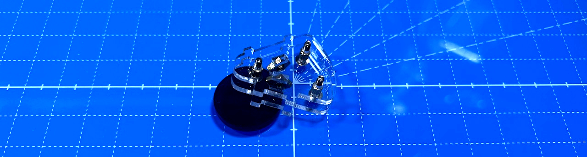     
Insert washers and spring washers, and secure with a nut.
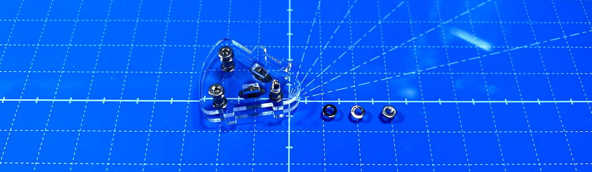    
Finally, tighten the screws a bit with a screwdriver, but make sure not to exert too much force as the sheets may break.
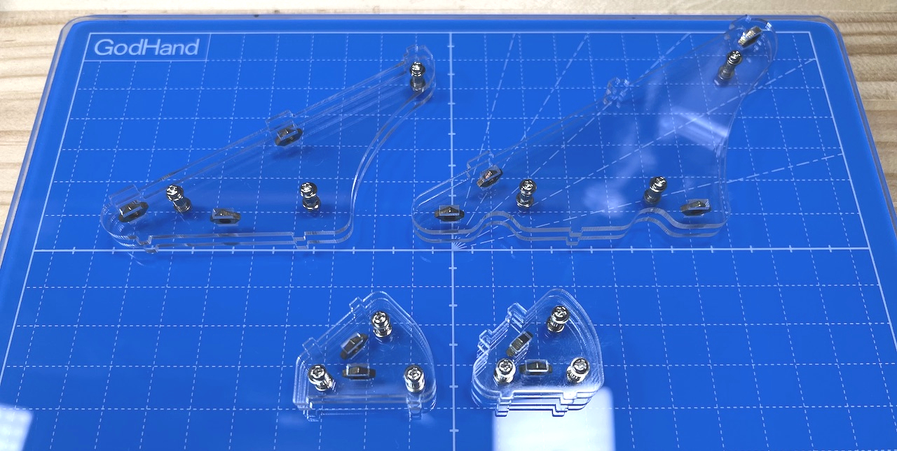    
At this point, the 4 supports are complete.

### Assembly of the support onto the unit
Thread M3 washers onto 5 M3 screws.
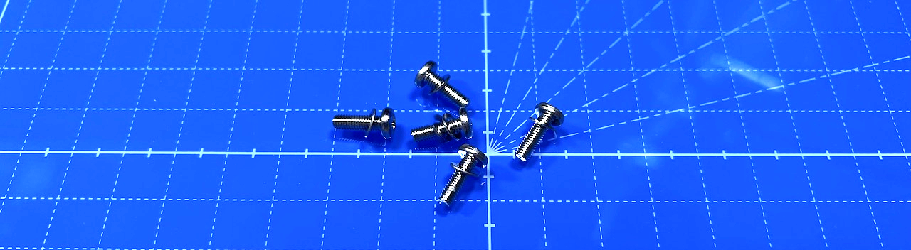    
Place the pillar on the front side of the PCB and secure them from the back side with screws. As they will be removed later, do not tighten them too much.
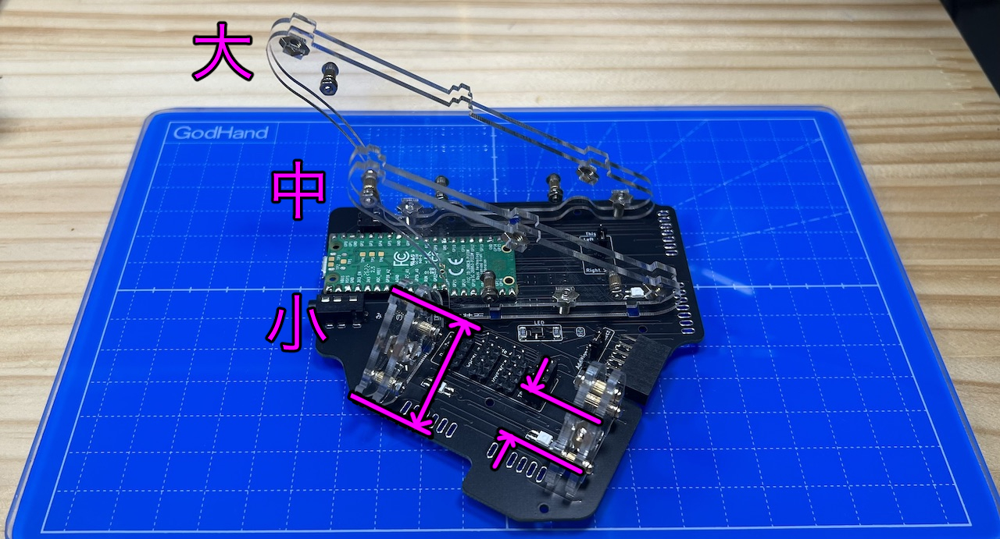    
Refer to the picture for the location and orientation of the supports.

Remaining parts will be used in later steps, therefore keep them at hand.
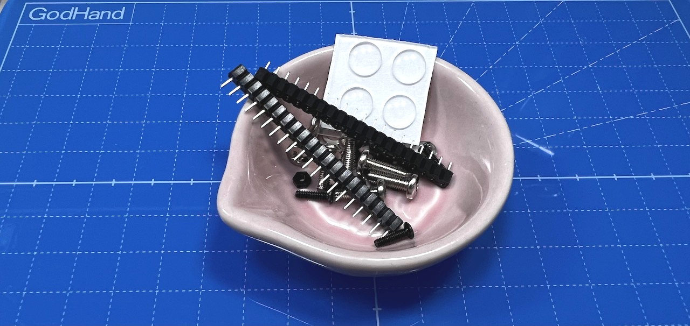    

Now you can proceed to the build guide of the SIDE unit that you are planning to use.

3. SIDE Unit
   - [Trackball](../rightside/3_SIDE_TRACKBALL.md)
   - [D-PAD](../rightside/3_SIDE_DPAD.md)
   - [Wheel (sold separately)](../rightside/3_SIDE_WHEEL.md)
   - [Joystick (sold separately)](../rightside/3_SIDE_JOYSTICK.md)
