# Killer Whale SIDE Unit D-Pad RIGHT Side Build Manual （[LEFT SIDE](../leftside/3_SIDE_DPAD.md)）

1. [Start Page](../README_EN.md)
2. [BASE Unit](../rightside/2_BASE.md)
3. SIDE Unit
   - [Trackball](../rightside/3_SIDE_TRACKBALL.md)
   - D-Pad RIGHT Side
   - [Wheel (sold separately)](../rightside/3_SIDE_WHEEL.md)
   - [Joystick (sold separately)](../rightside/3_SIDE_JOYSTICK.md)
4. [TOP Unit](../rightside/4_TOP.md)
5. [ADD Unit](../rightside/5_ADD.md)
6. [Assembly](../rightside/6_ASSEMBLE.md)
7. [Customizations](../rightside/7_CUSTOM.md)
8. [Misc](../rightside/8_MISC.md)

## Contents
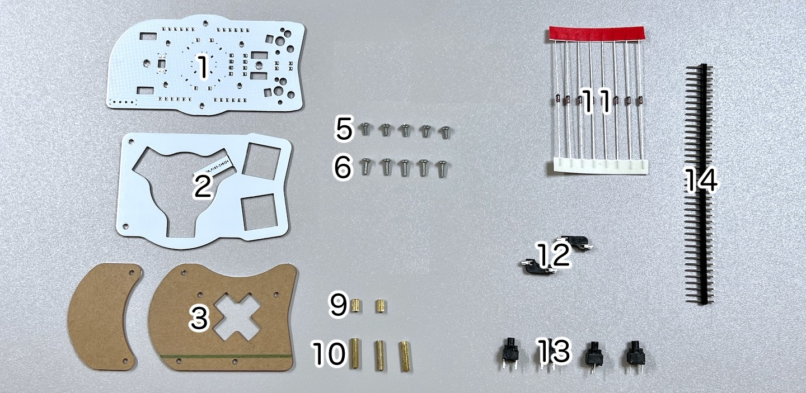      
||types|quantities||
|-|-|-|-|
|1|Mainboard|1|FR4|
|2|Switch plate|1|FR4|
|3|Cover plate|2|Acrylic|
|4|D-pad plate|2|Acrylic|
|5|M2 short screws|5|4mm|
|6|M2 middle screws|5|6mm|
|7|M2 long screw|1|10mm|
|8|M2 nut|1||
|9|M2 short spacers|2|5mm|
|10|M2 long spacers|3|12mm|
|11|Diodes|8|1N4148|
|12|MX hotswap sockets|2||
|13|Mute switches|4|
|14|Pin header|1||

## Soldering
Note that components will be placed on both sides of the side unit.
  
The PCB side with text in Japanese is the back side.

### Soldering of the LEDs (optional)  
Solder the 3 LEDs. The round LED should be facing away from the side where soldering is done.
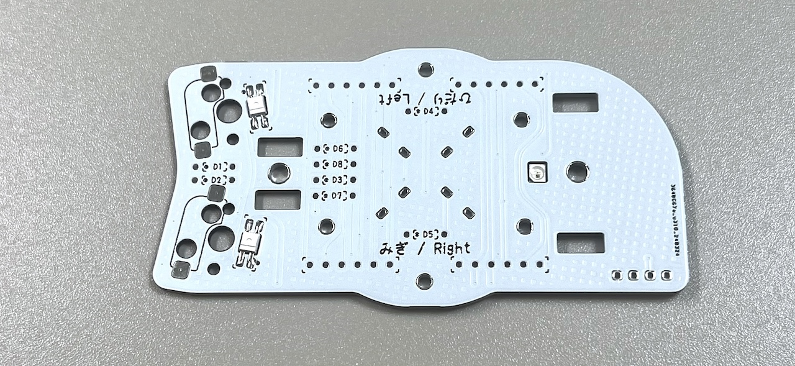  

### Soldering of MX hotswap socket (back side)
From the back side of the unit, solder the MX hotswap sockets while keeping them in place with tweezers.
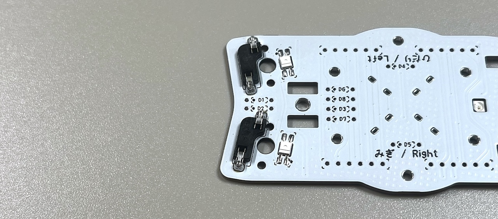  

### Soldering of the diodes (back side)
Diodes are directional components. Make sure to align the lines with markings on the PCB.
  
Insert the diodes in the 4 locations on the back side of the PCB, and solder from the front side of the PCB, and cut the diode legs.
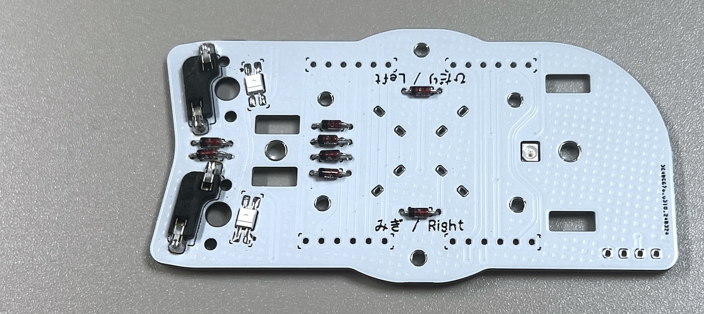   

### Soldering of pin headers (back side)
Cut out four sets of 6 pins from the 40 pin headers. 

   
Insert the pin headers from the back side and solder.
> [!WARNING]
> Insert the long side of the pins. In case you did it the other way around, cut the long side in order to match the length of the short side.

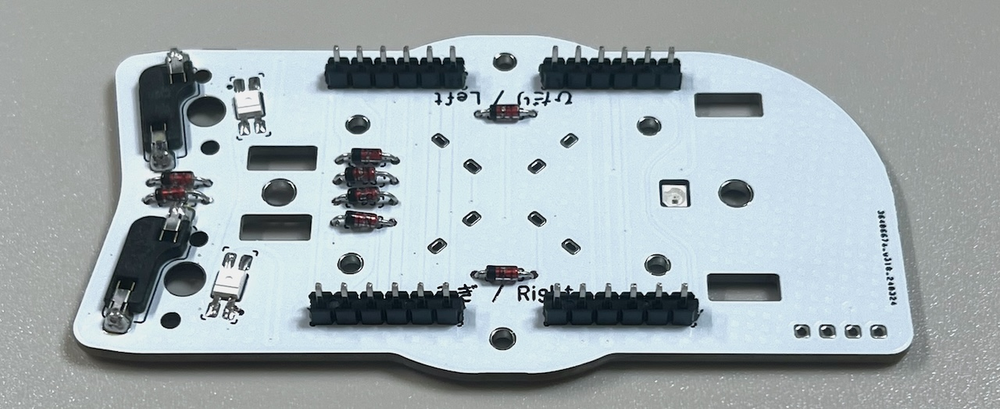 

### Soldering of OLED Display (optional, front side)
If you want to make the OLED module removable, solder a 4pin socket on the surface.  
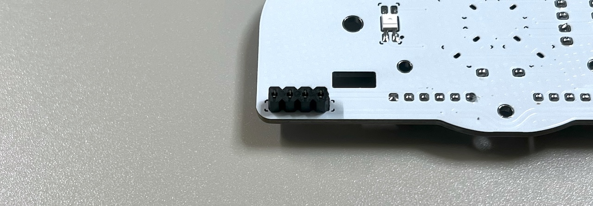   

Solder the pin headers to the OLED module.
  
If the OLED module is to be soldered directly, solder it to the main board at this time.

### Mute switch
### Soldering of the Kailh mute switches (front side)
Insert the switches from the front side of the PCB and solder from the back side.

  

## Intermediate assembly and soldering of sockets

### Assembling the switch plate

If the switch plate is tagged, fold it and then sand it.
   
Attach the M2 long spacers and M2 short screws to the switch plate.
> [!NOTE]
> The switch plate has an orientation (lower and top part).

  
  
Attach the protection acrylic sheets to the spacers with M2 middle screws.  
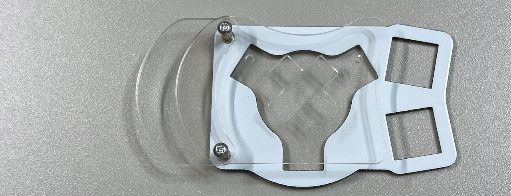 
Put the large protection acrylic sheet on top.
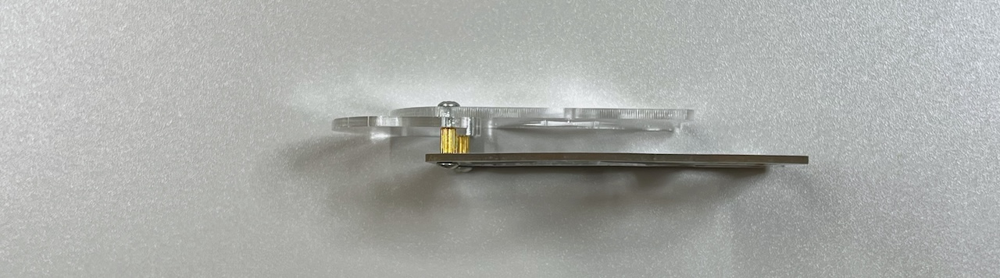  

### Connecting to the BASE unit
Attach long M2 spacers with M2 short screws to the SIDE unit.

> [!NOTE]
> There should be one spacer on the bottom side of the SIDE unit and two to the top, forming an equilateral triangle.

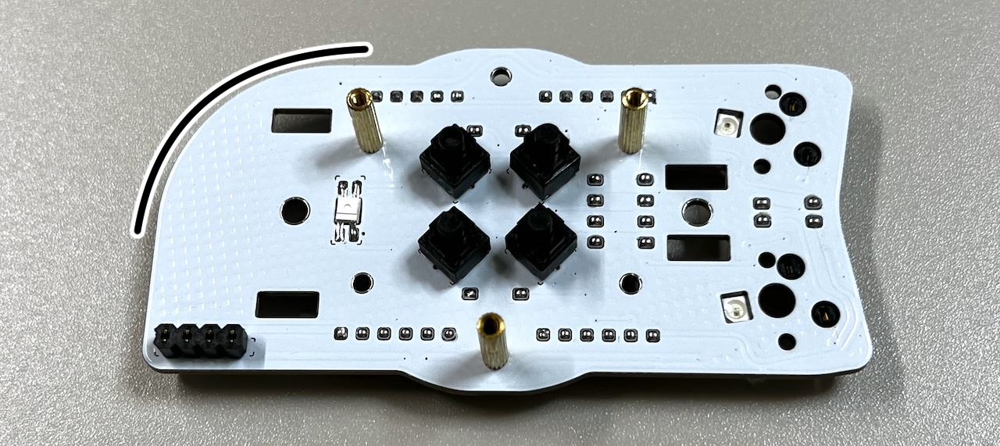  

If this is the first SIDE unit that you have built, remove two sets of 6 pins from the remaining BASE unit pin headers, and insert them in the pin sockets of the SIDE unit.
   
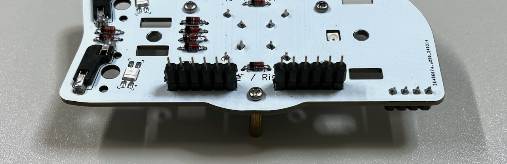  

Place the SIDE unit on the supports and secure it with the M3 screws excessed in base unit. 
> [!CAUTION]
> Make sure that the legs of the pin sockets are inside the long through-holes of the BASE unit.

   

Solder the pin sockets from the back side of the BASE unit.
  
This is the last soldering step for the SIDE unit.

In case you plan on using the OLED module, insert it in the pin socket.  
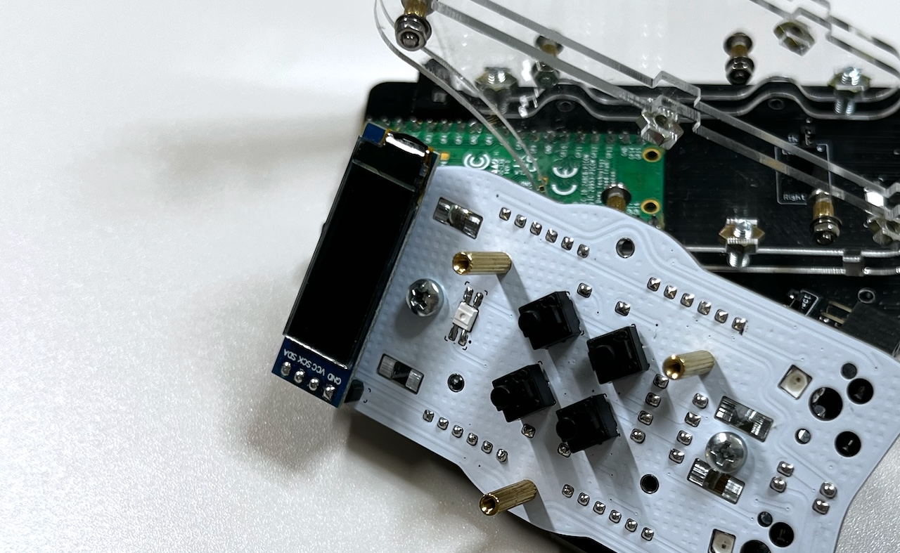   

Attach MX switches to the switch plate, and insert them in the MX sockets, so that the D pad is in the middle.   
   
Secure the protection plate with M2 middle screws.
 

Confirm that everything is working by connecting the unit to a computer with a USB cable.  
> [!NOTE]
> The LEDs will not work until the TOP (and ADD) units are completed.  

If the keys and ball are working, proceed with the TOP unit assembly
There are two types of top unit: the one included in the package, and a top unit with wheels sold separately.

4. [TOP Unit](../rightside/4_TOP.md)
   - [TOP Unit with wheel (sold separately)](../rightside/4_TOP_WHEEL.md)

