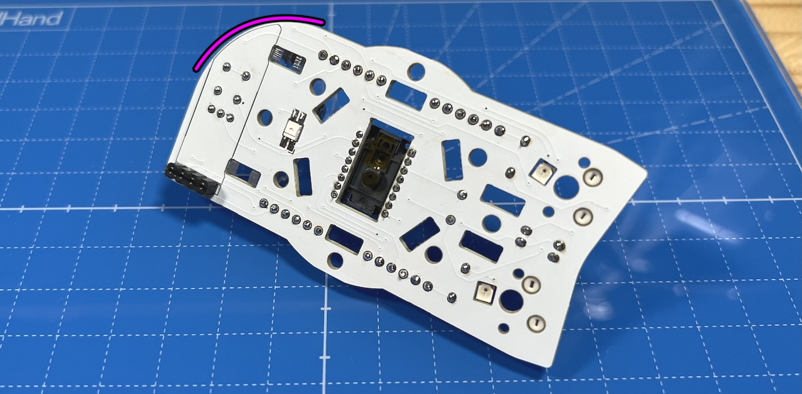
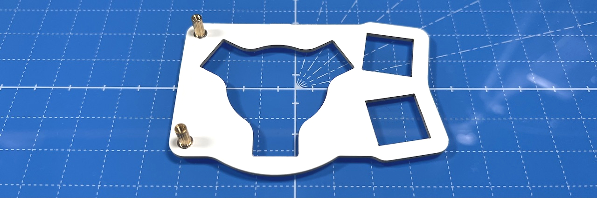
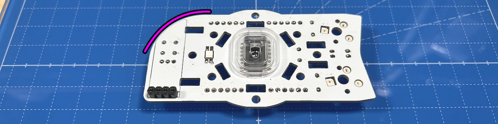
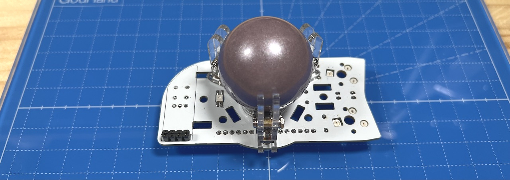
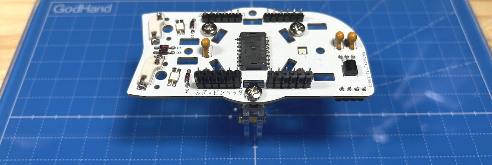
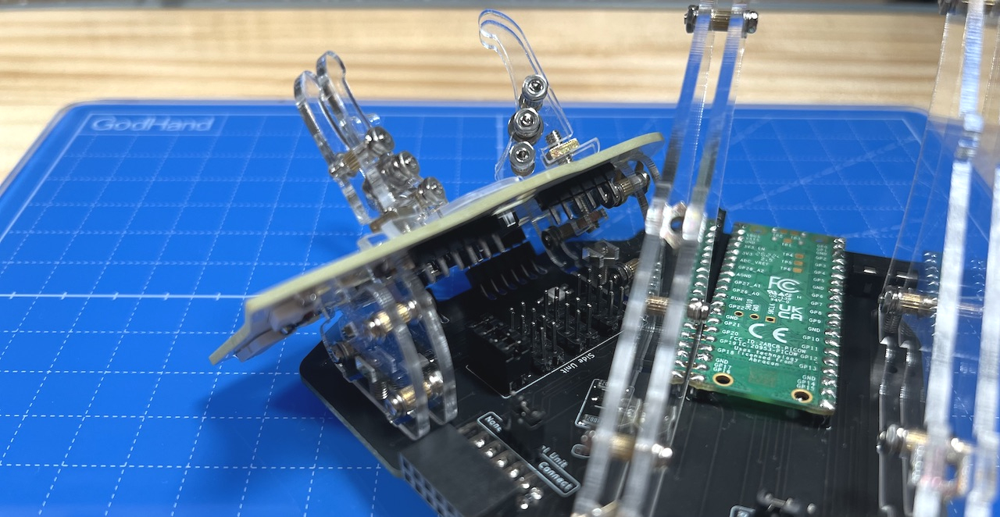
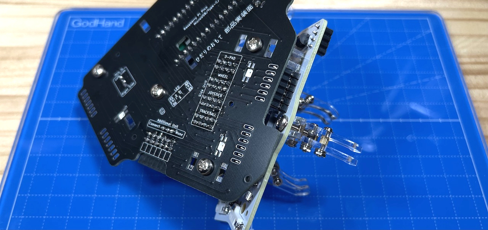
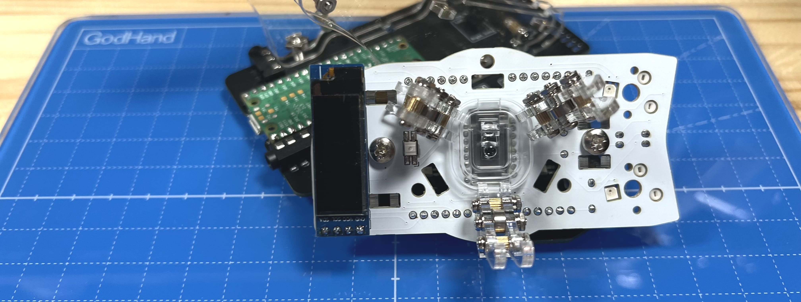
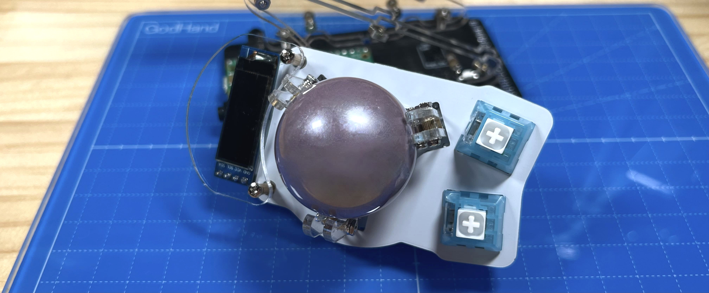

# Killer Whale SIDE Unit Trackball RIGHT Side Build Manual （[See LEFT Side there](../leftside/3_SIDE_TRACKBALL.md)）

1. [Start Page](../README_EN.md)
2. [BASE Unit](../rightside/2_BASE.md)
3. SIDE Unit
   - Trackball RIGHT Side (this page)
   - [D-PAD](../rightside/3_SIDE_DPAD.md)
   - [Wheel (sold separately)](../rightside/3_SIDE_WHEEL.md)
   - [Joystick (sold separately)](../rightside/3_SIDE_JOYSTICK.md)
4. [TOP Unit](../rightside/4_TOP.md)
5. [ADD Unit](../rightside/5_ADD.md)
6. [Assembly](../rightside/6_ASSEMBLE.md)
7. [Customizations](../rightside/7_CUSTOM.md)
8. [Misc](../rightside/8_MISC.md)

## Contents
    
||types|quantities||
|-|-|-|-|
|1|Mainboard|1|FR4|
|2|Switch plate|1|FR4|
|3|Ball pillars|6|Acrylic|
|4|Cover plate|1|Acrylic|
|5|M2 long screws|9|10mm|
|6|M2 middle screws|2|6mm|
|7|M2 silver washers|18||
|8|M2 silver spring washers|9||
|9|M2 short screws|2|4mm|
|10|M2 short spacers|6|3mm|
|11|M2 long spacers|2|7mm|
|12|M2 nuts|9|
|13|M3 screws|3|10mm|
|14|M3 washers|3||
|15|M3 square nuts|3||
|16|Pin header|1||
|17|Diodes|4|1N4148|
|18|Sensor & lens|1|PMW3360|
|19|Capacitor C1, C2|2|10uF|
|20|Capacitor C3|1|4.7uF|
|21|Regulator|1|UT7500L-18|
|22|Bearing|3|2x5x2.5|
|23|MX Switch Socket|2||

Disclaimer: it is possible that the screws aspect or socket colors are different from the pictures from the build guide.

## Soldering
Keep in mind that components will be placed on both sides of the unit.
  
The PCB side with text in Japanese is the back side.
### Soldering of the LEDs (optional)  
Solder the 3 LEDs. The round LED should be facing away from the side where soldering is done.
  

### Soldering of MX hotswap socket (back side)
From the back side of the unit, solder the MX hotswap sockets while keeping them in place with tweezers.
  
Once there is enough solder material on both sides of the socket so that it stays in place, you can put the tweezers aside and apply more solder.
Because of the relatively large surface, a lot of solder material is needed.

### Soldering of the diodes (back side)
Diodes are directional components. Make sure to align the lines with markings on the PCB.
  
Insert the diodes in the 4 locations on the back side of the PCB, and secure them with masking tape.
  
Solder from the front side of the PCB and cut the diode legs.
  

### Soldering of sensor, regulator, capacitors (back side)
As a precaution, do not remove the protecting tape from the sensor yet.
Align the round mark on the PCB with the round mark on the chip, secure with masking tape and solder from the front side.
  

Insert the regulator pins from the back side and bend them so that the component is lying on the designated markings on the PCB, then solder.
  

Solder the capacitors. The locations C1 and C2 correspond to capacitors with 106 written on them, while C3 correspond to the capacitor with 475 written on it.
  
 
  

### Soldering of pin headers (back side)
Cut out four sets of 6 pins from the 40 pin headers. Insert the pin headers from the back side and solder.
Insert the long side of the pins. In case you did it the other way around, cut the long side in order to match the length of the short side.
  

### Soldering of OLED Display (optional, front side)
Solder the OLED display socket from the front side.
  
If you do not plan to remove the display later, it is also possible to directly solder it without socket.

Solder the dedicated pin headers to the OLED module.
  
Keep the module aside for later and do not connect it yet.

## Intermediate assembly and soldering of sockets
The side unit has an orientation. Be aware that for the right side of the keyboard, the OLED socket in placed on the lower side, while for the right side of the keyboard, it is on the upper side.
  

### Assembling the switch plate
Attach the M2 long spacers and M2 short screws to the switch plate.
  
Note that the switch plate also has an orientation (lower and top part).
  
Attach the cover plate to the spacers with M2 middle screws.  
  

### Assembling the trackball

Thread the M2 silver washers onto 9 M2 long screws.  
  
Insert the screws into the two holes of each of the 3 trackball arms and fasten with M2 spacers. 

On the opposite side, secure the screws with washers, spring washers and nuts.
  
Thread bearings onto the remaining 3 screws and hook them into the notches of the trackball arms.
  
Secure with washers, spring washers and nuts.
  

Thread the M3 washers onto 3 M3 screws. 
  
Remove the protective film from the sensor and insert the lens. The lens has a specific mounting direction, therefore make sure not to apply too much force in case it does not fit well, and check direction instead.
  
Place the arms on the PCB, put a square nut in the slits, and screw them from the back side.
Be sure to check the orientation (upper vs. lower) of the main board.
  
Place one arm in the bottom side, and two in the upper side, so as to form an equilateral triangle.
  
After securing the 3 arms, insert a ball, and from a flat location, check if the ball moves smoothly. If there is no problem, remove the ball.

### Connecting to the BASE unit
If this is the first SIDE unit that you have built, remove two sets of 6 pins from the remaining BASE unit pin headers, and insert them in the pin sockets of the SIDE unit.
  
From the BASE unit remaining items, thread M3 washers onto M3 screws.  
  
Place the SIDE unit on the supports and secure it with the M3 screws. Make sure that the legs of the pin sockets are inside the long through-holes of the BASE unit.
  
Solder the pin sockets from the back side of the BASE unit.
  
Make sure to put enough solder to reach the front side of the BASE unit through the holes.
  
This is the last soldering step for the SIDE unit.

In case you plan on using the OLED module, insert it in the pin socket.
 

Attach MX switches to the switch plate, and insert them in the MX sockets. 
 

Confirm that everything is working by connecting the unit to a computer with a USB cable. Note that the LEDs will not work until the TOP and ADD units are completed.
If the keys and ball are working, proceed with the TOP unit assembly (trackball speed and direction can be adjusted later).

There are two types of top unit: the one included in the package, and a top unit with wheels sold separately.
  
4. [TOP Unit](../rightside/4_TOP.md)
   - [TOP Unit with wheel (sold separately)](../rightside/4_TOP_WHEEL.md)
