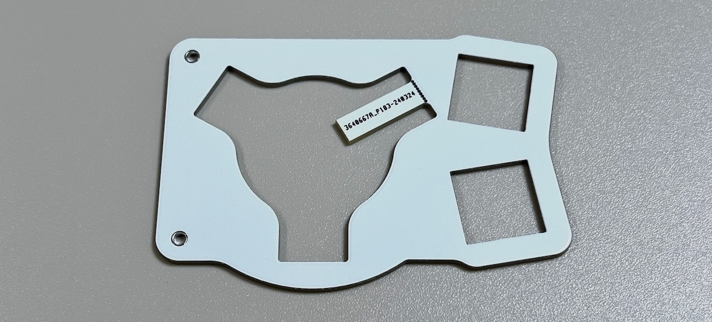

# Killer Whale SIDE Unit Trackball RIGHT Side Build Manual （[See LEFT Side there](../leftside/3_SIDE_TRACKBALL.md)）

1. [Start Page](../README_EN.md)
2. [BASE Unit](../rightside/2_BASE.md)
3. SIDE Unit
   - Trackball RIGHT Side (this page)
   - [D-PAD](../rightside/3_SIDE_DPAD.md)
   - [Wheel (sold separately)](../rightside/3_SIDE_WHEEL.md)
   - [Joystick (sold separately)](../rightside/3_SIDE_JOYSTICK.md)
4. [TOP Unit](../rightside/4_TOP.md)
5. [ADD Unit](../rightside/5_ADD.md)
6. [Assembly](../rightside/6_ASSEMBLE.md)
7. [Customizations](../rightside/7_CUSTOM.md)
8. [Misc](../rightside/8_MISC.md)

## Contents
     
||types|quantities||
|-|-|-|-|
|1|Mainboard|1|FR4|
|2|Switch plate|1|FR4|
|3|Ball pillars|6|Acrylic|
|4|Cover plate|1|Acrylic|
|5|M2 short screws|2|4mm|
|6|M2 middle screws|2|6mm|
|7|M2 long screws|9|10mm|
|8|M3 screws|3|10mm|
|9|M2 washers|18||
|10|M2 spring washers|9||
|11|M2 nuts|9|
|12|M3 washers|3||
|13|M3 square nuts|3||
|14|M2 short spacers|6|3mm|
|15|M2 long spacers|2|7mm|
|16|Bearing|3|2x5x2.5|
|17|Capacitor C1, C2|2|10uF|
|18|Capacitor C3|1|4.7uF|
|19|Regulator|1|UT7500L-18|
|20|MX Switch Socket|2||
|21|Diodes|4|1N4148|
|22|Sensor & lens|1|PMW3360|
|23|Pin header|1||

## Soldering
Keep in mind that components will be placed on both sides of the unit.
   
The PCB side with text in Japanese is the back side.
### Soldering of the LEDs (optional)  
Solder the 3 LEDs. The round LED should be facing away from the side where soldering is done.
   

### Soldering of MX hotswap socket (back side)
From the back side of the unit, solder the MX hotswap sockets while keeping them in place with tweezers.

   

### Soldering of the diodes (back side)
Diodes are directional components. Make sure to align the lines with markings on the PCB.
  
Insert the diodes in the 4 locations on the back side of the PCB, and solder from the front side of the PCB, and cut the diode legs.
   

### Soldering of sensor, regulator, capacitors (back side)

Align the round mark on the PCB with the round mark on the chip and solder from the front side.
> [!NOTE]
> As a precaution, do not remove the protecting tape from the sensor yet.

  

Solder the capacitors. The locations C1 and C2 correspond to capacitors with 106 written on them, while C3 correspond to the capacitor with 475 written on it.
   
   

Insert the regulator pins from the back side and bend them so that the component is lying on the designated markings on the PCB, then solder.
   

### Soldering of pin headers (back side)
Cut out four sets of 6 pins from the 40 pin headers. 

   
Insert the pin headers from the back side and solder.
> [!WARNING]
> Insert the long side of the pins. In case you did it the other way around, cut the long side in order to match the length of the short side.

 

### Soldering of OLED Display (optional, front side)
If you want to make the OLED module removable, solder a 4pin socket on the surface.  
   

Solder the pin headers to the OLED module.
   
If the OLED module is to be soldered directly, solder it to the main board at this time.

## Intermediate assembly and soldering of sockets

### Assembling the switch plate

If the switch plate is tagged, fold it and then sand it.
   
Attach the M2 long spacers and M2 short screws to the switch plate.
> [!NOTE]
> The switch plate has an orientation (lower and top part).

  
  
Attach the cover plate to the spacers with M2 middle screws.  
  

### Assembling the trackball

Thread the M2 silver washers onto 9 M2 long screws.  
  
Insert the screws into the two holes of each of the 3 trackball arms and fasten with M2 spacers. 
   
On the opposite side, secure the screws with washers, spring washers and nuts.
   
Thread bearings onto the remaining 3 screws and hook them into the notches of the trackball arms, then  secure with washers, spring washers and nuts.
  
Make three. 
   

Thread the M3 washers onto 3 M3 screws. 
 
Remove the protective film from the sensor and insert the lens.
> [!IMPORTANT] 
> The lens has a specific mounting direction, therefore make sure not to apply too much force in case it does not fit well, and check direction instead.

   
Heat the lens legs on the back side with a soldering iron to fix them in place.
   

Place the arms on the PCB, put a square nut in the slits, and screw them from the back side.

> [!NOTE]
> Place one arm in the bottom side, and two in the upper side, so as to form an equilateral triangle.

   

After securing the 3 arms, insert a ball, and from a flat location, check if the ball moves smoothly. If there is no problem, remove the ball.
     

### Connecting to the BASE unit
If this is the first SIDE unit that you have built, remove two sets of 6 pins from the remaining BASE unit pin headers, and insert them in the pin sockets of the SIDE unit.
   
   

Place the SIDE unit on the supports and secure it with the M3 screws excessed in base unit. 
> [!CAUTION]
> Make sure that the legs of the pin sockets are inside the long through-holes of the BASE unit.

   
Solder the pin sockets from the back side of the BASE unit.
  
This is the last soldering step for the SIDE unit.

In case you plan on using the OLED module, insert it in the pin socket.
   

Attach MX switches to the switch plate, and insert them in the MX sockets. 
   

Confirm that everything is working by connecting the unit to a computer with a USB cable.
> [!NOTE]
> the LEDs will not work until the TOP (and ADD) units are completed.  
> trackball speed and direction can be adjusted later.

If the keys and ball are working, proceed with the TOP unit assembly
There are two types of top unit: the one included in the package, and a top unit with wheels sold separately.
  
4. [TOP Unit](../rightside/4_TOP.md)
   - [TOP Unit with wheel (sold separately)](../rightside/4_TOP_WHEEL.md)
