# Killer Whale SIDE Unit Wheel RIGHT Side Build Manual （[LEFT Side](../leftside/3_SIDE_WHEEL.md)）

1. [First Page](../README_EN.md)
2. [BASE Unit](../rightside/2_BASE.md)
3. SIDE Unit
   - [Trackball](../rightside/3_SIDE_TRACKBALL.md)
   - [D-PAD](../rightside/3_SIDE_DPAD.md)
   - Wheel (selling separately) RIGHT Side
   - [Joystick (selling separately)](../rightside/3_SIDE_JOYSTICK.md)
4. [TOP Unit](../rightside/4_TOP.md)
5. [ADD Unit](../rightside/5_ADD.md)
6. [Assemble](../rightside/6_ASSEMBLE.md)
7. [Customize](../rightside/7_CUSTOM.md)
8. [Misc](../rightside/8_MISC.md)

## Contents
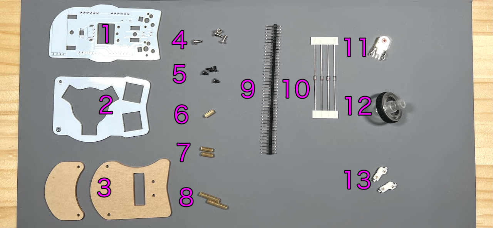    
Vertical and horizontal common build manuals.
||types|quantities||
|-|-|-|-|
|1|Main board|1|FR4|
|2|Switch plate|1|FR4|
|3|Cover plates|2|Acryic|
|4|M2 silver screw|4|6mm|
|5|M2 black screw|5|4mm|
|6|M2 short spacer|1|8mm|
|6|M2 middle spacers|2|9mm|
|7|M2 long spacers|2|16mm|
|8|Pin header|1||
|9|Diodes|4|1N4148|
|10|Wheel encoder|1||
|11|Wheel|1||
|12|MX hotswap sockets|2||

### Additional Required
|Types|quantities|
|-|-|
|Keyswitches|2|
|Keycaps|2|

### Optional Parts
<table>
    <tr>
      <td>OLED Display</a></td> 
      <td>1</td>
    </tr>
    <tr>
      <td>SK6812MINI-E</td>
      <td>3</td>
    </tr>
 </table>
 
## Soldering
### (Optional)LED 
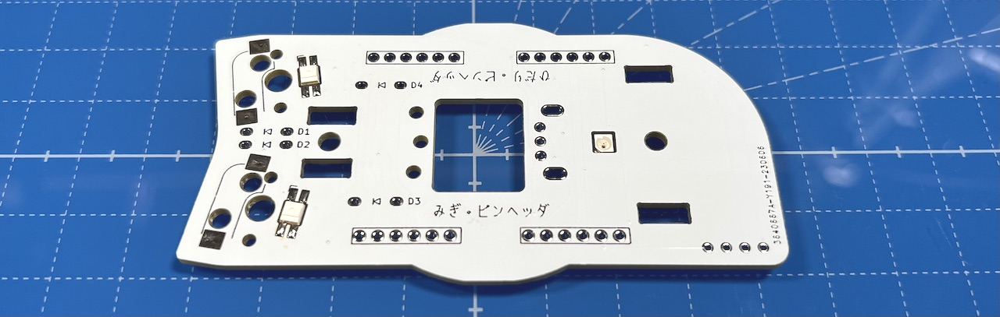  
### MX hotswap socket
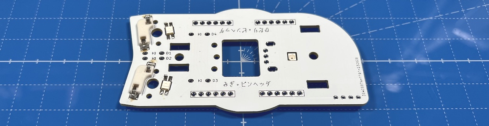  
### Diodes
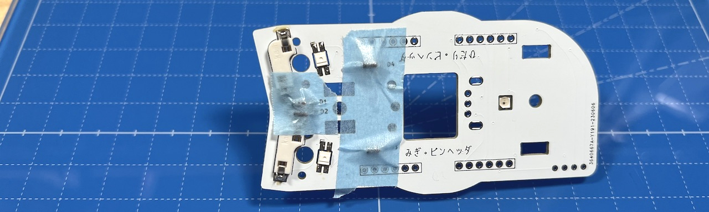  
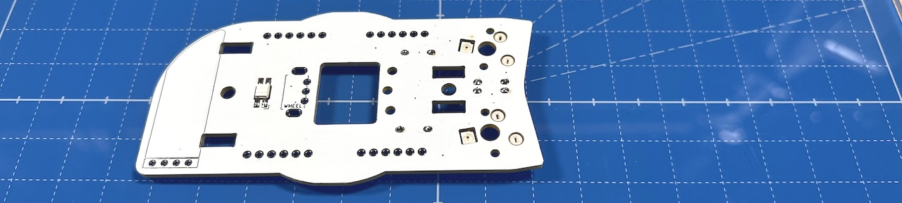  

### Pin headers
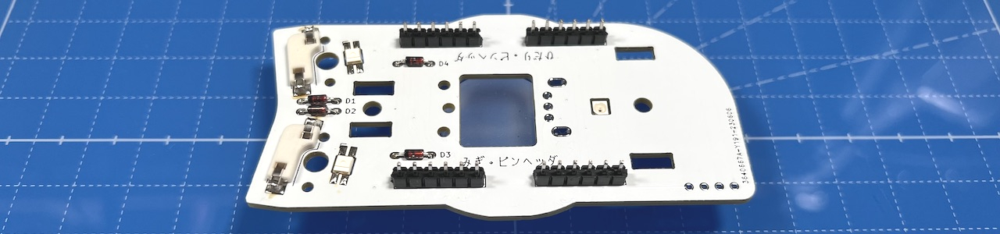  

### (Optional) OLED Display
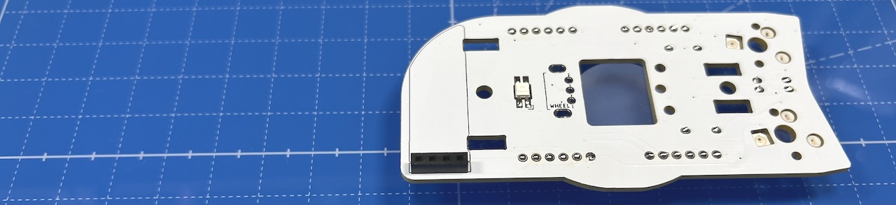  

  

### Wheel encoder
Widen the plate at the hem of the encoder 
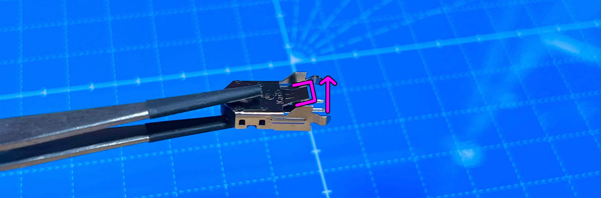  
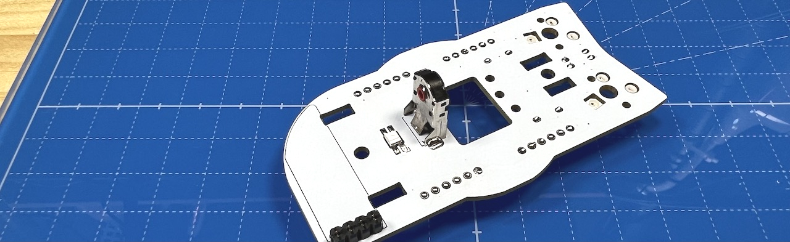  

## Assembling
Attach M2 middle spacers with M2 black screws. 
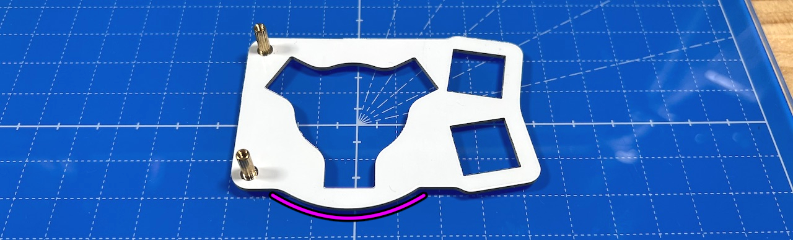 
Attach cover plate with M2 short screws.
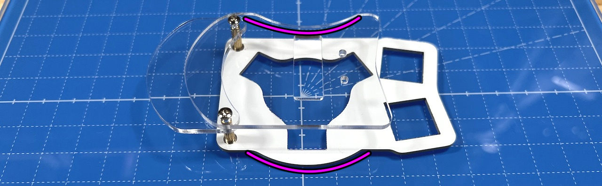  
Larger cover plate is on top.

Attach M2 long spacers and short spacer with M2 black screws.
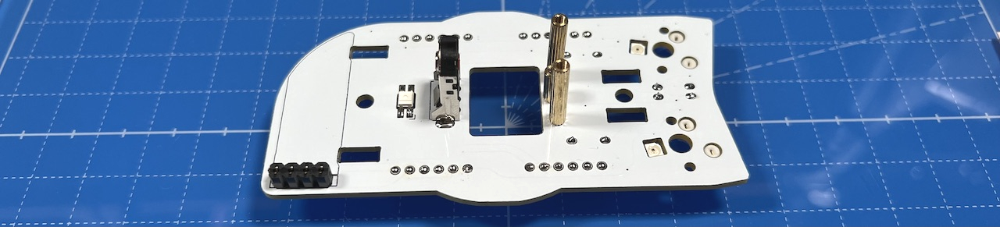  
  

Insert pin socket into pin header.
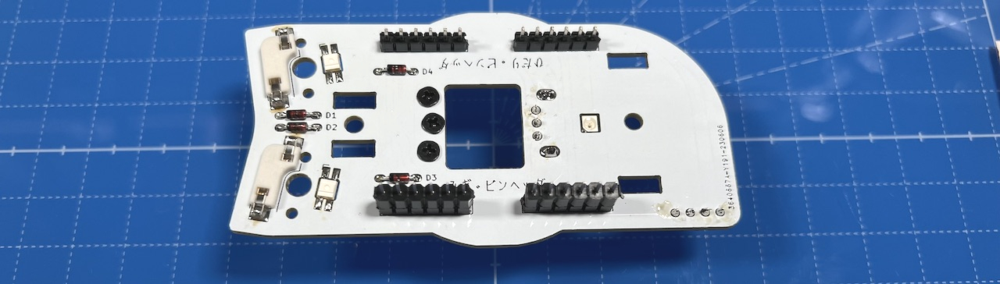  

Attach M3 washers with M3 screws. 
   
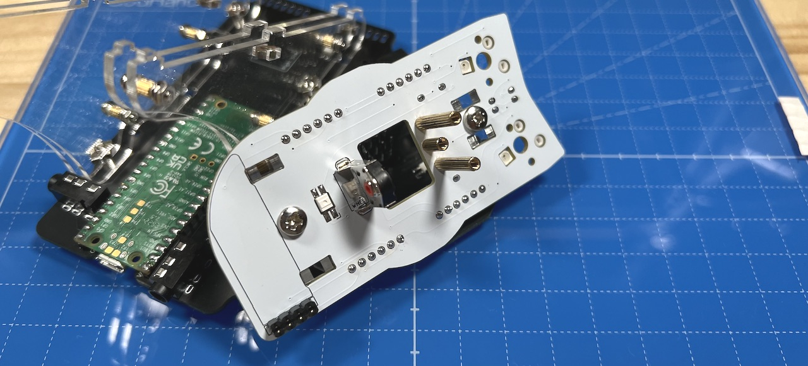  
Solder pin sockets on the bottom.
  
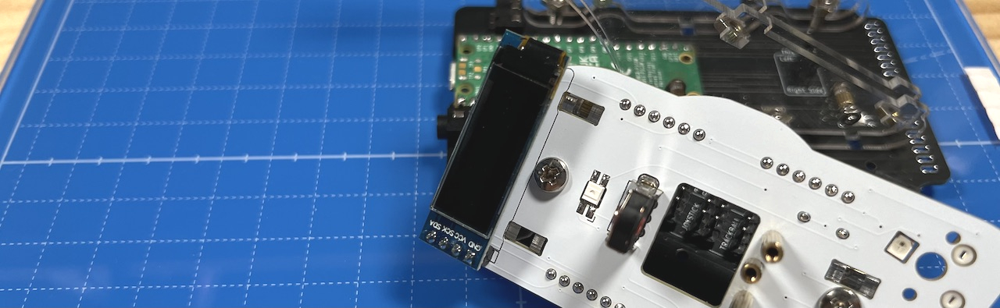  
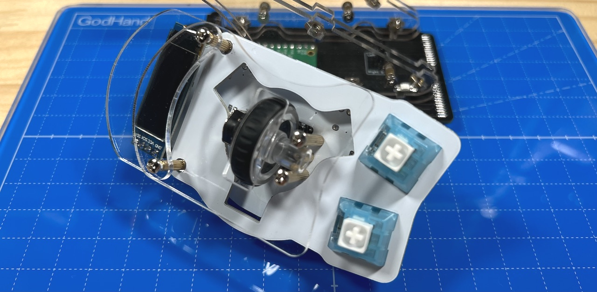  

4. [TOP Unit](../rightside/4_TOP.md)
   - [TOP Unit with wheel (selling separately)](../rightside/4_TOP_WHEEL.md)

