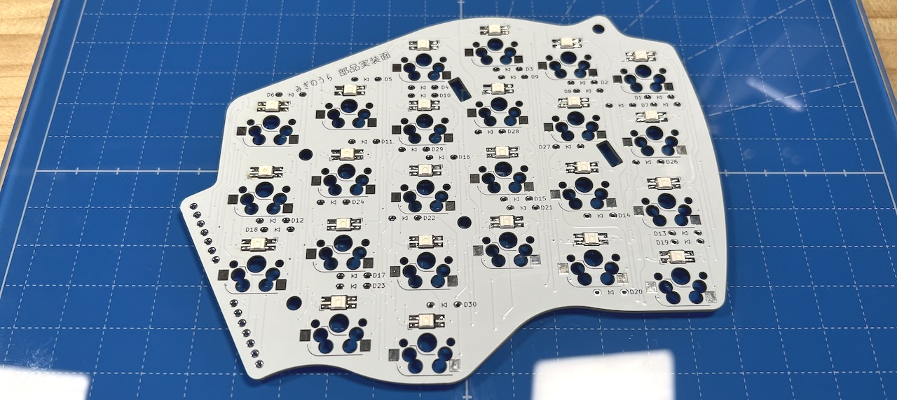
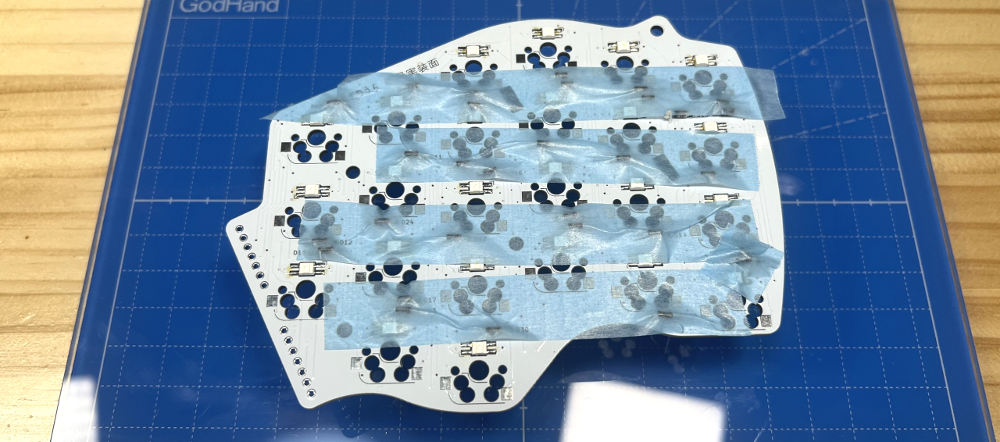
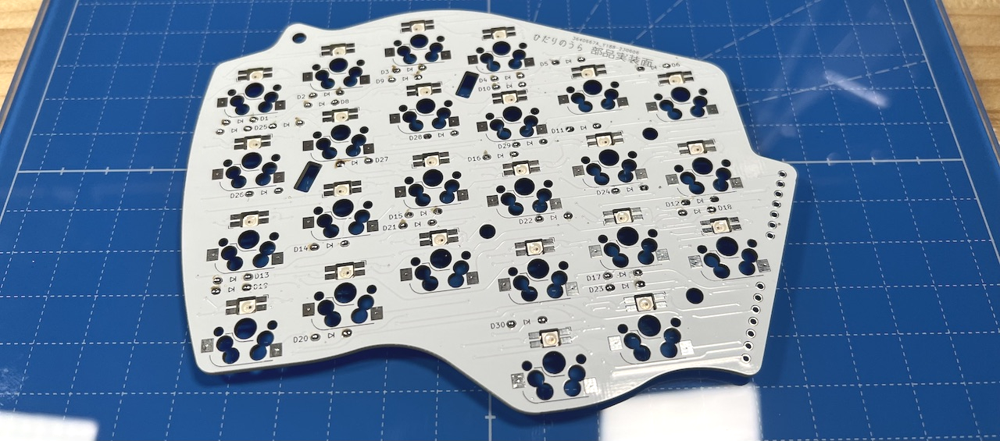
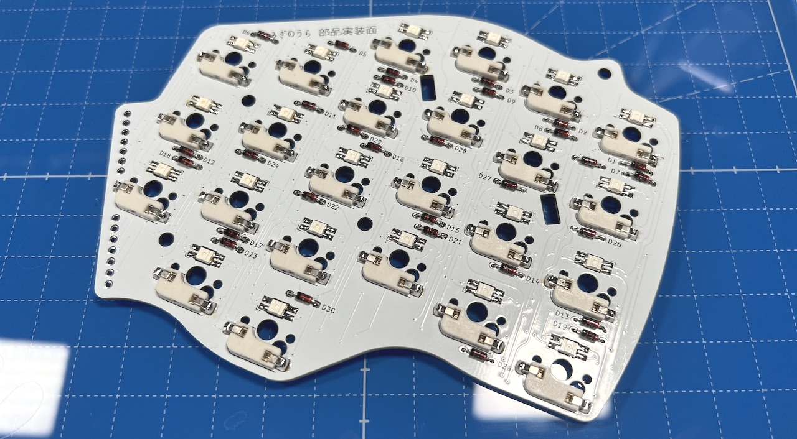
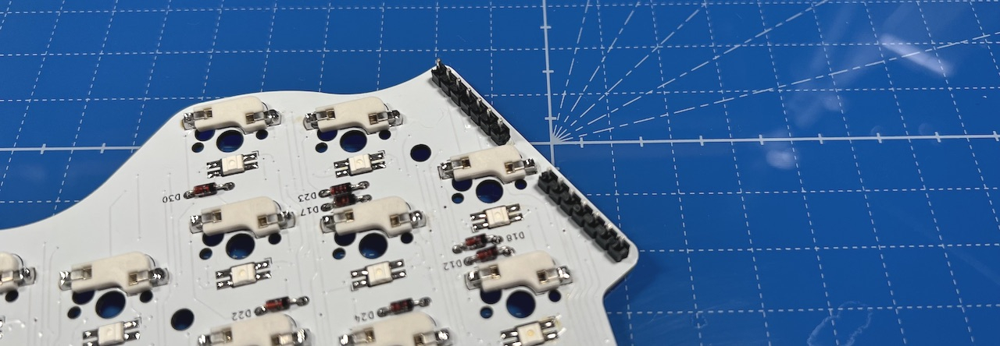
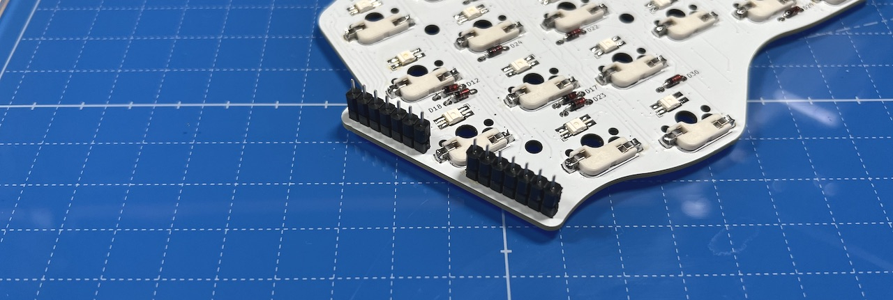
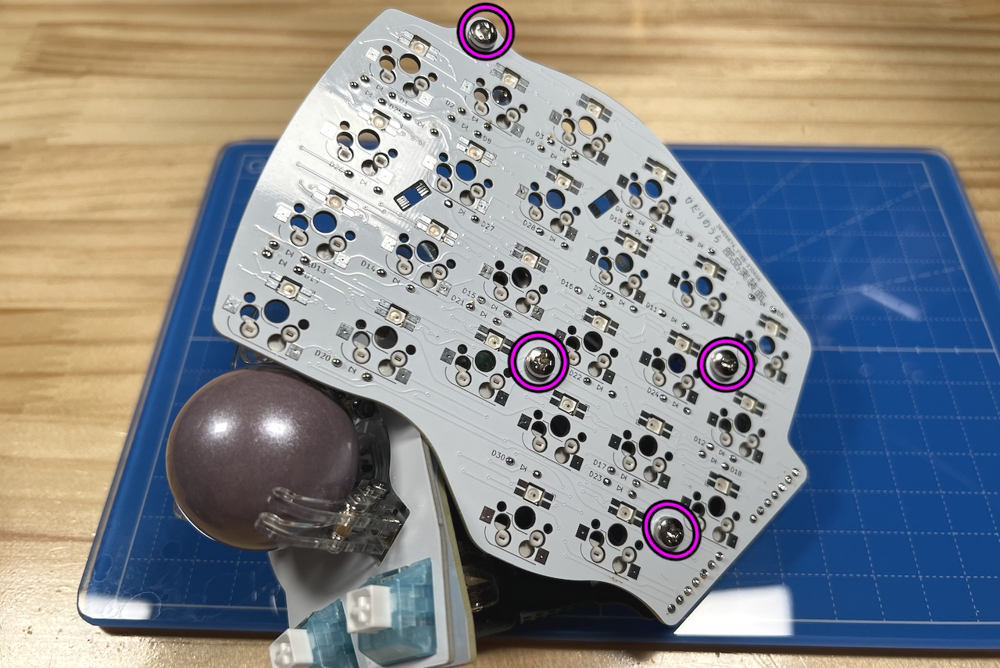
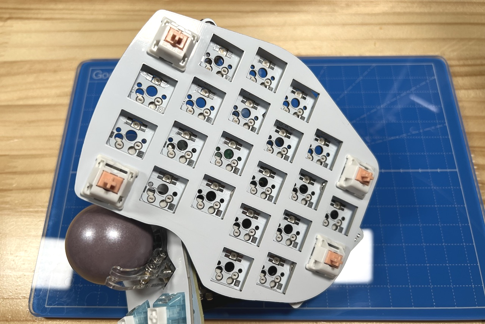
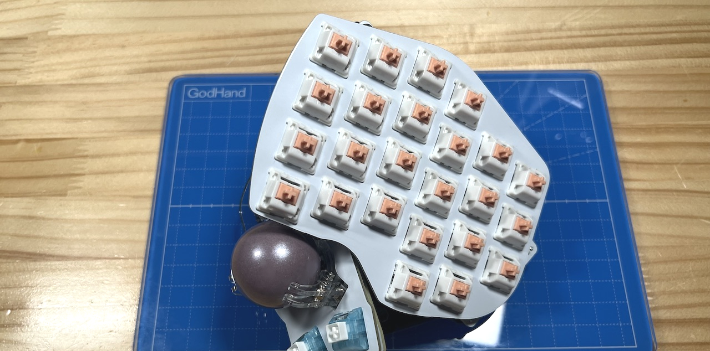

# Killer Whal TOP Unit RIGHT Side Build Manual （[LEFT Side](../leftside/4_TOP.md)）

1. [First Page](../README_EN.md)
2. [BASE Unit](../rightside/2_BASE.md)
3. [SIDE Unit](../rightside/3_SIDE_TRACKBALL.md)
4. TOP Unit RIGHT Side
   - [TOP Unit with wheel (selling separately)](../rightside/4_TOP_WHEEL.md)
5. [ADD Unit](../rightside/5_ADD.md)
6. [Assemble](../rightside/6_ASSEMBLE.md)
7. [Customize](../rightside/7_CUSTOM.md)
8. [Misc](../rightside/8_MISC.md)

## Contents
    
||types|quantities||
|-|-|-|-|
|1|Main board|1|FR4|
|2|Switch plate|1|FR4|
|3|Pin header|1||
|4|Diodes|30||
|5|MX hotswap socket|24||

## Soldering
### (Optional)LED 
  

### Diodes 
  
  

### MX hotswap socket
  

### Pin headers
  

## Assembling

Solder pin sockets on the bottom.
  
Thread the M3 washers onto 4 M3 screws. 
  
  
Solder pin sockets on the bottom.
  
  
  

5. [ADD Unit](../rightside/5_ADD.md)
6. [Assemble](../rightside/6_ASSEMBLE.md)
