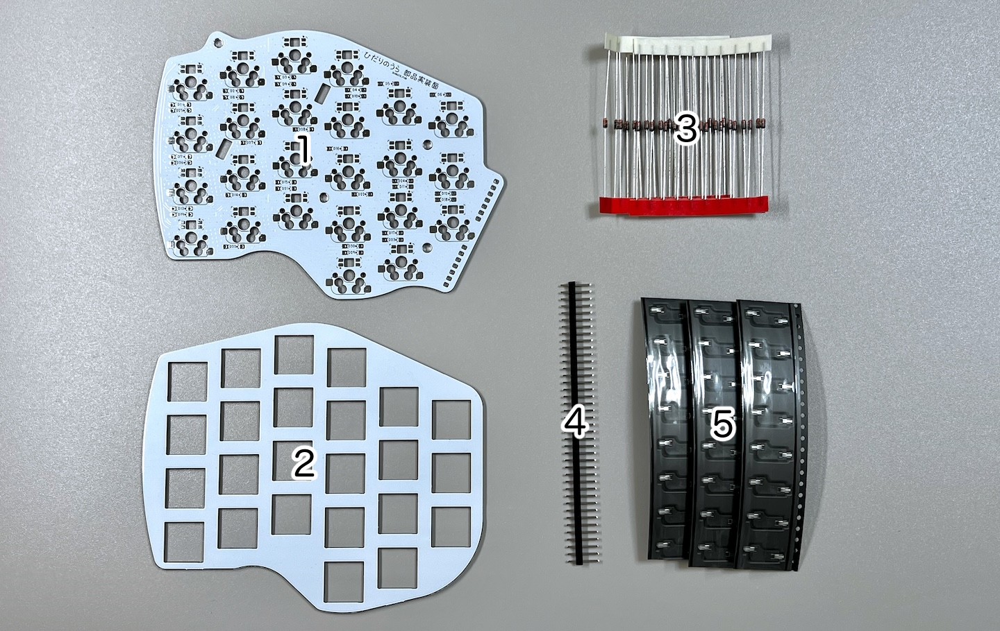
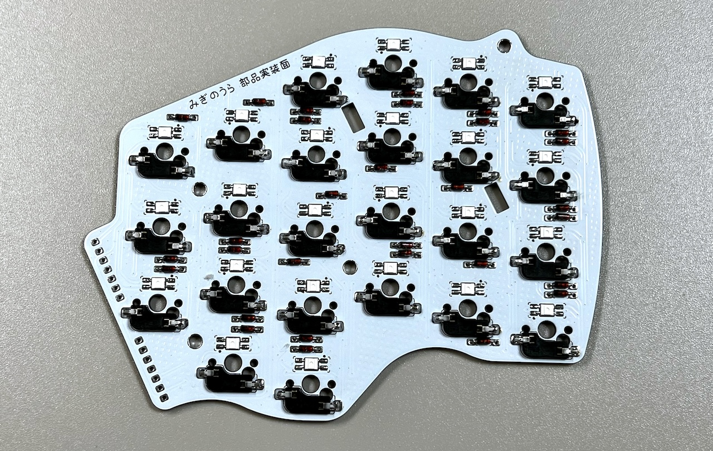
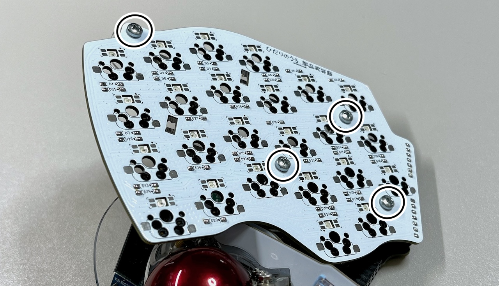
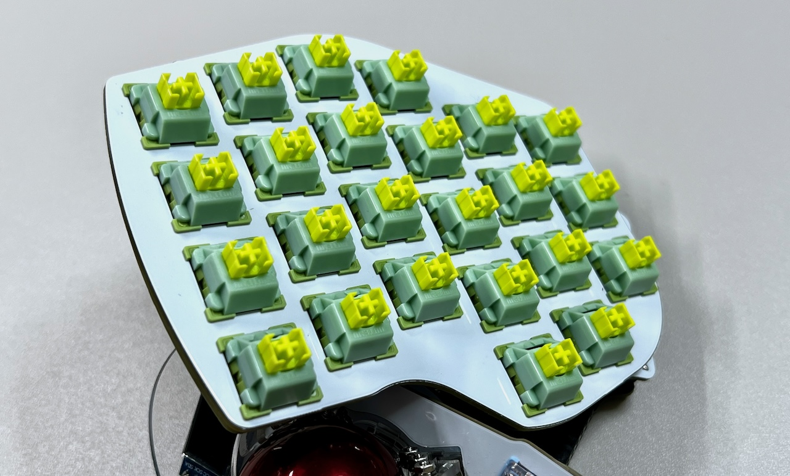

# Killer Whale TOP Unit RIGHT Side Build Manual （[LEFT Side](../leftside/4_TOP.md)）

1. [Start Page](../README_EN.md)
2. [BASE Unit](../rightside/2_BASE.md)
3. [SIDE Unit](../rightside/3_SIDE_TRACKBALL.md)
4. TOP Unit RIGHT Side
   - [TOP Unit with wheel (sold separately)](../rightside/4_TOP_WHEEL.md)
5. [ADD Unit](../rightside/5_ADD.md)
6. [Assembly](../rightside/6_ASSEMBLE.md)
7. [Customizations](../rightside/7_CUSTOM.md)
8. [Misc](../rightside/8_MISC.md)

## Contents
  
||types|quantities||
|-|-|-|-|
|1|Main board|1|FR4|
|2|Switch plate|1|FR4|
|3|Diodes|30||
|4|Pin header|1||
|5|MX hotswap socket|24||

## Soldering

For the TOP unit, all components are soldered from the back side.
  
### Soldering of the LEDs (optional)

> [!CAUTION]
> Orientation varies by location.

  

### Soldering of the diodes
Insert the diodes D1 to D30 from the bottom side of the PCB, and solder from the front side of the PCB and cut the diode legs.
 

### Soldering of the MX hotswap socket
Solder the MX hotswap sockets while keeping them in place with tweezers.
 

### Soldering od the pin headers
Cut out two sets of 7 pins from the 40 pin headers, insert from the back side of the PCB and solder. Insert the long side of the pins.
   
 

## Intermediate assembly and soldering of sockets
If this is the first TOP unit that you have built, remove two sets of 7 pins from the remaining BASE unit pin headers, and insert them in the pin sockets of the TOP unit.

   
 
Place the TOP unit on the supports and secure it with the M3 screws excessed in base unit.
> [!NOTE]
>  Make sure that the legs of the pin sockets are inside the long through-holes of the base unit.

 
Solder the pin sockets from the back side of the base unit.
 
Switch plate and all switches are in place, then confirm that everything is working by connecting the unit to a computer with a USB cable. 
  

The ADD unit is not mandatory. If you need it, proceed with the ADD unit build guide, otherwise proceed with the overall assembly guide

5. [ADD unit](../rightside/5_ADD.md)
6. [Overall assembly](../rightside/6_ASSEMBLE.md)
