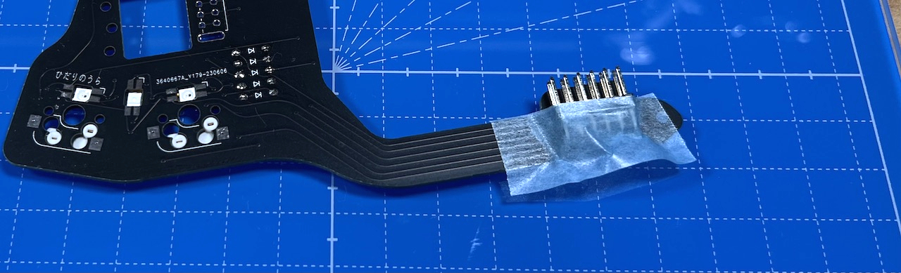

# Killer Whale ADD Unit RIGHT Side Build Manual （[Left Side](../leftside/5_ADD.md)）

1. [First Page](../README_EN.md)
2. [BASE Unit](../rightside/2_BASE.md)
3. [SIDE Unit](../rightside/3_SIDE_TRACKBALL.md)
4. [TOP Unit](../rightside/4_TOP.md)
5. ADD Unit RIGHT Side
6. [Assemble](../rightside/6_ASSEMBLE.md)
7. [Customize](../rightside/7_CUSTOM.md)
8. [Misc](../rightside/8_MISC.md)

## Contents
    
||types|quantities||
|-|-|-|-|
|1|Main board|1|FR4|
|2|Switch plate|1|FR4|
|3|Bottom plate|1|Acrylic|
|4|Cover plate|1|Acrylic|
|5|M2 middle screws|2|6mm|
|6|M2 short spacer|1|8mm|
|7|M2 long spacers|2|16mm|
|8|M2 short screws|2|4mm|
|9|M2 short screws|5|8mm|
|10|M2 black washers|6|
|11|M2 black spring washers|3|
|12|M2 black nuts|3|
|13|Diodes|5||
|14|Angle pin header|1||
|15|Wheel encoder|1||
|16|Wheel|1||
|17|Toggle switch|1||
|18|MX Hotswap sockets|2||
|19|Rubber feet|2||

## Soldering
### (Optional)LED 
  

### Diodes
  

### MX hotswap socket
  

### Angle pin header 
  

### Wheel encoder
Widen the plate at the hem of the encoder 
  
 
  

### Toggle switch
  
  
## Assembling
Attach M2 black washers with 2 M2 short screws and M2 long screw. 
  

Attach bottom plate with M2 long screw and M2 short spacer.
  
Attach M2 short screws and M2 long spacers.
  
  
  

6. [Assemble](../rightside/6_ASSEMBLE.md)
