# Killer Whale ADD Unit RIGHT Side Build Manual （[Left Side](../leftside/5_ADD.md)）

1. [Start Page](../README_EN.md)
2. [BASE Unit](../rightside/2_BASE.md)
3. [SIDE Unit](../rightside/3_SIDE_TRACKBALL.md)
4. [TOP Unit](../rightside/4_TOP.md)
5. ADD Unit RIGHT Side
6. [Assembly](../rightside/6_ASSEMBLE.md)
7. [Customizations](../rightside/7_CUSTOM.md)
8. [Misc](../rightside/8_MISC.md)

## Contents
    
||types|quantities||
|-|-|-|-|
|1|Main board|1|FR4|
|2|Switch plate|1|FR4|
|3|Bottom plate|1|Acrylic|
|4|Cover plate|1|Acrylic|
|5|M2 silver screws|2|6mm|
|6|M2 short spacer|1|8mm|
|7|M2 long spacers|2|16mm|
|8|M2 short black screws|2|4mm|
|9|M2 short black screws|5|8mm|
|10|M2 black washers|6|
|11|M2 black spring washers|3|
|12|M2 black nuts|3|
|13|Diodes|5||
|14|Angle pin header|1||
|15|Wheel encoder|1||
|16|Wheel|1||
|17|Toggle switch|1||
|18|MX Hotswap sockets|2||
|19|Rubber feet|2||

Disclaimer: it is possible that the screws aspect or socket colors are different from the pictures from the build guide.

## Soldering
Keep in mind that components will be placed on both sides of the ADD unit.
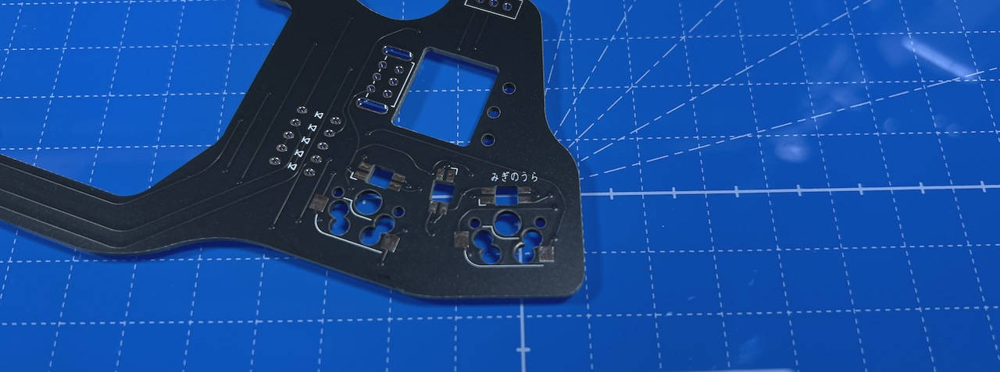  
### Soldering of the LEDs (optional, back side)  
On the ADD unit, LEDs are soldered from the back side of the PCB, at 3 different locations.
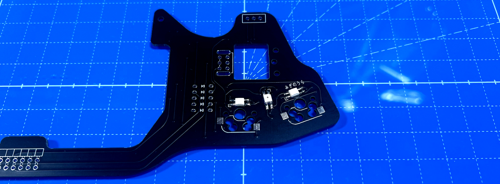  
For 2 of the LEDs, the round LED should be facing away from the side where soldering is done, and the one in the middle has the opposite orientation.

### Soldering of the diodes (back side)
Insert the diodes from the back side of the PCB, solder from the front side and cut the legs.
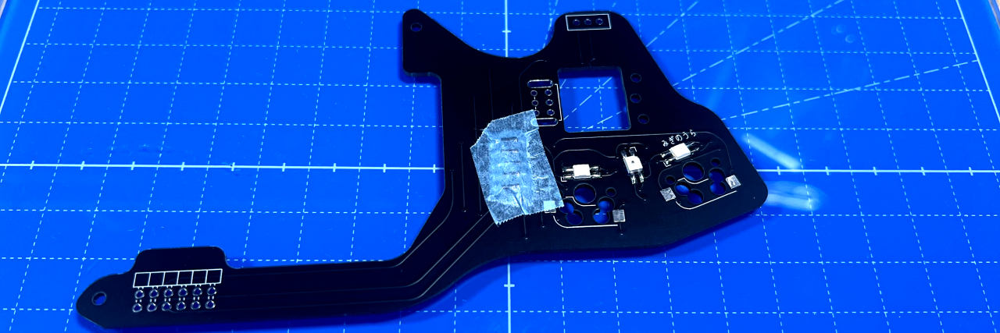  

### Soldering of MX hotswap socket (back side)
Solder the MX hotswap sockets while keeping them in place with tweezers.
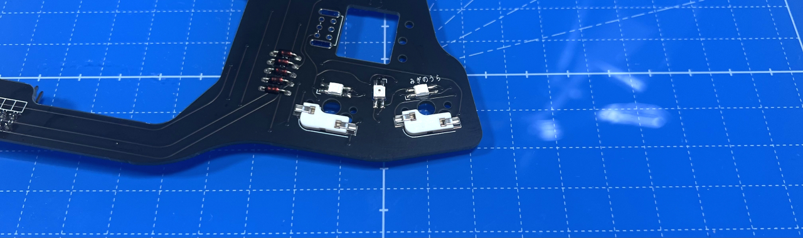  
Once there is enough solder material on both sides of the socket so that it stays in place, you can put the tweezers aside and apply more solder.
Because of the relatively large surface, a lot of solder material is needed.

### Soldering of the angle pin header (front side)
Keep the pin header in place with masking tape and solder from the back side of the PCB.
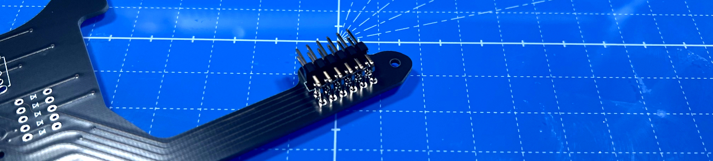  

### Soldering of the wheel encoder (front side)
Slightly bend the plate at the base of the wheel encoder (to avoid any short circuit). 
  
Insert the wheel encoder at the location with a square mark on the PCB, secure with masking tape, and solder from the back side of the PCB.
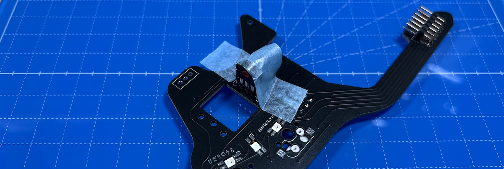  
Note that the orientation of the encoder is different for the LEFT and RIGHT units.

### Soldering of the toggle switch (front side)
Insert from the from the front side of the PCB and solder from the back side.
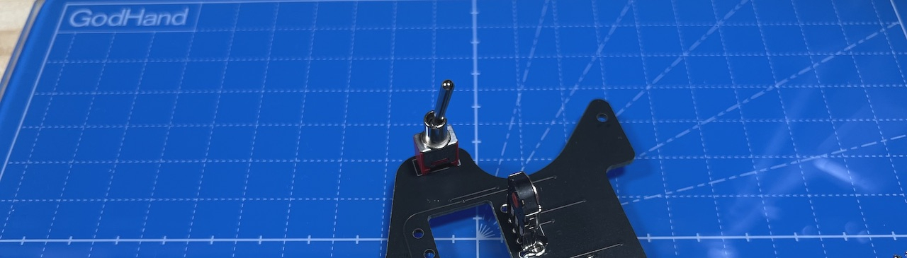  

This is the last soldering step for the ADD unit.

## Assembly
### Assembly of the acrylic plate
Thread the M2 black washers onto 2 black M2 screws and 1 long black M2 screw.  
  

Place the bottom place on the back side of the ADD unit, and thread the long black M2 screw through the hole on the other side of the wheel encoder.
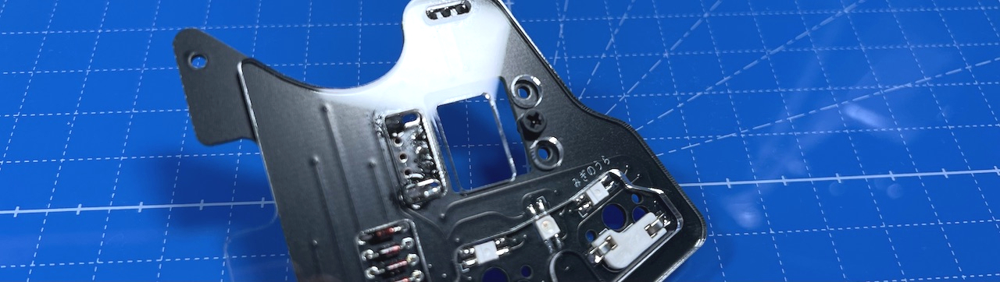  
Secure the long black screw with the short M2 spacer.
Then secure the short black screws on both sides with long spacers.
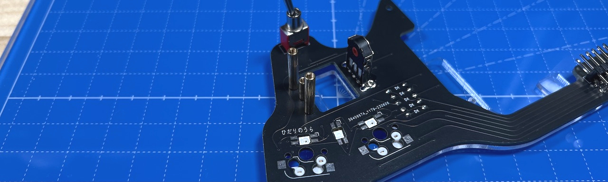  
Insert the wheel in the encoder, place the protective acrylic plate and secure it with M2 screws. 
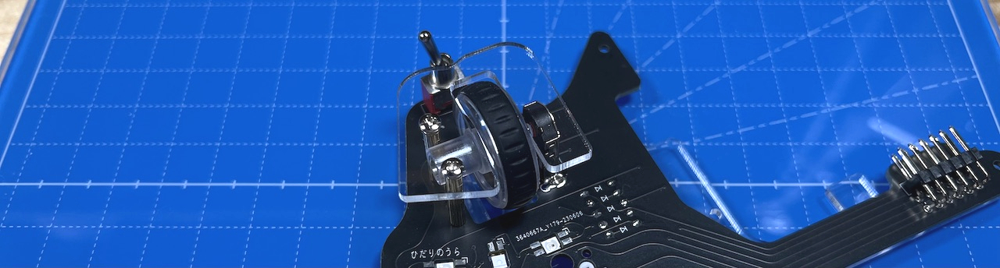  
Attach the switches to the switch plate, and insert the assembly into the MX sockets.
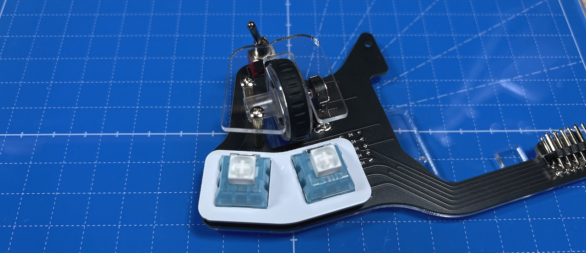  
Proceed with the overall assembly

6. [Overall assembly](../rightside/6_ASSEMBLE.md)
