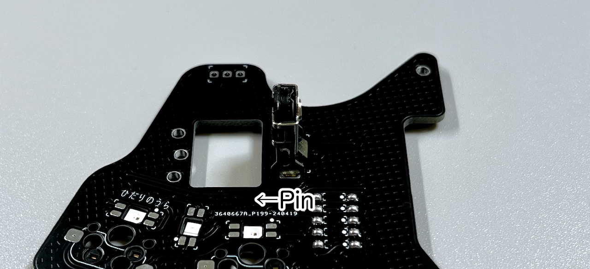
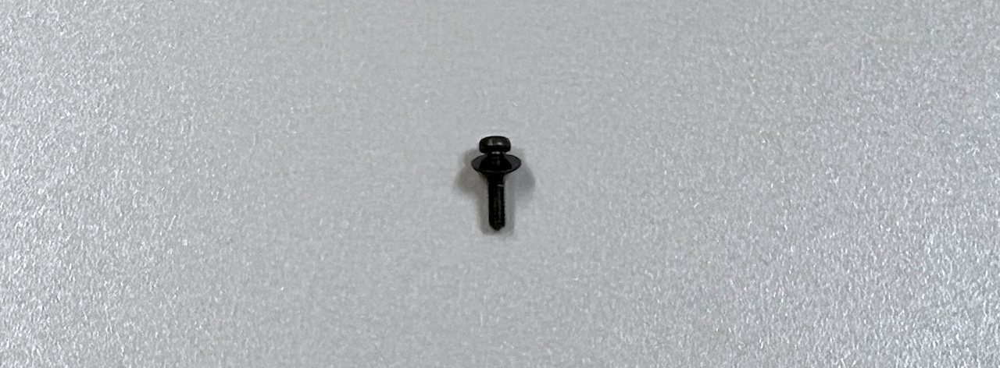
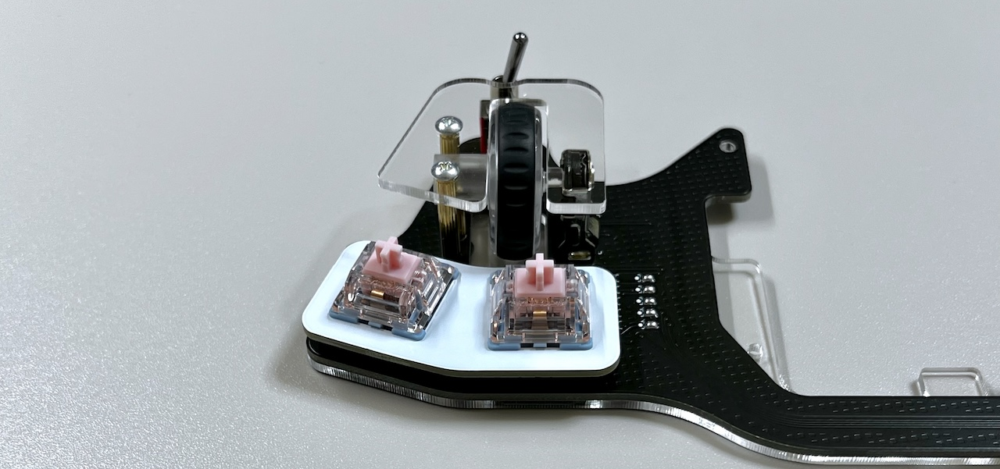

# Killer Whale ADD Unit RIGHT Side Build Manual （[Left Side](../leftside/5_ADD.md)）

1. [Start Page](../README_EN.md)
2. [BASE Unit](../rightside/2_BASE.md)
3. [SIDE Unit](../rightside/3_SIDE_TRACKBALL.md)
4. [TOP Unit](../rightside/4_TOP.md)
5. ADD Unit RIGHT Side
6. [Assembly](../rightside/6_ASSEMBLE.md)
7. [Customizations](../rightside/7_CUSTOM.md)
8. [Misc](../rightside/8_MISC.md)

## Contents

||types|quantities||
|-|-|-|-|
|1|Main board|1|FR4|
|2|Switch plate|1|FR4|
|3|Bottom plate|1|Acrylic|
|4|Cover plate|1|Acrylic|
|5|M2 middle screws|2|6mm|
|6|M2 short spacer|1|8mm|
|7|M2 long spacers|2|16mm|
|8|M2 short screws|2|4mm|
|9|M2 long screws|5|8mm|
|10|M2 black washers|6|
|11|M2 black spring washers|3|
|12|M2 black nuts|3|
|13|Diodes|5||
|14|Angle pin header|1||
|15|Wheel encoder|1||
|17|Toggle switch|1||
|18|MX Hotswap sockets|2||
|19|Rubber feet|2||

The following 3D printed parts are also used.

## Soldering
Keep in mind that components will be placed on both sides of the ADD unit.

### Soldering of the LEDs (optional, back side)
On the ADD unit, LEDs are soldered from the back side of the PCB, at 3 different locations.

For 2 of the LEDs, the round LED should be facing away from the side where soldering is done, and the one in the middle has the opposite orientation.

### Soldering of the diodes (back side)
Insert the diodes from the back side of the PCB, solder from the front side and cut the legs.

### Soldering of MX hotswap socket (back side)
Solder the MX hotswap sockets while keeping them in place with tweezers.

### Soldering of the angle pin header (front side)
Insert the pin header from the front side of the PCB, solder from the back side of the PCB.

> [!WARNING]
> The side of the soldering has been changed.

### Soldering of the wheel encoder (front side)
 To avoid any short circuit slightly bend the plate at the base of the wheel encoder.

Align the printing on the board with the pin orientation and solder on the reverse side.

### Soldering of the toggle switch (front side)
Insert from the from the front side of the PCB and solder from the back side.

This is the last soldering step for the ADD unit.

## Assembly
### Assembly of the acrylic plate
Thread the M2 black washer onto 1 long M2 screw.

Place the bottom plate on the back of the additional unit and fasten the M2 short spacer with the M2 long screw.

Fasten M2 long spacers with M2 short screws on either side of it.

Combine the wheel parts. Be careful with the direction of the axis of the thinner one.

It may require a little force. The medium axis can come from either direction.

Insert the wheel in the encoder, place the protective acrylic plate and secure it with M2 middle screws.

Attach the switches to the switch plate, and insert the assembly into the MX sockets.

Proceed with the overall assembly

6. [Overall assembly](../rightside/6_ASSEMBLE.md)
