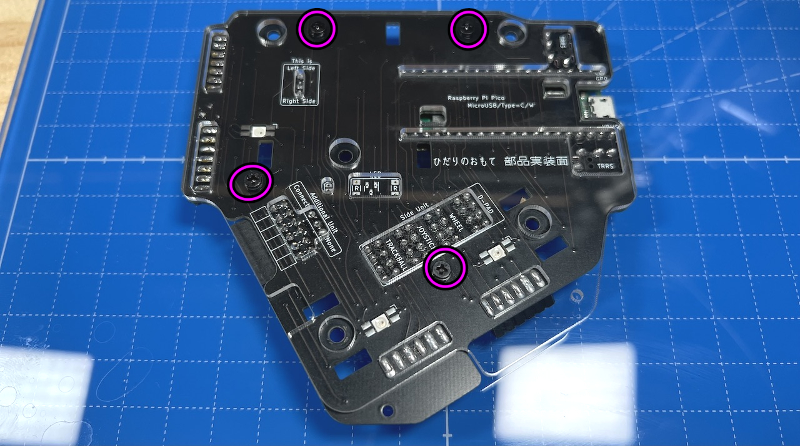
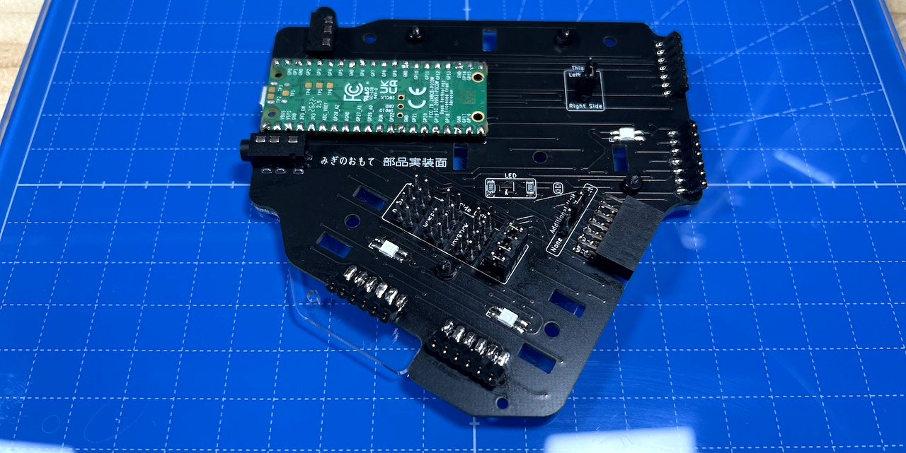
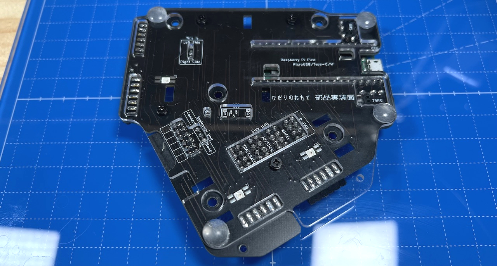
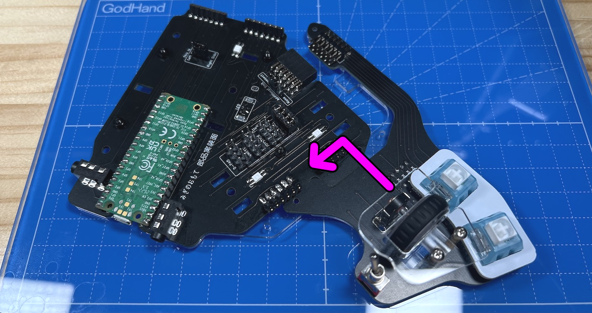
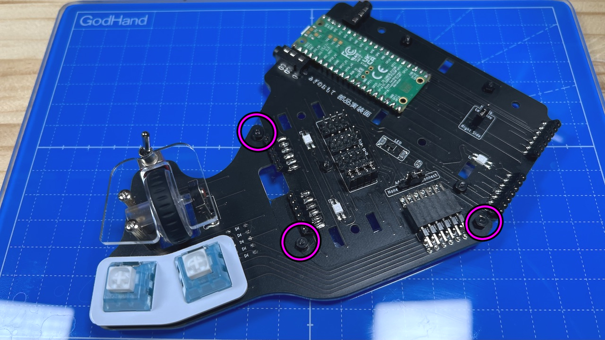
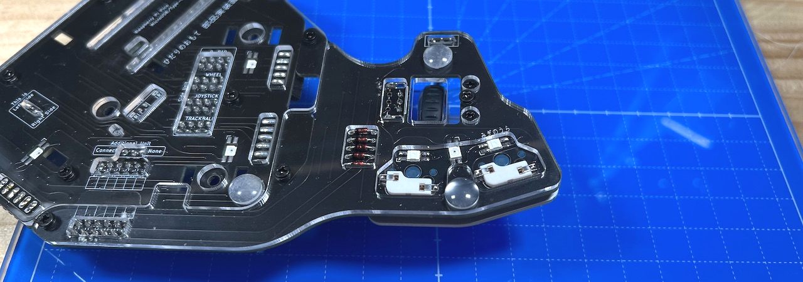
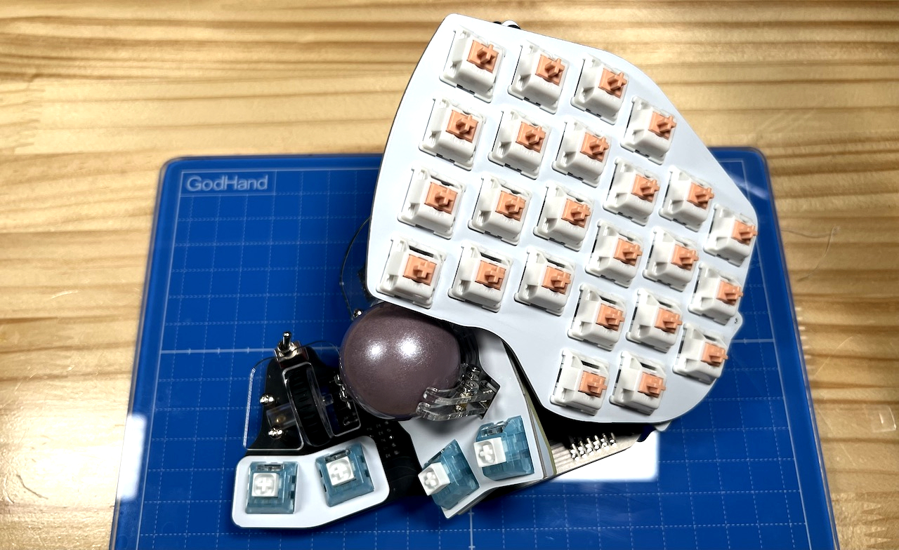
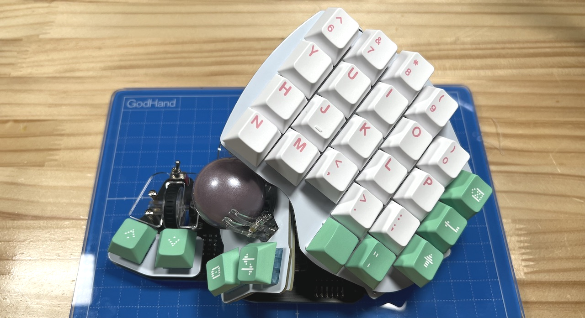

# Killer Whale Assemble RIGHT Side（[LEFT Side](../leftside/6_ASSEMBLE.md)）

1. [First Page](../README_EN.md)
2. [BASE Unit](../rightside/2_BASE.md)
3. [SIDE Unit](../rightside/3_SIDE_TRACKBALL.md)
4. [TOP Unit](../rightside/4_TOP.md)
5. [ADD Unit](../rightside/5_ADD.md)
6. Assemble RIGHT Side
7. [Customize](../rightside/7_CUSTOM.md)
8. [Misc](../rightside/8_MISC.md)

### Attach bottom plate
Remove bottom screws and TOP Unit and pillars, then remove SIDE Unit and pillars.
  

Attach M2 black washers with 4 M2 black screws.   
  
  
  
  

### (Optional) ADD Unit
Attach M2 black washers with 3 M2 black screws.    
  
    
  
  

Attach SIDE Unit and pillars, then attach TOP Unit and pillars.
  
  

7. [Customize](../rightside/7_CUSTOM.md)
