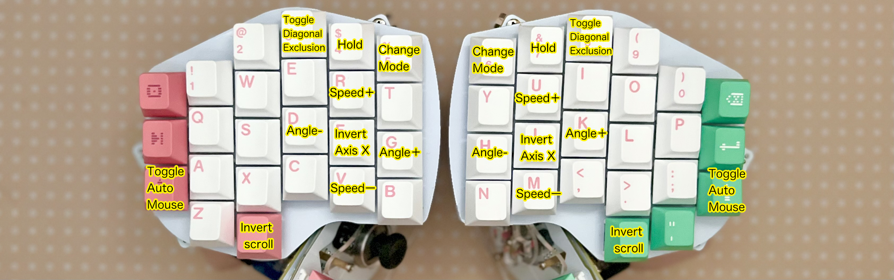
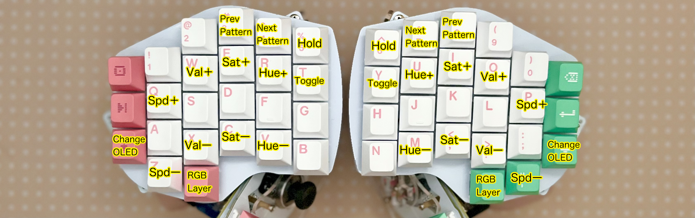
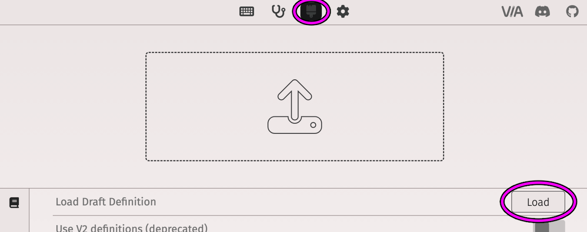
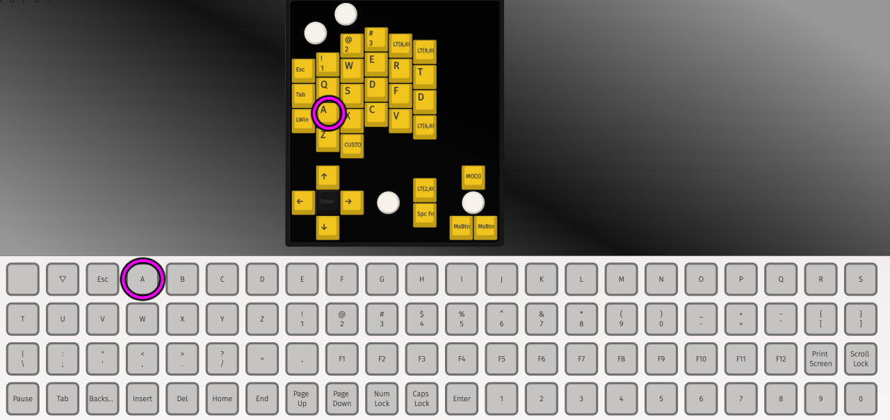

# Killer Whale Customize

1. [First Page](../README_EN.md)
2. [BASE Unit](../rightside/2_BASE.md)
3. [SIDE Unit](../rightside/3_SIDE_TRACKBALL.md)
4. [TOP Unit](../rightside/4_TOP.md)
5. [ADD Unit](../rightside/5_ADD.md)
6. [Assemble](../rightside/6_ASSEMBLE.md)
7. Customize
8. [Misc](../rightside/8_MISC.md)
## Toggle LEFT and RIGHT keymap, bootloader mode, oled setting
Hold B（N）to move to utility layer.
  

## Firmware for split keyboard

- Ball in LEFT Side [tarohayashi_killerwhale_duo_ballleft.uf2
](https://github.com/Taro-Hayashi/KillerWhale/releases/download/0.21.7/tarohayashi_killerwhale_duo_ballleft.uf2)
- Ball in RIGHT Side [tarohayashi_killerwhale_duo_ballright.uf2
](https://github.com/Taro-Hayashi/KillerWhale/releases/download/0.21.7/tarohayashi_killerwhale_duo_ballright.uf2)
- Ball in BOTH Side [tarohayashi_killerwhale_duo_default.uf2
](https://github.com/Taro-Hayashi/KillerWhale/releases/download/0.21.7/tarohayashi_killerwhale_duo_default.uf2)

  

## Mouse layer and auto mouse
Hold S（L）or use trackball to move to mouse layer.

  

## Trackball settings
Hold 4（7）or use trackball to move to ball setteing layer.
  

## LED settings
Hold 5（6）or use trackball to move to RGB setteing layer.
  

## Using VIA
Download JSON File.
- SOLO [killer_whale_solo.json
](https://github.com/Taro-Hayashi/KillerWhale/releases/download/0.21.7/killer_whale_solo.json)
- DUO [killer_whale_duo.json
](https://github.com/Taro-Hayashi/KillerWhale/releases/download/0.21.7/killer_whale_duo.json)

Access VIA.
- https://usevia.app/#/design
  
Load JSON.
  

### Save and restore keymap
  
- sample keymap [solo_right.layout.json](https://github.com/Taro-Hayashi/KillerWhale/releases/download/0.21.7/solo_left.layout.json)

### Change layout
  

### Assign keys
  
### Assign Wheels
  
-  https://github.com/qmk/qmk_firmware/blob/master/docs/keycodes.md

### Assign keycode directly
  
#### Mod key
|function|keycode|
|-|-|
|Ctrl|C(keycode)|
|Shift|S(keycode)|
|Win, Cmd|G(keycode)|
|Alt, Opt|A(keycode)|
|Ctrl+Shift|RCS(keycode)|
|Win, Cmd+Shift|LSG(keycode)|

~~~
C(KC_S)
~~~
- https://github.com/qmk/qmk_firmware/blob/master/docs/mod_tap.md

#### Mod-Tap

|function|keycode|
|-|-|
|Ctrl|LCTL_T(keycode)|
|Shift|LSFT_T(keycode)|
|Win、Cmd|LGUI_T(keycode)|
|Alt、Opt|LALT_T(keycode)|
|Ctrl+Shift|RCS_T(keycode)|
|Win、Cmd+Shift|LSG_T(keycode)|

~~~
LSFT_T(KC_Z)
~~~

- https://github.com/qmk/qmk_firmware/blob/master/docs/mod_tap.md

#### Layer key
|function|keycode|
|-|-|
|momentarily|MO(layer)|
|toggle|TG(layer)|
|hold and tap|LT(layer、keycode)|

- https://github.com/qmk/qmk_firmware/blob/master/docs/feature_layers.md

#### Original keycode for settings
|function|keycode|
|-|-|
|cpi +|CUSTOM(65)|
|cpi -|CUSTOM(66)|
|left angle +|CUSTOM(67)|
|left angle -|CUSTOM(68)|
|reverse left horizontal axis|CUSTOM(69)|
|right angle +|CUSTOM(70)|
|right angle -|CUSTOM(71)|
|reverse right horizontal axis|CUSTOM(72)|
|toggle cursor/scroll left|CUSTOM(73)|
|toggle cursor/scroll right|CUSTOM(74)|
|reverse scroll direction|CUSTOM(75)|
|scroll mode when hold|CUSTOM(76)|
|toggle auto mouse|CUSTOM(77)|
|change OLED display mode|CUSTOM(78)|
  
  
8. [Misc](../rightside/8_MISC.md)
