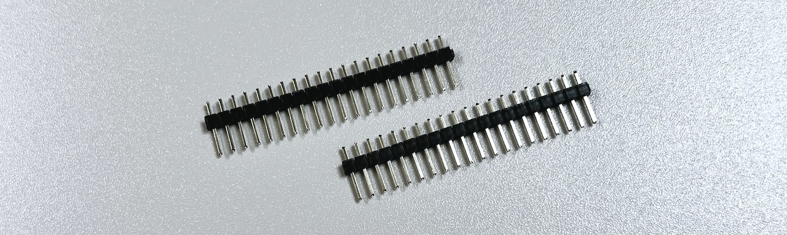
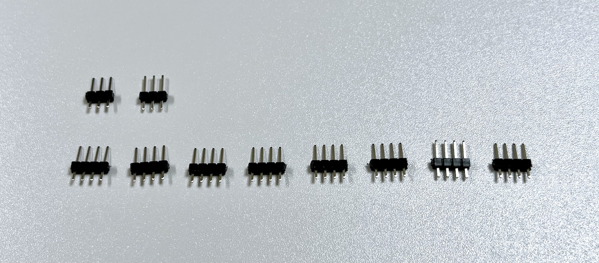
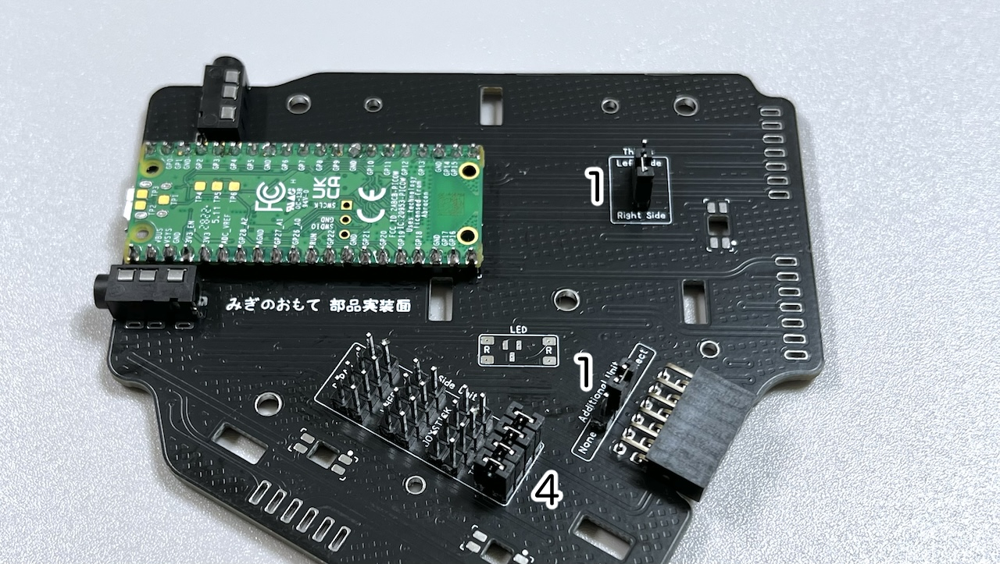
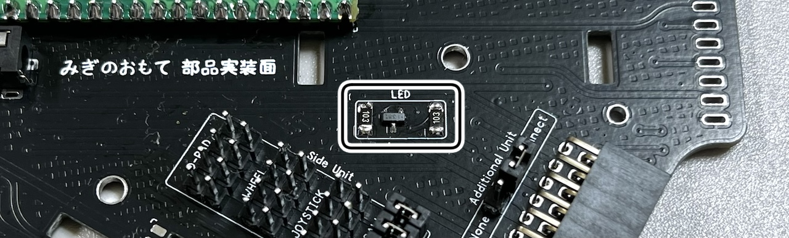
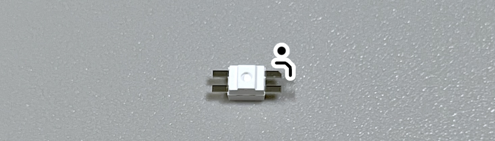
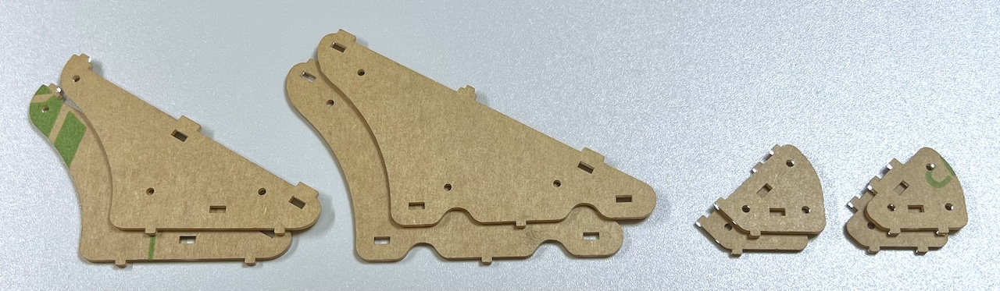
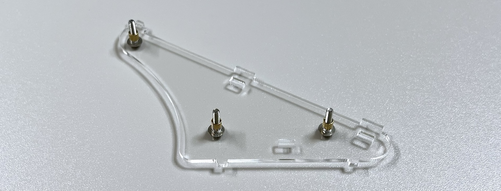

# Killer Whale ベースユニット 右手用ビルドガイド （[左手用](../左手用/2_ベースユニット.md)）

1. [スタートページ](../README.md)
2. ベースユニットの組み立て（右手用）（このページ）
3. [側面ユニットの組み立て](../右手用/3_側面ユニット_トラックボール.md)
4. [天面ユニットの組み立て](../右手用/4_天面ユニット.md)
5. [追加ユニットの組み立て](../右手用/5_追加ユニット.md)
6. [全体の組み立て](../右手用/6_全体の組み立て.md)
7. [カスタマイズ](../右手用/7_カスタマイズ.md)
8. [その他](../右手用/8_その他.md)

## 内容品

||部品名|数||
|-|-|-|-|
|1|メインボード|1|FR4|
|2|ボトムプレート|1|アクリル|
|3|側面ユニット支柱|4|アクリル|
|4|天面ユニット支柱|4|アクリル|
|5|M2ネジ|12|10mm|
|6|M2ワッシャー|24||
|7|M2スプリングワッシャー|12||
|8|M2ナット|12||
|9|M2スペーサー|12|3mm|
|10|M3ネジ|11|10mm|
|11|M3四角ナット|11||
|12|M2ネジ（黒）|4|8mm|
|13|M2ワッシャー（黒）|8||
|14|M2スプリングワッシャー（黒）|4|
|15|M2ナット（黒）|4|
|16|TRRSジャック|2||
|17|ピンソケット|2||
|18|L字ピンソケット|1||
|19|ピンヘッダ|2||
|20|ジャンパー|6||
|21|ゴム足|4||
|22|MOSFET|1|BSS138|
|23|抵抗|2|10k|
|24|Raspberry Pico（Type-C、互換品）|1||

## はんだ付け
ベースユニットには全ての部品を表に実装します。

### Raspberry Pi Picoのはんだ付け
ピンヘッダを20ピンずつニッパーで切ります。

メインボードに差し込み、Raspberry Pi Picoをのせます。

> [!WARNING]
> 左右でRaspberry Pi Picoの裏表が変わるのでGP0,VBUSの位置を確認して合わせます。  
> ビルドガイドの写真はMicro-USBですがType-C版が同梱されています。

表裏両面をはんだ付けします。

長い方のピンはニッパーで短くします。

### L字ピンソケットのハンダ付け
L字ピンソケットを差し込み裏側ではんだ付けします。

### TRRSジャックのはんだ付け
TRRSジャックを差し込み裏側ではんだ付けします。

### ジャンパーピンの取り付け
ピンヘッダーを3ピンを2つ、4ピンを8つ切り出します。

短い方をホールに差して長い方を表側にします。

3箇所にジャンパーピンを6つ差し込み、どのように組み立てるかを選びます。

それぞれ左右どちらか、追加ユニットを接続するか、側面ユニットの種類がどれかに対応しています。

### （オプション）LED部品のはんだ付け
部品が小さいのでピンセットを使いやけどをしないように注意します。

LEDには向きがあります。  丸い発光面が向こう向きになり、基板の角のマークとLEDの足の切り欠きの方向が一致するようにします。

ベースユニットには3箇所取り付けます。

一度USBケーブルを接続して発光するかチェックします。

## 支柱の取り付け

### 支柱の組み立て
支柱は8パーツ4組あります。

前準備としてM2ネジ12本にワッシャーを通します。

ワッシャーを通したM2ネジを支柱パーツの片側に通し、スペーサーで止めます。

スリットに四角ナットを斜めにして立てます。  小さいパーツは2箇所、中くらいのパーツは3箇所、大きいパーツは4箇所スリットがあります。

反対側の支柱パーツをネジに通し、ワッシャー、スプリングワッシャーの順に入れてナットで固定します。

4種類作り終えたところです。

### 支柱の取り付け
表面に支柱を立てて裏面からM3ネジで止めます。
> [!NOTE]
> あとで一度外すので強く締めすぎないようにします。

組み立てる予定の側面ユニットの説明に進みます。
残りの部品はこの後の工程で使うので保管します。

3. 側面ユニットの組み立て
   - [トラックボール](../右手用/3_側面ユニット_トラックボール.md)
   - [十字キー](../右手用/3_側面ユニット_十字キー.md)
   - [（別売）ホイール 縦/横](../右手用/3_側面ユニット_ホイール.md)
   - [（別売）ジョイスティック](../右手用/3_側面ユニット_ジョイスティック.md)
