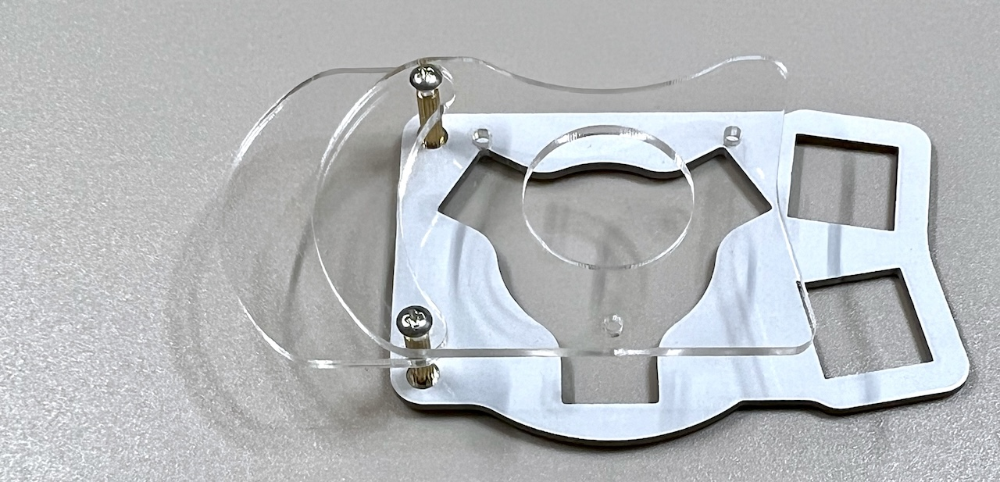
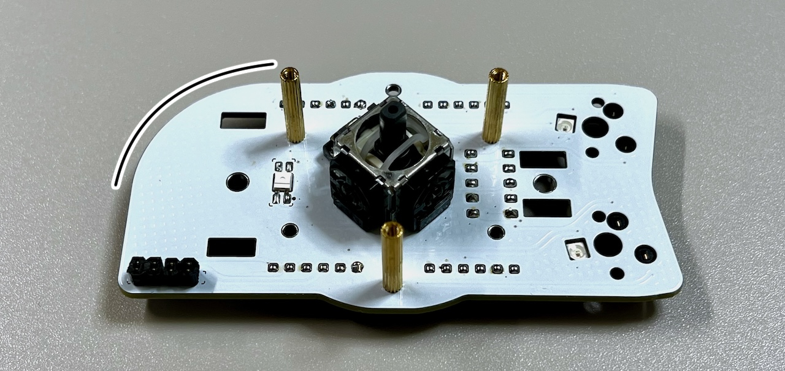

# Killer Whale ジョイスティック側面ユニット 右手用ビルドガイド （[左手用](../左手用/3_側面ユニット_ジョイスティック.md)）

1. [スタートページ](../README.md)
2. [ベースユニットの組み立て](../右手用/2_ベースユニット.md)
3. 側面ユニットの組み立て
   - [トラックボール](../右手用/3_側面ユニット_トラックボール.md)
   - [十字キー](../右手用/3_側面ユニット_十字キー.md)
   - [（別売）ホイール 縦/横](../右手用/3_側面ユニット_ホイール.md)
   - （別売）ジョイスティック（右手用）（このページ）
4. [天面ユニットの組み立て](../右手用/4_天面ユニット.md)
5. [追加ユニットの組み立て](../右手用/5_追加ユニット.md)
6. [全体の組み立て](../右手用/6_全体の組み立て.md)
7. [カスタマイズ](../右手用/7_カスタマイズ.md)
8. [その他](../右手用/8_その他.md)

## ご注意
左右分割キーボードとして使用する時、ジョイスティックはUSBを接続している側のみ動作します。
## 内容品

||部品名|数||
|-|-|-|-|
|1|メインボード|1|FR4|
|2|スイッチプレート|1|FR4|
|3|保護プレート|2|アクリル|
|4|M2ネジ（短）|5|4mm|
|5|M2ネジ（中）|5|6mm|
|6|M2スペーサー（短）|2|9mm|
|7|M2スペーサー（長）|3|16mm|
|8|ダイオード|5|1N4148|
|9|MXスイッチソケット|2||
|10|ジョイスティック|1||
|11|キャップ|1||
|12|ピンヘッダ|1||

### キット以外に必要なもの
|部品名|数||
|-|-|-|
|[キースイッチ](https://shop.yushakobo.jp/collections/all-switches)|2|Cherry MX互換|
|[キーキャップ](https://shop.yushakobo.jp/collections/keycaps)|2|Cherry MX互換|
|幅1cm以下の棒やすり||処理済みで必要ないことがあります|

### オプション
<table>
    <tr>
      <td><a href="https://shop.yushakobo.jp/products/oled">OLEDモジュール</a></td>
      <td>1</td>
    </tr>
    <tr>
      <td>ピンソケット4ピン</a></td>
      <td>1</td>
    </tr>
    <tr>
      <td><a href="https://shop.yushakobo.jp/products/sk6812mini-e-10">LED（SK6812MINI-E)</a></td>
      <td>3</td>
    </tr>
 </table>

## はんだ付け
側面ユニットは表裏両方に部品をはんだ付けします。

左右の記載がある方が裏面です。
### （オプション）LEDのはんだ付け
LEDは3個取り付けます。すべてはんだ付けする面から見て丸い発光面が向こう向きです。

### MXスイッチソケットのはんだ付け（裏面）
裏面にピンセットで押し付けながらハンダごてに乗せたはんだを流し込みます。

### ダイオードのはんだ付け（裏面）
ダイオードには向きがあります。線とメインボードのマークの方向を合わせます。

4箇所に裏からダイオードを差し、表ではんだ付けして足を切ります。

### ピンヘッダーのはんだ付け（裏面）
40ピンヘッダーから6ピンを4本切り出します。

裏面から差し込み、表面ではんだ付けして足を切ります。
> [!WARNING]
> 長い方を差し込みます。反対にした場合は短い方と同程度まで切ります。

### （オプション）OLEDモジュールのはんだ付け（表面）
OLEDモジュールを着脱可能にする場合は表面に4ピンソケットをはんだ付けします。

OLEDモジュールにはOLED用ピンヘッダをはんだ付けします。

直接はんだ付けする場合はここでメインボードにはんだ付けします。
### ジョイスティックのはんだ付け（表面）
表から差し込んで裏ではんだ付けします。

## 仮組みとソケットのはんだ付け
### スイッチプレートの組み立て

スイッチプレートにタグが付いている場合は折ってからやすりで削ります。

スイッチプレートにM2スペーサー（短）をM2ネジ（短）で取り付けます。
> [!NOTE]
> スイッチプレートには上下があります。

スペーサーに保護プレート2種をM2ネジ（中）で取り付けます。

大きい方を上にします。

### ベースユニットへの取り付け
側面ユニットにM2スペーサー（長）をM2ネジ（短）で取り付けます。

> [!NOTE]
> 下側に一つ、上側に2つ付け正三角形にします。

初めて側面ユニットを作る場合、ベースユニットで余ったピンソケットから6ピンを2つ切り出して側面ユニットのピンソケットに差し込みます。

支柱に側面ユニットを差し込み、ベースユニットのM3ネジで止めます。
> [!CAUTION]
> ベースユニットの縦長のスルーホールにピンソケットの足が入るようにします。

ベースユニットの裏面でピンソケットをはんだ付けします。

これで側面ユニットのはんだ付けは終わりです。

OLEDモジュールを使う場合はここでピンソケットに差し込みます。

ジョイスティックにキャップをはめて、スイッチプレートにキースイッチを取り付けてMXソケットに差し込みます。

保護プレートをM2ネジ（中）で固定します。

USBケーブルを差し動作を確認します。
> [!NOTE]
> 側面ユニットのLEDは天面ユニット（と追加ユニット）を取り付けるまで光りません。

## ゲームパッドのアナログスティックとしての利用について
ジョイスティック側面ユニットを使っている場合、従来の3つのモード（カーソル移動、スクロール、キー入力）に加えてゲームモードに切り替えガできます。

DirectInputのコントローラーとして認識されるのでXInputへの対応のゲームではXbox 360 Controller Emulator等をお使いください。

ゲームモードでも角度の変更をすることができます。回転とX軸の反転を組み合わせて好みの方向に変えてください。また、スティックが反応する傾きの範囲も変更できるので感度や斜め入力のしやすさもある程度調整できます。

ゲームモードでのジョイスティックは自動でキャリブレーションを行っています。USBケーブルの接続後は大きく一周回すとすぐに正確な方向が入力できるようになります。

問題がなければ天面ユニットの組み立てに進みます。
同梱されているものと、別売のホイール付きの2種類があります。

4. [天面ユニットの組み立て](../右手用/4_天面ユニット.md)
   - [（別売）ホイール付き天面ユニット](../右手用/4_ホイール付き天面ユニット.md)
