# Killer Whale トラックボール側面ユニット 右手用ビルドガイド （[左手用](../左手用/3_側面ユニット_トラックボール.md)）

1. [スタートページ](../README.md)
2. [ベースユニットの組み立て](../右手用/2_ベースユニット.md)
3. 側面ユニットの組み立て
   - トラックボール（右手用）（このページ）
   - [十字キー](../右手用/3_側面ユニット_十字キー.md)
   - [（別売）ホイール 縦/横](../右手用/3_側面ユニット_ホイール.md)
   - [（別売）ジョイスティック](../右手用/3_側面ユニット_ジョイスティック.md)
4. [天面ユニットの組み立て](../右手用/4_天面ユニット.md)
5. [追加ユニットの組み立て](../右手用/5_追加ユニット.md)
6. [全体の組み立て](../右手用/6_全体の組み立て.md)
7. [カスタマイズ](../右手用/7_カスタマイズ.md)
8. [その他](../右手用/8_その他.md)

## 内容品
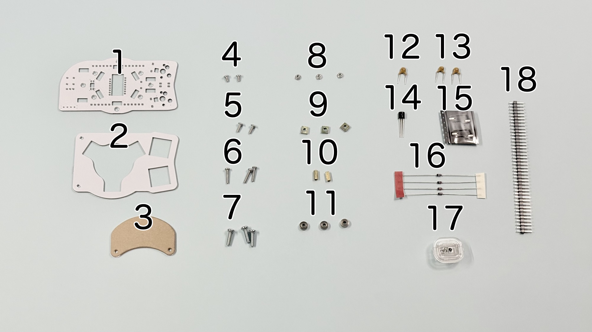
||部品名|数||
|-|-|-|-|
|1|メインボード|1|FR4|
|2|スイッチプレート|1|FR4|
|4|保護プレート|1|アクリル|
|5|M2ネジ（短）|2|4mm|
|6|M2ネジ（中）|2|6mm|
|7|M2ネジ（長）|3|10mm|
|8|M3ネジ|3|10mm|
|11|M2ナット|3|
|13|M3四角ナット|3||
|15|M2スペーサー（長）|2|7mm|
|16|ベアリング|3|2x6x2.5|
|17|コンデンサーC1,C2|2|10uF|
|18|コンデンサーC3|1|4.7uF|
|19|レギュレーター|1|UT7500L-18|
|20|MXスイッチソケット|2||
|21|ダイオード|4|1N4148|
|22|センサーとレンズ|1|PMW3360|
|23|ピンヘッダ|1||

以下の3Dプリンター製部品も使います。

## はんだ付け
側面ユニットは表裏両方に部品をはんだ付けします。

左右の記載がある方が裏面です。
### （オプション）LEDのはんだ付け
LEDは3個取り付けます。すべてはんだ付けする面から見て丸い発光面が向こう向きです。

### MXスイッチソケットのはんだ付け（裏面）
裏面にピンセットで押し付けながらハンダごてに乗せたはんだを流し込みます。

### ダイオードのはんだ付け（裏面）
ダイオードには向きがあります。線とメインボードのマークの方向を合わせます。

4箇所に裏からダイオードを差し、表ではんだ付けして足を切ります。
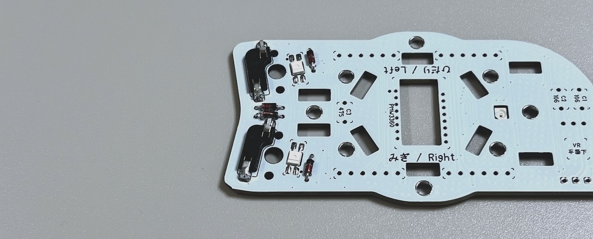

### センサー類のはんだ付け（裏面）
裏面でメインボードの丸マークとチップの丸の位置を合わせて表面ではんだ付けします。
> [!NOTE]
> センサーのシールはまだ剥がさない方が安全です。

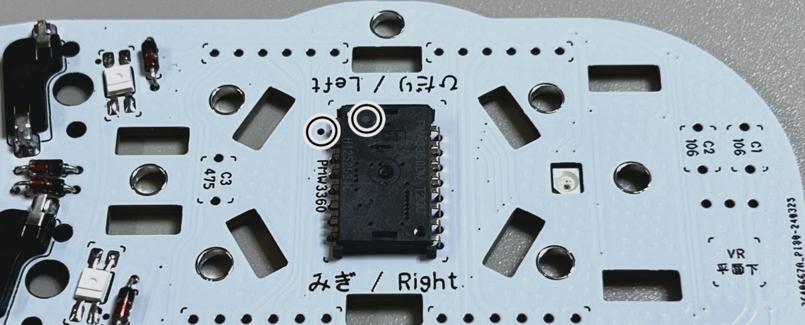

コンデンサーをはんだ付けします。106と書いてあるのがC1,C2で475がC3です。
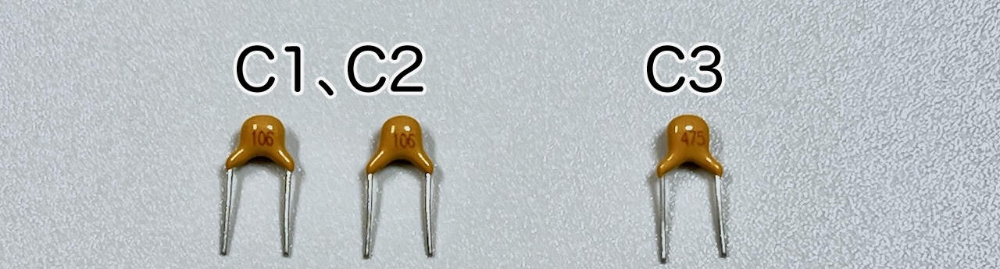
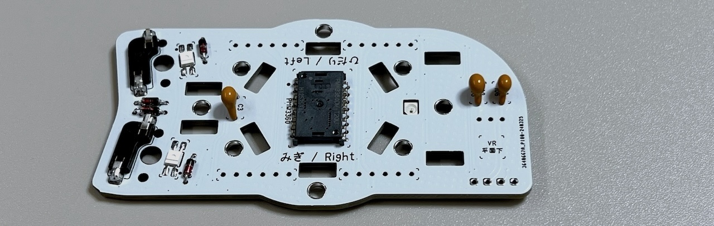

レギュレーターを裏面から差し、メインボードの印刷どおり平面が下になるように折り曲げてはんだ付けします。
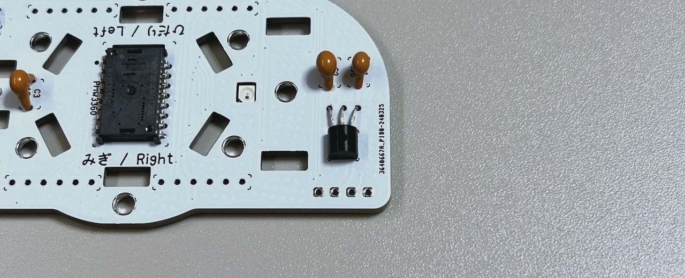

### ピンヘッダーのはんだ付け（裏面）
40ピンヘッダーから6ピンを4本切り出します。

裏面から差し込み、表面ではんだ付けして足を切ります。
> [!WARNING]
> 長い方を差し込みます。反対にした場合は短い方と同程度まで切ります。

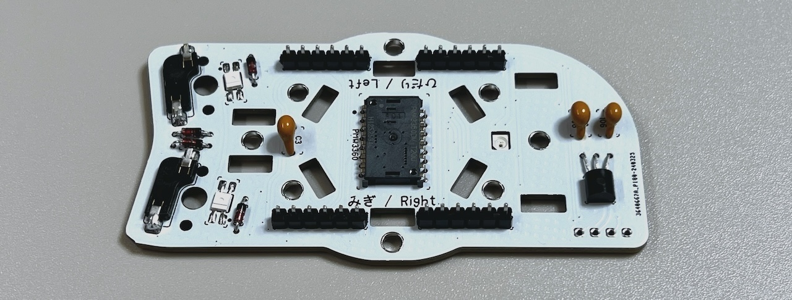

### （オプション）OLEDモジュールのはんだ付け（表面）
OLEDモジュールを着脱可能にする場合は表面に4ピンソケットをはんだ付けします。
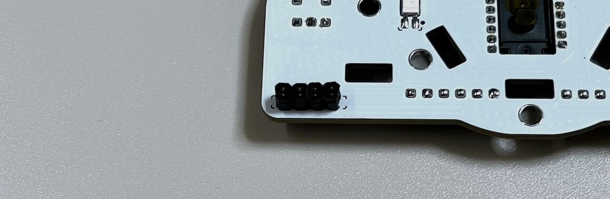

OLEDモジュールにはOLED用ピンヘッダをはんだ付けします。

直接はんだ付けする場合はここでメインボードにはんだ付けします。

## 仮組みとソケットのはんだ付け
### スイッチプレートの組み立て
スイッチプレートにタグが付いている場合は折ってからやすりで削ります。

スイッチプレートにM2スペーサー（長）をM2ネジ（短）で取り付けます。
> [!NOTE]
> スイッチプレートには上下があります。

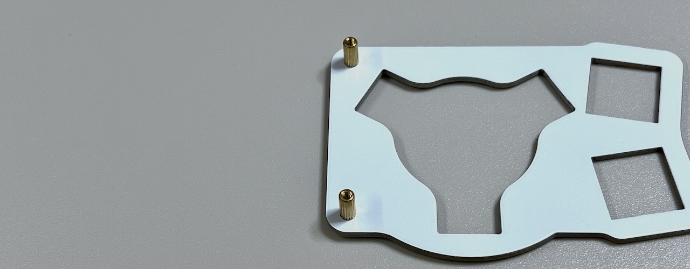

スペーサーに保護プレートを、M2ネジ（中）で取り付けます。
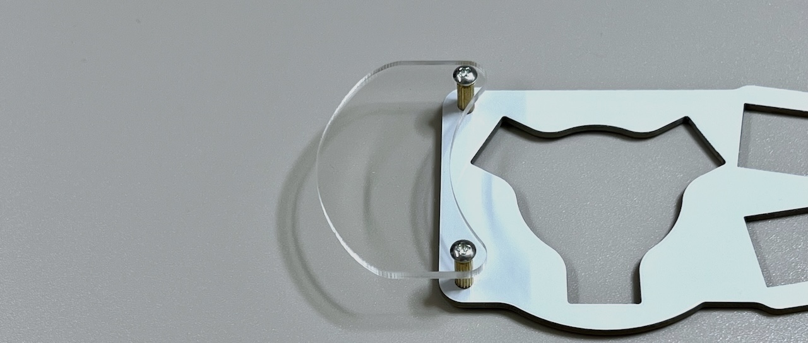

### トラックボールケースの取り付け
センサーの保護フィルムをはがし、レンズを取り付けます。
> [!IMPORTANT]
> レンズには取り付け方向があります。

裏面に出ているレンズの足をはんだごてで熱して固定します。

ボールケース支柱の3箇所にベアリングを3本のネジと3個のナットで固定します。

ボールケース支柱を立て、スリットにM3角ナットを当てたら裏面からM3ネジで止めます。
> [!NOTE]
> 下側は支柱が一本、上側に2本で正三角形を作るように立てます。

### ベースユニットへの取り付け
初めて側面ユニットを作る場合、ベースユニットのピンソケットから6ピンを2つ切り出して側面ユニットのピンソケットに差し込みます。

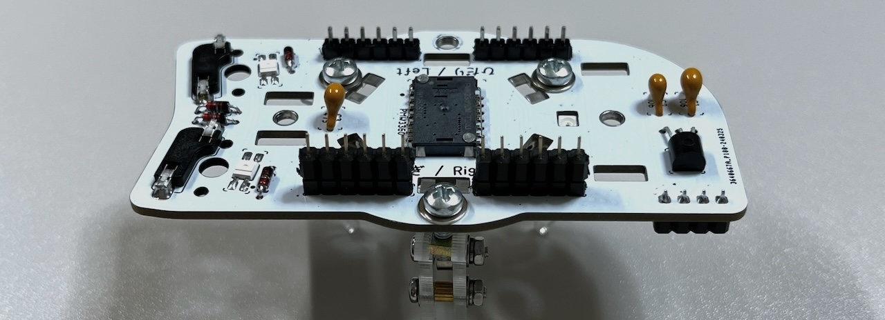
支柱に側面ユニットを差し込み、ベースユニットのM3ネジで止めます。
> [!CAUTION]
> ベースユニットの縦長のスルーホールにピンソケットの足が入るようにします。

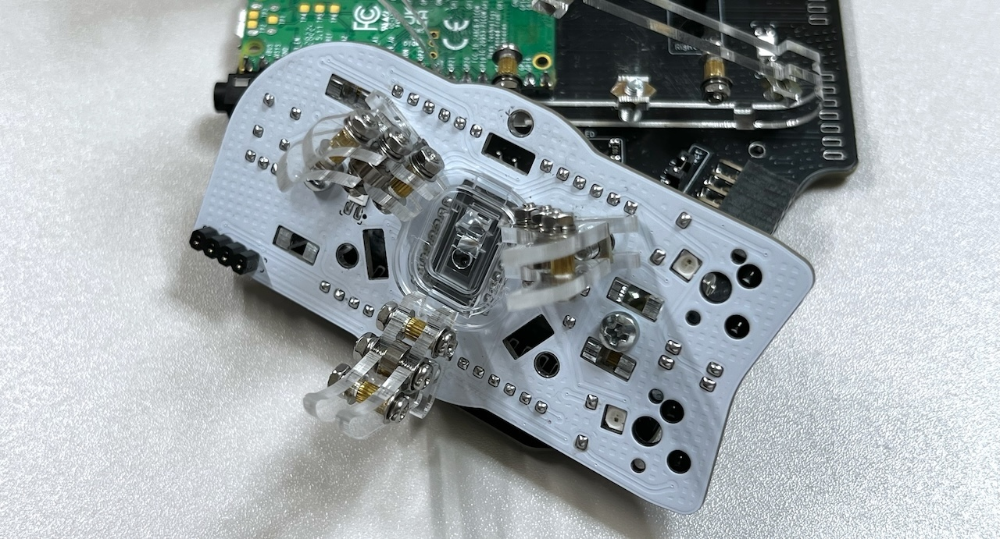
ベースユニットの裏面でピンソケットをはんだ付けします。
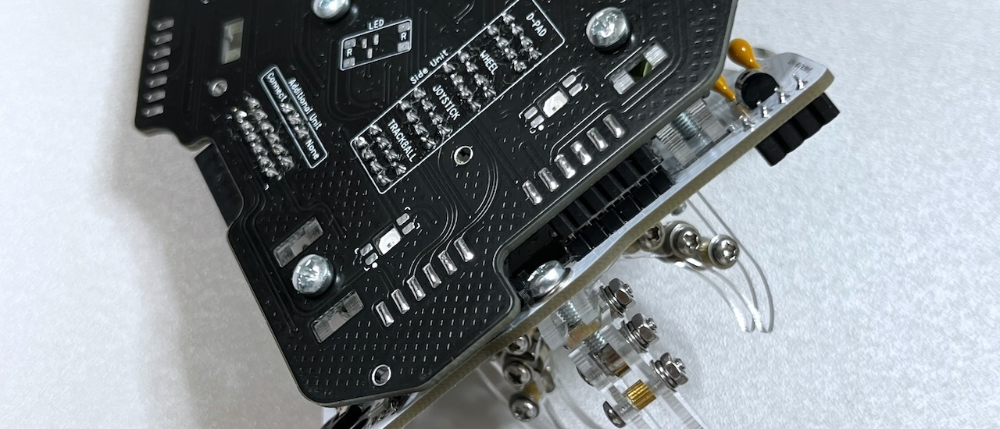
これで側面ユニットのはんだ付けは終わりです。

OLEDモジュールを使う場合はここでピンソケットに差し込みます。
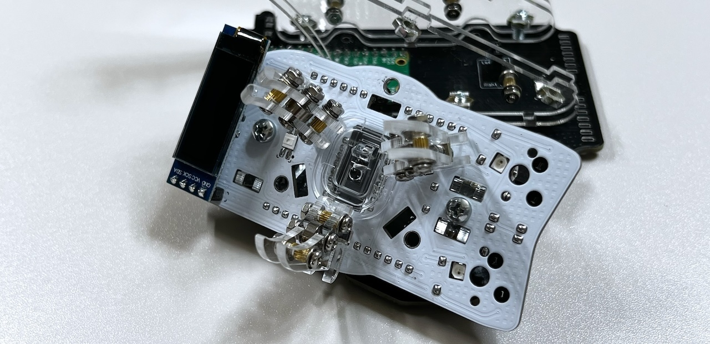

スイッチプレートにキースイッチを取り付けてMXソケットに差し込み、カバーを取り付けます。

USBケーブルを差し動作を確認します。

> [!NOTE]
> 側面ユニットのLEDは天面ユニット（と追加ユニット）を取り付けるまで光りません。
> カーソルの方向や速度は後で調節できます。

問題がなければ天面ユニットの組み立てに進みます。
同梱されているものと、別売のホイール付きの2種類があります。

4. [天面ユニットの組み立て](../右手用/4_天面ユニット.md)
   - [（別売）ホイール付き天面ユニット](../右手用/4_ホイール付き天面ユニット.md)
