# Killer Whale 十字キー側面ユニット 右手用ビルドガイド （[左手用](../左手用/3_側面ユニット_十字キー.md)）

1. [スタートページ](../README.md)
2. [ベースユニットの組み立て](../右手用/2_ベースユニット.md)
3. 側面ユニットの組み立て
   - [トラックボール](../右手用/3_側面ユニット_トラックボール.md)
   - 十字キー（右手用）（このページ）
   - [（別売）ホイール 縦/横](../右手用/3_側面ユニット_ホイール.md)
   - [（別売）ジョイスティック](../右手用/3_側面ユニット_ジョイスティック.md)
4. [天面ユニットの組み立て](../右手用/4_天面ユニット.md)
5. [追加ユニットの組み立て](../右手用/5_追加ユニット.md)
6. [全体の組み立て](../右手用/6_全体の組み立て.md)
7. [カスタマイズ](../右手用/7_カスタマイズ.md)
8. [その他](../右手用/8_その他.md)

## 内容品 
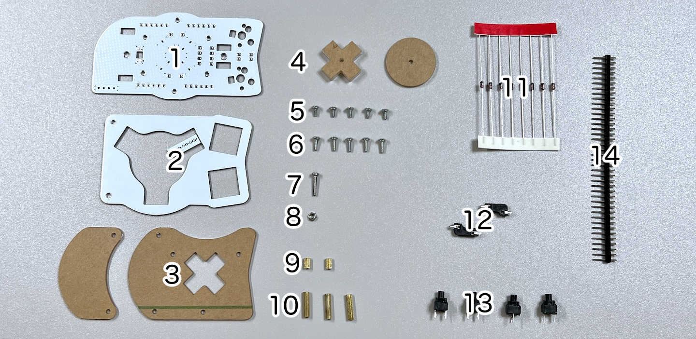    
||部品名|数||
|-|-|-|-|
|1|メインボード|1|FR4|
|2|スイッチプレート|1|FR4|
|3|保護プレート|2|アクリル|
|4|十字キー用プレート|2|アクリル|
|5|M2ネジ（短）|5|4mm|
|6|M2ネジ（中）|5|6mm|
|7|M2ネジ（長）|1|10mm|
|8|M2ナット|1||
|9|M2スペーサー（短）|2|5mm
|10|M2スペーサー（長）|3|12mm|
|11|ダイオード|8|1N4148|
|12|MXスイッチソケット|2||
|13|ミュートスイッチ|4|
|14|ピンヘッダ|1||

## はんだ付け
側面ユニットは表裏両方に部品をはんだ付けします。
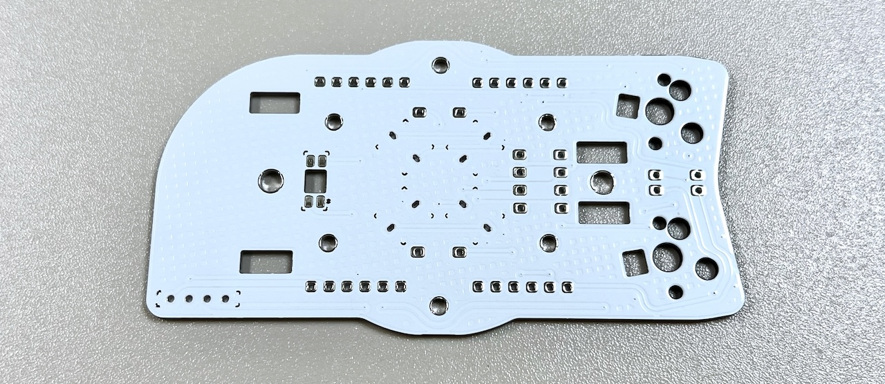  
左右の記載がある方が裏面です。 
### （オプション）LEDのはんだ付け
LEDは3個取り付けます。すべてはんだ付けする面から見て丸い発光面が向こう向きです。  
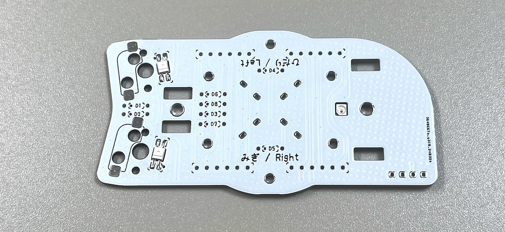  

### MXスイッチソケットのはんだ付け（裏面）
裏面にピンセットで押し付けながらハンダごてに乗せたはんだを流し込みます。 
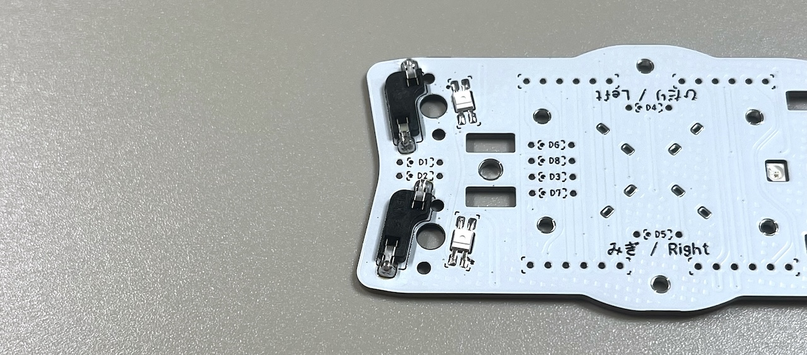  

### ダイオードのはんだ付け（裏面）
ダイオードには向きがあります。線とメインボードのマークの方向を合わせます。 
  
8箇所に裏からダイオードを差し、表ではんだ付けして足を切ります。  
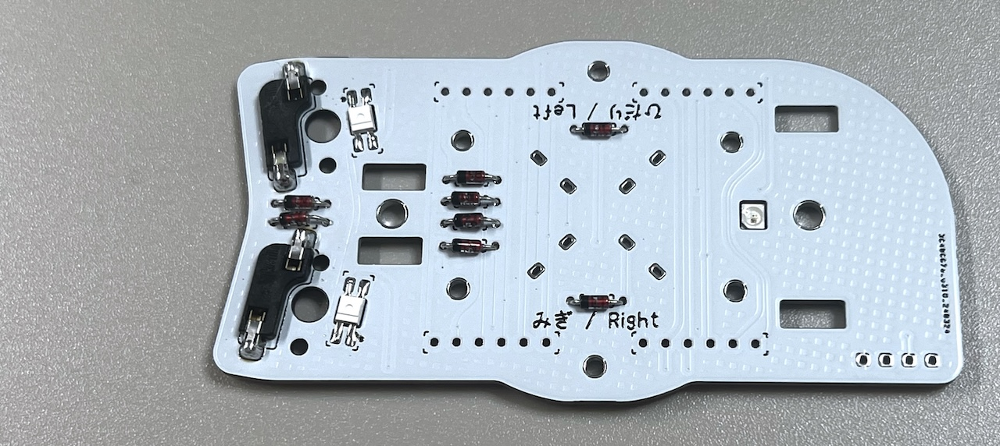  

### ピンヘッダーのはんだ付け（裏面）
40ピンヘッダーから6ピンを4本切り出します。
  
裏面から差し込み、表面ではんだ付けして足を切ります。
> [!WARNING]
> 長い方を差し込みます。反対にした場合は短い方と同程度まで切ってください。

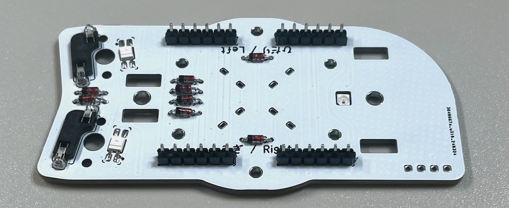   
### （オプション）OLEDモジュールのはんだ付け（表面）
OLEDモジュールを着脱可能にする場合は表面に4ピンソケットをはんだ付けします。  
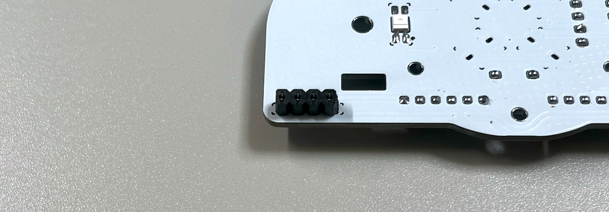   
OLEDモジュールにはOLED用ピンヘッダをはんだ付けします。  
  
直接はんだ付けする場合はここでメインボードにはんだ付けします。

### 十字キーのスイッチのはんだ付け（表面）
ミュートスイッチを表面から差し込んで裏面ではんだ付けします。  
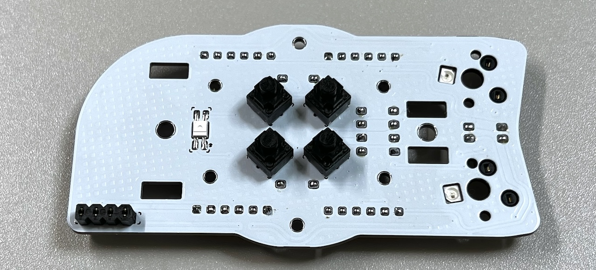  

## 仮組みとソケットのはんだ付け
### スイッチプレートの組み立て

スイッチプレートにタグが付いている場合は折ってからやすりで削ります。

   

スイッチプレートにM2スペーサー（短）をM2ネジ（短）で取り付けます。  
> [!NOTE]
> スイッチプレートには上下があります。  

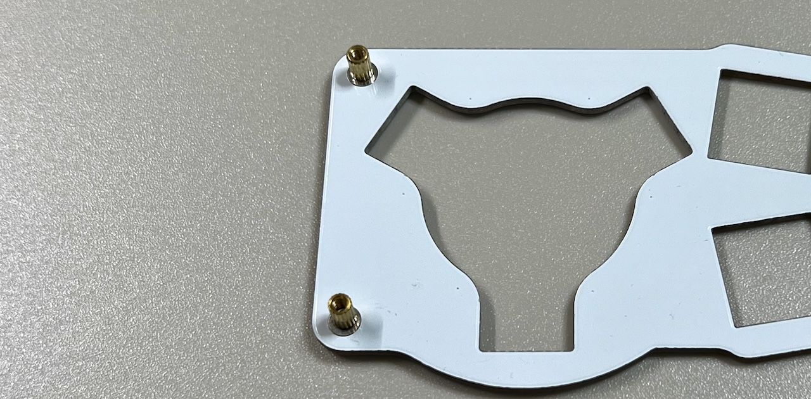  
  
スペーサーに保護プレート2種をM2ネジ（中）で取り付けます。  
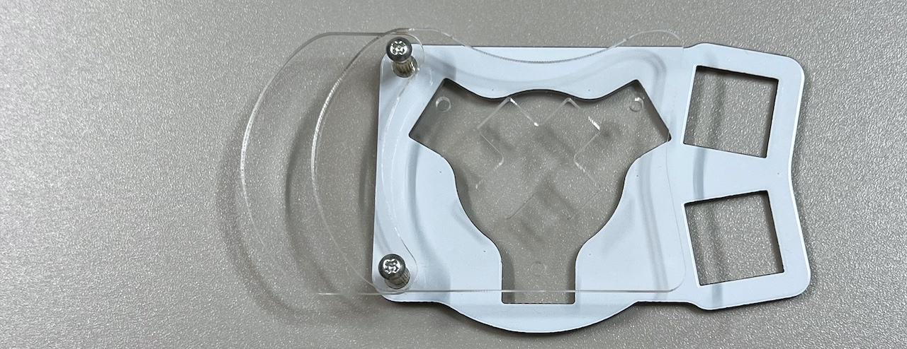  
大きい方を上にします。 
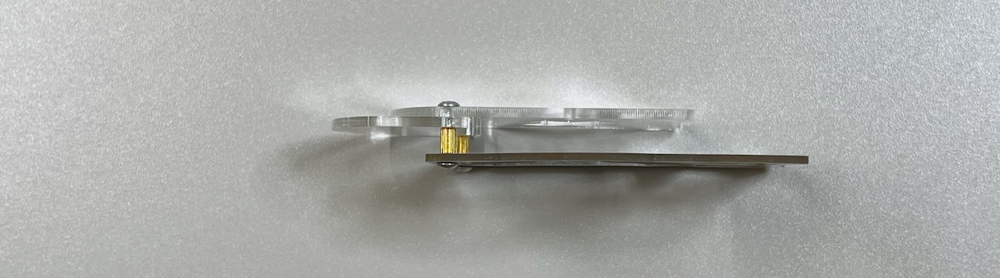  

### ベースユニットへの取り付け
側面ユニットにM2スペーサー（長）をM2ネジ（短）で取り付けます。  

> [!NOTE]
> 下側に一つ、上側に2つ付け正三角形にします。

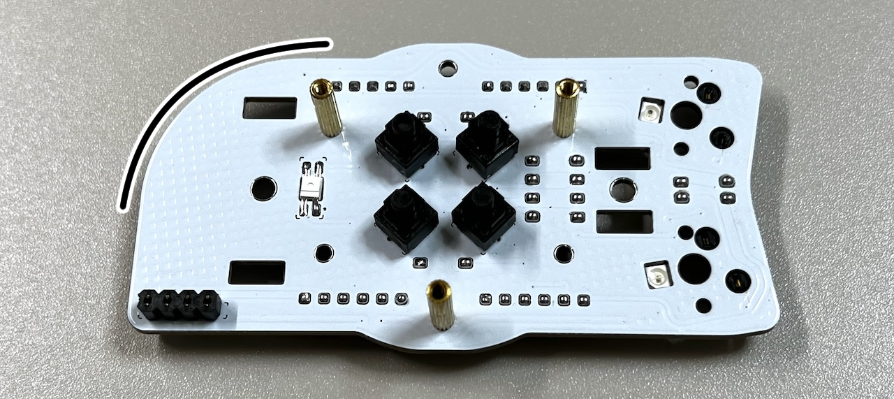  
   
初めて側面ユニットを作る場合、ベースユニットで余ったピンソケットから6ピンを2つ切り出して側面ユニットのピンソケットに差し込みます。
   
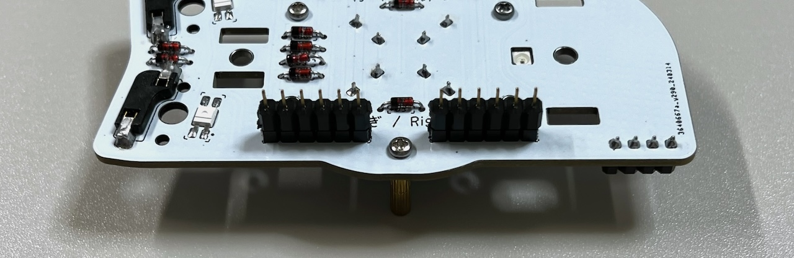  
支柱に側面ユニットを差し込み、ベースユニットのM3ネジで止めます。
> [!CAUTION]
> ベースユニットの縦長のスルーホールにピンソケットの足が入るようにします。

   
ベースユニットの裏面でピンソケットをはんだ付けします。  
   
これで側面ユニットのはんだ付けは終わりです。  

OLEDモジュールを使う場合はここでピンソケットに差し込みます。   
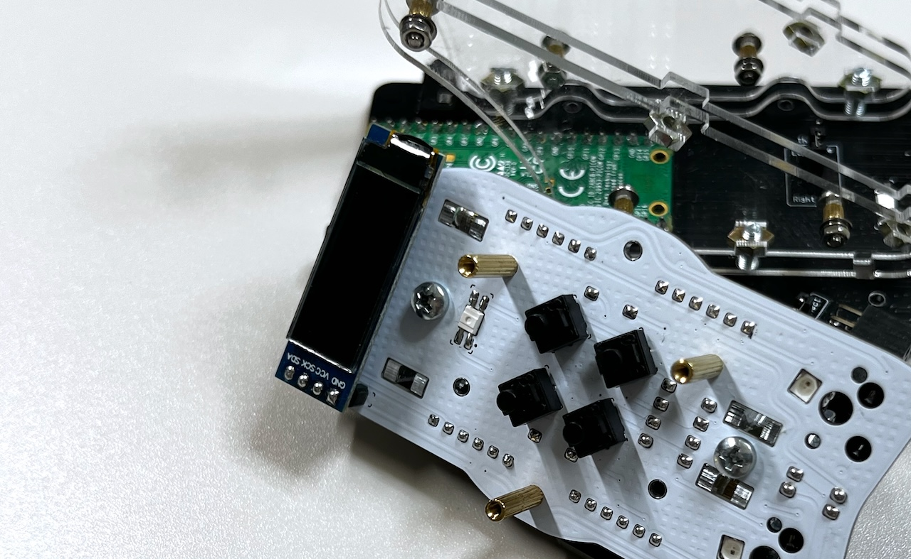   

十字キー用プレートをM2ネジ（長）とナットで固定します。    
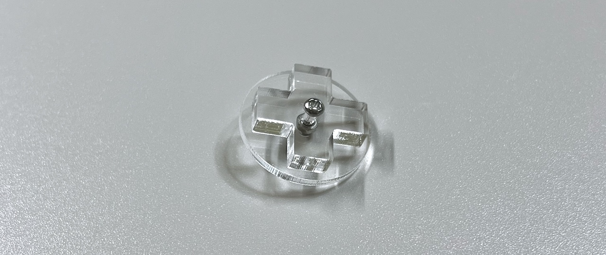  

十字キーを挟み込むようにして、スイッチプレートにキースイッチを取り付けてMXソケットに差し込みます。
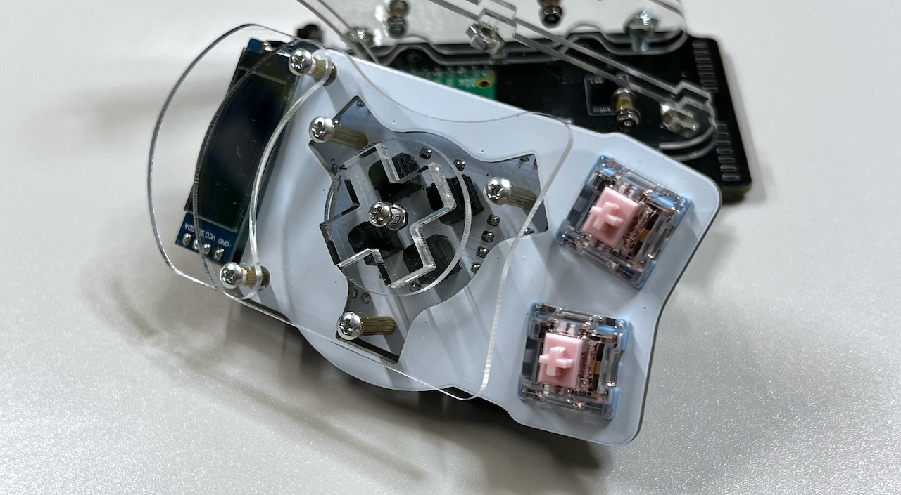   

USBケーブルを差し動作を確認します。
> [!NOTE]
> 側面ユニットのLEDは天面ユニット（と追加ユニット）を取り付けるまで光りません。  

問題がなければ天面ユニットの組み立てに進みます。  
同梱されているものと、別売のホイール付きの2種類があります。   
  
4. [天面ユニットの組み立て](../右手用/4_天面ユニット.md)
   - [（別売）ホイール付き天面ユニット](../右手用/4_ホイール付き天面ユニット.md)

