# Killer Whale ホイール付き天面ユニット 右手用ビルドガイド （[左手用](../左手用/4_ホイール付き天面ユニット.md)）

1. [スタートページ](../README.md)
2. [ベースユニットの組み立て](../右手用/2_ベースユニット.md)
3. [側面ユニットの組み立て](../右手用/3_側面ユニット_トラックボール.md)
4. [天面ユニットの組み立て](../右手用/4_天面ユニット.md)
   - （別売）ホイール付き天面ユニットの組み立て（右手用）（このページ）
5. [追加ユニットの組み立て](../右手用/5_追加ユニット.md)
6. [全体の組み立て](../右手用/6_全体の組み立て.md)
7. [カスタマイズ](../右手用/7_カスタマイズ.md)
8. [その他](../右手用/8_その他.md)

## 内容品 
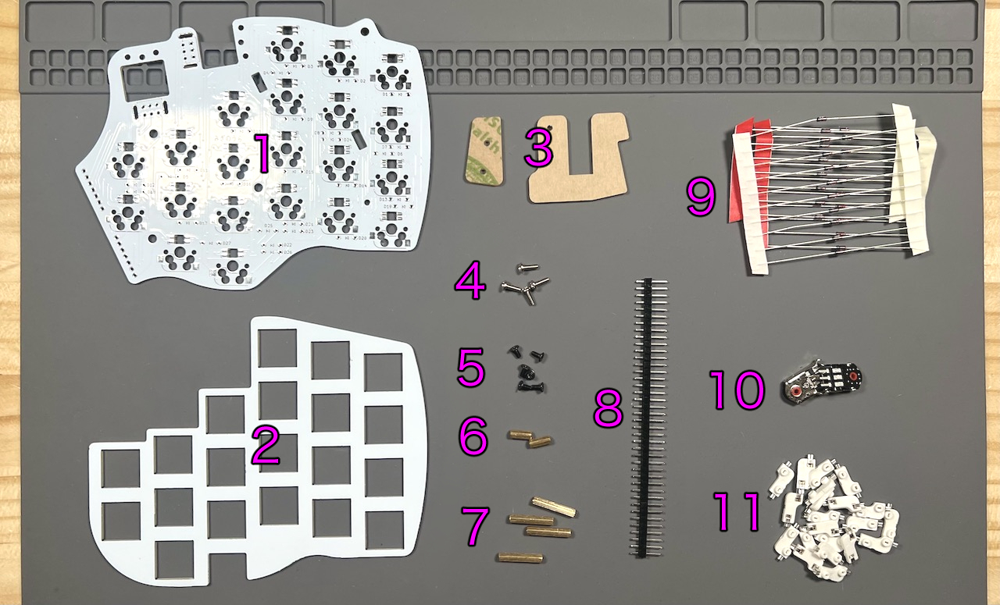    
||部品名|数||
|-|-|-|-|
|1|メインボード|1|FR4|
|2|スイッチプレート|1|FR4|
|3|保護プレート|2|アクリル|
|4|M2バインドねじ|4|6mm|
|5|M2ねじ（黒）|6|4mm|
|6|M2スペーサー（短）|2|8mm|
|7|M2スペーサー（長）|4|16mm|
|8|ピンヘッダ|1||
|9|ダイオード|27||
|10|ホイールエンコーダー|2||
|11|ホイール|2||
|12|MXスイッチソケット|21||

## はんだ付け
ホイール付き天面ユニットは表裏両方に部品を実装するので気をつけてください。  
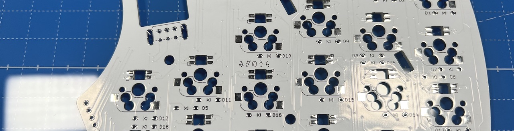  

### （オプション）LEDのはんだ付け（裏面）
すべて発光面が向こう向きになります。   
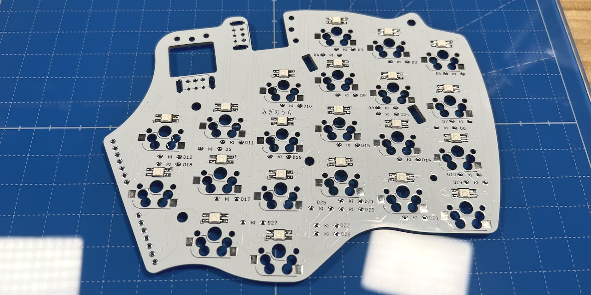  

### ダイオードのはんだ付け（裏面）
裏面にD1からD27までダイオードを差し、マスキングテープで固定します。  
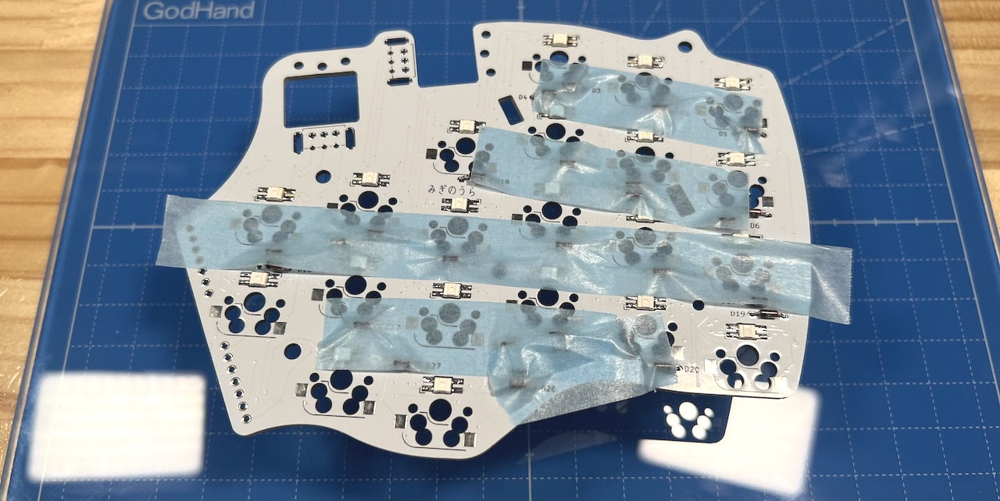  
表ではんだ付けして足を切ります。  
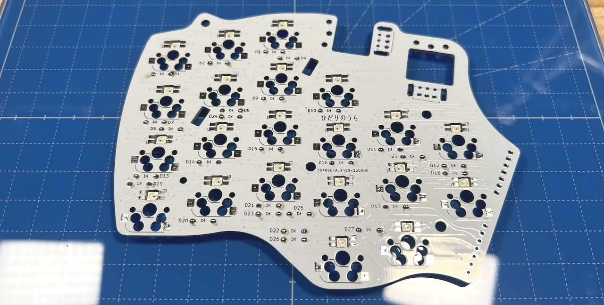  
### MXスイッチソケットのはんだ付け（裏面）
裏面にピンセットで押し付けながらハンダごてに乗せたはんだを流し込みます。  
  
両側をはんだしてずれなくなったらピンセットからはんだに持ち替えて追加で流し込みしましょう。  表面積が広く多めのはんだが必要です。  

### ピンヘッダーのはんだ付け（裏面）
40ピンヘッダーから7ピンを2本切り出して裏面に立ててはんだ付けします。長い方を差し込んでください。  
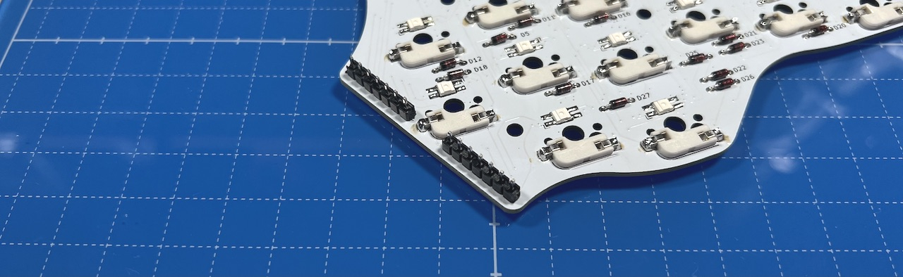  

### ホイールエンコーダーのはんだ付け（表面）
エンコーダーの裾のプレートを少し広げます（ショートを防ぐため）。  
  
基板の四角マークに合わせてホイールを差し込みマスキングテープで垂直に固定したら、裏面をはんだ付けします。  
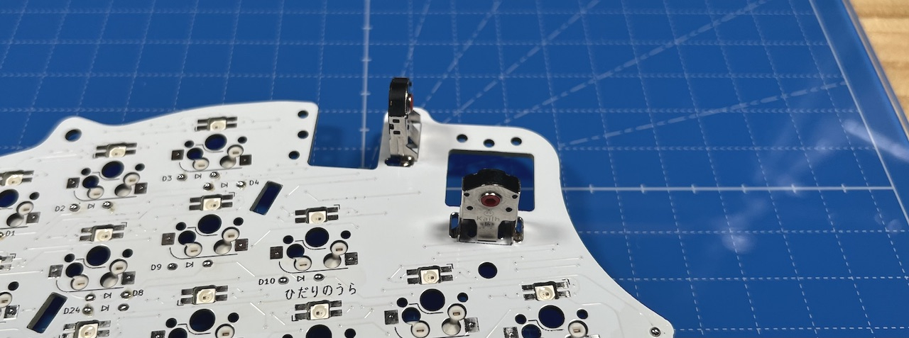  
M2ねじ（黒）でスペーサー6つを止めます。真ん中に短いスペーサーを使います。  
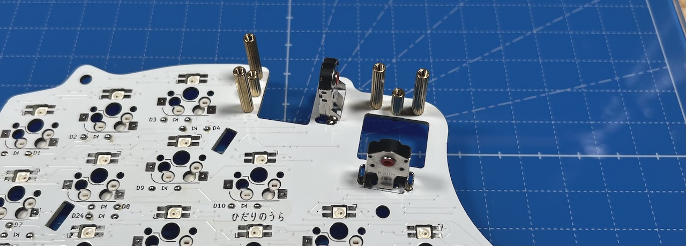  

## 仮組みとソケットのはんだ付け
ベースユニットにピンソケットを取り付けていない場合、ベースユニットで余ったピンソケットから7ピンを2つ切り出して側面ユニットのピンソケットに差し込みます。  
  
ベースユニットのM3ねじ4本にワッシャーを通します。  
   
支柱に天面ユニットを差し込み、M3ねじで止めます。  ベースユニットの横長のスルーホールにピンソケットの足が入るようにしてください。  
  
ベースユニットの裏面でピンソケットをはんだ付けします。  多めにはんだを流して表面までしっかりはんだ付けされるようにしてください。  
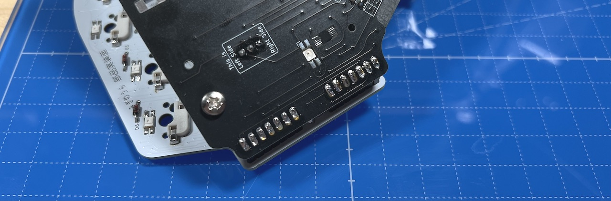  
スイッチプレートの四角にキースイッチを取り付けてMXソケットに差し込みます。  
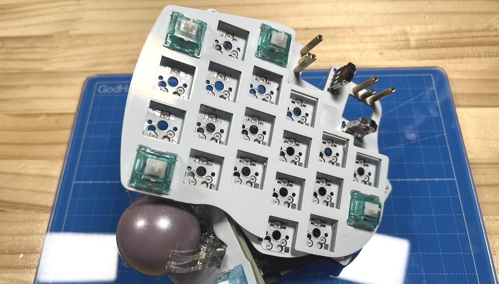  
全てのスイッチを取り付けました。
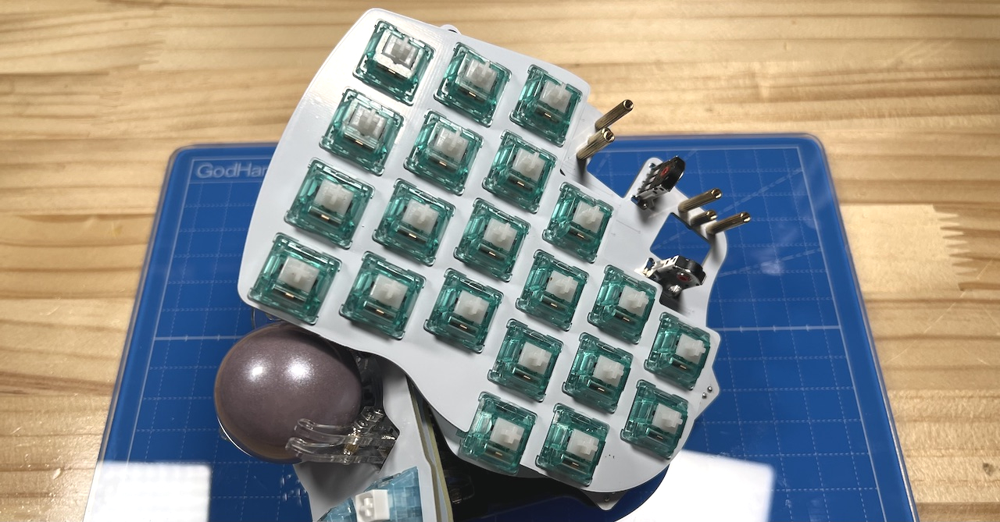  
ホイールをホイールエンコーダーに差し込み、保護プレートをバインドネジで固定します。
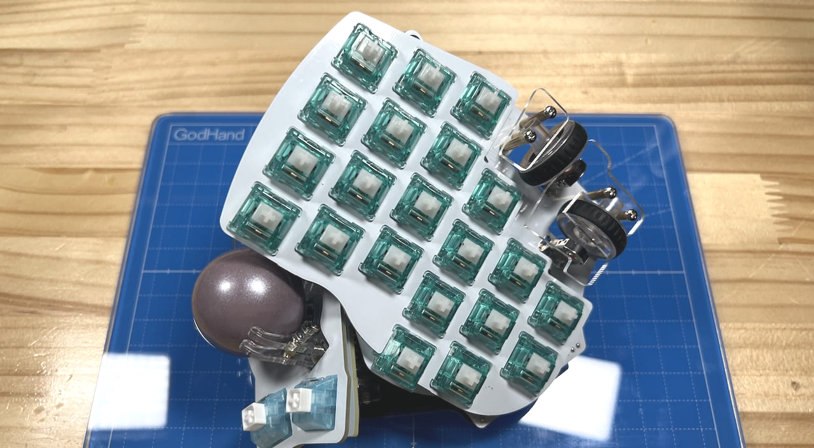  
USBを繋いで動作確認をしてみてください。

追加ユニットは必須ではありません。取り付ける場合は追加ユニットの説明に、取り付けない場合は全体の組立てに進んでください。  

5. [追加ユニットの組み立て](../右手用/5_追加ユニット.md)
6. [全体の組み立て](../右手用/6_全体の組み立て.md)
