# Killer Whale　天面ユニット 右手用ビルドガイド （[左手用](../左手用/4_天面ユニット.md)）

1. [スタートページ](../README.md)
2. [ベースユニットの組み立て](../右手用/2_ベースユニット.md)
3. [側面ユニットの組み立て](../右手用/3_側面ユニット_トラックボール.md)
4. 天面ユニットの組み立て（右手用）（このページ）
   - [（別売）ホイール付き天面ユニットの組み立て](../右手用/4_ホイール付き天面ユニット.md)
5. [追加ユニットの組み立て](../右手用/5_追加ユニット.md)
6. [全体の組み立て](../右手用/6_全体の組み立て.md)
7. [カスタマイズ](../右手用/7_カスタマイズ.md)
8. [その他](../右手用/8_その他.md)

## 内容品
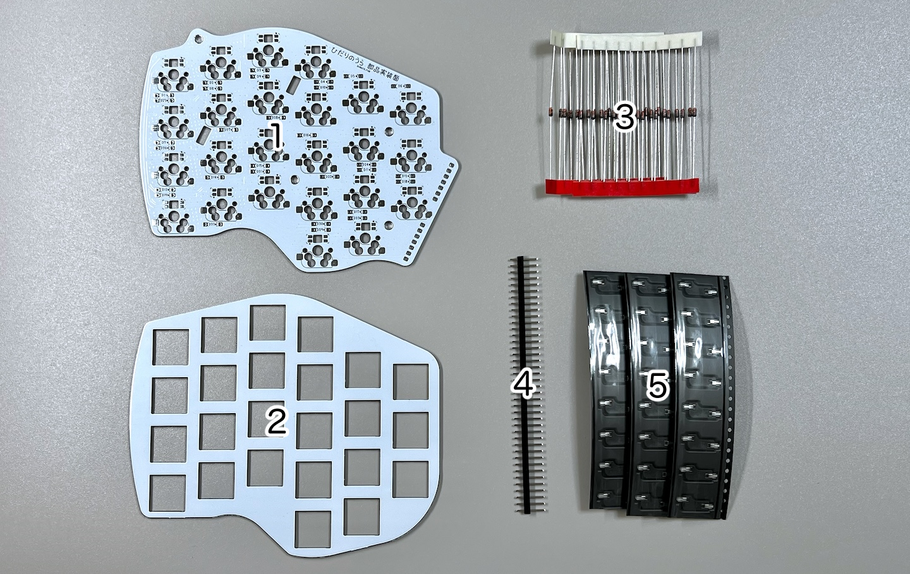    
||部品名|数||
|-|-|-|-|
|1|メインボード|1|FR4|
|2|スイッチプレート|1|FR4|
|3|ダイオード|30||
|4|ピンヘッダ|1||
|5|MXスイッチソケット|24||

## はんだ付け
天面ユニットは全ての部品を裏に実装します。  
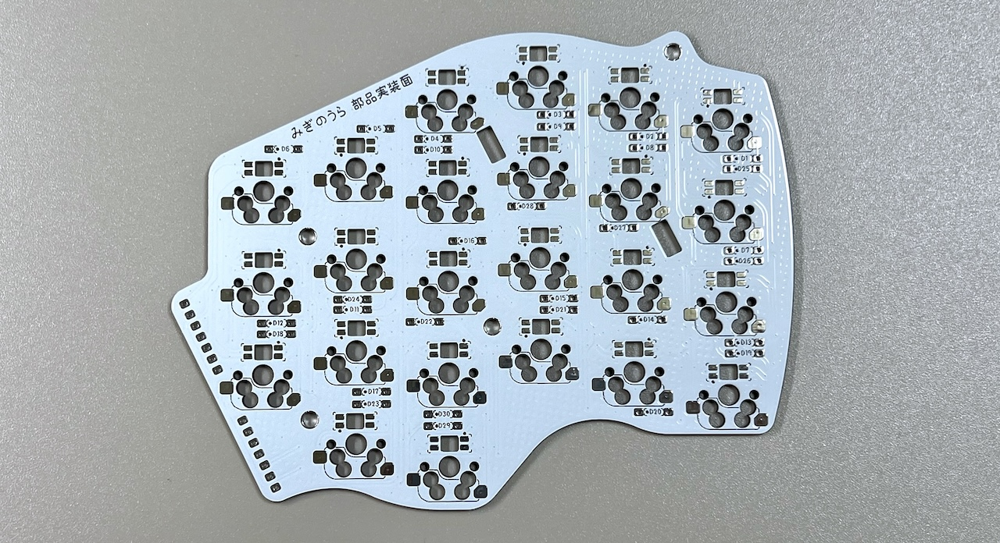  

### （オプション）LEDのはんだ付け 
すべて発光面が向こう向きになります。  
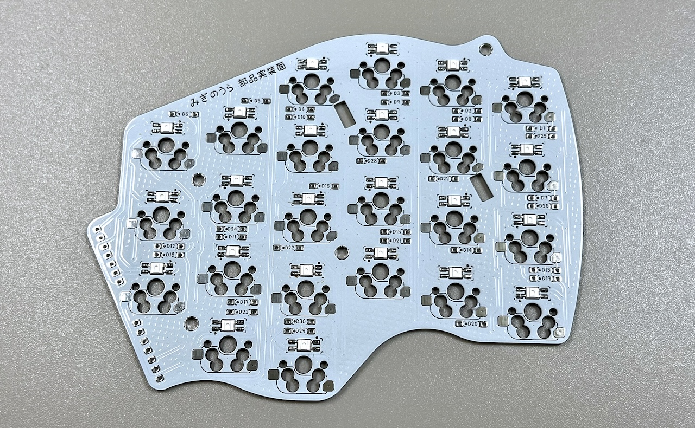  

### ダイオードのはんだ付け
D1からD30までダイオードを裏から差し、表ではんだ付けして足を切ります。  
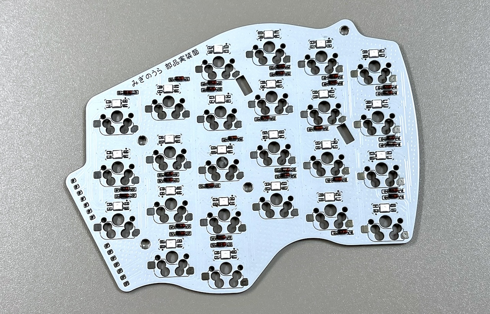 
### MXスイッチソケットのはんだ付け
ピンセットで押し付けながらハンダごてに乗せたはんだを流し込みます。  
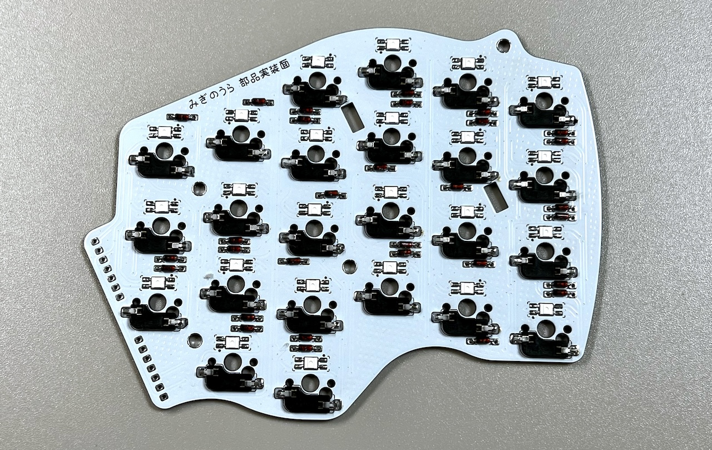 

### ピンヘッダーのはんだ付け
40ピンヘッダーから7ピンを2本切り出し、裏面に立ててはんだ付けします。長い方を差し込んでください。   
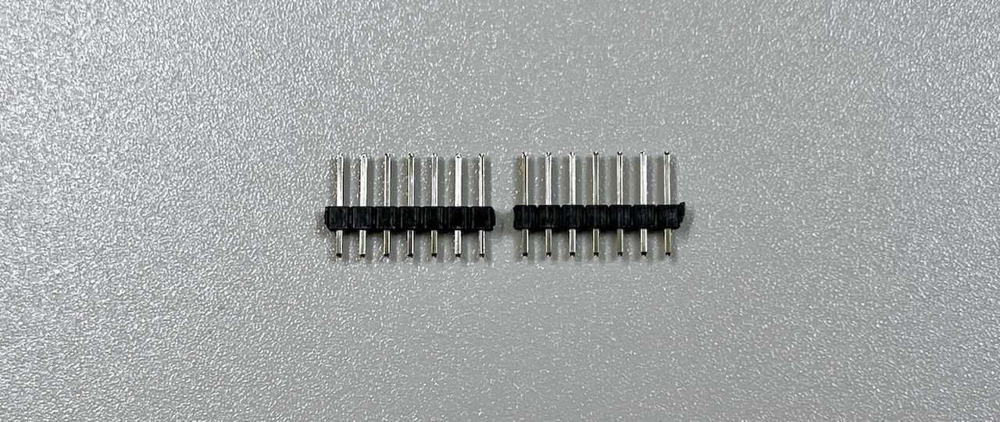   
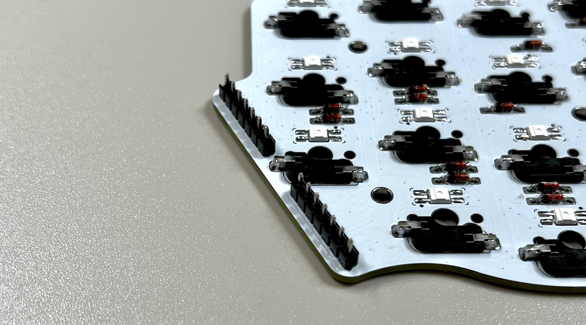 

### 仮組みとソケットのはんだ付け
初めて天面ユニットを作る場合、ベースユニットで余ったピンソケットから7ピンを2つ切り出して天面ユニットのピンソケットに差し込みます。  
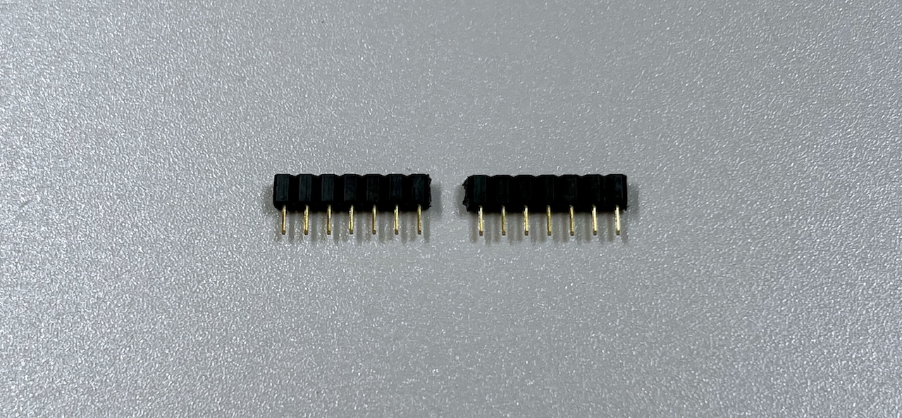   
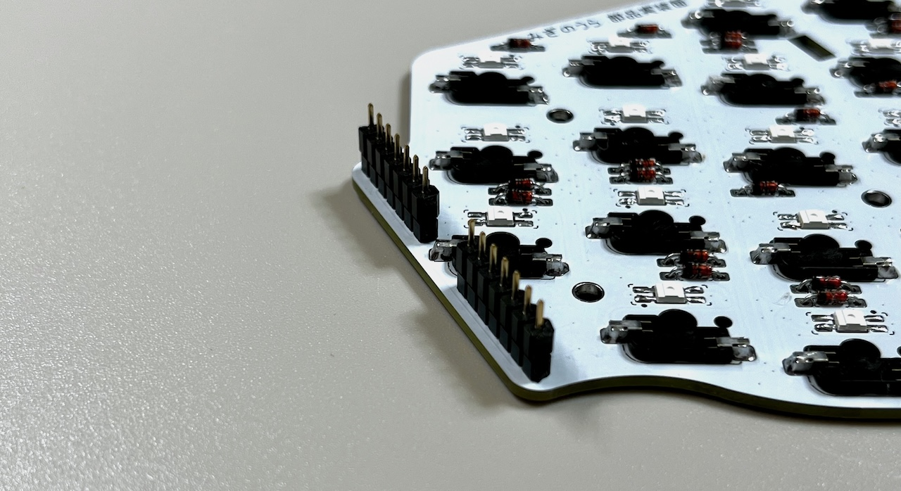 
支柱に天面ユニットを差し込み、M3ネジで止めます。

> [!NOTE]
> ベースユニットの横長のスルーホールにピンソケットの足が入るようにします。

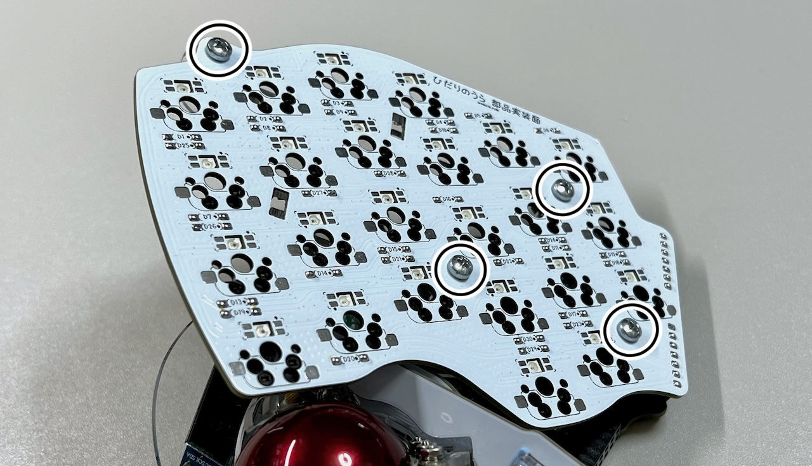 
ベースユニットの裏面でピンソケットをはんだ付けします。
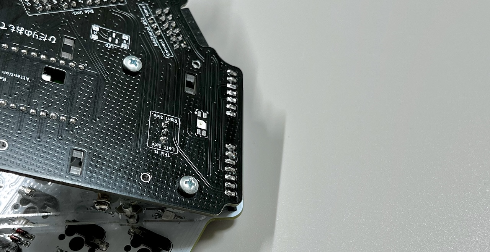 
スイッチを取り付けたらUSBを繋いで動作確認をします。
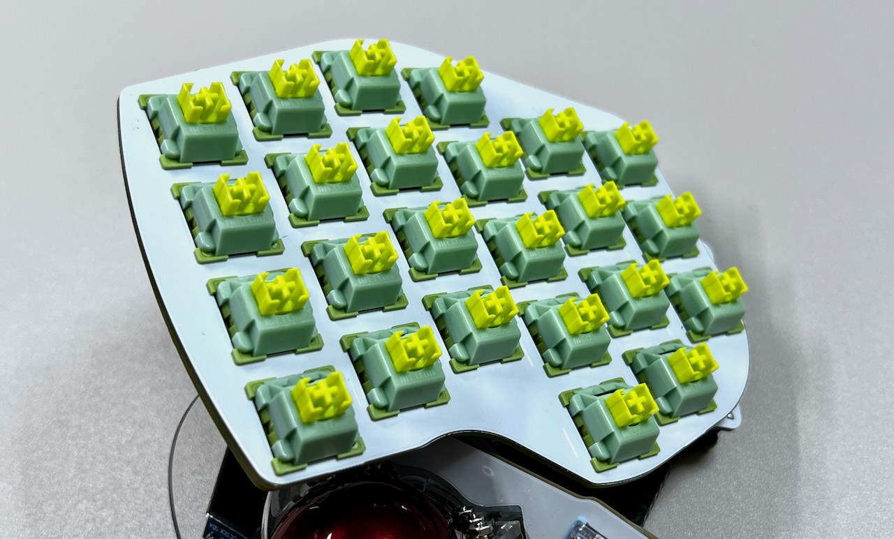  

追加ユニットは必須ではありません。取り付ける場合は追加ユニットの説明に、取り付けない場合は全体の組立てに進んでください。  

5. [追加ユニットの組み立て](../右手用/5_追加ユニット.md)
6. [全体の組み立て](../右手用/6_全体の組み立て.md)
