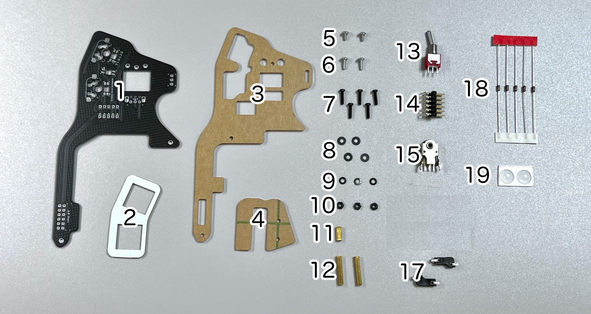
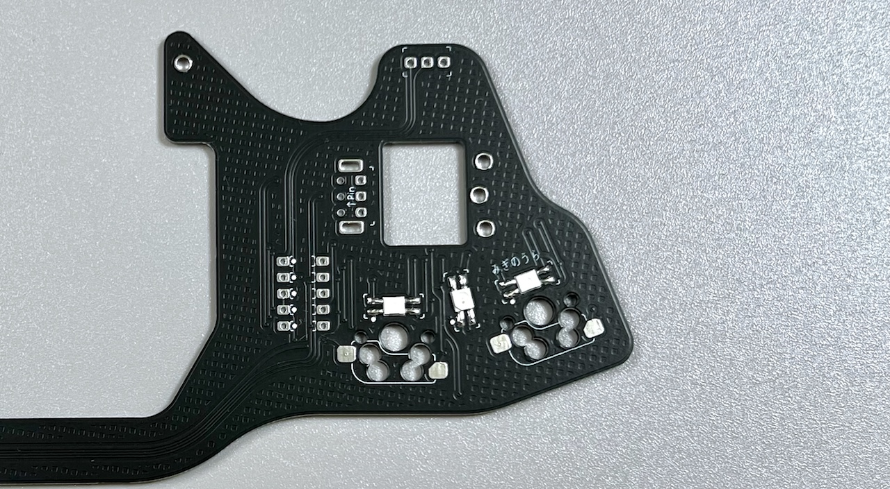
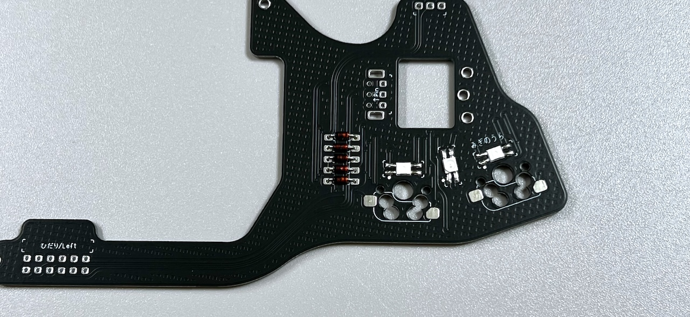
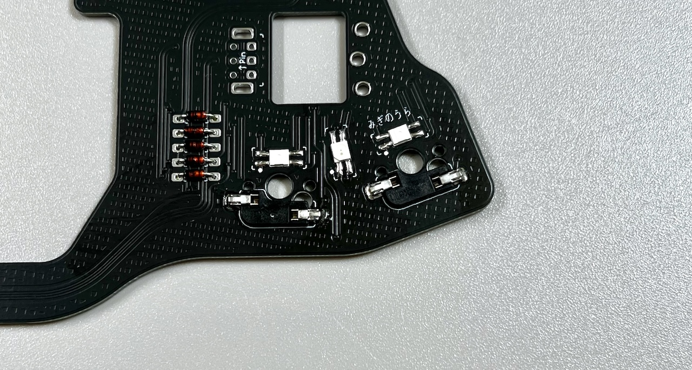
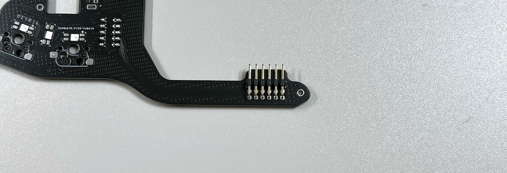
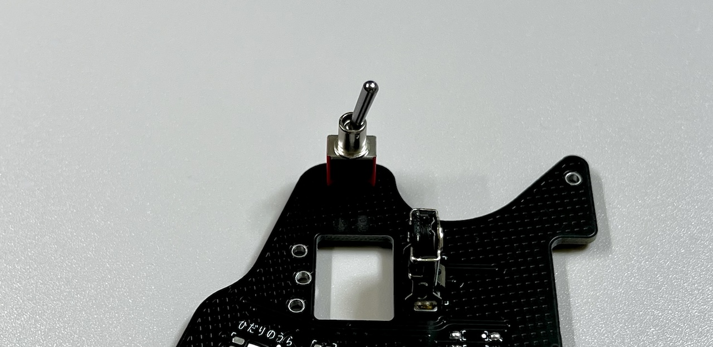
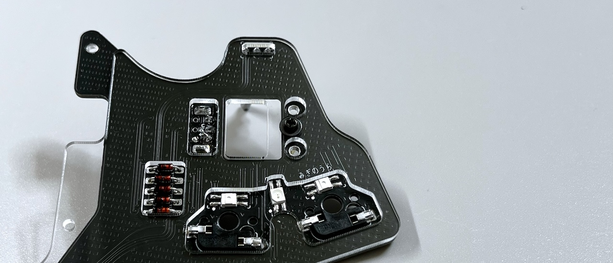

# Killer Whale 追加ユニット 右手用ビルドガイド （[左手用](../左手用/5_追加ユニット.md)）

1. [スタートページ](../README.md)
2. [ベースユニットの組み立て](../右手用/2_ベースユニット.md)
3. [側面ユニットの組み立て](../右手用/3_側面ユニット_トラックボール.md)
4. [天面ユニットの組み立て](../右手用/4_天面ユニット.md)
5. 追加ユニットの組み立て（右手用）（このページ）
6. [全体の組み立て](../右手用/6_全体の組み立て.md)
7. [カスタマイズ](../右手用/7_カスタマイズ.md)
8. [その他](../右手用/8_その他.md)

## 内容品
    
||部品名|数||
|-|-|-|-|
|1|メインボード|1|FR4|
|2|スイッチプレート|1|FR4|
|3|ボトムプレート|1|アクリル|
|4|保護プレート|1|アクリル|
|5|M2ネジ（短）|2|4mm|
|6|M2ネジ（中）|2|6mm|
|7|M2ネジ（長）|5|8mm|
|8|M2ワッシャー（黒）|4|
|9|M2スプリングワッシャー（黒）|3|
|10|M2ナット（黒）|3|
|11|M2スペーサー（短）|1|8mm|
|12|M2スペーサー（長）|2|16mm|
|13|トグルスイッチ|1||
|14|L字ピンヘッダ|1||
|15|ホイールエンコーダー|1||
|16|ホイール|1||
|17|MXスイッチソケット|2||
|18|ダイオード|5||
|19|ゴム足|2||

## はんだ付け
追加ユニットは表裏両方に部品をはんだ付けします。  
   

### （オプション）LEDのはんだ付け（裏側）
追加ユニットには3箇所、すべて裏側にはんだ付けします。  
   
2個は丸い発光面がが向こう向き、間の一つはこちら向きになります。  

### ダイオードのはんだ付け（裏側）
裏面から差し、表ではんだ付けして足を切ります。 
   

### MXスイッチソケットのはんだ付け（裏側）
ピンセットで押し付けながらハンダごてに乗せたはんだを流し込みます。 
   

### L字ピンヘッダのはんだ付け（表側）
表面から差し、裏側をはんだ付けします。   

> [!WARNING]
> ここまでのはんだ付けと裏表が変わっています。

   

### ホイールエンコーダーのはんだ付け（表側）
ショートを防ぐためエンコーダーの裾のプレートを少し広げます。  
  
基板の印刷とピンの方向を合わせて裏面ではんだ付けします。
   

### トグルスイッチのはんだ付け
表から差して裏ではんだ付けします。 

    
  
追加ユニットのはんだ付けは以上です。  

## 組み立て
### アクリルプレートの取り付け
M2ネジ（長）1本にワッシャー（黒）を通します。  
   

追加ユニットの裏にボトムプレートをあててM2スペーサー（短）をM2ネジ（長）で止めます。
  
   
  
その左右にM2ネジ（短）でM2スペーサー（長）を止めます。  
 
ホイールをホイールエンコーダーに差し込み、保護プレートを載せてM2ネジ（中）で固定します。  

 
キースイッチをスイッチプレートに取り付けて、追加ユニットのMXスイッチソケットに差し込みます。  
 

全体の組立てに進みます。

6. [全体の組み立て](../右手用/6_全体の組み立て.md)
