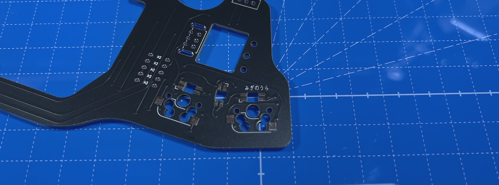
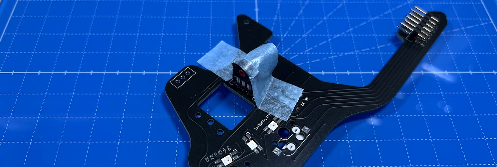
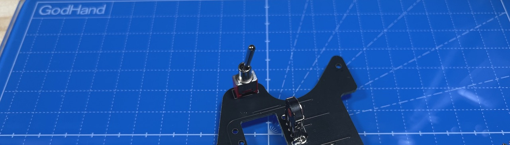
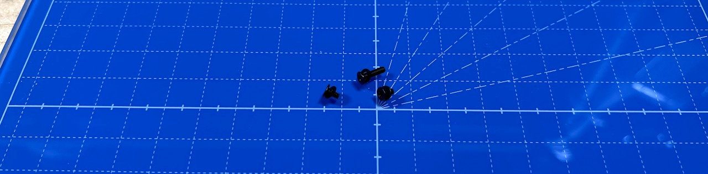
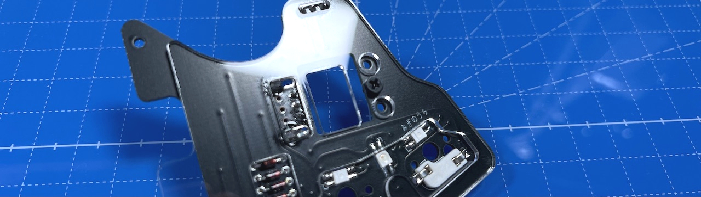
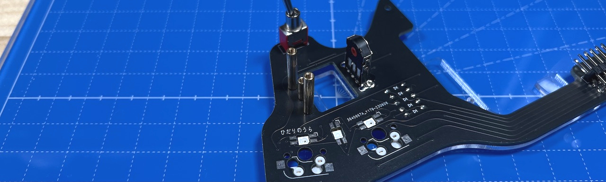
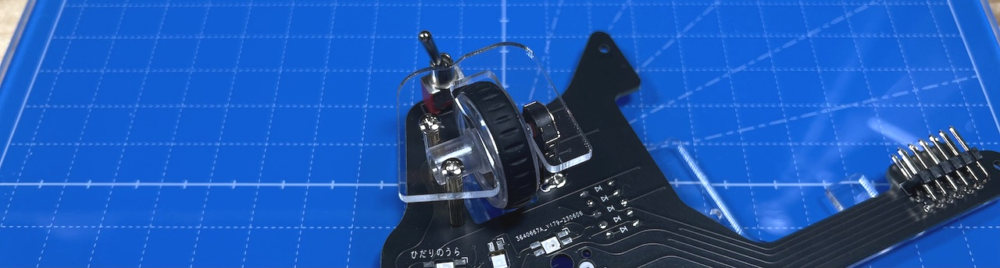
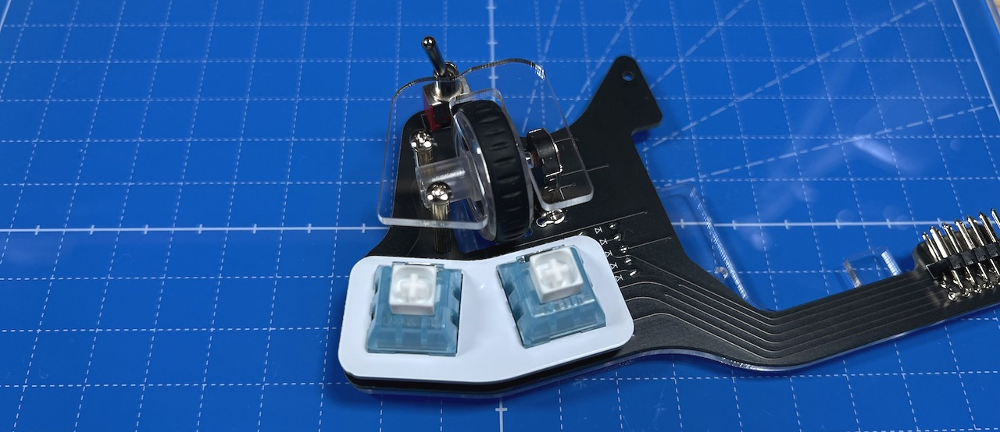

# Killer Whale 追加ユニット 右手用ビルドガイド （[左手用](../左手用/5_追加ユニット.md)）

1. [スタートページ](../README.md)
2. [ベースユニットの組み立て](../右手用/2_ベースユニット.md)
3. [側面ユニットの組み立て](../右手用/3_側面ユニット_トラックボール.md)
4. [天面ユニットの組み立て](../右手用/4_天面ユニット.md)
5. 追加ユニットの組み立て（右手用）（このページ）
6. [全体の組み立て](../右手用/6_全体の組み立て.md)
7. [カスタマイズ](../右手用/7_カスタマイズ.md)
8. [その他](../右手用/8_その他.md)

## 内容品
    
||部品名|数||
|-|-|-|-|
|1|メインボード|1|FR4|
|2|スイッチプレート|1|FR4|
|3|ボトムプレート|1|アクリル|
|4|保護プレート|1|アクリル|
|5|M2バインドネジ|2|6mm|
|6|M2スペーサー（短）|1|8mm|
|7|M2スペーサー（長）|2|16mm|
|8|M2ネジ（黒）（短）|2|4mm|
|9|M2ネジ（黒）（長）|5|8mm|
|10|M2ワッシャー（黒）|6|
|11|M2スプリングワッシャー（黒）|3|
|12|M2ナット（黒）|3|
|13|ダイオード|5||
|14|L字ピンヘッダ|1||
|15|ホイールエンコーダー|1||
|16|ホイール|1||
|17|トグルスイッチ|1||
|18|MXスイッチソケット|2||
|19|ゴム足|2||

## はんだ付け
追加ユニットは表裏両方に部品を実装するので気をつけてください。  
  

### （オプション）LEDのはんだ付け（裏側）
追加ユニットには3箇所、すべて裏側にはんだ付けします。
  
2個は丸い発光面がが向こう向き、間の一つはこちら向きになります。  

### ダイオードのはんだ付け（裏側）
裏面から差し、表ではんだ付けして足を切ります。  
  

### MXスイッチソケットのはんだ付け（裏側）
ピンセットで押し付けながらハンダごてに乗せたはんだを流し込みます。  
  
両側をはんだしてずれなくなったらピンセットからはんだに持ち替えて追加で流し込みしましょう。  表面積が広く多めのはんだが必要です。  

### L字ピンヘッダのはんだ付け（表側）
マスキングテープで固定して裏側をはんだ付けします。  
  

### ホイールエンコーダーのはんだ付け（表側）
エンコーダーの裾のプレートを少し広げます（ショートを防ぐため）。  
  
基板の四角マークに合わせてホイールを差し込みマスキングテープで垂直に固定したら、裏面をはんだ付けします。  
  
左手用と右手用でエンコーダーの向きが違うので気をつけてください。  
### トグルスイッチのはんだ付け
表から差して裏ではんだ付けします。

  
  
追加ユニットのはんだ付けは以上です。  

## 組み立て
### アクリルプレートの取り付け
M2ネジ（黒）（短）2個とM2ネジ（黒）（長）1本にワッシャー（黒）を通します。  
  

追加ユニットの裏にボトムプレートをあててM2ネジ（黒）（長）をホイールエンコーダーの反対側のネジ穴に通します。  
  
表はM2スペーサー（短）で止めます。  
  
その左右にM2ネジ（黒）（短）でM2スペーサー（長）を止めます。  
  
ホイールをホイールエンコーダーに差し込み、保護プレートを載せてM2バインドネジで固定します。  
  
キースイッチをスイッチプレートに取り付けて、追加ユニットのMXスイッチソケットに差し込みます。  
  

全体の組立てに進んでください。
1. [全体の組み立て](../右手用/6_全体の組み立て.md)
