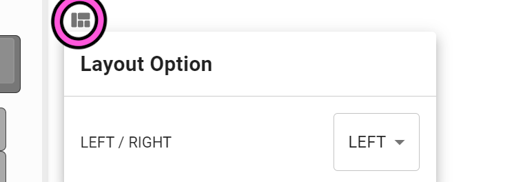

# Killer Whale カスタマイズ 右手用ビルドガイド （[左手用](../左手用/7_カスタマイズ.md)）

1. [スタートページ](../README.md)
2. [ベースユニットの組み立て](../右手用/2_ベースユニット.md)
3. [側面ユニットの組み立て](../右手用/3_側面ユニット_トラックボール.md)
4. [天面ユニットの組み立て](../右手用/4_天面ユニット.md)
5. [追加ユニットの組み立て](../右手用/5_追加ユニット.md)
6. [全体の組み立て](../右手用/6_全体の組み立て.md)
7. カスタマイズ（このページ）
8. [その他](../右手用/8_その他.md)

## 2台を接続する
左手用、右手用をTRSケーブルかTRRSケーブルで繋げると左右分割キーボードとして使用できます。  
こちらのファームウェアをダウンロードして更新してください。

- 左右分割 左手ボール [tarohayashi_killerwhale_duo_ballleft.uf2
](https://github.com/Taro-Hayashi/KillerWhale/releases/download/0.21.3/tarohayashi_killerwhale_duo_ballleft.uf2)
- 左右分割 右手ボール [tarohayashi_killerwhale_duo_ballright.uf2
](https://github.com/Taro-Hayashi/KillerWhale/releases/download/0.21.3/tarohayashi_killerwhale_duo_ballright.uf2)
- 左右分割 両手ボール [tarohayashi_killerwhale_duo_default.uf2
](https://github.com/Taro-Hayashi/KillerWhale/releases/download/0.21.3/tarohayashi_killerwhale_duo_default.uf2)

最初にやったのと同様にBOOTボタンを押してもいいですが、USB端子に一番近いキー（5、6のキー）を押しながらUSBケーブルを接続し、2秒ほど待ってキーから指を離すことでもRPI-RP2フォルダを出すことができます。  
またはUSBを接続した状態でB（N）を押しながら5（6）のキーを押しても大丈夫です。

両手ともファームウェアを更新したらUSBケーブルを外してTRRS（TRS）ケーブルで左右を繋いでください。
#### ※左右間のケーブルを着け外しする前には毎回USBケーブルを抜いてください
  
差し込み口は2つありますが、どちらを使用しても大丈夫です。  

<<<<<<< HEAD
## LEDの設定を変える
角のキーを長押すると発光の設定が出来ます。
  
=======
## 標準のキーマップとレイヤー機能

## トラックボールの方向、速度を変える
>>>>>>> 3bc44a48670a209db8373e1b006400bc6f7ce2de

##　トラックボールの方向、速度を変える
角から2番目のキーを長押しするとトラックボールの設定を変更できます。
  
## キーマップのカスタマイズ
ジョイスティクやホイールを含めて全てのキーは、VIAというWebサイト（もしくはアプリケーション）で好きなものに変更することができます。

こちらのJSONファイルをダウンロードしてください。

- 単体使用向け [killer_whale_solo.json
](https://github.com/Taro-Hayashi/KillerWhale/releases/download/0.21.3/killer_whale_solo.json)
- 左右分割向け [killer_whale_duo.json
](https://github.com/Taro-Hayashi/KillerWhale/releases/download/0.21.3/killer_whale_duo.json)

Google Chrome（Microsoft Edge）を利用して下記webサイトにアクセスするか、VIAのアプリケーションをダウンロードして起動してください。  
- [Web版VIA（Google Chromeでアクセスしてください）](https://usevia.app/#/design)
- [アプリ版VIA](https://github.com/the-via/releases/releases)

DESIGNタブのLoadでダウンロードしたJSONファイルを読み込ませるとキーの変更が出来るようになります（アプリ版ではまずShow Design tabをオンにしてください）。  
  
CONFIGUREタブのAuthorize device+からKiller Whale SOLO\DUOを追加してください。  
### 左右の変更（単体使用時）
LAYOUTSから見た目の左右を変更することができます。  
  

### 通常のキーの割り当て
入れ替えたいキーを上から選んで、下のキーコード一覧をクリックすると設定できます。  
  
### ホイールのキーの割り当て
丸いキーを選ぶとホイールに割り当てるキーを設定できます。
  
QMK Firmwareのキーコードを入力してください。こちらに一覧があります。
-  https://github.com/qmk/qmk_firmware/blob/master/docs/keycodes.md

### 特殊なキーの割り当て
#### Mod-Tap
長押しでMODキー（Shift、Ctrlなど）、
#### Tap-Hold

#### トラックボールの方向、速度を変更するキー
LEDやトラックボールの設定変更は直接キーコードを入力して設定します。
|機能|キーコード|
|-|-|
|速度UP|CUSTOM(65)|
|速度DOWN|CUSTOM(66)|
|角度+（左手）|CUSTOM(67)|
|角度-（左手）|CUSTOM(68)|
|X軸の反転（左手）|CUSTOM(69)|
|角度+（右手）|CUSTOM(70)|
|角度-（右手）|CUSTOM(71)|
|X軸の反転（右手）|CUSTOM(72)|
|スクロールとカーソルの切り替え（左手）|CUSTOM(73)|
|スクロールとカーソルの切り替え（右手）|CUSTOM(74)|
|スクロールの反転|CUSTOM(75)|
|スクロールモード|CUSTOM(76)|
|オートマウスの切り替え|CUSTOM(77)|

これらはSPECIALタブのANYキーで設定することができます。
  

### 保存と復元

1. [その他](../右手用/8_その他.md)
