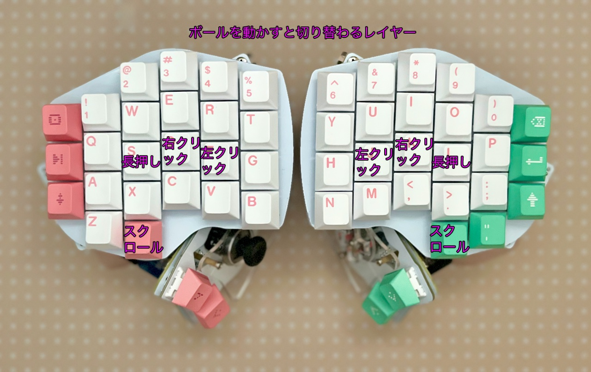

# Killer Whale カスタマイズ 右手用ビルドガイド （[左手用](../左手用/7_カスタマイズ.md)）

1. [スタートページ](../README.md)
2. [ベースユニットの組み立て](../右手用/2_ベースユニット.md)
3. [側面ユニットの組み立て](../右手用/3_側面ユニット_トラックボール.md)
4. [天面ユニットの組み立て](../右手用/4_天面ユニット.md)
5. [追加ユニットの組み立て](../右手用/5_追加ユニット.md)
6. [全体の組み立て](../右手用/6_全体の組み立て.md)
7. カスタマイズ（このページ）
8. [その他](../右手用/8_その他.md)
## 左右を切り替える（単体使用時）
標準では左手用のQWERTYの配列になっていて、右手用で作るとキーマップがずれています。
側面ユニットに一番近いキー（B、N）を押しながらピンヘッダに一番近いキー（Ctrl、Shift）を押すと右手用のYUIOPの配列に切り替えることができます。
  
- 画像のBOOTでRPI-RP2フォルダが出てファームウェアの更新をすることができます
- 画像のOLED切替で詳細表示/簡易表示の切り替えができます。
- 追加ユニットのトグルスイッチでも左右を切り替えられるようになっています。
  
## 2台を接続する

左手用、右手用をTRSケーブルかTRRSケーブルで繋げると左右分割キーボードとして使用できます。  
こちらのファームウェアをダウンロードしてください。 
  
※左右間のケーブルを着け外しする前には毎回USBケーブルを抜いてください
※USBを繋がない側のボールはカーソルが少し遅くなります  
※トラックボールを使わない場合はどのファームウェアでも使えます。  
  
- 左右分割 左手ボール [tarohayashi_killerwhale_duo_ballleft.uf2
](https://github.com/Taro-Hayashi/KillerWhale/releases/download/0.21.4.1/tarohayashi_killerwhale_duo_ballleft.uf2)
- 左右分割 右手ボール [tarohayashi_killerwhale_duo_ballright.uf2
](https://github.com/Taro-Hayashi/KillerWhale/releases/download/0.21.4.1/tarohayashi_killerwhale_duo_ballright.uf2)
- 左右分割 両手ボール [tarohayashi_killerwhale_duo_default.uf2
](https://github.com/Taro-Hayashi/KillerWhale/releases/download/0.21.4.1/tarohayashi_killerwhale_duo_default.uf2)

両手ともファームウェアを更新したらUSBケーブルを外してTRRS（TRS）ケーブルで左右を繋いでください。
  
差し込み口は2つありますが、どの組み合わせで使用しても大丈夫です。  

## マウスのボタンとオートマウスについて
トラックボールの側面ユニットを使った場合、ボールを動かした直後はF（J）キーがマウスのクリックになり、D（K）キーが右クリックになります（オートマウス機能）。
マウスを動かさなくてもS（L）キーを長押ししている間はFとDがクリック、右クリックに入れ替わります。
  

- 側面ユニットに一番近いキーを長押ししている間はボールを動かしてスクロールすることができます。 
- 追加ユニットのキーにもクリックが割り当てられています。ホイールはスクロールです。

オートマウス機能は以下でオンオフできます。
## トラックボールの方向、速度を変える
角から2番目のキー（4、7）を長押しするとトラックボールの設定を変更できます。
  
- 角度の変更とX軸の反転を組み合わせて好みの角度に設定してください。
- モード変更で、ボールをスクロールに使うかカーソルに使うかを持続的に変更することができます。
- 両手ボールの時は左右で別々の設定が保存されます。

## LEDの設定を変える
角のキー（5、6）を長押しすると発光の設定が出来ます。
  
## キーマップのカスタマイズ
ジョイスティクやホイールを含めて全てのキーは、VIAというWebサイト（もしくはアプリケーション）で好きなように変更することができます。使いやすいように変えて使ってください。

こちらのJSONファイルをダウンロードしてください。

- 単体使用向け [killer_whale_solo.json
](https://github.com/Taro-Hayashi/KillerWhale/releases/download/0.21.4.1/killer_whale_solo.json)
- 左右分割向け [killer_whale_duo.json
](https://github.com/Taro-Hayashi/KillerWhale/releases/download/0.21.4.1/killer_whale_duo.json)

Google Chrome（Microsoft Edge）を利用して下記webサイトにアクセスするか、VIAのアプリケーションをダウンロードして起動してください。  
- [Web版VIA（Google Chromeでアクセスしてください）](https://usevia.app/#/design)
- [アプリ版VIA](https://github.com/the-via/releases/releases)

DESIGNタブのLoadでダウンロードしたJSONファイルを読み込ませるとキーの変更が出来るようになります（アプリ版ではまずShow Design tabをオンにしてください）。  
  
JSONファイルは一度読み込むとブラウザに保存されるので次からは接続するだけで使うことができます。  
CONFIGUREタブのAuthorize device+からKiller Whale SOLO\DUOを追加してください。  

### 保存と復元
VIAで設定したキーマップは保存、復元することができます。ファームウェアを入れ替えると初期化されるので保存しておくと便利です。
  
単体使用時に反対側のキーマップを消したレイアウトを用意したのでカスタマイズ元に使ってください。
- 単体使用右手用キーマップ[solo_right.layout.json](https://github.com/Taro-Hayashi/KillerWhale/releases/download/0.21.4.1/solo_right.layout.json)

### 左右の変更（単体使用時）
LAYOUTSから見た目の左右を変更することができます。  
  

### 通常のキーの割り当て
入れ替えたいキーを上から選んで、下のキーコード一覧をクリックすると設定できます。  
  
### ホイールのキーの割り当て
丸いキーを選ぶとホイールに割り当てるキーを設定できます。
  
QMK Firmwareのキーコードを入力してください。こちらに一覧があります。
-  https://github.com/qmk/qmk_firmware/blob/master/docs/keycodes.md

### 特殊なキーの割り当て
SPECIALタブのANYキーに直接入力することでいろいろな機能を設定することができます。
  
ここで紹介しているのはほんの一部です。
#### 修飾キーの同時押し
修飾キー（Shift、Ctrlなど）と通常のキーの組み合わせを1キーに割り当てることができます。
|機能|キーコード|
|-|-|
|Ctrl|C(キーコード)|
|Shift|S(キーコード)|
|Win、Cmd|G(キーコード)|
|Alt、Opt|A(キーコード)|
|Ctrl+Shift|RCS(キーコード)|
|Win、Cmd+Shift|LSG(キーコード)|

例えばCtrl+Sのキーは
~~~
C(KC_S)
~~~
となります。

詳しくはこちらをご覧ください。
- https://github.com/qmk/qmk_firmware/blob/master/docs/mod_tap.md

#### Mod-Tap
長押しで修飾キー、短押しで通常のキーが打てるようなキーを設定できます。

|機能|キーコード|
|-|-|
|Ctrl|LCTL_T(キーコード)|
|Shift|LSFT_T(キーコード)|
|Win、Cmd|LGUI_T(キーコード)|
|Alt、Opt|LALT_T(キーコード)|
|Ctrl+Shift|RCS_T(キーコード)|
|Win、Cmd+Shift|LSG_T(キーコード)|

長押しでShift、短押しでZの場合は
~~~
LSFT_T(KC_Z)
~~~
です。

詳しくはこちらをご覧ください。
- https://github.com/qmk/qmk_firmware/blob/master/docs/mod_tap.md

#### レイヤーキー
レイヤーの切り替え方法は複数あります。
|機能|キーコード|
|-|-|
|押している間だけ切り替え|MO(レイヤー番号)|
|押すと切り替え、もう一度押すと戻る|TG(レイヤー番号)|
|長押しでレイヤー切り替え、短押しは通常キー|LT(レイヤー番号、キーコード)|

詳しくはこちらをご覧ください。
- https://github.com/qmk/qmk_firmware/blob/master/docs/feature_layers.md

#### トラックボールの方向、速度を変更するキー
|機能|キーコード|
|-|-|
|速度UP|CUSTOM(65)|
|速度DOWN|CUSTOM(66)|
|角度+（左手）|CUSTOM(67)|
|角度-（左手）|CUSTOM(68)|
|X軸の反転（左手）|CUSTOM(69)|
|角度+（右手）|CUSTOM(70)|
|角度-（右手）|CUSTOM(71)|
|X軸の反転（右手）|CUSTOM(72)|
|スクロールとカーソルの切り替え（左手）|CUSTOM(73)|
|スクロールとカーソルの切り替え（右手）|CUSTOM(74)|
|スクロールの反転|CUSTOM(75)|
|押下時だけスクロールモード|CUSTOM(76)|
|オートマウスの切り替え|CUSTOM(77)|
|OLED表示の切り替え|CUSTOM(78)|

最後のページはファームウェア、JSONファイル、トラブルシューティングの簡単なまとめです。

8. [その他](../右手用/8_その他.md)
