# Killer Whale トラックボール側面ユニット 左手用ビルドガイド （[右手用](../右手用/3_側面ユニット_トラックボール.md)）

1. [スタートページ](../README.md)
2. [ベースユニットの組み立て](../左手用/2_ベースユニット.md)
3. 側面ユニットの組み立て
   - トラックボール（左手用）（このページ）
   - [十字キー](../左手用/3_側面ユニット_十字キー.md)
   - [（別売）ホイール 縦/横](../左手用/3_側面ユニット_ホイール.md)
   - [（別売）ジョイスティック](../左手用/3_側面ユニット_ジョイスティック.md)
4.  [天面ユニットの組み立て](../左手用/4_天面ユニット.md)
5. [追加ユニットの組み立て](../左手用/5_追加ユニット.md)
6. [全体の組み立て](../左手用/6_全体の組み立て.md)
7. [カスタマイズ](../左手用/7_カスタマイズ.md)
8. [その他](../左手用/8_その他.md)

## 内容品
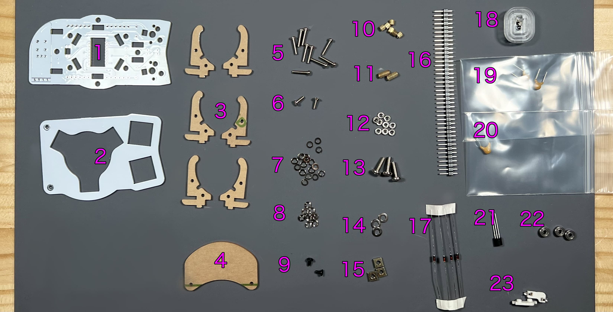    
||部品名|数||
|-|-|-|-|
|1|メインボード|1|FR4|
|2|スイッチプレート|1|FR4|
|3|ボールケース支柱|6|アクリル|
|4|保護プレート|1|アクリル|
|5|M2ネジ（長）|9|10mm|
|6|M2ネジ（短）|2|6mm|
|7|M2ワッシャー|18||
|8|M2スプリングワッシャー|9||
|9|M2ネジ（黒）|2|4mm|
|10|M2スペーサー（短）|6|3mm|
|11|M2スペーサー（長）|2|7mm|
|12|M2ナット|9|
|13|M3ネジ|3|10mm|
|14|M3ワッシャー|3||
|15|M3四角ナット|3||
|16|ピンヘッダ|1||
|17|ダイオード|4|1N4148|
|18|センサーとレンズ|1|PMW3360|
|19|コンデンサーC1,C2|2|10uF|
|20|コンデンサーC3|1|4.7uF|
|21|レギュレーター|1|UT7500L-18|
|22|ベアリング|3|2x5x2.5|
|23|MXスイッチソケット|2||

※ねじの見た目やソケットの色はビルドガイドと異なることがあります。

## はんだ付け
側面ユニットは表裏両方に部品を実装するので気をつけてください。  
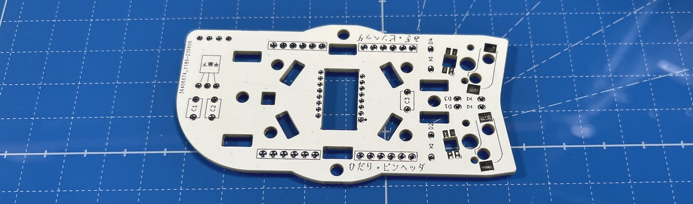  
左右の記載がある方が裏面です。  
### （オプション）LEDのはんだ付け
LEDは3個取り付けます。すべてはんだ付けする面から見て丸い発光面が向こう向きです。  
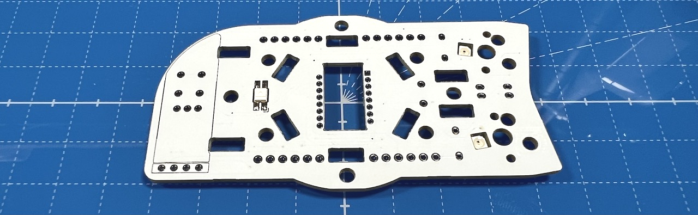  

### MXスイッチソケットのはんだ付け（裏面）
裏面にピンセットで押し付けながらハンダごてに乗せたはんだを流し込みます。  
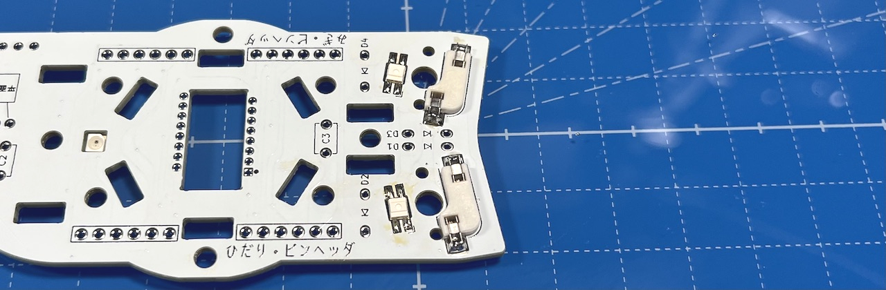  
両側をはんだしてずれなくなったらピンセットからはんだに持ち替えて追加で流し込みしましょう。表面積が広く多めのはんだが必要です。  

### ダイオードのはんだ付け（裏面）
ダイオードには向きがあります。 
 
4箇所に裏からダイオードを差し、マスキングテープで固定します。  
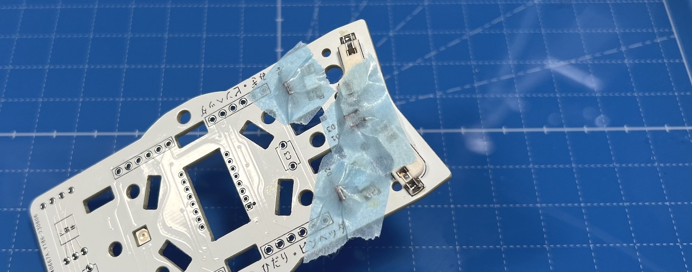  
表ではんだ付けして足を切ります。  
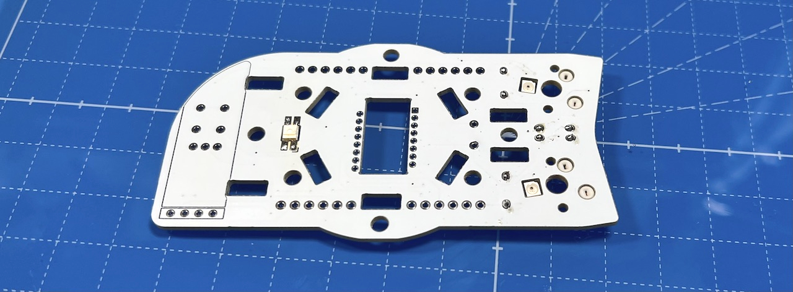  

### センサー類のはんだ付け（裏面）
念のためセンサーを保護しているテープはまだ剥がさないでください。  
裏面で基板の丸マークとチップの丸の位置を合わせてマスキングテープで固定して、表面ではんだ付けします。  
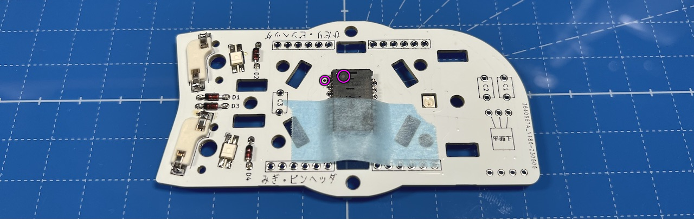  

レギュレーターの足を裏面から差し、基板の印刷どおり平面が下になるように折り曲げてはんだ付けします。  
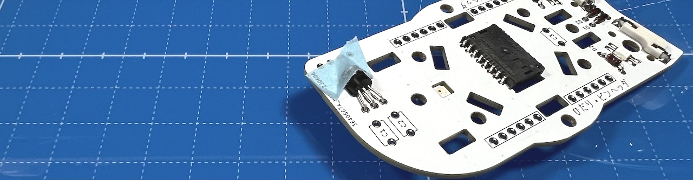  

コンデンサーをはんだ付けします。106と書いてあるのがC1,C2で475がC3です。  
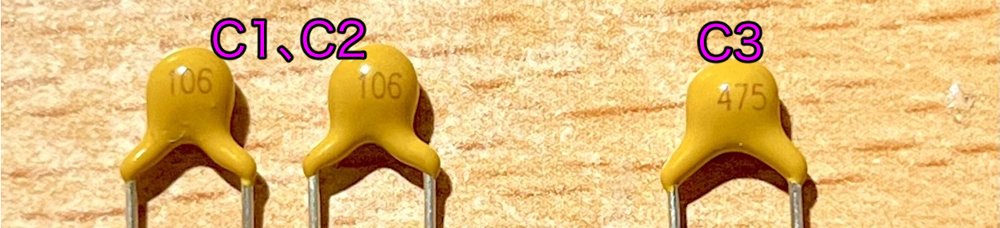  
  

### ピンヘッダーのはんだ付け（裏面）
40ピンヘッダーから6ピンを4本切り出し、裏面にピンヘッダーを立ててはんだ付けします。  
長い方を差し込んでください。反対にした場合は短い方と同程度まで切ってください。
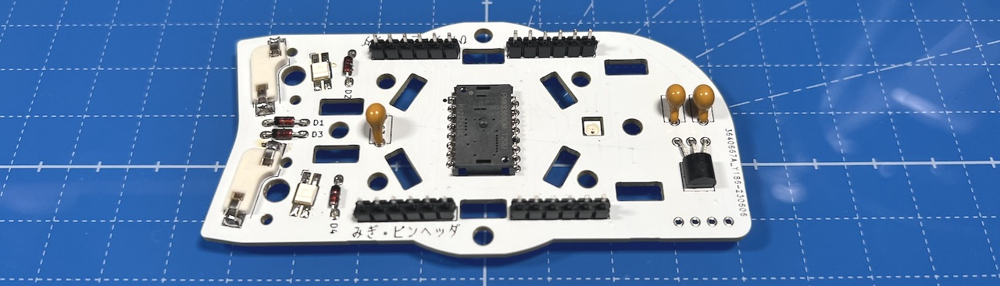  

### （オプション）OLEDモジュールのはんだ付け（表面）
表面にOLED用ソケットをはんだ付けします。  
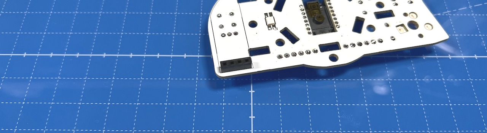  
付け外しを考えないのであれば、OLEDモジュールを直接はんだ付けしてしまうのも良いと思います。

OLEDモジュールにはOLED用ピンヘッダをはんだ付けします。  
  
まだ差し込まず別々に保管してください。  

## 仮組みとソケットのはんだ付け
側面ユニットには上下があります。右手用はOLED用ソケットが下側、左手用は上側です。  
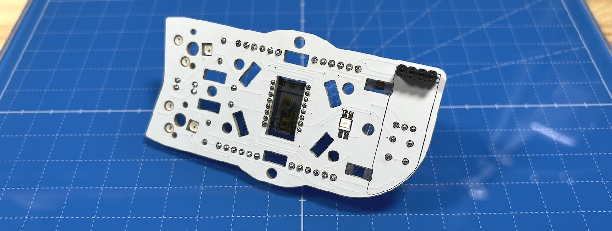  
### スイッチプレートの組み立て
スイッチプレートにM2スペーサー（長）をM2ネジ（黒）で取り付けます。  
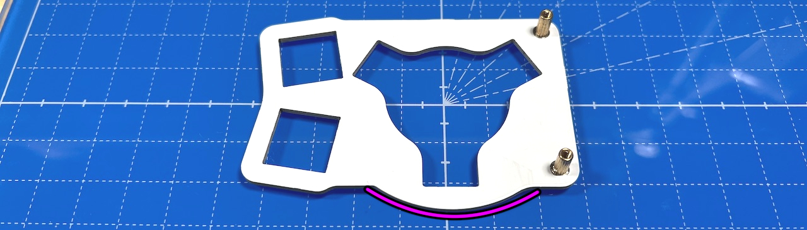  
スイッチプレートも上下があるので気をつけてください。  
  
スペーサーに保護プレートを、M2ネジ（短）で取り付けます。  
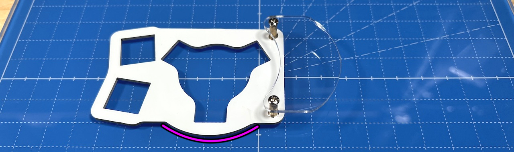  

### トラックボールケースの組み立て
M2ネジ（長）9本にワッシャーを通します。  
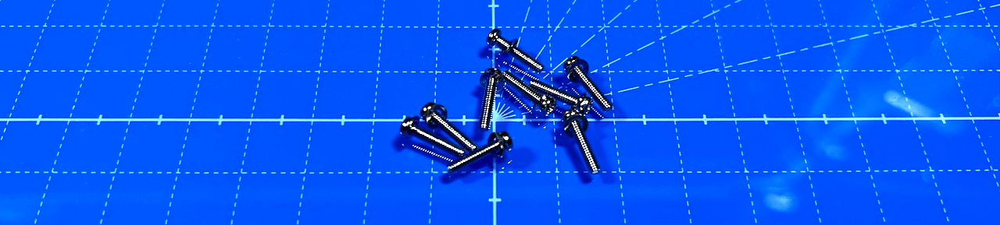  
ボールケース支柱3つのネジ穴2つにネジを通してM2スペーサーで止めます。  
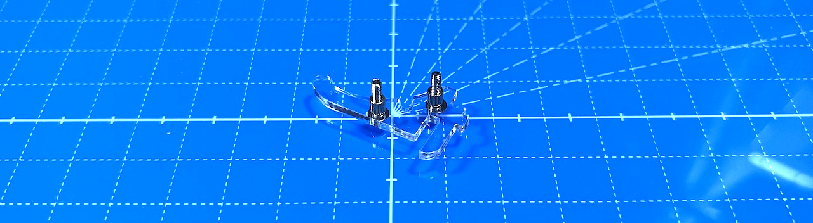  
反対側のボールケース支柱をワッシャー、スプリングワッシャー、ナットで止めます。  
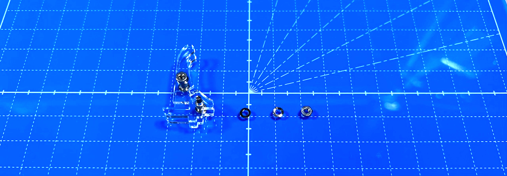  
余った3本のネジにはベアリングを通し、切れ込みに引っ掛けます。  
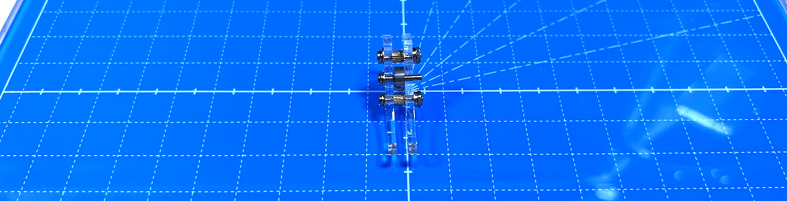  
ワッシャー、スプリングワッシャー、ナットで固定します。3つ作ってください。  
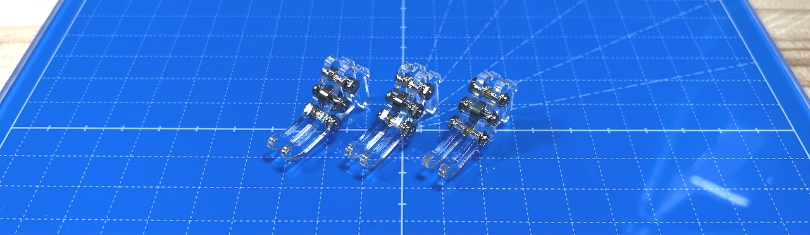  

### トラックボールケースの取り付け
M3ネジ3本にワッシャーを通します。  
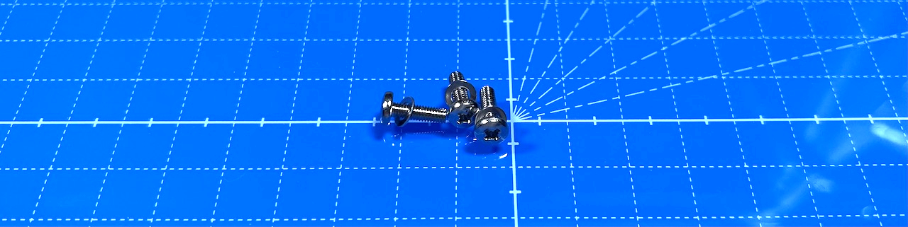  
センサーの保護フィルムをはがし、レンズを取り付けます。レンズには取り付け方向があるので無理に力をくわえないようにします。  
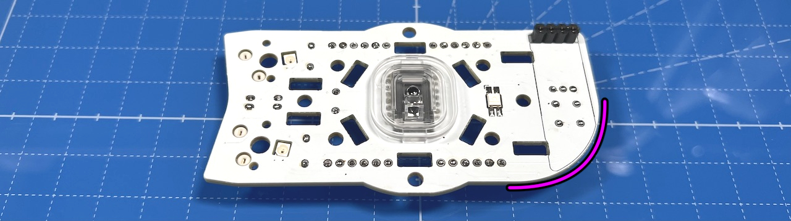  
ボールケース支柱を立て、スリットにM3角ナットを当てたら裏面からネジ止めします。  
メインボードの上下に気をつけてください。  
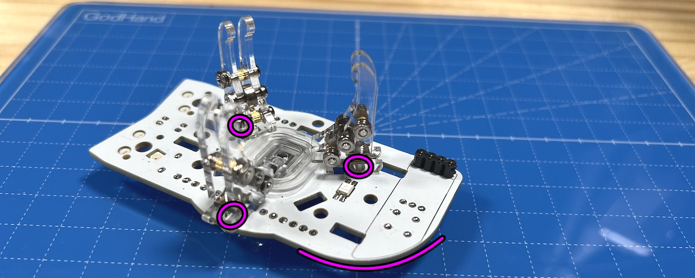  
下側は支柱が一本、上側に2本で正三角形を作るように立てます。

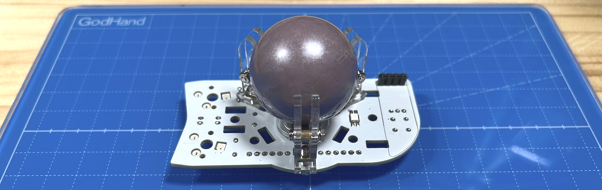  
3箇所を止めたらボールを入れて平らな場所に置き、スムーズに動くか確かめて問題がなければボールは外してください。  

### ベースユニットへの取り付け
初めて側面ユニットを作る場合、ベースユニットで余ったピンソケットから6ピンを2つ切り出して側面ユニットのピンソケットに差し込みます。  
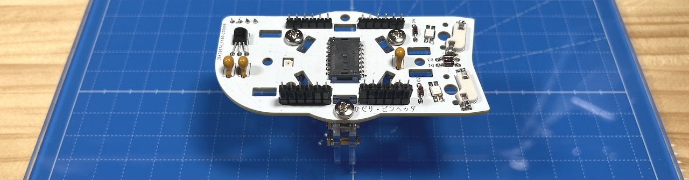  
ベースユニットのM3ネジ２本にワッシャーを通します。  
  
支柱に側面ユニットを差し込み、M3ネジで止めます。ベースユニットの縦長のスルーホールにピンソケットの足が入るようにしてください。  
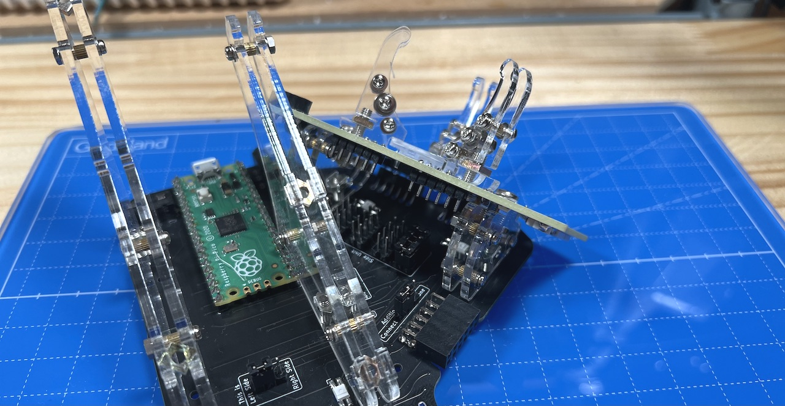  
ベースユニットの裏面でピンソケットをはんだ付けします。  
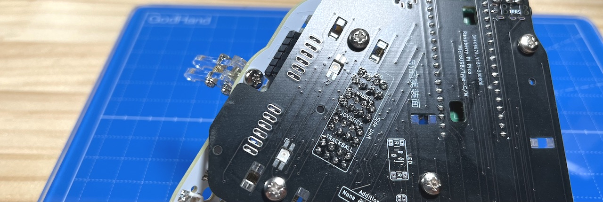  
多めにはんだを流して表面までしっかりはんだ付けされるようにしてください。  
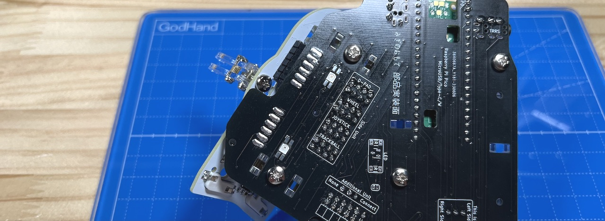  
これで側面ユニットのはんだ付けは終わりです。  

OLEDモジュールを使う場合はここでピンソケットに差し込みます。  
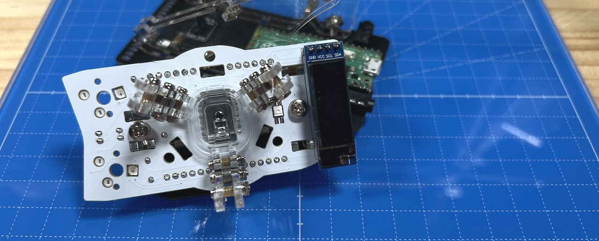 

スイッチプレートにキースイッチを取り付けてMXソケットに差し込みます。
 

USBケーブルを差し動作確認してみましょう。  LEDは天面ユニットを取り付けるまで光りません。  

同梱されているものと、別売のホイール付きの2種類があります。  
  
4. [天面ユニットの組み立て](../左手用/4_天面ユニット.md)
   - [（別売）ホイール付き天面ユニット](../左手用/4_ホイール付き天面ユニット.md)

