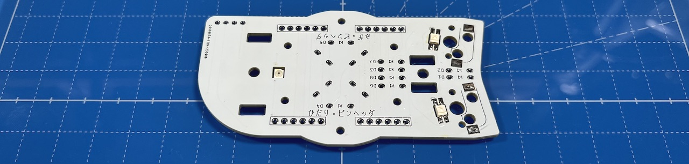
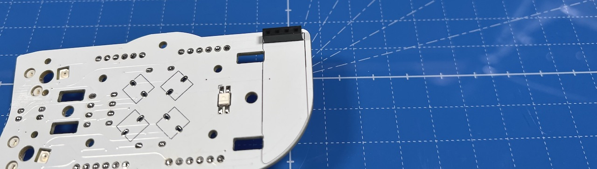
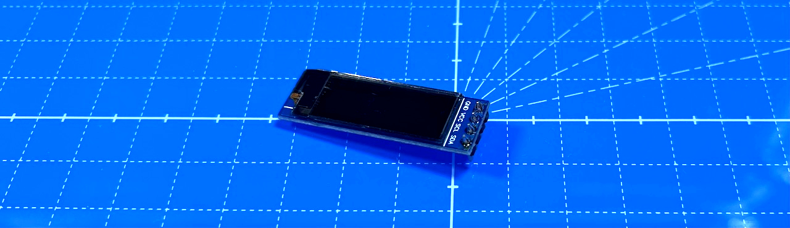
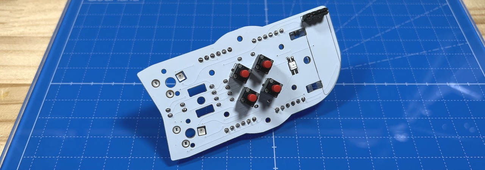
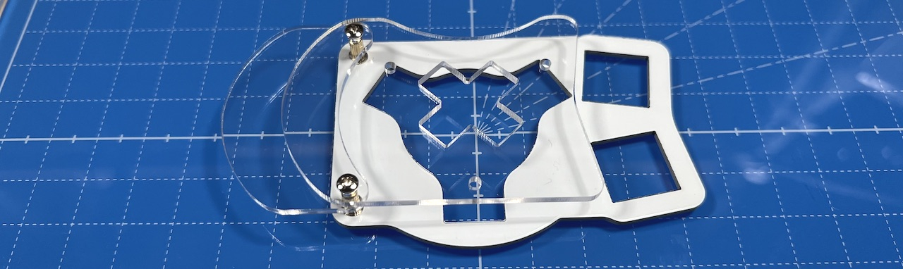
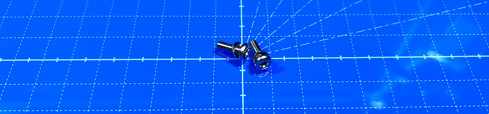
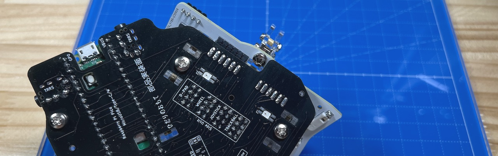
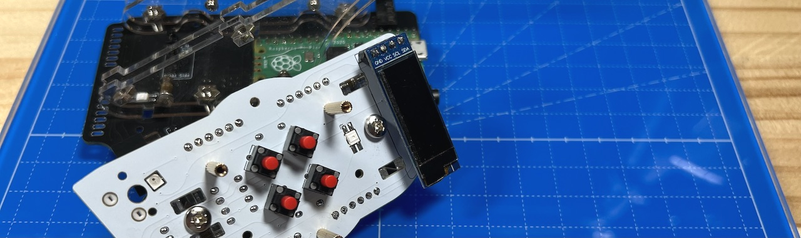
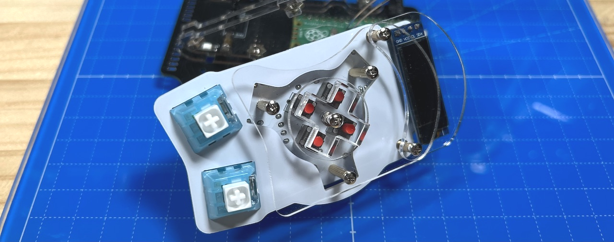

# Killer Whale 十字キー側面ユニット 左手用ビルドガイド （[右手用](../右手用/3_側面ユニット_十字キー.md)）

1. [スタートページ](../README.md)
2. [ベースユニットの組み立て](../左手用2_ベースユニット.md)
3. [追加ユニットの組み立て](../左手用/3_追加ユニット.md)
4. 側面ユニットの組み立て
   - [トラックボール](../左手用/4_側面ユニット_トラックボール.md)
   - 十字キー（左手用）（このページ）
   - [（別売予定）ホイール 縦/横](../左手用/4_側面ユニット_ホイール.md)
   - [（別売予定）ジョイスティック](../左手用/4_側面ユニット_ジョイスティック.md)
5. [追加ユニットの組み立て](../左手用/5_追加ユニット.md)
6. [全体の組み立て](../左手用/6_全体の組み立て.md)
7. [カスタマイズ](../左手用/7_カスタマイズ.md)
8. [その他](../左手用/8_その他.md)

## 内容品 
    
||部品名|数||
|-|-|-|-|
|1|メインボード|1|FR4|
|2|スイッチプレート|1|FR4|
|3|保護プレート|2|アクリル|
|4|十字キー用プレート|2|アクリル|
|5|M2バインドネジ（短）|5|6mm|
|6|M2ネジ（長）|1|10mm|
|7|M2ワッシャー|1||
|8|M2スプリングワッシャー|1||
|9|M2ナット|1||
|10|M2ネジ（黒）|5|4mm|
|11|M2スペーサー（短）|2|5mm|
|12|M2スペーサー（長）|3|12mm|
|13|ピンヘッダ|1||
|14|ダイオード|8|1N4148|
|15|Kailhミュートスイッチ|4|
|16|MXスイッチソケット|2||

メインボード、保護プレートには縦と横で違いがあります。  適宜読み替えてください。  
## はんだ付け
側面ユニットは表裏両方に部品を実装するので気をつけてください。  
  
左右の記載がある方が裏面です。 
### （オプション）LEDのはんだ付け
LEDは3個取り付けます。すべてはんだ付けする面から見て丸い発光面が向こう向きです。  
  

### MXスイッチソケットのはんだ付け（裏面）
裏面にピンセットで押し付けながらハンダごてに乗せたはんだを流し込みます。  
  
両側をはんだしてずれなくなったらピンセットからはんだに持ち替えて追加で流し込みしましょう。  表面積が広く多めのはんだが必要です。  
### ダイオードのはんだ付け（裏面）
ダイオードには向きがあります。線と基板のマークの方向を合わせてください。 
 
8箇所に裏からダイオードを差し、マスキングテープで固定します。  
  
表ではんだ付けして足を切ります。  
  

### ピンヘッダーのはんだ付け（裏面）
40ピンヘッダーから6ピンを4本切り出し、裏面にピンヘッダーを立ててはんだ付けします。
長い方を差し込んでください。反対にした場合は短い方と同程度まで切ってください。
  
### （オプション）OLEDモジュールのはんだ付け（表面）
表面にOLED用ソケットをはんだ付けします。  
  

OLEDモジュールにはOLED用ピンヘッダをはんだ付けします。  
  
まだ差し込まず別々に保管してください。  
### 十字キーのスイッチのはんだ付け（表面）
表面から差し込んで裏面ではんだ付けします。  
  

## 組み立て
側面ユニットには上下があります。  右手用はOLED用ソケットが下側、左手用は上側です。  
  
### スイッチプレートの組み立て
スイッチプレートにM2スペーサー（短2）をM2ねじ（黒）で取り付けます。  
  
スイッチプレートも上下があるので気をつけてください。  
  
スペーサーに保護プレート2種を、M2バインドねじで取り付けます。  
  
ホイール横版はメインボードのスペーサーと保護プレートのネジ穴の上下を合わせてください。  

### ベースユニットへの取り付け
側面ユニットにM2スペーサー（長）をM2ねじ（黒）で取り付けます。  
  
下側はスペーサーが一本、上側に2本で正三角形を作るように立てます。  
   
初めて側面ユニットを作る場合、ベースユニットで余ったピンソケットから6ピンを2つ切り出して側面ユニットのピンソケットに差し込みます。
  
ベースユニットのM3ねじ２本にワッシャーを通します。  
   
支柱に側面ユニットを差し込み、M3ねじで止めます。  ベースユニットの縦長のスルーホールにピンソケットの足が入るようにしてください。  
  
ベースユニットの裏面でピンソケットをはんだ付けします。  多めにはんだを流して表面までしっかりはんだ付けされるようにしてください。  

  
これで側面ユニットのはんだ付けは終わりです。  

OLEDモジュールを使う場合はここでピンソケットに差し込みます。  
  

十字キー用プレートをM2ねじ（長）とワッシャー、スプリングワッシャー、ナットで固定します。  
  

十字キーを挟み込むようにして、スイッチプレートにキースイッチを取り付けてMXソケットに差し込みます。  
  
保護プレートをM2バインドネジで固定したら完成です。  
 
USBケーブルを差し動作確認してみましょう。  LEDは天面ユニットを取り付けるまで光りません。  
問題がなくキーやホイールが反応したら天面ユニットの組み立てに進んでください。
  

同梱されているものと、別売のホイール付きの2種類があります。  
  
4. [天面ユニットの組み立て](../右手用/4_天面ユニット.md)
   - [（別売予定）ホイール付き天面ユニット](../右手用/4_ホイール付き天面ユニット.md)

