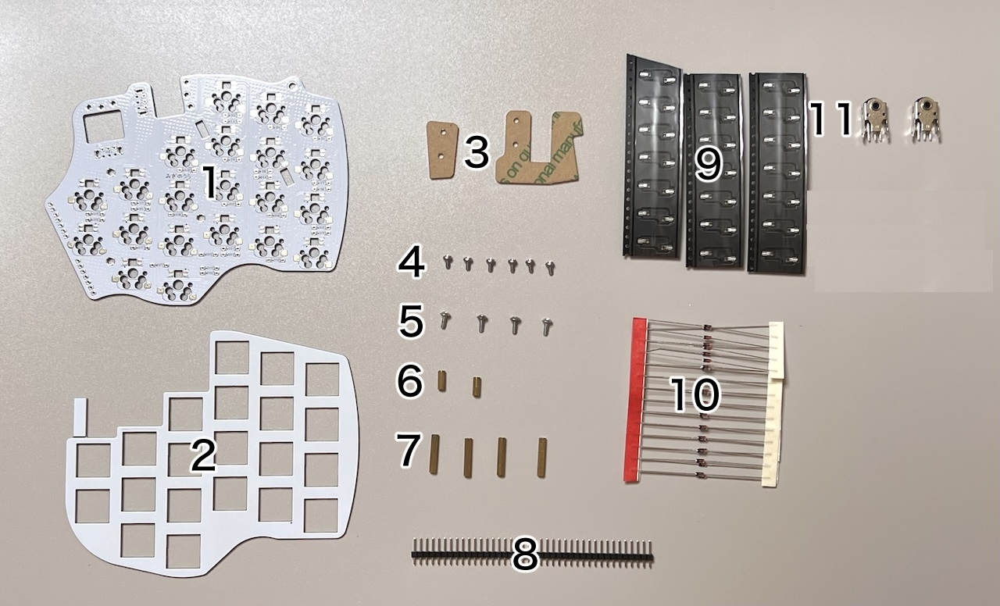
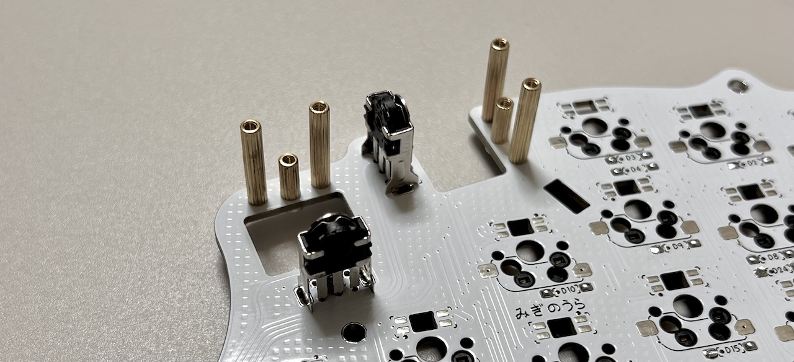
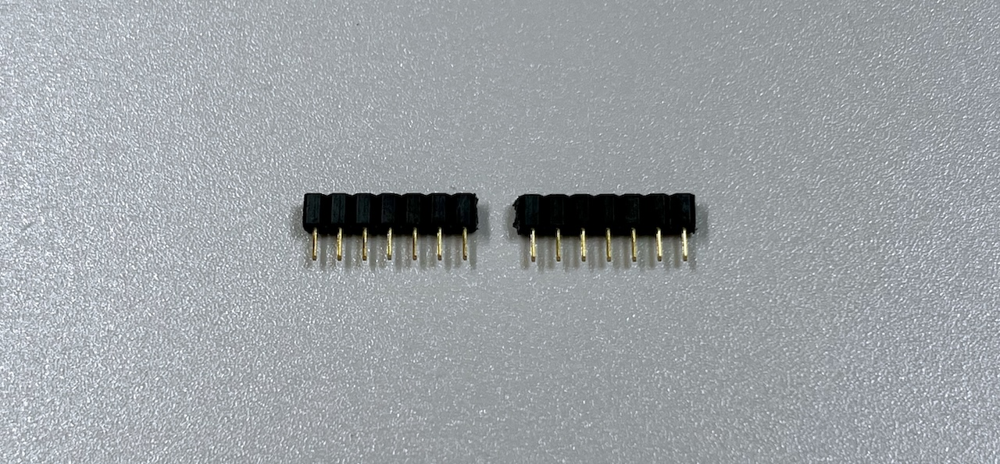

# Killer Whale ホイール付き天面ユニット 左手用ビルドガイド （[右手用](../右手用/4_ホイール付き天面ユニット.md)）

1. [スタートページ](../README.md)
2. [ベースユニットの組み立て](../左手用/2_ベースユニット.md)
3. [側面ユニットの組み立て](../左手用/3_側面ユニット_トラックボール.md)
4. [天面ユニットの組み立て](../左手用/4_天面ユニット.md)
   - （別売）ホイール付き天面ユニットの組み立て（左手用）（このページ）
5. [追加ユニットの組み立て](../左手用/5_追加ユニット.md)
6. [全体の組み立て](../左手用/6_全体の組み立て.md)
7. [カスタマイズ](../左手用/7_カスタマイズ.md)
8. [その他](../左手用/8_その他.md)

## 内容品

||部品名|数||
|-|-|-|-|
|1|メインボード|1|FR4|
|2|スイッチプレート|1|FR4|
|3|保護プレート|2|アクリル|
|4|M2ネジ（短）|6|4mm|
|5|M2ネジ（中）|4|6mm|
|6|M2スペーサー（短）|2|8mm|
|7|M2スペーサー（長）|4|16mm|
|8|ピンヘッダ|1||
|9|MXスイッチソケット|21||
|10|ダイオード|27||
|11|ホイールエンコーダー|2||
|12|ホイール|2||

※ネジの見た目やソケットの色はビルドガイドと異なることがあります。

### キット以外に必要なもの
|部品名|数||
|-|-|-|
|[キースイッチ](https://shop.yushakobo.jp/collections/all-switches)|21|Cherry MX互換|
|[キーキャップ](https://shop.yushakobo.jp/collections/keycaps)|21|Cherry MX互換|

## はんだ付け
ホイール付き天面ユニットは表裏両方に部品をはんだ付けします。

### （オプション）LEDのはんだ付け（裏面）
すべて発光面が向こう向きになります。

> [!CAUTION]
> 場所により向きが異なります。

### ダイオードのはんだ付け（裏面）
裏面にD1からD27までダイオードを差し、表ではんだ付けして足を切ります。

### MXスイッチソケットのはんだ付け（裏面）
裏面にピンセットで押し付けながらハンダごてに乗せたはんだを流し込みます。

両側をはんだしてずれなくなったらピンセットからはんだに持ち替えて追加で流し込みしましょう。  表面積が広く多めのはんだが必要です。

### ピンヘッダーのはんだ付け（裏面）
40ピンヘッダーから7ピンを2本切り出して裏面に立ててはんだ付けします。長い方を差し込みます。

### ホイールエンコーダーのはんだ付け（表面）
エンコーダーの裾のプレートを少し広げます（ショートを防ぐため）。

基板の四角マークに合わせてホイールエンコーダーを差し込み裏面をはんだ付けします。

M2ネジ（短）でスペーサー6つを止めます。真ん中に短いスペーサーを使います。

## 仮組みとソケットのはんだ付け
ベースユニットにピンソケットを取り付けていない場合、ベースユニットで余ったピンソケットから7ピンを2つ切り出して側面ユニットのピンソケットに差し込みます。

支柱に天面ユニットを差し込み、M3ネジで止めます。  ベースユニットの横長のスルーホールにピンソケットの足が入るようにします。

ベースユニットの裏面でピンソケットをはんだ付けします。

スイッチプレートを挟み込むようにキースイッチを取り付けます。

ホイールをホイールエンコーダーに差し込み、保護プレートをM2ネジ（中）で固定します。

USBを繋いで動作確認をします。

追加ユニットは必須ではありません。取り付ける場合は追加ユニットの説明に、取り付けない場合は全体の組立てに進みます。

5. [追加ユニットの組み立て](../左手用/5_追加ユニット.md)
6. [全体の組み立て](../左手用/6_全体の組み立て.md)
