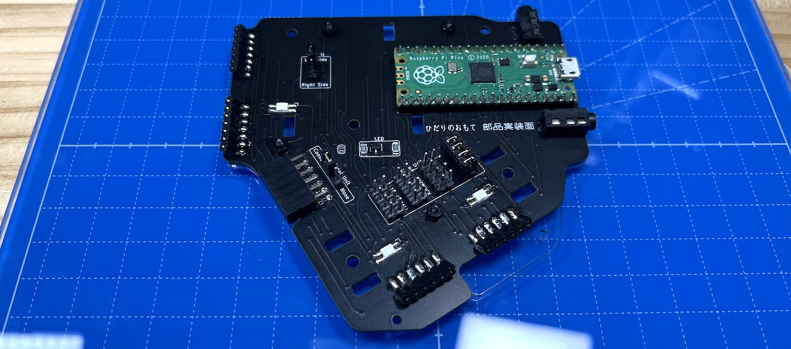
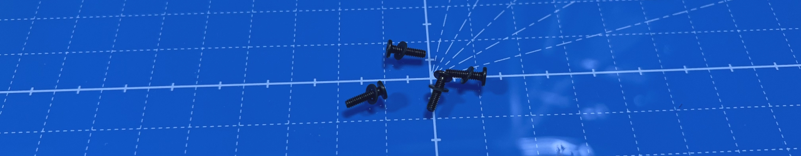
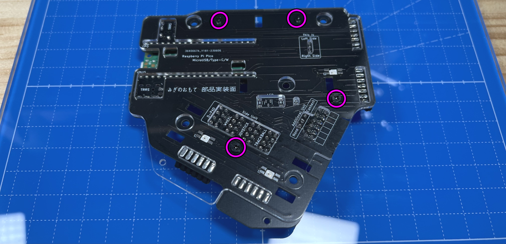
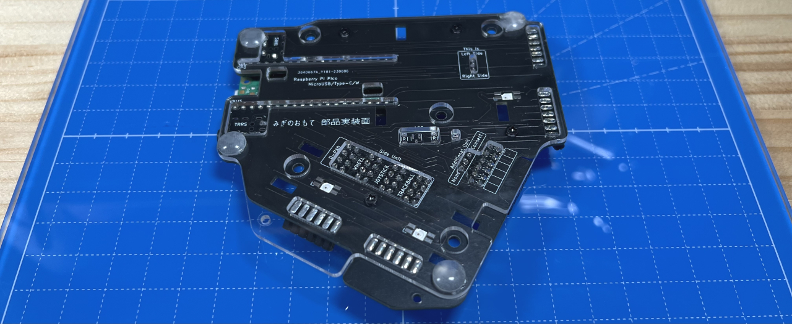
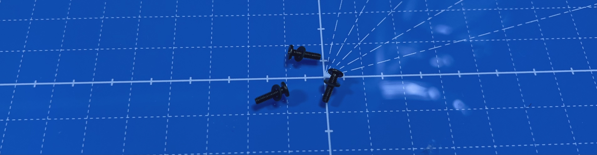
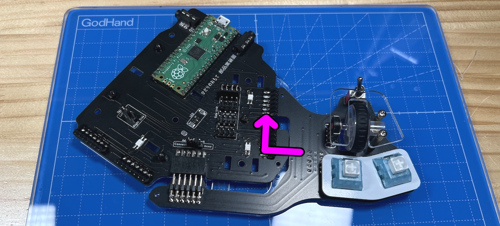
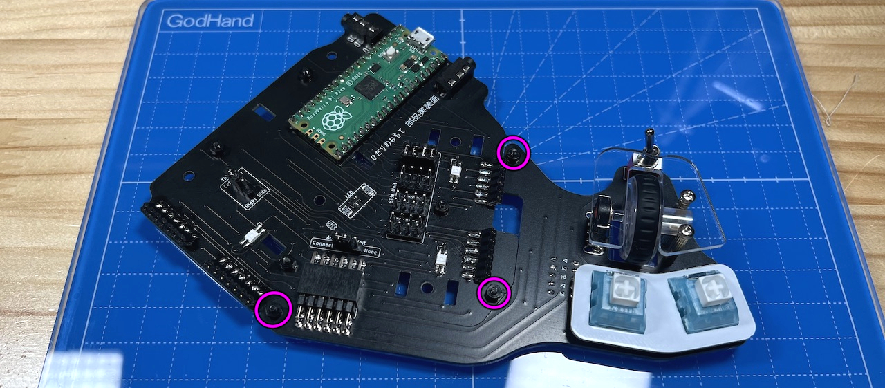
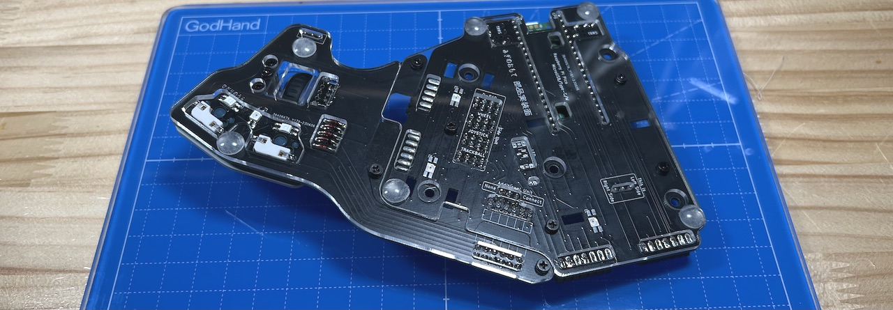
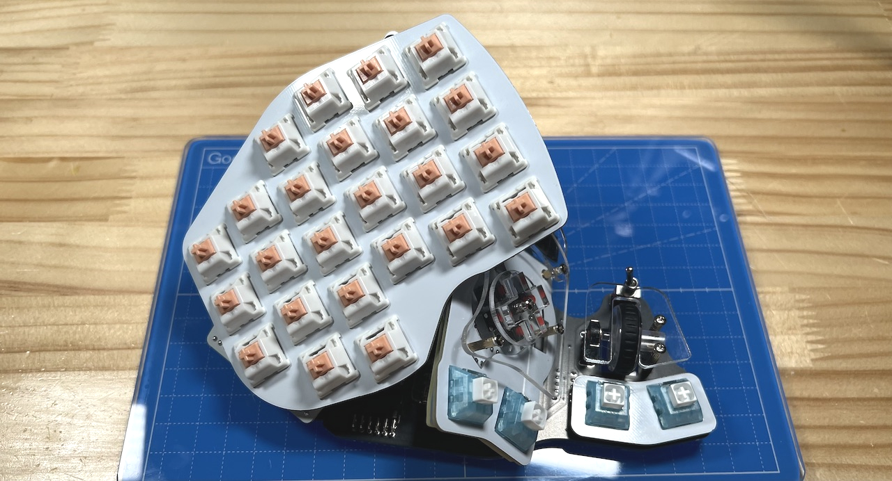
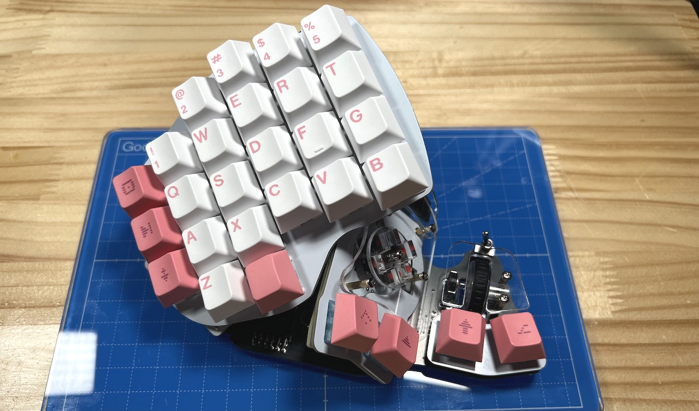

# Killer Whal　全体の組み立て 左手用ビルドガイド （[右手用](../右手用/6_全体の組み立て.md)）

1. [スタートページ](../README.md)
2. [ベースユニットの組み立て](../左手用/2_ベースユニット.md)
3. [側面ユニットの組み立て](../左手用/3_側面ユニット_トラックボール.md)
4. [天面ユニットの組み立て](../左手用/4_天面ユニット.md)
5. [追加ユニットの組み立て](../左手用/5_追加ユニット.md)
6. 全体の組み立て（左手用）（このページ）
7. [カスタマイズ](../左手用/7_カスタマイズ.md)
8. [その他](../左手用/8_その他.md)

##　組み立て
### ボトムプレートの取り付け
底面のM3ネジをはずして、ピンソケットからピンヘッダーを抜きながら天面ユニットを外します。  
同様に側面ユニットも取り外します。  
  

ネジ（黒）4本にワッシャー（黒）を通します。  
  
ベースユニットにボトムプレートをあてて、裏面からネジを差し込みます。  
  
表面にワッシャー、スプリングワッシャーの順に通し、ナットで締めます。  
  
ゴム足を4つ貼りました。  
  

### （オプション）追加ユニットの取り付け
ネジ（黒）3本にワッシャー（黒）を通します。   
  
画像のようにスライドさせてL字ピンヘッダをL字ピンソケットに差し込みます。  
  
アクリルとFR4のプレートがうまく噛み合うはずなので無理に力を加えないようにします。  
3箇所のネジ穴にM2ネジ（黒）（長）を通してワッシャー黒、スプリングワッシャー黒、ナットの順で止めます。  
  
ゴム足を貼りました。  
  
USBを繋いで動作を確認します。LEDは天面ユニットを取り付けるまで光りません。ホイールのスクロール方向は後から変更できます。  

### 仕上げ
側面ユニット、天面ユニットの順で付け直します。
  
キーキャップを付ければ完成です。
  
お疲れ様でした。

次のページはキー設定の解説です。

7. [カスタマイズ](../左手用/7_カスタマイズ.md)
