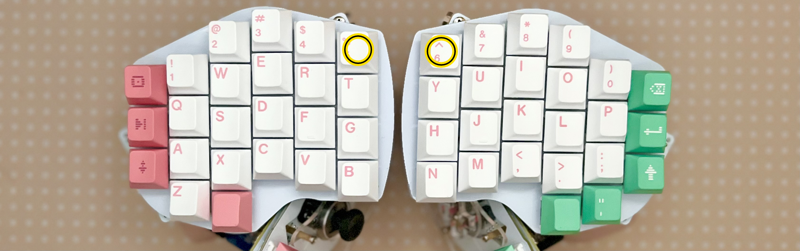
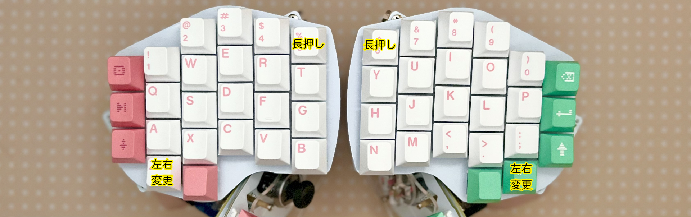
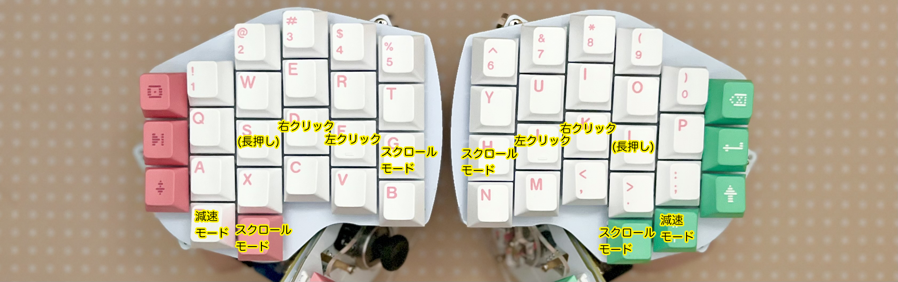
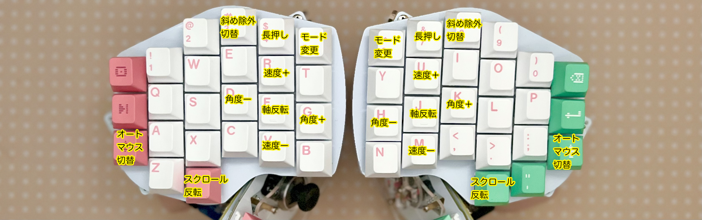
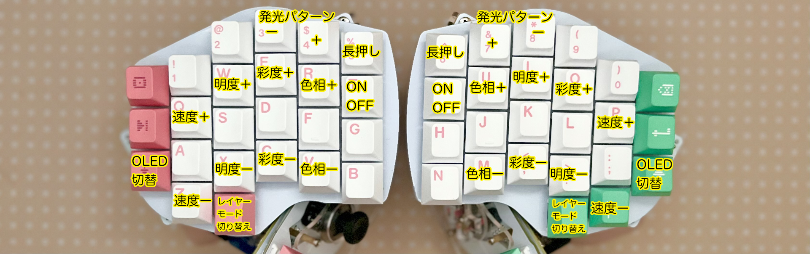
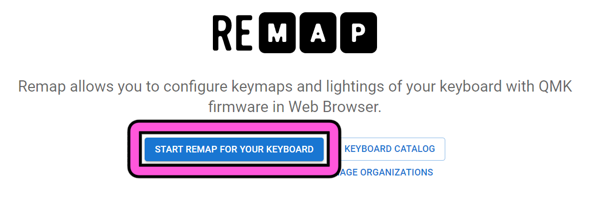
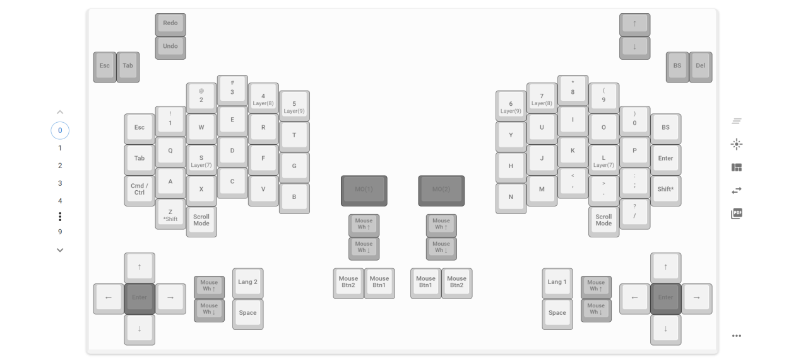
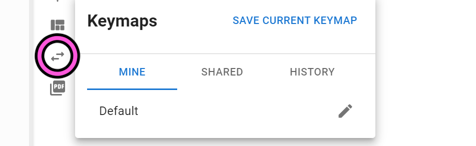

# Killer Whale カスタマイズ 左手用ビルドガイド （[右手用](../右手用/7_カスタマイズ.md)）

1. [スタートページ](../README.md)
2. [ベースユニットの組み立て](../左手用/2_ベースユニット.md)
3. [側面ユニットの組み立て](../左手用/3_側面ユニット_トラックボール.md)
4. [天面ユニットの組み立て](../左手用/4_天面ユニット.md)
5. [追加ユニットの組み立て](../左手用/5_追加ユニット.md)
6. [全体の組み立て](../左手用/6_全体の組み立て.md)
7. カスタマイズ（このページ）
8. [その他](../左手用/8_その他.md)

## Remap用ファームウェアを書き込む
全てのキーの反応を確かめたら使用方法に合ったファームウェアをこちらからダウンロードします。
- 単体用 [tarohayashi_killerwhale_solo_via.uf2
](https://github.com/Taro-Hayashi/KillerWhale/releases/latest/download/tarohayashi_killerwhale_solo_via.uf2)
- 左右分割用 [tarohayashi_killerwhale_duo_via.uf2
](https://github.com/Taro-Hayashi/KillerWhale/releases/latest/download/tarohayashi_killerwhale_duo_via.uf2)

#### ※左右間のケーブルを着け外しする時は必ずUSBケーブルを抜いてください。
※追加ユニットのトグルスイッチは手のひら側に倒した状態にしてください。

Raspberry Pi Picoのボタンか画像のキーを押しながらUSBケーブルを接続するとRPI-RP2フォルダが出てくるのでuf2ファイルをドラッグアンドドロップしてください。
  
- 左右分割キーボードとして使う場合は両手とも更新してください。  
- 左右を繋ぐケーブルの差込口は2つありますがどちらを使っても大丈夫です。 

## 左右を切り替える（単体使用時）
標準では左手用のQWERTYの配列になっています。右手用のキーマップにはトグルスイッチで切り替え可能です。  
画像のキーの組み合わせで追加ユニットを使わない場合でも左右のキーマップを切り替えることが可能です。
  

## マウスのボタンとオートマウスについて
トラックボールの側面ユニットを使った場合、ボールを動かした直後はF（J）キーがマウスのクリックになり、D（K）キーが右クリックになります（オートマウス機能）。
マウスを動かさなくてもS（L）キーを長押ししている間はFとDがクリック、右クリックに入れ替わります。
  

- 側面ユニットに一番近いキーを長押ししている間はボールを動かしてスクロールすることができます。 
- 追加ユニットのキーにもクリックが割り当てられています。ホイールはスクロールです。

オートマウス機能は以下でオンオフできます。
## トラックボール（ジョイスティック）の方向、速度を変える
角から2番目のキー（4、7）を押しながら画像のキーを押すとトラックボールの設定を変更できます。
 
- 角度の変更と軸の反転を組み合わせて好みの角度に設定してください。
- ジョイスティックやトラックボールのカーソル移動/スクロール/十字キー入力をモード変更で切り替えることができます。

## LEDの設定を変える
角のキー（5、6）を押しながら画像のキーを押すと発光の設定が出来ます。
  
## キーマップのカスタマイズ
ジョイスティクやホイールを含めて全てのキーは、RemapというWebサイトで好きなように変更することができます。使いやすいように変えて使ってください。

Google Chrome（Microsoft Edge）を利用して下記webサイトにアクセスしてください。
- Remap https://remap-keys.app

  

 

### 保存と復元
こちらからキーマップの保存と復元ができます。
  
キーマップの共有もできるので良かったら公開してみてください。

### 左右の変更（単体使用時）、縮小モード（両手使用時）
こちらからRemapの見た目を変更することができます。  
  

### キーの割り当て
ドラッグアンドドロップしてFLASHを押すとキーを変更できます。
  
下のEnglish(US)のプルダウンをJapaneseに変更すると日本語キーボード（JIS）のキーに対応できます。OSの設定を確認して合わせてください。

### 特殊なキーの割り当て
FUNCTIONSタブのVIA USER KEYにOSに関わらず使えるショートカットやトラックボール、OLEDなどの設定をするキーがあります。
  

### LEDの調整
このボタンで発光方法を変更することができます。
  。

最後のページはファームウェア、JSONファイル、トラブルシューティングの簡単なまとめです。

8. [その他](../左手用/8_その他.md)
