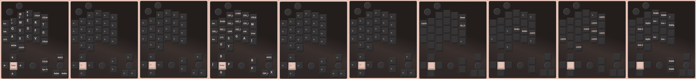
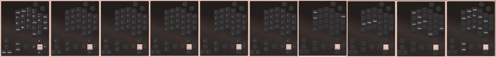
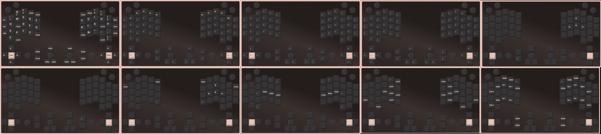
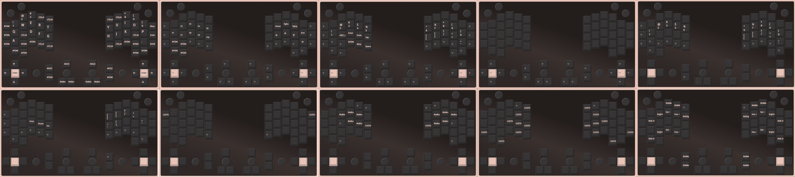
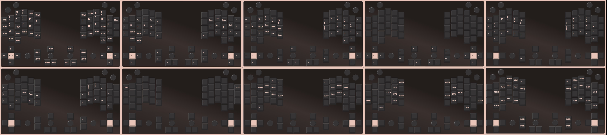
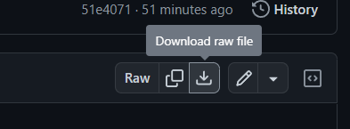

# Killer Whale その他 右手用ビルドガイド （[右手用](../右手用/8_その他.md)）

1. [スタートページ](../README.md)
2. [ベースユニットの組み立て](../左手用/2_ベースユニット.md)
3. [側面ユニットの組み立て](../左手用/3_側面ユニット_トラックボール.md)
4. [天面ユニットの組み立て](../左手用/4_天面ユニット.md)
5. [追加ユニットの組み立て](../左手用/5_追加ユニット.md)
6. [全体の組み立て](../左手用/6_全体の組み立て.md)
7. [カスタマイズ](../左手用/7_カスタマイズ.md)
8. その他（このページ）

## ファームウェアまとめ（更新日: 2023/8/12）
完成後にファームウェアを入れ替えたくなった場合はこちらからもダウンロード可能です。  
- 単体使用 [tarohayashi_killerwhale_solo_default.uf2
](https://github.com/Taro-Hayashi/KillerWhale/releases/download/0.21.6/tarohayashi_killerwhale_solo_default.uf2)
- 左右分割 左手ボール [tarohayashi_killerwhale_duo_ballleft.uf2
](https://github.com/Taro-Hayashi/KillerWhale/releases/download/0.21.6/tarohayashi_killerwhale_duo_ballleft.uf2)
- 左右分割 右手ボール [tarohayashi_killerwhale_duo_ballright.uf2
](https://github.com/Taro-Hayashi/KillerWhale/releases/download/0.21.6/tarohayashi_killerwhale_duo_ballright.uf2)
- 左右分割 両手ボール [tarohayashi_killerwhale_duo_doubleball.uf2
](https://github.com/Taro-Hayashi/KillerWhale/releases/download/0.21.6/tarohayashi_killerwhale_duo_doubleball.uf2)

レイヤーや各種Lockで発光が変わるファームウェアはこちら
- 単体使用 [tarohayashi_killerwhale_solo_default_layer.uf2
](https://github.com/Taro-Hayashi/KillerWhale/releases/download/0.21.6/tarohayashi_killerwhale_solo_default_layer.uf2)
- 左右分割 左手ボール [tarohayashi_killerwhale_duo_ballleftlayer.uf2
](https://github.com/Taro-Hayashi/KillerWhale/releases/download/0.21.6/tarohayashi_killerwhale_duo_ballleft_layer.uf2)
- 左右分割 右手ボール [tarohayashi_killerwhale_duo_ballrightlayer.uf2
](https://github.com/Taro-Hayashi/KillerWhale/releases/download/0.21.6/tarohayashi_killerwhale_duo_ballright_layer.uf2)
- 左右分割 両手ボール [tarohayashi_killerwhale_duo_doubleball_layer.uf2
](https://github.com/Taro-Hayashi/KillerWhale/releases/download/0.21.6/tarohayashi_killerwhale_duo_doubleball_layer.uf2)

## VIA用JSONファイル（更新日: 2023/8/9）

- 単体使用向け [killer_whale_solo.json
](https://github.com/Taro-Hayashi/KillerWhale/releases/download/0.21.6/killer_whale_solo.json)
- 左右分割向け [killer_whale_duo.json
](https://github.com/Taro-Hayashi/KillerWhale/releases/download/0.21.6/killer_whale_duo.json)

## VIA用サンプルキーマップ
- 単体使用 左手専用+クリスタレイヤーキーマップ
   - [solo_left.layout.json](https://github.com/Taro-Hayashi/KillerWhale/releases/download/0.21.6/solo_left.layout.json)
       
- 単体使用 右手専用キーマップ
   - [solo_right.layout.json](https://github.com/Taro-Hayashi/KillerWhale/releases/download/0.21.6/solo_right.layout.json)
     
- 左右分割 デフォルトキーマップ
   - [killer_whale_duo.layout.json](https://github.com/Taro-Hayashi/KillerWhale/releases/download/0.21.6/killer_whale_duo.layout.json)
    
- 左右分割 [すとのふさん作](https://twitter.com/ld50themetaler/status/1691378802365214720?s=20)qwerty用キーマップ
   - https://github.com/ld50themetaler/etc/blob/main/killer_whale_duo.layout_20230815_30%25_qwerty_style.json
    
- 左右分割 [すとのふさん作](https://twitter.com/ld50themetaler/status/1691378802365214720?s=20)dvorak用キーマップ
   - https://github.com/ld50themetaler/etc/blob/main/killer_whale_duo.layout_20230815_30%25_dvorak_style.json
    

キーマップをこちらに載せたい方はご連絡ください。

### ブートローダーモードへの入り方
- Raspberry Pi PicoのBOOTボタンを押しながらUSBケーブルを接続する
- UtilレイヤーのQK_BOOTを押す（カスタマイズ参照）
- USBに一番近いキー（5、6）を押しながらUSBケーブルを接続する
  
### ファームウェアのコード
- https://github.com/Taro-Hayashi/qmk_firmware/tree/tarohayashi/keyboards/tarohayashi/killerwhale/

## Q&A
- 側面/追加ユニットのLEDが光らない
  - LEDは組み立て終わった状態で初めてすべて発光します。完成後に側面ユニットのみ発光しない場合はジャンパーの指定が間違っている可能性があります。  
- 天面ユニットで3か所だけLEDの色が違う
  - RGBレイヤーありのファームウェアを使うとCapsLock、NumLock、ScrollLockやレイヤーの切り替えで発光パターンが変わります。
- 側面ユニットのキー以外の機能が動かない
- 分割キーボードでキーマップが左右逆
  - ジャンパーの指定が間違っている可能性があります。  
- ジョイスティックが動かない
  - 左右分割キーボードとして使う場合、ジョイスティックはUSBケーブルを繋いだ側だけが動作します。  
- カーソルがカクつく
  - 左右分割向けのファームウェアで片手のみの利用だとカーソルが飛ぶ現象を確認しています。  単体使用向けのファームウェアをダウンロードしてインストールしてください。
- ファームウェアを入れ替えたらキーマップがおかしくなった
  - 前のファームウェアのキーマップが保存されている可能性があります。保存したキーマップやサンプルのキーマップを読み込んでください。
- ファームウェアを入れ替えたらVIAが使えなくなった。
  - JSONファイルも更新してみてください。
- 読み込めていたキーマップが読み込めなくなった
  - キーマップのJSONファイルの以下の項目の数字をこちらのように修正してください。

単体使用の場合
~~~
"vendorProductId": 2290354328,
~~~
左右分割の場合
~~~
"vendorProductId": 2290354329,
~~~
  
- 各種キーが効かない
- 設定が保存されない
- 発光パターンがおかしい
  - EE_CLR とういうキーを作って押すと設定をリセットできます。
  - またはこちらのページの一番下の flash_nuke.uf2 を使うとRaspberry Pi Picoをリセットできるのでお試しください。
    - https://www.raspberrypi.com/documentation/microcontrollers/raspberry-pi-pico.html

## 販売サイト
- 遊舎工房
  - Killer Whale https://shop.yushakobo.jp/products/7948
- BOOTH（別売りユニット）
  - Killer Whale 側面ユニット https://tarohayashi.booth.pm/items/4877491
  - Killer Whale ホイール付き天面ユニット https://tarohayashi.booth.pm/items/4877486
