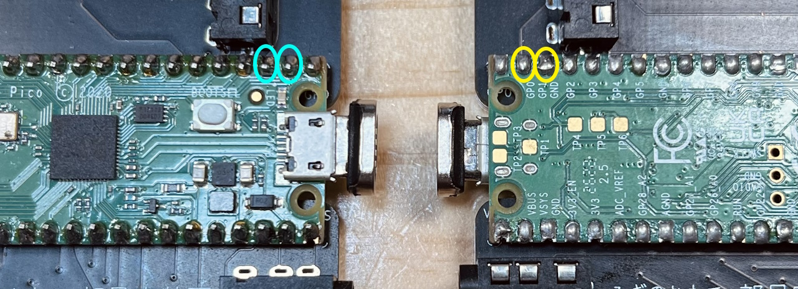

# Killer Whale その他 左手用ビルドガイド （[右手用](../右手用/8_その他.md)）

1. [スタートページ](../README.md)
2. [ベースユニットの組み立て](../左手用/2_ベースユニット.md)
3. [側面ユニットの組み立て](../左手用/3_側面ユニット_トラックボール.md)
4. [天面ユニットの組み立て](../左手用/4_天面ユニット.md)
5. [追加ユニットの組み立て](../左手用/5_追加ユニット.md)
6. [全体の組み立て](../左手用/6_全体の組み立て.md)
7. [カスタマイズ](../左手用/7_カスタマイズ.md)
8. その他（このページ）

## ファームウェアまとめ
- 単体テスト用 [tarohayashi_killerwhale_solo_default.uf2
](https://github.com/Taro-Hayashi/KillerWhale/releases/latest/download/tarohayashi_killerwhale_solo_default.uf2)
- 単体使用 [tarohayashi_killerwhale_solo_via.uf2
](https://github.com/Taro-Hayashi/KillerWhale/releases/latest/download/tarohayashi_killerwhale_solo_via.uf2)
- 左右分割テスト用 [tarohayashi_killerwhale_duo_default.uf2
](https://github.com/Taro-Hayashi/KillerWhale/releases/latest/download/tarohayashi_killerwhale_duo_default.uf2)
- 左右分割 左手ボール [tarohayashi_killerwhale_duo_ballleft.uf2
](https://github.com/Taro-Hayashi/KillerWhale/releases/latest/download/tarohayashi_killerwhale_duo_ballleft.uf2)
- 左右分割 右手ボール [tarohayashi_killerwhale_duo_ballright.uf2
](https://github.com/Taro-Hayashi/KillerWhale/releases/latest/download/tarohayashi_killerwhale_duo_ballright.uf2)
- 左右分割 両手ボール [tarohayashi_killerwhale_duo_doubleball.uf2
](https://github.com/Taro-Hayashi/KillerWhale/releases/latest/download/tarohayashi_killerwhale_duo_doubleball.uf2)

レイヤーや各種Lockで発光が変わるファームウェアはこちら
- 単体使用 [tarohayashi_killerwhale_solo_via_layer_rgb.uf2
](https://github.com/Taro-Hayashi/KillerWhale/releases/latest/download/tarohayashi_killerwhale_solo_via_layer_rgb.uf2)
- 左右分割 左手ボール [tarohayashi_killerwhale_duo_ballleft_layer_rgb.uf2
](https://github.com/Taro-Hayashi/KillerWhale/releases/latest/download/tarohayashi_killerwhale_duo_ballleft_layer_rgb.uf2)
- 左右分割 右手ボール [tarohayashi_killerwhale_duo_ballright_layer_rgb.uf2
](https://github.com/Taro-Hayashi/KillerWhale/releases/latest/download/tarohayashi_killerwhale_duo_ballright_layer_rgb.uf2)
- 左右分割 両手ボール [tarohayashi_killerwhale_duo_doubleball_layer_rgb.uf2
](https://github.com/Taro-Hayashi/KillerWhale/releases/latest/download/tarohayashi_killerwhale_duo_doubleball_layer_rgb.uf2)

### ファームウェアのコード
- https://github.com/Taro-Hayashi/qmk_firmware/tree/tarohayashi/keyboards/tarohayashi/killerwhale/

### 保守部品の入手先
|部品名|入手先|
|-|-|
|ねじ、ワッシャー、ナット類|ホームセンター等|
|ゴム足|100円ショップ等|
|スペーサー|[札幌貿易](https://item.rakuten.co.jp/sapporo-boueki/c/0000000681/)|
|TRRSジャック|[秋月電子通商](https://akizukidenshi.com/catalog/g/gC-06070/)|
|ピンヘッダ|[秋月電子通商](https://akizukidenshi.com/catalog/g/gC-00167/)|
|ピンソケット|[秋月電子通商](https://akizukidenshi.com/catalog/g/gC-03138/)|
|L字ピンソケット|[秋月電子通商](https://akizukidenshi.com/catalog/g/gC-16795/)|
|L字ピンヘッダ|[秋月電子通商](https://akizukidenshi.com/catalog/g/gC-16794/)|
|ジャンパー|[秋月電子通商](https://akizukidenshi.com/catalog/g/gP-03687/)|
|ダイオード|[秋月電子通商](https://akizukidenshi.com/catalog/g/gI-00941/)|
|コンデンサーC1,C2|[秋月電子通商](https://akizukidenshi.com/catalog/g/gP-08155/)|
|コンデンサーC3|[秋月電子通商](https://akizukidenshi.com/catalog/g/gP-08154/)|
|レギュレーター|[秋月電子通商](https://akizukidenshi.com/catalog/g/gI-10491/)|
|トグルスイッチ|[秋月電子通商](https://akizukidenshi.com/catalog/g/gP-02399/)|
|ジョイスティック|[秋月電子通商](https://akizukidenshi.com/catalog/g/gP-15951/)|
|MOSFET|[秋月電子通商](https://akizukidenshi.com/catalog/g/gI-04232/)|
|抵抗R|[秋月電子通商](https://akizukidenshi.com/catalog/g/gR-11802/)|
|MXスイッチソケット|[遊舎工房](https://shop.yushakobo.jp/products/4291)|
|ホイールエンコーダー|[Amazon](https://www.amazon.co.jp/s?k=ホイールエンコーダー+11mm)|
|ベアリング|[モノタロウ](https://www.monotaro.com/s/?c=&q=Mr62zz)|

※書かれていないものはAli Expressで探すか、余らせていることがあるのでご連絡ください。

## Q&A
- 側面/追加ユニットのLEDが光らない
  - LEDは組み立て終わった状態で初めてすべて発光します。完成後に側面ユニットのみ発光しない場合はジャンパーの指定が間違っている可能性があります。  
- 天面ユニットで3か所だけLEDの色が違う
  - RGBレイヤーありのファームウェアを使うとCapsLock、NumLock、ScrollLockやレイヤーの切り替えで発光パターンが変わります。
- 天面ユニットのLEDが一部しか発光しない。
   - LEDのはんだ付けが足りない可能性があります。光るLEDも含めて見直してみてください。
- 側面ユニットのキー以外の機能が動かない
- 分割キーボードでキーマップが左右逆
  - ジャンパーの指定が間違っている可能性があります。 
- 分割キーボードでUSBを繋げない側が動かない
   - Raspberry Pi Picoの左右通信用のピンが壊れている可能性があります。
     こちらのテスト用ファームウェアを導入して画像の青どうし、黄色どうしをピンセット等で繋いでみて、"A"と入力されたら正常に動作しています。入力されなかった場合は故障していますので交換していただくか、左右別々にUSBに繋いでご利用いただくこともできます。
      - [tarohayashi_killerwhale_trrstest_default.uf2](https://github.com/Taro-Hayashi/KillerWhale/releases/latest/download/tarohayashi_killerwhale_trrstest_default.uf2)
        
- ジョイスティックが動かない
  - 左右分割キーボードとして使う場合、ジョイスティックはUSBケーブルを繋いだ側だけが動作します。  
- カーソルがカクつく
  - 左右分割向けのファームウェアで片手のみの利用だとカーソルが飛ぶ現象を確認しています。  単体使用向けのファームウェアをダウンロードしてインストールしてください。
- ファームウェアを入れ替えたらキーマップがおかしくなった
  - 前のファームウェアのキーマップが保存されている可能性があります。保存したキーマップやサンプルのキーマップを読み込んでください。
- 各種キーが効かない
- 設定が保存されない
- 発光パターンがおかしい
   - こちらのページの一番下の flash_nuke.uf2 を使うとRaspberry Pi Picoをリセットできるのでお試しください。
      - https://www.raspberrypi.com/documentation/microcontrollers/raspberry-pi-pico.html

## 販売サイト
- 遊舎工房
  - Killer Whale https://shop.yushakobo.jp/products/7948
- BOOTH（別売りユニット）
  - Killer Whale 側面ユニット https://tarohayashi.booth.pm/items/4877491
  - Killer Whale ホイール付き天面ユニット https://tarohayashi.booth.pm/items/4877486
